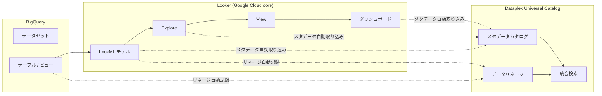

# Dataplex: Looker メタデータの自動カタログ化と BigQuery データリネージ取り込み

**リリース日**: 2026-03-30

**サービス**: Dataplex (Universal Catalog)

**機能**: Looker (Google Cloud core) メタデータの自動カタログ化および BigQuery ソースからのデータリネージ取り込み

**ステータス**: Preview

[このアップデートのインフォグラフィックを見る](https://takech9203.github.io/google-cloud-news-summary/20260330-dataplex-looker-metadata-cataloging.html)

## 概要

Google Cloud は、Dataplex Universal Catalog において Looker (Google Cloud core) のメタデータ自動カタログ化機能と、BigQuery ソースからのデータリネージ取り込み機能をプレビューとしてリリースしました。これにより、Looker で定義された Explore、View、Dashboard などの BI メタデータが Dataplex Universal Catalog に自動的に登録され、組織全体のデータカタログから一元的に検索・管理できるようになります。

さらに、BigQuery をデータソースとして使用する Looker のデータリネージが自動的に追跡されるため、データの流れ（BigQuery テーブルから Looker のモデル、Explore、ダッシュボードまで）を可視化できます。これにより、データガバナンスチームはデータの出所と消費先を完全に把握し、コンプライアンス要件への対応やインパクト分析を効率化できます。

この機能は、データエンジニア、データスチュワード、BI 管理者、およびデータガバナンス担当者を主な対象としています。

**アップデート前の課題**

- Looker のメタデータ（Explore、View、LookML モデルなど）は Looker 内部でのみ管理されており、Dataplex Universal Catalog から検索・発見することができなかった
- BigQuery から Looker への データフローのリネージ情報を手動で追跡・文書化する必要があり、工数がかかっていた
- BI レイヤーのメタデータとデータウェアハウスのメタデータが分断されており、組織横断的なデータガバナンスが困難だった

**アップデート後の改善**

- Looker (Google Cloud core) のメタデータが Dataplex Universal Catalog に自動的にカタログ化され、統合検索で発見可能になった
- BigQuery ソースから Looker への データリネージが自動的に取り込まれ、エンドツーエンドのデータフローを可視化できるようになった
- データカタログの統合により、データウェアハウスから BI ダッシュボードまでの完全なメタデータ管理とガバナンスが実現された

## アーキテクチャ図



Looker のメタデータが Dataplex Universal Catalog に自動的に取り込まれ、BigQuery から Looker へのデータリネージが記録される全体フローを示しています。破線はメタデータとリネージの自動取り込みを、実線はデータの流れを表しています。

## サービスアップデートの詳細

### 主要機能

1. **Looker メタデータの自動カタログ化**
   - Looker (Google Cloud core) で定義された LookML モデル、Explore、View、ダッシュボードなどのメタデータが Dataplex Universal Catalog に自動的に登録される
   - カタログ化されたメタデータは Dataplex の統合検索（キーワード検索および自然言語検索）で発見可能になる
   - Looker アセットに対してビジネスコンテキスト（アスペクト、ビジネス用語集など）を付与してメタデータを拡充できる

2. **BigQuery ソースからのデータリネージ取り込み**
   - BigQuery テーブルを参照する Looker モデルにおいて、データの流れが自動的にリネージとして記録される
   - テーブルレベルでのリネージ追跡により、上流（BigQuery）から下流（Looker ダッシュボード）までのデータフローを可視化
   - Google Cloud コンソールのリネージグラフ機能で視覚的にデータの流れを確認可能

3. **統合データガバナンス**
   - Dataplex Universal Catalog の既存のガバナンス機能（IAM、データ品質、メタデータ変更フィードなど）が Looker メタデータにも適用可能
   - インパクト分析が容易になり、BigQuery テーブルの変更が Looker ダッシュボードに与える影響を事前に評価できる

## 技術仕様

### 対応するメタデータタイプ

| メタデータタイプ | 説明 |
|------|------|
| LookML モデル | Looker のデータモデル定義 |
| Explore | ユーザーがクエリを構築するためのインターフェース定義 |
| View | LookML のビュー定義（ディメンション、メジャーを含む） |
| ダッシュボード | Looker ダッシュボードのメタデータ |

### 必要な IAM ロール

| ロール | 用途 |
|------|------|
| `roles/datacatalog.viewer` | カタログ化されたメタデータの閲覧 |
| `roles/datalineage.viewer` | データリネージ情報の閲覧 |
| `roles/dataplex.catalogEditor` | メタデータの編集・拡充 |
| `roles/looker.viewer` | Looker リソースへのアクセス |

## 設定方法

### 前提条件

1. Looker (Google Cloud core) インスタンスが設定済みであること
2. Dataplex API および Data Lineage API が有効化されていること
3. 適切な IAM ロールが付与されていること

### 手順

#### ステップ 1: API の有効化

```bash
# Dataplex API と Data Lineage API を有効化
gcloud services enable dataplex.googleapis.com
gcloud services enable datalineage.googleapis.com
```

Dataplex Universal Catalog の機能を利用するために必要な API を有効化します。

#### ステップ 2: Looker メタデータカタログ化の確認

```bash
# Dataplex Catalog で Looker エントリを検索
gcloud dataplex entries search "system=looker" \
  --project=PROJECT_ID \
  --location=LOCATION
```

Looker メタデータが自動的にカタログ化されていることを確認します。プレビュー期間中は、Google Cloud コンソールの Dataplex Universal Catalog ページからも確認できます。

#### ステップ 3: データリネージの確認

```bash
# BigQuery テーブルのリネージ情報を確認
gcloud dataplex lineage search-links \
  --project=PROJECT_ID \
  --location=LOCATION \
  --target="bigquery:PROJECT_ID.DATASET.TABLE"
```

BigQuery テーブルから Looker への リネージリンクが記録されていることを確認します。

## メリット

### ビジネス面

- **データガバナンスの強化**: BI レイヤーを含むエンドツーエンドのデータ管理が可能になり、規制対応やコンプライアンス監査の効率が向上する
- **セルフサービス分析の促進**: アナリストが Dataplex の統合検索を通じて Looker のアセットを発見し、既存の BI リソースを再利用できる
- **インパクト分析の効率化**: データソースの変更が下流の Looker ダッシュボードに与える影響を事前に把握できる

### 技術面

- **自動化によるメンテナンス負荷の軽減**: メタデータの登録やリネージの追跡が自動化され、手動メンテナンスが不要になる
- **統合メタデータ管理**: BigQuery、Looker、その他の Google Cloud サービスのメタデータを単一のカタログで管理できる
- **既存ワークフローとの統合**: Dataplex のメタデータ変更フィード（Pub/Sub 連携）を活用し、Looker メタデータの変更をトリガーとした自動ワークフローを構築できる

## デメリット・制約事項

### 制限事項

- プレビュー段階のため、本番環境での利用には注意が必要。SLA の適用対象外となる
- Looker (Google Cloud core) のみが対象であり、Looker (original) はサポートされない
- データリネージ情報はシステム内で 30 日間のみ保持される（Dataplex データリネージの既存制限）
- リネージグラフのトラバーサルは深さ 20 レベル、各方向 10,000 リンクに制限される

### 考慮すべき点

- Data Lineage API の有効化により追加コストが発生する可能性がある
- プレビューから GA への移行時に仕様変更が発生する可能性がある
- 大規模な Looker 環境ではメタデータの初回同期に時間がかかる場合がある

## ユースケース

### ユースケース 1: 規制対応のためのデータリネージ追跡

**シナリオ**: 金融機関のデータガバナンスチームが、個人情報を含む BigQuery テーブルのデータが最終的にどの Looker ダッシュボードで表示されているかを追跡する必要がある。

**実装例**:
```bash
# 個人情報テーブルから下流のリネージを検索
gcloud dataplex lineage search-links \
  --project=my-project \
  --location=us-central1 \
  --source="bigquery:my-project.customer_data.pii_table"
```

**効果**: 個人情報の流れをエンドツーエンドで可視化でき、GDPR やプライバシー規制への対応を効率化。データ侵害時のインパクト範囲を迅速に特定可能。

### ユースケース 2: BI アセットの発見と再利用

**シナリオ**: 新規プロジェクトのアナリストが、既存の Looker ダッシュボードや Explore を検索して、類似の分析要件に対して既存リソースを再利用したい。

**効果**: Dataplex Universal Catalog の自然言語検索を使用して「売上分析」のような検索クエリで関連する Looker アセットを即座に発見でき、ゼロからの構築を回避して開発時間を大幅に短縮。

## 料金

Dataplex Universal Catalog のメタデータストレージ SKU およびデータリネージのプレミアム処理 SKU に基づいて課金されます。プレビュー期間中の料金については、Google Cloud の営業担当者にお問い合わせください。

### 料金例

| 項目 | 月額料金 (概算) |
|--------|-----------------|
| メタデータストレージ | Dataplex Universal Catalog 料金に準拠 |
| データリネージ処理 | プレミアム処理 SKU に準拠 |

詳細は [Dataplex 料金ページ](https://cloud.google.com/dataplex/pricing) を参照してください。

## 利用可能リージョン

Dataplex Universal Catalog および Data Lineage が利用可能な全リージョンでサポートされます。主要なリージョンには以下が含まれます:

- us-central1, us-east1, us-west1
- europe-west1, europe-west2, europe-west3, europe-west10, europe-west12
- asia-northeast1 (東京), asia-northeast2 (大阪), asia-southeast1
- me-central1, me-central2
- africa-south1

最新のリージョン情報は [Google Cloud ロケーション](https://cloud.google.com/about/locations) を参照してください。

## 関連サービス・機能

- **Dataplex Universal Catalog**: メタデータの統合管理基盤。Looker メタデータの格納先
- **Data Lineage API**: データリネージ情報の記録と検索を提供する API
- **Looker (Google Cloud core)**: BI プラットフォーム。メタデータソースとなるサービス
- **BigQuery**: データウェアハウス。Looker のデータソースとしてリネージの起点となる
- **Pub/Sub**: メタデータ変更フィードの通知先として活用可能

## 参考リンク

- [インフォグラフィック](https://takech9203.github.io/google-cloud-news-summary/20260330-dataplex-looker-metadata-cataloging.html)
- [公式リリースノート](https://cloud.google.com/release-notes#March_30_2026)
- [Dataplex Universal Catalog ドキュメント](https://cloud.google.com/dataplex/docs/catalog-overview)
- [データリネージについて](https://cloud.google.com/dataplex/docs/about-data-lineage)
- [Looker (Google Cloud core) ドキュメント](https://cloud.google.com/looker/docs)
- [Dataplex 料金ページ](https://cloud.google.com/dataplex/pricing)

## まとめ

今回のアップデートにより、Dataplex Universal Catalog が Looker (Google Cloud core) のメタデータを自動的にカタログ化し、BigQuery から Looker へのデータリネージを追跡できるようになりました。これは、データウェアハウスから BI レイヤーまでのエンドツーエンドのデータガバナンスを実現する重要な一歩です。プレビュー段階ではありますが、データガバナンスの強化を検討している組織は早期に検証を開始し、GA 時にスムーズに導入できるよう準備することを推奨します。

---

**タグ**: #Dataplex #Looker #DataLineage #メタデータ管理 #DataGovernance #BigQuery #UniversalCatalog #Preview
