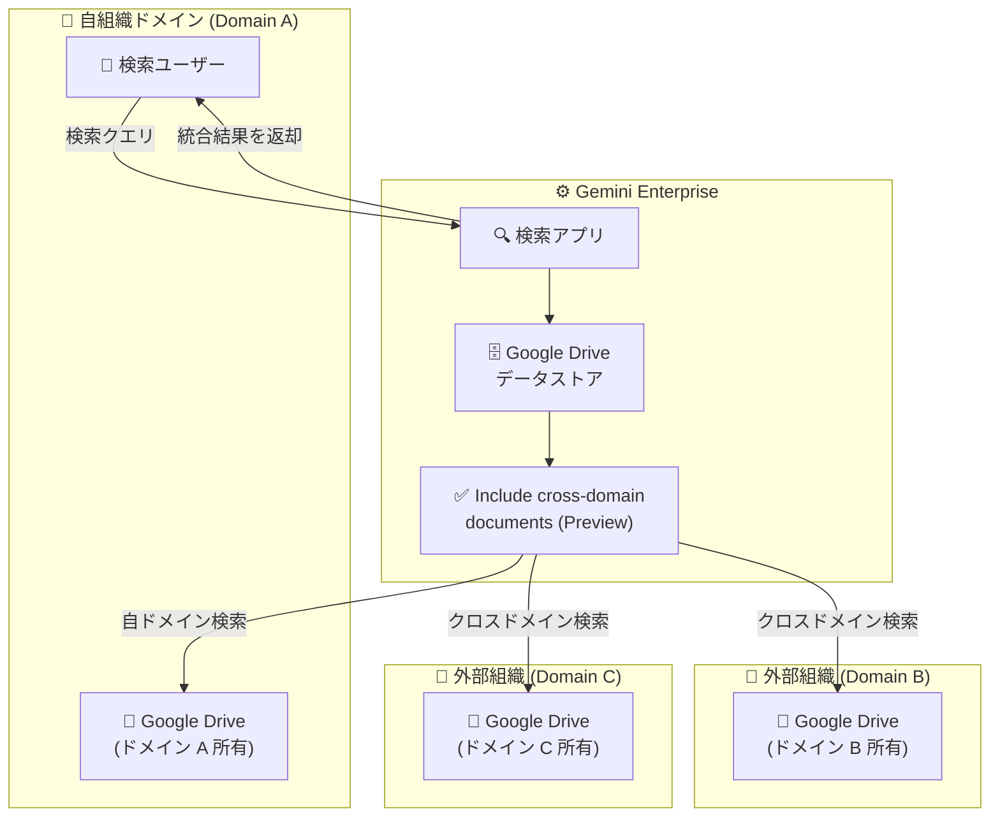

# Gemini Enterprise: Google Drive クロスドメインドキュメント検索機能

**リリース日**: 2026-03-30

**サービス**: Gemini Enterprise

**機能**: Google Drive データストアにおけるクロスドメインドキュメントのインクルード機能

**ステータス**: Public Preview

📊 [このアップデートのインフォグラフィックを見る](https://takech9203.github.io/google-cloud-news-summary/20260330-gemini-enterprise-cross-domain-drive.html)

## 概要

Gemini Enterprise の Google Drive データストア構成に、組織外のドキュメントを検索・インデックス化できる「Include cross-domain documents」機能が Public Preview として追加された。これにより、自組織のドメイン外にある Google Drive ドキュメントも Gemini Enterprise の検索対象に含めることが可能になる。

この機能は、アプリ作成時または既存アプリの「Manage web app features」ページから有効化できる。パートナー企業やグループ会社など、複数ドメインにまたがるドキュメントを横断的に検索したい組織にとって、大きな価値を持つアップデートである。

**アップデート前の課題**

- Google Drive データストアのコネクタは、検索を実行するユーザーのドメインが所有するドキュメントのみを検索対象としていた
- 組織外のパートナーや関連会社が共有するドキュメントは、データフェデレーション経由では検索できなかった
- クロスドメインのドキュメントを検索するには、ドキュメントの所有権を自ドメインのユーザーに移すか、自ドメインが所有する共有ドライブに配置する必要があった

**アップデート後の改善**

- 「Include cross-domain documents」設定を有効にすることで、組織外のドキュメントも検索・インデックス対象に含められるようになった
- アプリ作成時のフロー、または既存アプリの Feature Management ページから簡単に有効化できる
- ドキュメントの所有権移転や共有ドライブへの再配置が不要になった

## アーキテクチャ図

Gemini Enterprise の検索アプリが Google Drive データストアを通じて、自組織のドメインだけでなく外部組織のドメインのドキュメントも横断的に検索する構成を示している。

## サービスアップデートの詳細

### 主要機能

1. **クロスドメインドキュメントの検索・インデックス**
   - Google Drive データストア構成時に「Include cross-domain documents」オプションを有効化
   - 自組織ドメイン外のドキュメントを検索対象に含めることが可能
   - データフェデレーション利用時のドメイン制限を緩和

2. **アプリ作成時の設定**
   - 新規アプリ作成フローでクロスドメインドキュメントのインクルードを設定可能
   - Google Cloud コンソールの Gemini Enterprise ページからウィザード形式で設定

3. **既存アプリへの適用**
   - 既に作成済みのアプリに対しても「Manage web app features」ページから設定変更が可能
   - Feature Management タブから各種機能のトグルを切り替える形式で管理

## 技術仕様

### Google Drive データストアの構成要素

| 項目 | 詳細 |
|------|------|
| 機能名 | Include cross-domain documents |
| ステータス | Public Preview |
| 設定箇所 | アプリ作成時 / Manage web app features ページ |
| 対象データストア | Google Drive データストア |
| サポートリージョン | EU、US、Global |
| 暗号化 | Google マネージド暗号鍵 / Cloud KMS (US、EU のみ) |

### Google Drive データストアの検索制限

| ファイルタイプ | サイズ上限 |
|---------------|-----------|
| 一般的なファイル | 10 MB |
| XLSX ファイル (.xlsx) | 20 MB |
| PDF ファイル (.pdf) | 30 MB |
| テキストファイル (.txt) | 100 MB |
| PDF の OCR | 80 ページまで / 50 MB 以下 |
| テキスト抽出量 | 1 MB (検索インデックス用) |

## 設定方法

### 前提条件

1. Google Cloud プロジェクトで Gemini Enterprise が有効化されていること
2. Discovery Engine Admin ロールが付与されていること
3. Gemini Enterprise のサブスクリプションとライセンスが設定済みであること
4. ID プロバイダーの構成が完了していること
5. Google Workspace のスマート機能が有効化されていること

### 手順

#### ステップ 1: Google Drive データストアの作成

1. Google Cloud コンソールで [Gemini Enterprise ページ](https://console.cloud.google.com/gen-app-builder/) にアクセス
2. 「Data stores」をクリックし、「Create data store」を選択
3. Source セクションで「Google Drive」を検索して選択
4. Data セクションでドライブソースを指定:
   - **All**: ドライブ全体をデータストアに追加
   - **Specific shared drive(s)**: 共有ドライブのフォルダ ID を指定
   - **Specific shared folder(s)**: 共有フォルダの ID を指定

#### ステップ 2: クロスドメインドキュメントの有効化

**新規アプリの場合:**
- アプリ作成ウィザードの設定セクションで「Include cross-domain documents」を有効化

**既存アプリの場合:**
1. Google Cloud コンソールで Gemini Enterprise ページにアクセス
2. 対象アプリの名前をクリック
3. 「Configurations」から「Feature Management」タブを開く
4. 「Include cross-domain documents」のトグルを有効化

#### ステップ 3: アプリとデータストアの接続

1. [アプリを作成](https://cloud.google.com/gemini/enterprise/docs/create-app)する (未作成の場合)
2. 作成した Google Drive データストアをアプリに接続
3. データストアの状態が「Creating」から「Active」に変わるまで待機

## メリット

### ビジネス面

- **組織横断の知識活用**: パートナー企業やグループ会社が共有するドキュメントを含めた横断検索が可能になり、組織全体の知識活用が促進される
- **コラボレーションの効率化**: 外部ドメインのドキュメントを検索対象に含めることで、複数組織間のコラボレーションプロジェクトにおける情報アクセスが改善される
- **運用負荷の軽減**: ドキュメントの所有権移転や再配置の手間が不要になり、管理者の運用負荷が軽減される

### 技術面

- **シンプルな設定**: トグル 1 つで機能を有効化でき、複雑な設定が不要
- **既存アプリとの互換性**: 新規アプリだけでなく既存アプリにも適用可能
- **データコピー不要**: Google Drive コネクタはデータフェデレーション方式のため、Vertex AI Search インデックスへのデータコピーが発生しない

## デメリット・制約事項

### 制限事項

- Public Preview 段階のため、SLA の対象外であり本番ワークロードでの利用には注意が必要
- Google Drive データストアは EU、US、Global リージョンのみでサポート
- Google Drive 側の検索インデックス制限 (ファイルサイズ、テキスト抽出量) は引き続き適用される

### 考慮すべき点

- クロスドメインドキュメントを含めることで、検索結果に意図しない外部ドキュメントが表示される可能性がある。アクセス制御の設計を十分に検討する必要がある
- Data Residency (DRZ) に関しては、Google Cloud 内のデータ所在のみ保証される。Google Drive 内のデータ所在については、Google Workspace のコンプライアンスガイダンスを別途確認する必要がある
- CMEK を使用している場合、暗号化は Google Cloud 内のデータにのみ適用され、Google Drive に保存されているデータには適用されない

## ユースケース

### ユースケース 1: グループ会社間のナレッジ統合検索

**シナリオ**: 複数のグループ会社がそれぞれ異なる Google Workspace ドメインを使用しており、各社の技術ドキュメントや提案書を横断的に検索したい。

**効果**: クロスドメインドキュメント機能を有効化することで、全グループ会社のドキュメントを 1 つの Gemini Enterprise アプリから検索可能になる。ドキュメントの所有権移転や共有ドライブの統合が不要。

### ユースケース 2: パートナーエコシステムの情報アクセス

**シナリオ**: SI パートナーやコンサルティング会社が顧客組織のドメインで共有しているプロジェクト資料を、自組織の Gemini Enterprise から検索したい。

**効果**: パートナーが共有するドキュメントを自組織の検索アプリから直接アクセスでき、プロジェクトの情報収集や過去の類似案件の検索が効率化される。

## 料金

Gemini Enterprise のライセンスは月額または年間サブスクリプションで提供される。ライセンスはプロジェクトとリージョンごとに必要。クロスドメインドキュメント機能自体の追加料金については、公式ドキュメントを参照のこと。

詳細は [Gemini Enterprise ライセンスページ](https://cloud.google.com/gemini/enterprise/docs/licenses) および [エディション比較ページ](https://cloud.google.com/gemini/enterprise/docs/editions) を参照。

## 利用可能リージョン

Google Drive データストアは以下のリージョンで利用可能:

- **US** マルチリージョン
- **EU** マルチリージョン
- **Global**

Google は、コンプライアンスや規制上の理由がない場合、最大の可用性と低レイテンシを実現するために Global マルチリージョンの使用を推奨している。

## 関連サービス・機能

- **Vertex AI Search**: Gemini Enterprise のバックエンドとして検索インデックスとクエリ処理を提供
- **Google Drive API**: データフェデレーションを通じて Google Drive のドキュメントを検索
- **Cloud KMS**: US/EU リージョンでの顧客管理暗号鍵 (CMEK) をサポート
- **NotebookLM Enterprise**: Gemini Enterprise 内で利用可能なドキュメント分析ツール
- **Agent Designer / Agent Gallery**: Gemini Enterprise のカスタムエージェント作成・管理機能

## 参考リンク

- 📊 [インフォグラフィック](https://takech9203.github.io/google-cloud-news-summary/20260330-gemini-enterprise-cross-domain-drive.html)
- [公式リリースノート](https://cloud.google.com/release-notes#March_30_2026)
- [Google Drive データストアのセットアップ](https://cloud.google.com/gemini/enterprise/docs/connectors/gdrive/set-up-data-store)
- [Google Drive データストアの概要](https://cloud.google.com/gemini/enterprise/docs/connectors/gdrive)
- [アプリの作成](https://cloud.google.com/gemini/enterprise/docs/create-app)
- [Web アプリ機能の管理](https://cloud.google.com/gemini/enterprise/docs/manage-web-app-features)
- [ライセンス管理](https://cloud.google.com/gemini/enterprise/docs/licenses)

## まとめ

Gemini Enterprise の Google Drive データストアに「Include cross-domain documents」機能が Public Preview として追加され、組織外のドキュメントも検索対象に含められるようになった。これにより、グループ会社間やパートナーとのコラボレーションにおける情報アクセスが大幅に改善される。Preview 段階であるため本番環境への適用は慎重に判断しつつ、マルチドメイン環境での検索要件がある組織は早期に評価を開始することを推奨する。

---

**タグ**: #GeminiEnterprise #GoogleDrive #CrossDomain #DataStore #Preview #Search #Collaboration
