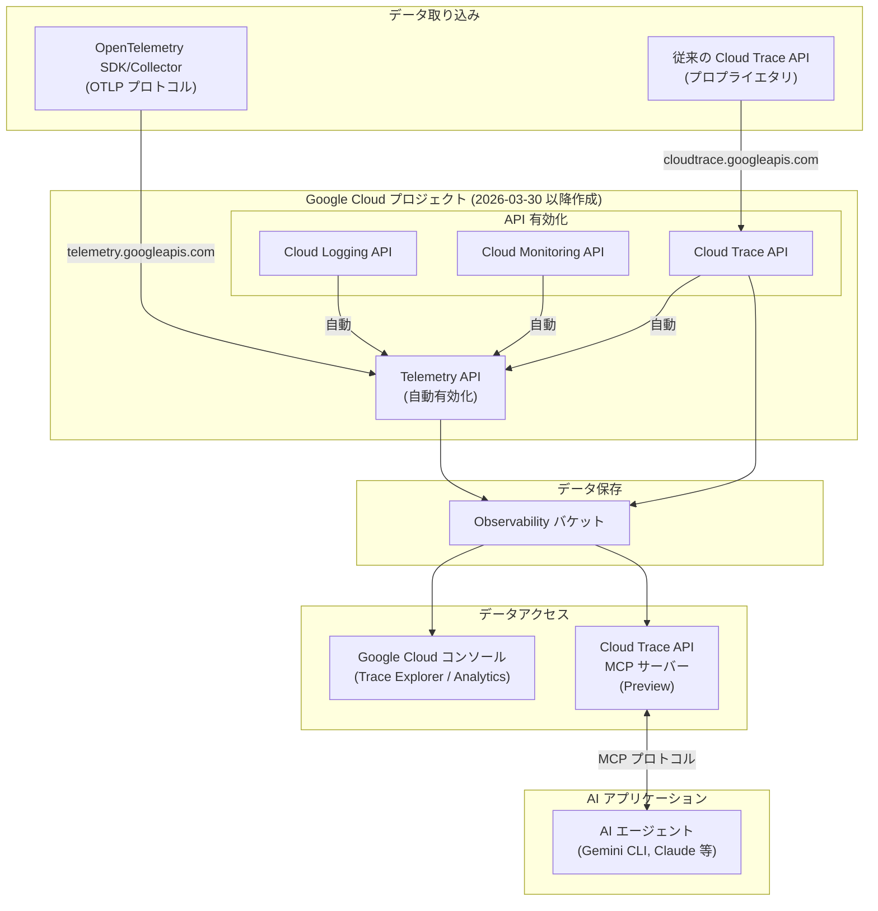

# Google Cloud Observability: Telemetry API 自動有効化と Cloud Trace MCP サーバー (Preview)

**リリース日**: 2026-03-30

**サービス**: Google Cloud Observability (Cloud Logging, Cloud Monitoring, Cloud Trace)

**機能**: Telemetry API の自動有効化 / Cloud Trace API MCP サーバー

**ステータス**: Change (Telemetry API 自動有効化) / Preview (Cloud Trace MCP サーバー)

📊 [このアップデートのインフォグラフィックを見る](https://takech9203.github.io/google-cloud-news-summary/20260330-google-cloud-observability-telemetry-api-trace-mcp.html)

## 概要

Google Cloud Observability に2つの重要なアップデートが発表されました。1つ目は、2026年3月30日以降に作成される新しいプロジェクトにおいて、Cloud Logging API、Cloud Monitoring API、または Cloud Trace API のいずれかを有効化すると、Telemetry API も自動的に有効化されるようになった点です。これにより、OpenTelemetry エコシステムとの統合がよりシームレスになります。

2つ目は、Cloud Trace API MCP サーバーが Preview として利用可能になった点です。Model Context Protocol (MCP) は Anthropic が開発したオープンソースプロトコルで、AI アプリケーションが外部データソースに標準化された方法で接続することを可能にします。Cloud Trace API MCP サーバーを使用することで、AI エージェントやアプリケーションがトレースデータと直接対話できるようになり、障害調査やパフォーマンス分析の自動化が大幅に進化します。

これらのアップデートは、Google Cloud の Observability スタックを OpenTelemetry 標準と AI エージェントの両面から強化するものであり、SRE エンジニア、DevOps チーム、そして AI を活用した運用自動化に取り組むチームにとって重要な意味を持ちます。

**アップデート前の課題**

- Telemetry API を利用するには、Cloud Logging / Monitoring / Trace の各 API とは別に手動で有効化する必要があった
- OpenTelemetry (OTLP) でテレメトリデータを送信するために、追加の API 有効化手順が必要だった
- トレースデータの分析は Google Cloud コンソールや API を直接操作する必要があり、AI エージェントから自然言語でトレースデータにアクセスする手段がなかった

**アップデート後の改善**

- 新規プロジェクトで Observability 関連 API を有効化すると、Telemetry API が自動的に有効化され、OpenTelemetry との統合が即座に利用可能になった
- Telemetry API の手動有効化が不要になり、初期セットアップの手順が簡素化された
- Cloud Trace API MCP サーバーにより、AI エージェントがトレースデータをクエリ・分析できるようになり、インシデント対応の自動化が可能になった

## アーキテクチャ図



この図は、新規プロジェクトにおける Observability API の自動有効化フローと、データ取り込みから AI エージェントによるアクセスまでの全体アーキテクチャを示しています。Telemetry API が自動有効化されることで、OpenTelemetry からのデータ取り込みが即座に利用可能になり、Cloud Trace MCP サーバーを通じて AI エージェントがトレースデータにアクセスできます。

## サービスアップデートの詳細

### 主要機能

1. **Telemetry API の自動有効化**
   - 2026年3月30日以降に作成された新規プロジェクトが対象
   - Cloud Logging API、Cloud Monitoring API、Cloud Trace API のいずれかを有効化すると、Telemetry API (`telemetry.googleapis.com`) も自動的に有効化される
   - Telemetry API は OpenTelemetry OTLP プロトコルの実装であり、OTLP 形式のトレースデータやメトリクスの取り込みに対応
   - Telemetry API のクォータ制限は Cloud Trace API よりも緩やかに設定されている場合が多い

2. **Cloud Trace API MCP サーバー (Preview)**
   - AI エージェントや AI アプリケーションがトレースデータと対話するためのリモート MCP サーバー
   - MCP (Model Context Protocol) は AI アプリケーションと外部データソースの接続を標準化するオープンソースプロトコル
   - Gemini CLI、Claude、ChatGPT などの AI アプリケーションから利用可能
   - IAM による細かなアクセス制御、認証・認可のサポート

3. **OpenTelemetry エコシステムとの統合強化**
   - Telemetry API は OpenTelemetry SDK および Collector との互換性を提供
   - トレースデータは OpenTelemetry OTLP プロトコルと整合性のある形式で保存される
   - Google Cloud 固有のエクスポーターに依存しないインストルメンテーションが可能
   - Application Monitoring などの一部機能は Telemetry API 経由でのデータ送信が必要

## 技術仕様

### Telemetry API

| 項目 | 詳細 |
|------|------|
| サービス名 | `telemetry.googleapis.com` |
| プロトコル | OpenTelemetry OTLP Protocol |
| 対応データ | トレース (v1.traces)、メトリクス (v1.metrics) |
| VPC Service Controls | 対応 (Telemetry API サービスのみに制限が適用) |
| 対象プロジェクト | 2026年3月30日以降に作成された新規プロジェクト |
| 自動有効化トリガー | Cloud Logging API / Cloud Monitoring API / Cloud Trace API の有効化 |

### Cloud Trace MCP サーバー

| 項目 | 詳細 |
|------|------|
| ステータス | Preview (Pre-GA) |
| サーバー種別 | リモート MCP サーバー (HTTP エンドポイント) |
| 認証 | Google Cloud 認証情報 / MCP 認可仕様準拠 |
| アクセス制御 | IAM による細粒度認可 |
| 対応クライアント | MCP 対応 AI アプリケーション (Gemini CLI, Claude, ChatGPT 等) |
| ドキュメント | [Cloud Trace API MCP server](https://docs.cloud.google.com/trace/docs/reference/mcp/mcp) |

### MCP サーバー接続設定例

```json
{
  "mcpServers": {
    "cloud-trace": {
      "url": "https://cloudtrace.googleapis.com/mcp/v1",
      "auth": {
        "type": "google-cloud",
        "scopes": ["https://www.googleapis.com/auth/cloud-platform"]
      }
    }
  }
}
```

※ 上記は MCP クライアント設定の概念的な例です。実際の設定は公式ドキュメントを参照してください。

## 設定方法

### 前提条件

1. Google Cloud プロジェクトが 2026年3月30日以降に作成されていること (Telemetry API 自動有効化の場合)
2. 必要な IAM 権限が付与されていること
3. MCP 対応の AI アプリケーション (Cloud Trace MCP サーバー利用の場合)

### 手順

#### ステップ 1: Observability API の有効化を確認

```bash
# Cloud Trace API の有効化状態を確認
gcloud services list --enabled --filter="name:cloudtrace.googleapis.com"

# Telemetry API の有効化状態を確認
gcloud services list --enabled --filter="name:telemetry.googleapis.com"
```

2026年3月30日以降に作成されたプロジェクトでは、Cloud Logging、Cloud Monitoring、Cloud Trace のいずれかの API を有効化すると Telemetry API も自動的に有効化されます。

#### ステップ 2: 既存プロジェクトでの Telemetry API 有効化 (必要な場合)

```bash
# 既存プロジェクトで Telemetry API を手動で有効化
gcloud services enable telemetry.googleapis.com
```

2026年3月30日より前に作成されたプロジェクトでは、手動での有効化が必要です。

#### ステップ 3: OpenTelemetry Collector の設定 (OTLP エンドポイント利用)

```yaml
# otel-collector-config.yaml
exporters:
  otlphttp:
    endpoint: "https://telemetry.googleapis.com"
    headers:
      x-goog-user-project: "YOUR_PROJECT_ID"

service:
  pipelines:
    traces:
      exporters: [otlphttp]
```

Telemetry API の OTLP エンドポイントにトレースデータを送信する OpenTelemetry Collector の設定例です。

#### ステップ 4: Cloud Trace MCP サーバーの利用

MCP 対応の AI アプリケーション (Gemini CLI 等) を設定し、Cloud Trace API MCP サーバーに接続します。詳細な設定手順は[公式ドキュメント](https://docs.cloud.google.com/trace/docs/reference/mcp/mcp)を参照してください。

## メリット

### ビジネス面

- **運用効率の向上**: AI エージェントによるトレースデータの自動分析により、MTTR (平均復旧時間) の短縮が期待できる
- **初期セットアップコストの削減**: Telemetry API の自動有効化により、新規プロジェクトの Observability 環境構築が簡素化される
- **ベンダーロックインの軽減**: OpenTelemetry 標準への準拠により、マルチクラウド環境でのインストルメンテーションの移植性が向上する

### 技術面

- **OpenTelemetry ネイティブ統合**: OTLP プロトコルの直接サポートにより、Google Cloud 固有のエクスポーターが不要になる
- **緩やかなクォータ制限**: Telemetry API は Cloud Trace API よりも緩やかなクォータ制限を持つ場合が多く、大規模トレースデータの取り込みに有利
- **AI 駆動の Observability**: MCP サーバーを通じて AI エージェントがトレースデータにプログラマティックにアクセスでき、自然言語での障害分析が可能になる

## デメリット・制約事項

### 制限事項

- Cloud Trace MCP サーバーは Preview 段階であり、サポートが限定的で、機能変更の可能性がある
- Telemetry API の自動有効化は 2026年3月30日以降に作成された新規プロジェクトのみが対象であり、既存プロジェクトでは手動有効化が必要
- Assured Workloads を使用してデータレジデンシーや IL4 要件がある場合、Telemetry API を使用してトレーススパンを送信することはできない
- VPC Service Controls の制限は Telemetry API サービスのみに適用され、Cloud Trace API など他のサービスには適用されない

### 考慮すべき点

- 既存プロジェクトの移行: 既にプロプライエタリな Cloud Trace エクスポーターを使用している場合、OTLP エンドポイントへの移行を計画的に進める必要がある
- MCP サーバーのセキュリティ: AI エージェントがトレースデータにアクセスする際の IAM 権限設計を適切に行い、最小権限の原則を遵守する必要がある
- Preview 機能の本番利用: Cloud Trace MCP サーバーは Preview であるため、本番環境での利用は Pre-GA サービス規約の条件下となる

## ユースケース

### ユースケース 1: AI エージェントによる自動インシデント調査

**シナリオ**: SRE チームがアラートを受け取った際、AI エージェントが Cloud Trace MCP サーバーを通じてトレースデータを自動的に分析し、レイテンシの異常やエラーの根本原因を特定する。

**実装例**:
```
# AI エージェントへの自然言語プロンプト例
「過去1時間で payment-service のレイテンシが P99 で 5秒を超えているトレースを
検索し、ボトルネックとなっているスパンを特定してください」
```

**効果**: インシデント調査の初期トリアージを自動化し、エンジニアは AI エージェントが提供する分析結果をもとに迅速に対応策を実行できる。MTTR の大幅な短縮が期待される。

### ユースケース 2: OpenTelemetry への段階的移行

**シナリオ**: 新規プロジェクトで Cloud Trace API を有効化すると Telemetry API も自動的に有効化されるため、最初から OpenTelemetry SDK と OTLP エクスポーターを使用してインストルメンテーションを構築する。

**効果**: Google Cloud 固有のエクスポーターに依存しないため、将来的なマルチクラウド展開やインストルメンテーションライブラリの変更が容易になる。また、Telemetry API のより緩やかなクォータ制限を活用できる。

### ユースケース 3: Observability as Code の自動化

**シナリオ**: CI/CD パイプラインで新しい Google Cloud プロジェクトを Terraform で作成する際、Cloud Monitoring API を有効化するだけで Telemetry API も自動的に有効化されるため、追加の Terraform リソース定義が不要になる。

**効果**: Infrastructure as Code のテンプレートが簡素化され、プロジェクトの初期セットアップにおける手動作業や設定漏れのリスクが軽減される。

## 料金

Telemetry API および Cloud Trace MCP サーバーに固有の追加料金は現時点では発表されていません。料金は既存の Cloud Trace、Cloud Logging、Cloud Monitoring の料金体系に準じます。

### 料金例

| 使用量 | 月額料金 (概算) |
|--------|-----------------|
| Cloud Trace: 最初の 250 万スパン/月 | 無料 |
| Cloud Trace: 250 万スパン超過分 | $0.20 / 100 万スパン |
| Cloud Monitoring: 最初の 150 MB/月 (取り込み) | 無料 |

※ 最新の料金情報は [Cloud Trace 料金ページ](https://cloud.google.com/trace#pricing) および [Cloud Monitoring 料金ページ](https://cloud.google.com/monitoring/pricing) をご確認ください。

## 利用可能リージョン

Telemetry API の自動有効化はグローバルに適用されます。Cloud Trace MCP サーバーはリモート MCP サーバーとして Google Cloud インフラストラクチャ上で動作し、グローバルエンドポイントまたはリージョナルエンドポイントが提供されます。詳細なリージョン情報は公式ドキュメントをご確認ください。

なお、Assured Workloads を使用してデータレジデンシー要件がある環境では、Telemetry API によるトレースデータの送信は利用できません。

## 関連サービス・機能

- **[Telemetry API](https://docs.cloud.google.com/stackdriver/docs/reference/telemetry/overview)**: OpenTelemetry OTLP プロトコルの実装であり、今回の自動有効化の対象
- **[Cloud Trace](https://docs.cloud.google.com/trace/docs/overview)**: 分散トレーシングサービス。Trace Explorer や Observability Analytics でトレースデータを可視化
- **[Cloud Logging](https://docs.cloud.google.com/logging/docs/overview)**: ログ管理サービス。Telemetry API 自動有効化のトリガーの1つ
- **[Cloud Monitoring](https://docs.cloud.google.com/monitoring/docs/overview)**: メトリクス監視サービス。Telemetry API 自動有効化のトリガーの1つ
- **[Google Cloud MCP サーバー](https://docs.cloud.google.com/mcp/overview)**: Google Cloud サービスへの AI エージェントアクセスを提供する MCP サーバー群
- **[OpenTelemetry](https://opentelemetry.io/)**: Google Cloud がサポートするオープンソースの Observability フレームワーク

## 参考リンク

- 📊 [インフォグラフィック](https://takech9203.github.io/google-cloud-news-summary/20260330-google-cloud-observability-telemetry-api-trace-mcp.html)
- [公式リリースノート](https://docs.cloud.google.com/release-notes#March_30_2026)
- [Telemetry API ドキュメント](https://docs.cloud.google.com/stackdriver/docs/reference/telemetry/overview)
- [Cloud Trace API MCP サーバー](https://docs.cloud.google.com/trace/docs/reference/mcp/mcp)
- [Cloud Trace ドキュメント](https://docs.cloud.google.com/trace/docs/overview)
- [Google Cloud MCP サーバー概要](https://docs.cloud.google.com/mcp/overview)
- [Cloud Trace 料金](https://cloud.google.com/trace#pricing)

## まとめ

今回のアップデートは、Google Cloud Observability を OpenTelemetry 標準と AI エージェントの2つの軸で強化する重要な変更です。Telemetry API の自動有効化により、新規プロジェクトでの OpenTelemetry 統合が大幅に簡素化されます。また、Cloud Trace API MCP サーバー (Preview) の登場により、AI エージェントがトレースデータに直接アクセスできるようになり、障害調査やパフォーマンス分析の自動化に新たな可能性が開かれます。新規プロジェクトを作成する際は Telemetry API が自動有効化されることを前提に OpenTelemetry ベースのインストルメンテーション設計を進め、Cloud Trace MCP サーバーの Preview を試してみることを推奨します。

---

**タグ**: #GoogleCloud #CloudObservability #CloudTrace #CloudLogging #CloudMonitoring #TelemetryAPI #OpenTelemetry #MCP #ModelContextProtocol #AIAgent #Preview #Observability #SRE #DevOps
