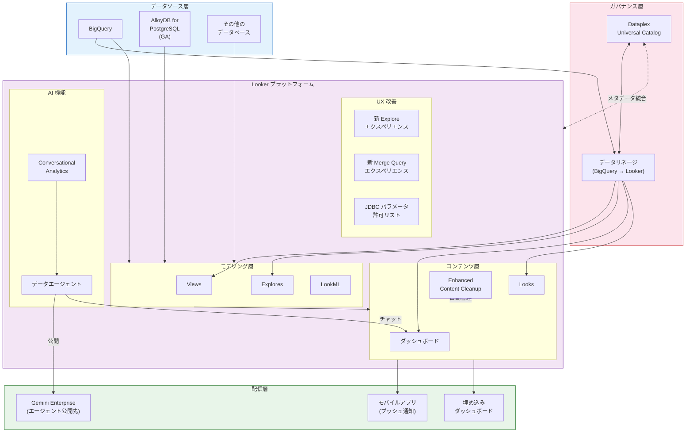

# Looker: Conversational Analytics、Dataplex リネージ統合、コンテンツ管理強化など多数の新機能

**リリース日**: 2026-03-30

**サービス**: Looker

**機能**: Conversational Analytics データエージェント公開、Dataplex リネージ統合、Enhanced Content Cleanup、AlloyDB 正式サポートなど

**ステータス**: 複数機能 (Preview / GA / Change)

📊 [このアップデートのインフォグラフィックを見る](https://takech9203.github.io/google-cloud-news-summary/20260330-looker-conversational-analytics-lineage.html)

## 概要

Looker に対して、AI 活用、データガバナンス、コンテンツ管理、データベース接続、UI 刷新にわたる大規模なアップデートが一斉にリリースされました。特に注目すべきは、Conversational Analytics データエージェントの Gemini Enterprise への公開機能、BigQuery から Looker コンテンツまでのエンドツーエンドのデータリネージ追跡を実現する Dataplex 統合、そして Dataplex Universal Catalog とのメタデータ統合です。

これらのアップデートにより、Looker は単なる BI ツールから、AI 駆動の分析基盤、統合メタデータカタログ、データガバナンスハブとしての役割を大幅に強化しています。データアナリスト、BI 管理者、データエンジニア、データスチュワードのいずれにとっても、日常のワークフローを効率化する機能が含まれています。

また、AlloyDB for PostgreSQL との接続が GA となり、Looker モバイルアプリのプッシュ通知対応、新しい Explore / Merge Query エクスペリエンスのプレビューなど、プラットフォーム全体の機能拡充が図られています。

**アップデート前の課題**

- Conversational Analytics データエージェントは Looker 内でのみ利用可能で、Gemini Enterprise ユーザーに直接提供する手段がなかった
- BigQuery のスキーマ変更が Looker のダッシュボードやビューにどのような影響を与えるか把握するには、手動でのトレースが必要だった
- 未使用コンテンツの特定とクリーンアップは管理者の手動作業に依存し、大規模環境では運用負荷が高かった
- AlloyDB for PostgreSQL への接続はプレビュー段階であり、本番利用には制約があった
- Looker のメタデータと Dataplex Universal Catalog のメタデータは分離しており、統合的なデータディスカバリができなかった

**アップデート後の改善**

- Conversational Analytics データエージェントを Gemini Enterprise に公開でき、組織全体でのセルフサービス分析が加速
- Dataplex リネージ統合により、BigQuery から Looker コンテンツまでの影響分析が自動化された
- Enhanced Content Cleanup によりプログラム的なクリーンアップスケジュール設定が可能になり、管理負荷が大幅に軽減
- AlloyDB for PostgreSQL が GA となり、本番ワークロードでの利用が正式にサポートされた
- Dataplex Universal Catalog 統合により、Looker のメタデータを含めた統合的なデータディスカバリが実現

## アーキテクチャ図



この図は、今回のアップデートで強化された Looker エコシステム全体を示しています。データソース層からガバナンス層、Looker プラットフォーム内の各レイヤー、そして配信層までのデータとメタデータの流れを可視化しています。

## サービスアップデートの詳細

### AI 機能の強化

1. **Conversational Analytics データエージェントの Gemini Enterprise 公開 (Preview)**
   - Looker 内で作成した Conversational Analytics データエージェントを Gemini Enterprise に公開できるようになった
   - 組織全体のユーザーが Gemini Enterprise インターフェースからデータエージェントにアクセスし、自然言語でデータに関する質問が可能
   - LookML セマンティックモデリング層に基づいた、ガバナンスの効いたセルフサービス BI を組織全体に展開可能

2. **ダッシュボード内での Conversational Analytics チャット (Preview)**
   - ユーザー定義ダッシュボードおよび LookML ダッシュボード内で Conversational Analytics データエージェントとチャットが可能
   - ダッシュボードのコンテキストを維持したまま、追加の分析質問を自然言語で投げかけることができる
   - データの深掘りや仮説検証のフローがダッシュボード上で完結する

### データガバナンスとメタデータ管理

3. **Dataplex リネージ統合 (Preview)**
   - Looker (Google Cloud core) において、BigQuery から Looker コンテンツまでのエンドツーエンドのデータリネージ追跡が可能
   - 追跡対象: Views、Explores、ダッシュボード、Looks
   - BigQuery のスキーマ変更やテーブル変更がダウンストリームの Looker コンテンツにどのような影響を与えるかの影響分析 (Impact Analysis) が可能
   - Dataplex のリネージグラフ上で Looker コンテンツが可視化される

4. **Dataplex Universal Catalog 統合 (Preview)**
   - Looker (Google Cloud core) が Dataplex Universal Catalog と統合され、統一的なメタデータディスカバリが可能
   - Looker の Explore、ダッシュボード、ビューなどのメタデータが Dataplex Universal Catalog に登録される
   - AI によるナチュラルランゲージ検索を含む統合カタログ内で、Looker アセットも検索・発見対象となる

### コンテンツ管理

5. **Enhanced Content Cleanup (Preview)**
   - 管理者とコンテンツオーナーが利用できるコンテンツ管理の強化機能
   - **未使用コンテンツフォルダ**: 使用されていないコンテンツを自動的に特定して一覧表示
   - **プログラム的クリーンアップスケジュール**: 未使用コンテンツの削除を自動スケジューリング
   - **オプトアウト機能**: 特定のコンテンツをクリーンアップ対象から除外可能
   - **ゴミ箱移動**: 不要コンテンツをゴミ箱に移動する管理フロー

### データベース接続とプラットフォーム

6. **AlloyDB for PostgreSQL 接続の正式サポート (GA)**
   - AlloyDB for PostgreSQL への接続が GA (一般提供) となった
   - Symmetric Aggregates、Derived Tables、Persistent SQL/Native Derived Tables、SSL、Aggregate Awareness など主要機能を網羅的にサポート
   - Looker (Google Cloud core) での利用も完全サポート

7. **JDBC パラメータ許可リスト**
   - 各データベースダイアレクトに対して追加の JDBC パラメータの許可リストが導入
   - セキュリティ向上を目的とし、承認されたパラメータのみが接続に使用される

### UX とモバイル

8. **新しい Explore / Merge Query エクスペリエンス (Preview)**
   - Explore と Merge Query のインターフェースが再設計
   - より高速なインサイト取得を目的としたデザイン刷新

9. **モバイルアプリのプッシュ通知 (Change)**
   - Looker モバイルアプリケーションがアラート通知のプッシュ通知送信をサポート
   - リアルタイムでのアラート確認がモバイルデバイスから可能

## 技術仕様

### 機能別ステータス一覧

| 機能 | ステータス | 対象 |
|------|-----------|------|
| Conversational Analytics エージェント公開 | Preview | Looker (Google Cloud core) / Looker (original) |
| ダッシュボード内 CA チャット | Preview | Looker (Google Cloud core) / Looker (original) |
| Dataplex リネージ統合 | Preview | Looker (Google Cloud core) のみ |
| Dataplex Universal Catalog 統合 | Preview | Looker (Google Cloud core) のみ |
| Enhanced Content Cleanup | Preview | Looker (Google Cloud core) / Looker (original) |
| AlloyDB for PostgreSQL 接続 | GA | Looker (Google Cloud core) / Looker (original) |
| 新 Explore / Merge Query | Preview | Looker |
| JDBC パラメータ許可リスト | GA | 全ダイアレクト |
| モバイルプッシュ通知 | GA (Change) | Looker モバイルアプリ |

### Dataplex リネージ追跡対象

| Looker コンテンツタイプ | リネージ追跡 |
|------------------------|-------------|
| Views | 対応 |
| Explores | 対応 |
| ダッシュボード | 対応 |
| Looks | 対応 |

### AlloyDB for PostgreSQL サポート機能

| 機能カテゴリ | サポート状況 |
|-------------|-------------|
| Symmetric Aggregates | 対応 |
| Derived Tables (SQL/Native) | 対応 |
| Persistent Derived Tables | 対応 |
| SSL | 対応 |
| Aggregate Awareness | 対応 |
| Incremental PDTs | 対応 |
| OAuth 2.0 認証 | 対応 |
| Materialized Views | 対応 |

## 設定方法

### Conversational Analytics データエージェントの Gemini Enterprise 公開

#### 前提条件

1. Looker インスタンスで Gemini in Looker が有効化されていること
2. Conversational Analytics 設定が管理パネルで有効化されていること
3. Looker (Google Cloud core) の場合、`roles/looker.admin` IAM ロールが付与されたユーザーによる設定が必要

#### ステップ 1: データエージェントの作成

Looker の Conversations ページから Agents タブを開き、「+ New agent」を選択してエージェントを作成します。エージェント名、説明、対象 Explore (最大 5 つ)、指示 (Instructions) を設定します。

#### ステップ 2: Gemini Enterprise への公開

作成したデータエージェントを Gemini Enterprise に公開します。公開後、Gemini Enterprise ユーザーがエージェントにアクセスして自然言語で質問できるようになります。

### Dataplex リネージ統合の有効化

#### 前提条件

1. Looker (Google Cloud core) インスタンスであること
2. Data Lineage API がプロジェクトで有効化されていること
3. 必要な IAM ロール: `roles/datalineage.viewer`

#### ステップ 1: Data Lineage API の有効化

```bash
gcloud services enable datalineage.googleapis.com --project=PROJECT_ID
```

#### ステップ 2: Looker と Dataplex の統合設定

Looker (Google Cloud core) の管理パネルから Dataplex リネージ統合を有効化します。有効化後、BigQuery ジョブの完了から最大 24 時間以内にリネージ情報が反映されます。

### AlloyDB for PostgreSQL 接続

#### ステップ 1: 接続の作成

```
Admin > Connections > Add Connection
Dialect: Google Cloud AlloyDB for PostgreSQL
```

接続ホスト、ポート、データベース名、認証情報を入力し、「Test」で接続を確認後、「Connect」で保存します。

## メリット

### ビジネス面

- **組織全体のデータ活用促進**: Conversational Analytics エージェントを Gemini Enterprise に公開することで、技術的なスキルを持たないビジネスユーザーもデータドリブンな意思決定が可能になる
- **変更影響の可視化**: Dataplex リネージ統合により、データインフラの変更がビジネスレポートに与える影響を事前に把握でき、意図しない障害を防止できる
- **コンテンツ管理コストの削減**: Enhanced Content Cleanup により、肥大化した Looker 環境のコンテンツ整理を自動化し、管理者の運用負荷を削減

### 技術面

- **エンドツーエンドリネージ**: BigQuery テーブルからLooker の View、Explore、ダッシュボード、Look までの完全なデータリネージが自動追跡される
- **統合メタデータカタログ**: Dataplex Universal Catalog との統合により、Looker アセットを含む組織全体のデータカタログが統一される
- **データベース接続の拡充**: AlloyDB GA によりPostgreSQLワークロードを Google Cloud のフルマネージドデータベースで運用しつつ Looker で分析可能
- **セキュリティ強化**: JDBC パラメータ許可リストにより、データベース接続のセキュリティが向上

## デメリット・制約事項

### 制限事項

- Dataplex リネージ統合は Looker (Google Cloud core) のみで利用可能。Looker (original) インスタンスでは利用不可
- Dataplex リネージ情報は BigQuery ジョブ完了から最大 24 時間の反映遅延がある
- データリネージ情報の保持期間は 30 日間に限定される
- Conversational Analytics はまだ FedRAMP High / FedRAMP Medium の認可境界に含まれていない
- 多くの新機能が Preview ステータスであり、本番環境での利用には注意が必要

### 考慮すべき点

- Conversational Analytics の利用には Gemini in Looker の有効化が必要で、追加コストが発生する可能性がある
- データリネージ機能は Dataplex Universal Catalog のプレミアム処理 SKU で課金される
- Enhanced Content Cleanup の自動クリーンアップスケジュールは、重要なコンテンツの誤削除を防ぐためオプトアウト設定の事前検討が推奨される
- AlloyDB for PostgreSQL 接続でネットワーク暗号化を行う場合、SSL 設定が別途必要

## ユースケース

### ユースケース 1: 全社データ分析の民主化

**シナリオ**: 大企業のデータチームが Looker で構築した売上・顧客分析のデータエージェントを、経営企画部や営業部門の非技術者にも展開したい。

**実装例**:
1. データチームが Looker で売上分析用のデータエージェントを作成 (売上 Explore、顧客 Explore を接続)
2. エージェントの Instructions に業界用語のマッピングを記述 (例: 「新規案件」= MRR の新規獲得)
3. エージェントを Gemini Enterprise に公開
4. 営業担当者が Gemini Enterprise から「今月の関東地方の新規案件はどれくらい?」と自然言語で質問

**効果**: SQL やダッシュボード操作の知識がなくても、ガバナンスの効いたデータアクセスが可能になる

### ユースケース 2: BigQuery スキーマ変更の影響分析

**シナリオ**: データエンジニアが BigQuery のテーブルスキーマを変更する際に、Looker のどのダッシュボードやレポートに影響があるかを事前に把握したい。

**実装例**:
1. Dataplex リネージ統合を有効化
2. Dataplex のリネージグラフで変更対象の BigQuery テーブルを選択
3. ダウンストリームの Looker View、Explore、ダッシュボード、Look を一覧で確認
4. 影響範囲を把握した上で、関連するダッシュボードのオーナーに事前通知

**効果**: スキーマ変更による Looker レポートの破損を事前に防止し、計画的なマイグレーションが可能になる

### ユースケース 3: 大規模 Looker 環境のコンテンツ整理

**シナリオ**: 数百のダッシュボードと Look が蓄積された Looker 環境で、使われていないコンテンツを定期的に整理したい。

**実装例**:
1. Enhanced Content Cleanup を有効化
2. 未使用コンテンツフォルダで 90 日以上未アクセスのコンテンツを確認
3. 重要なダッシュボードにはオプトアウト設定を適用
4. 月次のクリーンアップスケジュールを設定

**効果**: ストレージコストの削減、ユーザーの検索効率向上、環境のメンテナンス性向上

## 料金

今回のアップデートに関連する料金体系は以下の通りです。

### 料金の考慮事項

| 機能 | 料金への影響 |
|------|-------------|
| Conversational Analytics | Gemini in Looker の料金に含まれる (Looker の料金ページを参照) |
| Dataplex リネージ | Dataplex Universal Catalog プレミアム処理 SKU で課金 |
| Dataplex Universal Catalog 統合 | Dataplex の料金体系に準拠 |
| AlloyDB 接続 | Looker 側の追加料金なし (AlloyDB インスタンス費用は別途) |
| モバイルプッシュ通知 | 追加料金なし |

## 利用可能リージョン

- Looker (Google Cloud core): Looker インスタンスがデプロイされているリージョンに依存
- Dataplex リネージ: Data Lineage API がサポートされているリージョンで利用可能
- AlloyDB for PostgreSQL: AlloyDB がサポートされている全リージョンからの接続が可能
- Conversational Analytics のデータは、Looker インスタンスのリージョンに保存される (データレジデンシ対応)

## 関連サービス・機能

- **Gemini Enterprise**: Conversational Analytics データエージェントの公開先として機能し、組織全体へのセルフサービス分析を提供
- **Dataplex Universal Catalog**: Looker のメタデータを統合カタログに登録し、AI 駆動のデータディスカバリを実現
- **Dataplex データリネージ**: BigQuery から Looker コンテンツまでのエンドツーエンドのデータ系統追跡を提供
- **BigQuery**: Looker の主要データソースとして、リネージ統合のアップストリーム起点
- **AlloyDB for PostgreSQL**: フルマネージド PostgreSQL 互換データベースとして、Looker からの接続が GA サポート

## 参考リンク

- 📊 [インフォグラフィック](https://takech9203.github.io/google-cloud-news-summary/20260330-looker-conversational-analytics-lineage.html)
- [公式リリースノート](https://docs.cloud.google.com/release-notes#March_30_2026)
- [Conversational Analytics 概要ドキュメント](https://cloud.google.com/looker/docs/conversational-analytics-overview)
- [Conversational Analytics データエージェント](https://cloud.google.com/looker/docs/conversational-analytics-looker-data-agents)
- [Dataplex データリネージ](https://cloud.google.com/dataplex/docs/about-data-lineage)
- [Dataplex Universal Catalog](https://cloud.google.com/dataplex/docs/catalog-overview)
- [AlloyDB for PostgreSQL 接続設定](https://cloud.google.com/looker/docs/db-config-alloydb)
- [Looker 料金ページ](https://cloud.google.com/looker/pricing)

## まとめ

今回の Looker アップデートは、AI 駆動の分析、データガバナンス、コンテンツ管理、データベース接続、UX 改善を横断する大規模なリリースです。特に Conversational Analytics データエージェントの Gemini Enterprise 公開と Dataplex リネージ統合は、Looker を中心としたデータ分析エコシステムの統合度を飛躍的に高めるものであり、データドリブンな組織運営を加速させます。Preview 機能が多いため、まずは開発・検証環境で各機能を試用し、GA 移行のタイミングで本番適用を計画することを推奨します。

---

**タグ**: #Looker #ConversationalAnalytics #Dataplex #DataLineage #BigQuery #AlloyDB #GeminiEnterprise #DataGovernance #ContentManagement #MetadataCatalog #Preview #GA
