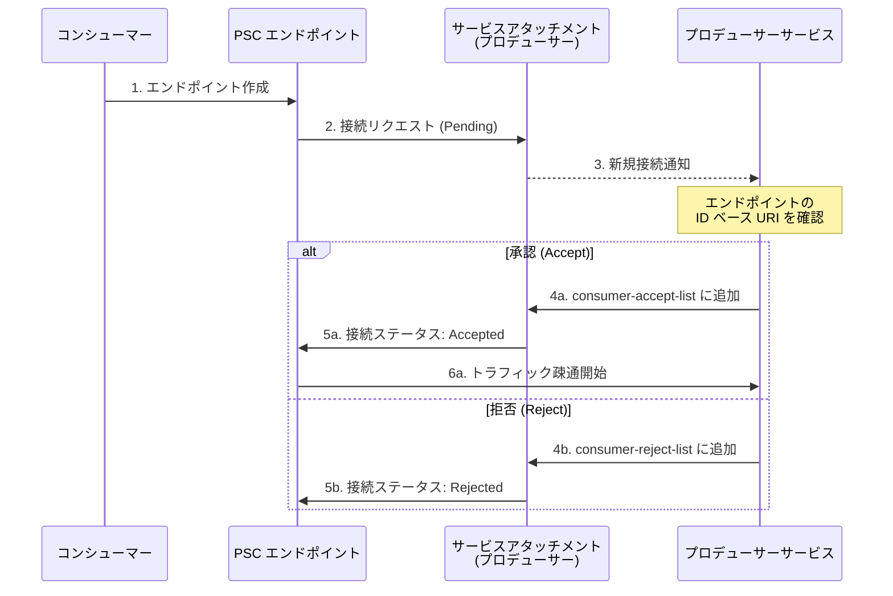

# Virtual Private Cloud (VPC): Private Service Connect エンドポイント単位のアクセス制御が GA

**リリース日**: 2026-03-30

**サービス**: Virtual Private Cloud (VPC)

**機能**: Private Service Connect エンドポイント単位の接続承認・拒否

**ステータス**: General Availability (GA)

📊 [このアップデートのインフォグラフィックを見る](https://takech9203.github.io/google-cloud-news-summary/20260330-vpc-private-service-connect-endpoint-control.html)

## 概要

Google Cloud は、Private Service Connect (PSC) のサービスアタッチメントにおいて、個々のエンドポイント単位で接続を承認または拒否する機能を General Availability (GA) としてリリースしました。これにより、サービスプロデューサーはプロジェクトや VPC ネットワーク単位ではなく、個別の PSC エンドポイントを指定してきめ細かなアクセス制御を行えるようになります。

この機能は、マルチテナントサービスを提供するプロデューサーにとって特に有用です。従来のプロジェクト単位や VPC ネットワーク単位の制御では、同一プロジェクト内の全エンドポイントを一括で許可・拒否するしかありませんでしたが、エンドポイント単位の制御により、特定のエンドポイントのみを選択的に承認できます。

対象ユーザーは、PSC を使用してサービスを公開しているプロデューサー組織、およびプロデューサーのサービスに接続するコンシューマー組織のネットワーク管理者です。

**アップデート前の課題**

従来の PSC アクセス制御には以下の制限がありました。

- プロジェクト単位または VPC ネットワーク単位でしかコンシューマーの接続を制御できず、同一プロジェクト内の個別エンドポイントを区別できなかった
- マルチテナント環境では、同じプロジェクト内の異なるテナントのエンドポイントを個別に管理することが困難だった
- エンドポイント単位の制御は Preview 段階であり、本番環境での利用には SLA やサポートの面で制約があった

**アップデート後の改善**

今回の GA リリースにより、以下の改善が実現しました。

- 個々の PSC エンドポイントの ID ベース URI を使用して、エンドポイント単位で接続を承認・拒否可能になった
- マルチテナントサービスにおいて、テナントごとのエンドポイントを個別に制御でき、最もきめ細かなアクセス管理が可能になった
- GA リリースにより SLA の対象となり、本番ワークロードでの利用が正式にサポートされるようになった

## アーキテクチャ図



この図は、コンシューマーが PSC エンドポイントを作成してからプロデューサーが個別に承認または拒否するまでのフローを示しています。エンドポイント作成後、接続は Pending 状態となり、プロデューサーが ID ベース URI を確認して明示的に承認することで接続が確立されます。

## サービスアップデートの詳細

### 主要機能

1. **エンドポイント単位の承認・拒否**
   - サービスアタッチメントのコンシューマー承認リスト (consumer-accept-list) およびコンシューマー拒否リスト (consumer-reject-list) に、個別の PSC エンドポイントの ID ベース URI を指定可能
   - 同一プロジェクト内の異なるエンドポイントに対して異なるアクセスポリシーを適用可能

2. **ID ベース URI による識別**
   - 各エンドポイントは一意の ID ベース URI を持ち、この URI を使用してアクセス制御を行う
   - URI の形式: `https://www.googleapis.com/compute/v1/projects/PROJECT/regions/REGION/forwardingRules/RESOURCE_ID`
   - サービスアタッチメントの `endpointWithId` フィールド、またはエンドポイントの `selfLinkWithId` フィールドから取得可能

3. **明示的承認ワークフロー**
   - プロデューサーは承認リストを空にしたサービスアタッチメントを作成し、明示的承認 (ACCEPT_MANUAL) を設定
   - コンシューマーがエンドポイントを作成すると Pending 状態になる
   - プロデューサーが ID ベース URI を確認後、承認リストに追加することで接続が確立

## 技術仕様

### コンシューマーリストの制約

| 項目 | 詳細 |
|------|------|
| 承認リスト (accept list) 最大値 | 5,000 エントリ |
| 拒否リスト (reject list) 最大値 | 64 エントリ |
| コンシューマータイプの混在 | 不可 (プロジェクト、VPC ネットワーク、エンドポイントのいずれか1種類) |
| 対象リソース | PSC エンドポイントのみ (PSC バックエンドは非対応) |
| 同一値を承認・拒否両方に追加 | 接続はブロックされる |

### 必要な IAM 権限

| 権限 | 説明 |
|------|------|
| `compute.serviceAttachments.update` | サービスアタッチメントの更新 |
| `compute.serviceAttachments.get` | サービスアタッチメントの詳細表示 |
| `roles/compute.networkAdmin` | 上記権限を含む事前定義ロール |

## 設定方法

### 前提条件

1. サービスアタッチメントが明示的承認 (`ACCEPT_MANUAL`) で作成されていること
2. `roles/compute.networkAdmin` ロールが付与されていること
3. コンシューマーが PSC エンドポイントを作成済みであること

### 手順

#### ステップ 1: サービスアタッチメントの作成 (プロデューサー側)

```bash
gcloud compute service-attachments create my-service-attachment \
  --region=us-central1 \
  --target-service=projects/my-project/regions/us-central1/forwardingRules/my-producer-rule \
  --connection-preference=ACCEPT_MANUAL \
  --nat-subnets=my-psc-subnet
```

明示的承認を有効にし、承認リストを空にしてサービスアタッチメントを作成します。この段階では全ての新規接続が Pending 状態になります。

#### ステップ 2: Pending エンドポイントの確認 (プロデューサー側)

```bash
gcloud compute service-attachments describe my-service-attachment \
  --region=us-central1
```

出力の `connectedEndpoints` セクションから、Pending 状態のエンドポイントの `endpointWithId` フィールドを確認します。

#### ステップ 3: エンドポイントの承認 (プロデューサー側)

```bash
gcloud compute service-attachments update my-service-attachment \
  --region=us-central1 \
  --consumer-accept-list=https://www.googleapis.com/compute/v1/projects/consumer-project/regions/us-central1/forwardingRules/12345678901234567
```

エンドポイントの ID ベース URI を承認リストに追加すると、接続ステータスが Pending から Accepted に変更され、トラフィックが疎通を開始します。

#### ステップ 4: エンドポイントの拒否 (必要な場合)

```bash
gcloud compute service-attachments update my-service-attachment \
  --region=us-central1 \
  --consumer-reject-list=https://www.googleapis.com/compute/v1/projects/consumer-project/regions/us-central1/forwardingRules/98765432109876543
```

特定のエンドポイントを拒否リストに追加して接続をブロックします。

## メリット

### ビジネス面

- **マルチテナント管理の効率化**: SaaS プロバイダーやマネージドサービス提供者が、テナントごとの接続を個別に管理でき、オンボーディングやオフボーディングが容易になる
- **コンプライアンス対応の強化**: 規制要件に基づいて特定のエンドポイントのみを許可し、監査証跡を明確に残すことができる
- **GA による本番利用の安心感**: SLA に基づくサポートが提供され、ミッションクリティカルなワークロードでも安心して利用可能

### 技術面

- **最もきめ細かなアクセス制御**: プロジェクトや VPC ネットワーク単位を超えた、エンドポイント単位の精密な制御が可能
- **ゼロトラストアーキテクチャとの親和性**: 個別のエンドポイントを明示的に承認する方式は、最小権限の原則に基づくゼロトラストモデルと整合する
- **既存接続への影響なし**: 承認・拒否リストの更新は新規接続にのみ影響し、接続調整 (Connection reconciliation) が有効でない限り既存接続は維持される

## デメリット・制約事項

### 制限事項

- PSC バックエンドには対応しておらず、PSC エンドポイントのみが対象
- 承認リストと拒否リストで異なるタイプのコンシューマーを混在させることはできない (エンドポイント URI を使用する場合、同じリスト内にプロジェクト ID や VPC ネットワークを追加不可)
- エンドポイントの ID ベース URI はエンドポイント作成後にのみ判明するため、事前承認はできない
- 拒否リストの上限は 64 エントリと比較的少ない

### 考慮すべき点

- エンドポイント単位の制御に切り替える際、既存のプロジェクト単位や VPC ネットワーク単位の承認リストとは別のサービスアタッチメントを作成する必要がある場合がある (同一リスト内でタイプの混在不可)
- コンシューマーがエンドポイントを作成してから承認されるまでの間、接続は Pending 状態のままとなるため、自動化されたワークフローの構築を検討する必要がある
- 組織ポリシー (`compute.restrictPrivateServiceConnectProducer`) が設定されている場合、承認リストで許可していても組織ポリシーによってブロックされる可能性がある

## ユースケース

### ユースケース 1: マルチテナント SaaS サービスの接続管理

**シナリオ**: SaaS プロバイダーが複数のテナント企業に対してサービスを提供しており、各テナントが同一プロジェクト内に複数の PSC エンドポイントを持っている場合。特定テナントの契約終了時に、そのテナントのエンドポイントのみを拒否したい。

**実装例**:
```bash
# テナント A のエンドポイントを承認
gcloud compute service-attachments update my-saas-service \
  --region=us-central1 \
  --consumer-accept-list=https://www.googleapis.com/compute/v1/projects/tenant-project/regions/us-central1/forwardingRules/111111111111

# テナント B のエンドポイントを拒否 (契約終了)
gcloud compute service-attachments update my-saas-service \
  --region=us-central1 \
  --consumer-reject-list=https://www.googleapis.com/compute/v1/projects/tenant-project/regions/us-central1/forwardingRules/222222222222
```

**効果**: 同一プロジェクト内でもテナントごとに接続を個別管理でき、契約ライフサイクルに応じた柔軟なアクセス制御が実現する。

### ユースケース 2: 段階的なサービス公開

**シナリオ**: 新しい内部サービスを段階的に社内チームに公開する場合。まず特定チームのエンドポイントのみを承認し、問題がないことを確認してから他のチームのエンドポイントも順次承認する。

**効果**: リスクを最小化しながら段階的にサービスを展開でき、問題が発生した場合は特定エンドポイントのみを拒否リストに追加して即座に切断可能。

## 料金

Private Service Connect の料金は VPC の料金ページに記載されています。エンドポイント単位のアクセス制御機能自体に追加料金は発生しませんが、PSC の利用に伴う以下の料金が適用されます。

### 料金例

| 項目 | 料金 (概算) |
|------|-------------|
| PSC エンドポイント (転送ルール) | VPC 料金ページを参照 |
| データ処理料金 | PSC 経由のトラフィック量に基づく |
| サービスアタッチメント | VPC 料金ページを参照 |

最新の料金情報は [VPC 料金ページ](https://cloud.google.com/vpc/pricing) をご確認ください。

## 利用可能リージョン

Private Service Connect エンドポイント単位のアクセス制御は、PSC がサポートされている全てのリージョンで利用可能です。エンドポイントとサービスアタッチメントは同一リージョンに配置する必要がありますが、エンドポイントのグローバルアクセスを有効にすることで他のリージョンからのアクセスも可能です。

## 関連サービス・機能

- **[Private Service Connect](https://cloud.google.com/vpc/docs/about-accessing-vpc-hosted-services-endpoints)**: エンドポイント単位の制御は PSC の機能の一部であり、サービスアタッチメントを通じたプライベート接続の管理に使用される
- **[VPC Service Controls](https://cloud.google.com/vpc-service-controls)**: PSC と併用してデータ流出防止のセキュリティ境界を構成可能
- **[Network Connectivity Center](https://cloud.google.com/network-connectivity-center)**: 接続伝播 (Propagated connections) により、PSC エンドポイント経由のサービスを複数の VPC スポーク間で共有可能
- **[組織ポリシー](https://cloud.google.com/vpc/docs/private-service-connect-security)**: `restrictPrivateServiceConnectProducer` 制約と組み合わせて、組織レベルのアクセス制御を実現

## 参考リンク

- 📊 [インフォグラフィック](https://takech9203.github.io/google-cloud-news-summary/20260330-vpc-private-service-connect-endpoint-control.html)
- [公式リリースノート](https://docs.google.com/release-notes#March_30_2026)
- [ドキュメント: サービス公開のアクセス制御](https://docs.cloud.google.com/vpc/docs/about-controlling-access-published-services#accept-endpoint)
- [ドキュメント: 公開サービスの管理](https://cloud.google.com/vpc/docs/manage-private-service-connect-services)
- [ドキュメント: PSC セキュリティ](https://cloud.google.com/vpc/docs/private-service-connect-security)
- [料金ページ](https://cloud.google.com/vpc/pricing)

## まとめ

Private Service Connect のエンドポイント単位のアクセス制御が GA となったことで、サービスプロデューサーは最もきめ細かなレベルで接続を管理できるようになりました。特にマルチテナント SaaS サービスや、厳格なセキュリティ要件を持つ環境において、個別エンドポイントの承認・拒否は大きな価値を提供します。PSC を利用している組織は、この機能を活用してゼロトラストアーキテクチャに沿ったアクセス制御の強化を検討することを推奨します。

---

**タグ**: #VPC #PrivateServiceConnect #PSC #ネットワーキング #セキュリティ #GA #アクセス制御 #マルチテナント #サービスアタッチメント
