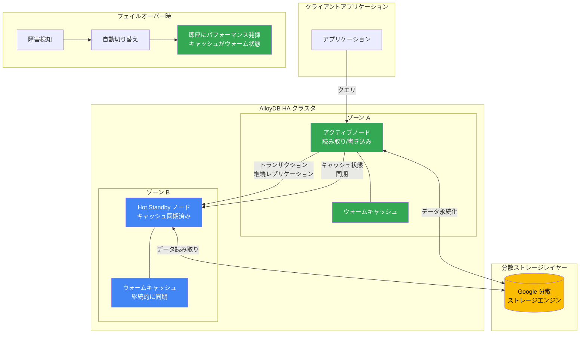

# AlloyDB for PostgreSQL: Hot Standby (GA)

**リリース日**: 2026-03-31

**サービス**: AlloyDB for PostgreSQL

**機能**: Hot Standby による高可用性アーキテクチャの強化

**ステータス**: GA (一般提供)

📊 [このアップデートのインフォグラフィックを見る](https://takech9203.github.io/google-cloud-news-summary/20260331-alloydb-hot-standby-ga.html)

## 概要

AlloyDB for PostgreSQL の Hot Standby 機能が一般提供 (GA) となりました。この機能は、AlloyDB の高可用性 (HA) アーキテクチャを強化し、フェイルオーバー時間の大幅な短縮と、フェイルオーバー後の一貫したパフォーマンスを実現します。Hot Standby は PostgreSQL 18 で GA となり、すべての新規インスタンスで自動的に有効化されます。

Hot Standby の核心は、スタンバイノードのキャッシュを常に「ウォーム」な状態に保つことです。AlloyDB はトランザクションをスタンバイノードに継続的にレプリケートし、キャッシュの同期を維持することで、フェイルオーバー発生時にスタンバイノードが即座にプライマリの役割を引き継げるようにします。これにより、従来の HA 構成で課題となっていたフェイルオーバー後のパフォーマンス低下（コールドキャッシュ問題）が解消されます。

この機能は、ミッションクリティカルなワークロードを AlloyDB 上で運用しているすべてのユーザーにとって重要なアップデートです。特に、金融システム、Eコマースプラットフォーム、リアルタイムアプリケーションなど、ダウンタイムやパフォーマンス劣化が直接的なビジネス損失につながる環境で大きな価値を発揮します。

**アップデート前の課題**

従来の AlloyDB HA 構成では、フェイルオーバーは自動的に行われるものの、いくつかの課題が存在していました。

- フェイルオーバー後、新しいアクティブノードのキャッシュがコールド状態であるため、クエリパフォーマンスが一時的に大幅に低下していた
- スタンバイノードはストレージレイヤーからデータを読み込む必要があり、キャッシュのウォームアップに時間を要していた
- フェイルオーバー後のパフォーマンス回復まで、アプリケーションのレスポンスタイムが不安定になっていた

**アップデート後の改善**

Hot Standby の導入により、以下の改善が実現されました。

- トランザクションの継続的なレプリケーションにより、スタンバイノードのキャッシュが常にウォーム状態に維持される
- フェイルオーバー時間が大幅に短縮され、より迅速なサービス復旧が可能になった
- フェイルオーバー後も一貫したパフォーマンスが維持され、コールドキャッシュによるパフォーマンス劣化が解消された
- PostgreSQL 18 の新規インスタンスでは自動的に有効化されるため、追加の設定作業が不要になった

## アーキテクチャ図



Hot Standby アーキテクチャでは、アクティブノードからスタンバイノードへトランザクションとキャッシュ状態が継続的にレプリケートされます。これにより、フェイルオーバー時にスタンバイノードがウォームキャッシュを持った状態で即座にアクティブノードの役割を引き継ぐことができます。

## サービスアップデートの詳細

### 主要機能

1. **継続的トランザクションレプリケーション**
   - アクティブノードで処理されるすべてのトランザクションがスタンバイノードにリアルタイムでレプリケートされる
   - スタンバイノードのデータ状態がアクティブノードとほぼ同一に維持される

2. **キャッシュウォーミング**
   - スタンバイノードのメモリキャッシュがアクティブノードと同期された状態で維持される
   - フェイルオーバー後にキャッシュのコールドスタートが発生しない
   - アクティブノードのアクセスパターンに基づいてスタンバイノードのキャッシュが事前にウォームアップされる

3. **高速フェイルオーバー**
   - フェイルオーバー時間が従来の HA 構成と比較して大幅に短縮される
   - フェイルオーバー後の性能劣化期間が実質的に排除される
   - アプリケーションへの影響が最小限に抑えられる

4. **自動有効化**
   - PostgreSQL 18 のすべての新規インスタンスで自動的に有効化
   - ユーザー側での追加設定は不要
   - 既存の HA インスタンスとの互換性を維持

## 技術仕様

### Hot Standby の技術要件

| 項目 | 詳細 |
|------|------|
| 対応 PostgreSQL バージョン | PostgreSQL 18 |
| ステータス | GA (一般提供) |
| 有効化方式 | 新規インスタンスで自動有効化 |
| インスタンスタイプ | HA プライマリインスタンス (リージョナル) |
| ノード構成 | アクティブノード + スタンバイノード (異なるゾーン) |
| レプリケーション方式 | 継続的トランザクションレプリケーション + キャッシュ同期 |
| フェイルオーバー | 自動フェイルオーバー + 手動フェイルオーバー対応 |

### 従来の HA と Hot Standby の比較

| 項目 | 従来の HA | Hot Standby |
|------|-----------|-------------|
| フェイルオーバー方式 | 自動 | 自動 |
| スタンバイノードのキャッシュ | コールド | ウォーム (継続同期) |
| フェイルオーバー後のパフォーマンス | 一時的に低下 | 一貫したパフォーマンス |
| キャッシュウォームアップ時間 | 数分〜数十分 | 不要 (事前同期済み) |
| トランザクションレプリケーション | ストレージレイヤー経由 | 継続的にスタンバイへ直接レプリケート |
| 対応バージョン | PostgreSQL 14 以降 | PostgreSQL 18 |

### IAM ロール要件

```json
{
  "必要なロール": [
    "roles/alloydb.admin (AlloyDB Admin)",
    "roles/owner (Owner)",
    "roles/editor (Editor)"
  ]
}
```

## 設定方法

### 前提条件

1. Google Cloud プロジェクトで AlloyDB API が有効化されていること
2. 適切な IAM ロール (`roles/alloydb.admin`、`roles/owner`、または `roles/editor`) が付与されていること
3. VPC ネットワークとプライベートサービスアクセスが構成されていること

### 手順

#### ステップ 1: HA クラスタの作成 (新規の場合)

```bash
gcloud alloydb clusters create my-cluster \
    --region=us-central1 \
    --password=YOUR_PASSWORD \
    --project=YOUR_PROJECT_ID
```

PostgreSQL 18 で新規クラスタを作成します。

#### ステップ 2: HA プライマリインスタンスの作成

```bash
gcloud alloydb instances create my-primary \
    --instance-type=PRIMARY \
    --cpu-count=16 \
    --availability-type=REGIONAL \
    --region=us-central1 \
    --cluster=my-cluster \
    --project=YOUR_PROJECT_ID
```

`--availability-type=REGIONAL` を指定することで、異なるゾーンにアクティブノードとスタンバイノードが配置される HA 構成となります。PostgreSQL 18 では Hot Standby が自動的に有効化されます。

#### ステップ 3: フェイルオーバーのテスト (障害注入)

```bash
gcloud alloydb instances inject-fault my-primary \
    --fault-type=stop-vm \
    --region=us-central1 \
    --cluster=my-cluster \
    --project=YOUR_PROJECT_ID
```

障害注入を使用して Hot Standby のフェイルオーバー動作を検証できます。フェイルオーバー後にパフォーマンスが一貫して維持されることを確認してください。

#### ステップ 4: 手動フェイルオーバー (任意)

```bash
gcloud alloydb instances failover my-primary \
    --region=us-central1 \
    --cluster=my-cluster \
    --project=YOUR_PROJECT_ID
```

手動フェイルオーバーでアクティブノードとスタンバイノードの役割を交換することも可能です。

## メリット

### ビジネス面

- **ダウンタイムの最小化**: フェイルオーバー時間の短縮により、サービス中断の影響を最小限に抑え、SLA の達成率を向上させる
- **顧客体験の向上**: フェイルオーバー後もパフォーマンスが維持されるため、エンドユーザーがフェイルオーバーの影響を感じることがない
- **運用コスト削減**: フェイルオーバー後のキャッシュウォームアップを待つ運用対応が不要になり、インシデント対応の負担が軽減される
- **信頼性の向上**: ミッションクリティカルなワークロードに対して、より高いレベルの可用性保証を提供

### 技術面

- **コールドキャッシュ問題の解消**: スタンバイノードのキャッシュが常にウォーム状態で維持されるため、フェイルオーバー後のパフォーマンス低下が発生しない
- **透過的な運用**: 新規インスタンスでは自動有効化されるため、追加の設定やアーキテクチャ変更が不要
- **一貫したレイテンシ**: フェイルオーバー前後でクエリレイテンシが一定に保たれる
- **メンテナンス時の影響軽減**: メンテナンスによるフェイルオーバーでも、パフォーマンスの連続性が維持される

## デメリット・制約事項

### 制限事項

- PostgreSQL 18 のみで利用可能であり、PostgreSQL 14、15、16 などの旧バージョンでは利用できない
- Basic インスタンス (シングルノード) ではスタンバイノードが存在しないため、Hot Standby は適用されない
- 無料トライアルクラスタでは高可用性自体がサポートされないため、Hot Standby も利用不可

### 考慮すべき点

- スタンバイノードへの継続的なレプリケーションによるネットワーク帯域への影響を考慮する必要がある
- HA 構成では 2 ノード分のコンピュートリソースが課金されるため、Basic インスタンスと比較してコストが約 2 倍になる
- 既存の PostgreSQL 14/15/16 インスタンスから PostgreSQL 18 へのアップグレードパスを確認する必要がある

## ユースケース

### ユースケース 1: 金融取引システム

**シナリオ**: 証券取引プラットフォームでは、取引時間中のダウンタイムが直接的な金銭的損失につながります。従来の HA 構成では、フェイルオーバー後のキャッシュウォームアップ中にクエリレイテンシが上昇し、取引の遅延が発生していました。

**実装例**:
```bash
# 高可用性クラスタの作成 (金融システム向け)
gcloud alloydb clusters create trading-cluster \
    --region=asia-northeast1 \
    --project=trading-project

gcloud alloydb instances create trading-primary \
    --instance-type=PRIMARY \
    --cpu-count=64 \
    --availability-type=REGIONAL \
    --region=asia-northeast1 \
    --cluster=trading-cluster \
    --project=trading-project
```

**効果**: Hot Standby により、フェイルオーバー後も取引クエリのレイテンシが一定に保たれ、取引の遅延や損失を防止できます。

### ユースケース 2: E コマースプラットフォーム

**シナリオ**: 大規模 EC サイトでは、セール期間中にデータベースの障害が発生した場合、フェイルオーバー後のパフォーマンス低下がカート離脱率の上昇に直結します。

**効果**: Hot Standby により、フェイルオーバーがユーザーに対してほぼ透過的になり、セール期間中の売上損失リスクを大幅に低減できます。

### ユースケース 3: リアルタイム AI アプリケーション

**シナリオ**: AlloyDB AI を活用したベクトル検索や ML モデル推論を行うリアルタイムアプリケーションでは、キャッシュのコールドスタートによるレイテンシ上昇が AI 推論のタイムアウトを引き起こす可能性があります。

**効果**: Hot Standby のウォームキャッシュにより、フェイルオーバー後もベクトル検索やカラムナーエンジンのキャッシュが維持され、AI アプリケーションの安定稼働が保証されます。

## 料金

Hot Standby 機能自体に追加料金は発生しません。ただし、HA 構成では 2 ノード (アクティブ + スタンバイ) 分のコンピュートリソースが課金されます。AlloyDB は消費ベースの料金モデルを採用しています。

### 料金例 (us-central1 リージョン、オンデマンド)

| 構成 | 月額料金 (概算) |
|--------|-----------------|
| HA インスタンス (16 vCPU / 128 GB RAM) | 約 $3,635/月 |
| HA インスタンス (16 vCPU / 128 GB RAM) + 1年 CUD | 約 $2,728/月 (25% 割引) |
| HA インスタンス (16 vCPU / 128 GB RAM) + 3年 CUD | 約 $1,746/月 (52% 割引) |

### 主要な料金要素

| 項目 | 単価 (us-central1, オンデマンド) |
|------|------|
| vCPU | $0.06608/vCPU/時間 |
| メモリ | $0.0112/GB/時間 |
| ストレージ | 使用量に応じた課金 |
| ネットワークエグレス | エグレストラフィック量に応じた課金 |

注意: HA 構成ではアクティブノードとスタンバイノードの両方に対してコンピュートリソースが課金されます。CUD (確約利用割引) により、1 年契約で 25%、3 年契約で 52% の割引が適用されます。

## 利用可能リージョン

Hot Standby は、AlloyDB for PostgreSQL が利用可能なすべてのリージョンで利用できます (PostgreSQL 18 インスタンスが前提)。

**アメリカ大陸**: us-central1 (Iowa), us-east1 (South Carolina), us-east4 (Northern Virginia), us-east5 (Columbus), us-south1 (Dallas), us-west1 (Oregon), us-west2 (Los Angeles), us-west3 (Salt Lake City), us-west4 (Las Vegas), northamerica-northeast1 (Montreal), northamerica-northeast2 (Toronto), northamerica-south1 (Mexico), southamerica-east1 (Brazil), southamerica-west1 (Santiago)

**ヨーロッパ**: europe-central2 (Warsaw), europe-southwest1 (Madrid), europe-north1 (Finland), europe-north2 (Stockholm), europe-west1 (Belgium), europe-west2 (London), europe-west3 (Frankfurt), europe-west4 (Netherlands), europe-west6 (Zurich), europe-west8 (Milan), europe-west9 (Paris), europe-west10 (Berlin), europe-west12 (Turin)

**アジア太平洋**: asia-east1 (Taiwan), asia-east2 (Hong Kong), asia-northeast1 (Tokyo), asia-northeast2 (Osaka), asia-northeast3 (Seoul), asia-south1 (Mumbai), asia-south2 (Delhi), asia-southeast1 (Singapore), asia-southeast2 (Jakarta), asia-southeast3 (Bangkok), australia-southeast1 (Sydney), australia-southeast2 (Melbourne)

**中東・アフリカ**: me-central1 (Doha), me-central2 (Dammam), me-west1 (Tel Aviv), africa-south1 (Johannesburg)

## 関連サービス・機能

- **AlloyDB Cross-Region Replication**: リージョン間のディザスタリカバリ機能。Hot Standby はリージョン内 HA を強化し、Cross-Region Replication はリージョン間の DR を提供する補完的な関係
- **AlloyDB Columnar Engine**: 分析クエリを高速化するカラムナーエンジン。Hot Standby によりフェイルオーバー後もカラムナーキャッシュが維持される
- **AlloyDB AI**: ベクトル検索と ML モデル統合。Hot Standby との組み合わせにより、AI ワークロードの高可用性が向上
- **Cloud SQL for PostgreSQL**: Google Cloud のもう一つの PostgreSQL マネージドサービス。より高度な HA が必要な場合は AlloyDB への移行を検討
- **Database Migration Service**: Cloud SQL や他のデータベースから AlloyDB への移行をサポートするサービス
- **AlloyDB Omni**: AlloyDB のダウンロード可能なエディション。オンプレミスやマルチクラウド環境で PostgreSQL ストリーミングレプリケーションによる HA を構成可能

## 参考リンク

- 📊 [インフォグラフィック](https://takech9203.github.io/google-cloud-news-summary/20260331-alloydb-hot-standby-ga.html)
- [公式リリースノート](https://docs.cloud.google.com/release-notes#March_31_2026)
- [AlloyDB 高可用性の概要](https://docs.cloud.google.com/alloydb/docs/high-availability)
- [AlloyDB フェイルオーバーの管理](https://docs.cloud.google.com/alloydb/docs/instance-primary-secondary-failover)
- [AlloyDB HA テスト (障害注入)](https://docs.cloud.google.com/alloydb/docs/test-high-availability)
- [AlloyDB 料金](https://cloud.google.com/alloydb/pricing)
- [AlloyDB リージョン一覧](https://docs.cloud.google.com/alloydb/docs/locations)
- [AlloyDB 概要](https://docs.cloud.google.com/alloydb/docs/overview)

## まとめ

AlloyDB for PostgreSQL の Hot Standby 機能の GA リリースは、エンタープライズデータベースの高可用性における重要な進歩です。従来の HA 構成で課題であったフェイルオーバー後のコールドキャッシュ問題を解消し、フェイルオーバー前後で一貫したパフォーマンスを提供します。PostgreSQL 18 の新規インスタンスで自動有効化されるため、ミッションクリティカルなワークロードを運用している組織は、PostgreSQL 18 への移行を計画し、Hot Standby による可用性向上の恩恵を受けることを推奨します。

---

**タグ**: #AlloyDB #PostgreSQL #HighAvailability #HotStandby #Failover #GA #データベース #高可用性 #GoogleCloud
