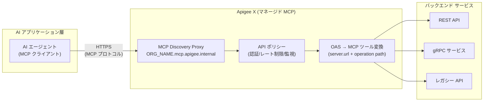

# Apigee X: Model Context Protocol (MCP) の一般提供開始 (GA)

**リリース日**: 2026-03-31

**サービス**: Apigee X

**機能**: Model Context Protocol (MCP) in Apigee GA + MCP Discovery Proxy エンドポイント変更 + OAS サーバー URL パス処理改善

**ステータス**: GA (一般提供)

[このアップデートのインフォグラフィックを見る](https://takech9203.github.io/google-cloud-news-summary/20260331-apigee-x-mcp-ga.html)

## 概要

Apigee X において、Model Context Protocol (MCP) 機能が一般提供 (GA) としてリリースされました。この機能により、Apigee で管理している既存の API を MCP ツールとしてエージェント型 AI アプリケーションに公開できるようになります。HTTP/S 経由のリモート MCP エンドポイントをサポートする任意の MCP クライアントからアクセス可能で、ローカルやリモートの MCP サーバーを個別にインストール・管理する必要がありません。

MCP は、AI エージェントが外部システムと通信するためのオープンな標準プロトコルです。Apigee が MCP をネイティブにサポートすることで、企業は既存の API 資産をそのまま AI エージェント向けのツールとして活用でき、API 管理の一元化とセキュリティを維持しながらエージェント型 AI の導入を加速できます。

本リリースでは、MCP の GA に加えて、MCP Discovery Proxy のターゲットエンドポイント形式の変更、OAS サーバー URL パス処理の改善、および一部リージョンにおけるキャパシティ制限に関する既知の問題が報告されています。Subscription、Pay-as-you-go、Evaluation のすべての組織タイプで利用可能であり、Data Residency および VPC Service Controls が有効な組織でも使用できます。

**アップデート前の課題**

MCP in Apigee が GA になる以前、API をエージェント型 AI アプリケーションに公開するには以下の課題がありました。

- API を AI エージェントのツールとして利用するには、ローカルまたはリモートの MCP サーバーを自前で構築・管理する必要があった
- MCP サーバーのインフラストラクチャ管理（スケーリング、可用性、セキュリティ）を別途行う必要があった
- 既存の Apigee API 管理ポリシー（認証、レート制限、モニタリング等）を MCP ツール経由のアクセスに統一的に適用することが困難だった
- プレビュー版の MCP Discovery Proxy エンドポイント形式 (`mcp.apigee.internal`) ではマルチ組織環境での識別が困難だった

**アップデート後の改善**

今回の GA リリースにより、以下の改善が実現されました。

- Apigee の既存 API を追加インフラなしで MCP ツールとしてエージェント型 AI アプリケーションに直接公開可能になった
- マネージド MCP エンドポイントにより、MCP サーバーのインフラ管理が不要になった
- Apigee の API 管理機能（認証、アクセス制御、トラフィック管理、分析等）が MCP ツールアクセスにも一貫して適用されるようになった
- 組織名を含む新しいエンドポイント形式 (`ORG_NAME.mcp.apigee.internal`) により、マルチ組織環境での識別性が向上した
- OAS 標準に完全準拠したサーバー URL パス処理により、`server.url` ベースパスと個別オペレーションパスの自動結合が正しく動作するようになった

## アーキテクチャ図



AI エージェント（MCP クライアント）が HTTPS 経由で Apigee のマネージド MCP エンドポイントにアクセスし、Apigee の API ポリシーを経由してバックエンドサービスに到達するアーキテクチャを示しています。OAS 定義に基づいて API オペレーションが MCP ツールとして自動的に公開されます。

## サービスアップデートの詳細

### 主要機能

1. **MCP in Apigee の GA リリース**
   - Apigee で管理する API を MCP ツールとしてエージェント型 AI アプリケーションに公開
   - HTTP/S 経由のリモート MCP エンドポイントをサポートする任意の MCP クライアントからアクセス可能
   - ローカル・リモートの MCP サーバーや追加インフラのインストール・管理が不要
   - Subscription、Pay-as-you-go、Evaluation の全組織タイプで利用可能
   - Data Residency および VPC Service Controls が有効な組織でも対応

2. **MCP Discovery Proxy のターゲットエンドポイント更新**
   - GA リリースに伴い、MCP サーバーターゲットエンドポイントの形式が変更
   - 新形式: `ORG_NAME.mcp.apigee.internal`（組織名をプレフィックスとして含む）
   - 旧形式: `mcp.apigee.internal`（プレビュー版で使用）
   - プレビュー版を使用中のユーザーは新形式への移行を推奨

3. **OAS サーバー URL パス処理の改善**
   - OpenAPI Specification (OAS) の設定が OAS 標準に完全準拠して動作
   - `server.url` のベースパス値と個別のオペレーションパスが自動的に結合
   - OAS 定義をそのまま利用して MCP ツールのパスが正しく構成される

4. **既知の問題 (Issue 496552286)**
   - キャパシティ制限のあるリージョンで MCP Discovery Proxy のデプロイが失敗する場合がある
   - 影響を受けるリージョンでは、デプロイ先の変更またはキャパシティの確保が必要

## 技術仕様

### MCP エンドポイント構成

| 項目 | 詳細 |
|------|------|
| プロトコル | HTTP/S (MCP over HTTPS) |
| エンドポイント形式 (GA) | `ORG_NAME.mcp.apigee.internal` |
| エンドポイント形式 (旧プレビュー) | `mcp.apigee.internal` (非推奨) |
| サポート対象クライアント | HTTP/S 経由のリモート MCP エンドポイントをサポートする任意の MCP クライアント |
| 対応組織タイプ | Subscription / Pay-as-you-go / Evaluation |
| VPC Service Controls | 対応 |
| Data Residency | 対応 |

### MCP ツールの定義（OAS ベース）

```json
{
  "openapi": "3.0.0",
  "info": {
    "title": "Example API exposed as MCP Tool",
    "version": "1.0.0"
  },
  "servers": [
    {
      "url": "https://api.example.com/v1"
    }
  ],
  "paths": {
    "/orders/{orderId}": {
      "get": {
        "summary": "Get order details",
        "operationId": "getOrder",
        "description": "Retrieve order information by ID - exposed as MCP tool",
        "parameters": [
          {
            "name": "orderId",
            "in": "path",
            "required": true,
            "schema": { "type": "string" }
          }
        ]
      }
    }
  }
}
```

上記の OAS 定義では、`server.url` (`https://api.example.com/v1`) とオペレーションパス (`/orders/{orderId}`) が自動的に結合され、MCP ツールとして公開されます。

## 設定方法

### 前提条件

1. Apigee X 組織が Subscription、Pay-as-you-go、または Evaluation タイプで作成済みであること
2. 対象の API が Apigee API プロキシとしてデプロイ済みであること
3. API に対応する OpenAPI Specification (OAS) が用意されていること

### 手順

#### ステップ 1: MCP Discovery Proxy の作成

Apigee コンソールまたは API を使用して MCP Discovery Proxy を作成します。ターゲットエンドポイントには GA 形式の `ORG_NAME.mcp.apigee.internal` を使用します。

```bash
# Apigee API を使用した MCP Discovery Proxy の設定例
# 組織名を含む新しいエンドポイント形式を使用
curl -X POST \
  "https://apigee.googleapis.com/v1/organizations/${ORG_NAME}/apis" \
  -H "Authorization: Bearer $(gcloud auth print-access-token)" \
  -H "Content-Type: application/json" \
  -d '{
    "name": "mcp-discovery-proxy",
    "targetEndpoint": "'${ORG_NAME}'.mcp.apigee.internal"
  }'
```

#### ステップ 2: API Hub への MCP API 登録

API Hub に MCP スタイルで API を登録し、MCP ツールとして管理します。

```bash
# API Hub に MCP API を登録
curl -X POST \
  -H "Content-Type: application/json" \
  -H "Authorization: Bearer $(gcloud auth print-access-token)" \
  "https://apihub.googleapis.com/v1/projects/${PROJECT_ID}/locations/${LOCATION}/apis?api_id=my-mcp-api" \
  -d '{
    "display_name": "My MCP API",
    "description": "API exposed as MCP tool for AI agents",
    "api_style": {
      "enum_values": {
        "values": [{ "id": "mcp-api" }]
      }
    }
  }'
```

#### ステップ 3: MCP クライアントからの接続確認

MCP クライアント（AI エージェント等）から HTTPS 経由でエンドポイントに接続し、ツールが正しく公開されていることを確認します。

## メリット

### ビジネス面

- **AI エージェント導入の加速**: 既存の API 資産をそのまま AI エージェントのツールとして活用でき、新たなインフラ投資なしにエージェント型 AI を導入できる
- **API 資産の価値最大化**: 既に構築・運用中の Apigee API プロキシを再利用し、AI エージェント市場への対応コストを最小化
- **ガバナンスの維持**: Apigee の既存セキュリティポリシー、アクセス制御、監査ログが MCP 経由のアクセスにも適用され、コンプライアンス要件を維持

### 技術面

- **インフラ管理の簡素化**: マネージド MCP エンドポイントにより、MCP サーバーのプロビジョニング、スケーリング、パッチ適用が不要
- **標準プロトコル準拠**: MCP オープン標準への準拠により、特定のベンダーロックインを回避し、任意の MCP クライアントとの互換性を確保
- **OAS ネイティブ対応**: 既存の OpenAPI Specification をそのまま利用でき、MCP ツール定義の二重管理が不要
- **Cloud API Registry との統合**: Cloud API Registry を通じた MCP ツールの一元的な検出・ガバナンス・モニタリングが可能

## デメリット・制約事項

### 制限事項

- 一部リージョンではキャパシティ制限により MCP Discovery Proxy のデプロイが失敗する可能性がある（Issue 496552286）
- プレビュー版から GA へのエンドポイント形式の変更に伴い、既存のプレビュー版ユーザーはプロキシの更新が必要
- Apigee hybrid では MCP 機能の利用可否について別途確認が必要

### 考慮すべき点

- プレビュー版の MCP Discovery Proxy を使用している場合、`mcp.apigee.internal` から `ORG_NAME.mcp.apigee.internal` への移行計画を策定する必要がある
- AI エージェントからの予期しない大量リクエストに対して、適切なレート制限ポリシーの設定が推奨される
- MCP ツールの依存関係分析は API Hub において現時点では未サポート

## ユースケース

### ユースケース 1: カスタマーサポート AI エージェント

**シナリオ**: カスタマーサポート部門で、既存の注文管理 API、在庫確認 API、返品処理 API を AI エージェントのツールとして公開し、顧客からの問い合わせに自動対応する。

**実装例**:
```
1. 既存の Apigee API プロキシ（注文管理、在庫確認、返品処理）を MCP ツールとして公開
2. MCP Discovery Proxy で全ツールを一元的に検出可能に設定
3. AI エージェント（MCP クライアント）が顧客の問い合わせ内容に応じて適切なツールを選択・実行
4. Apigee のポリシーで認証、レート制限、監査ログを統一的に管理
```

**効果**: カスタマーサポートの応答時間を大幅に短縮しながら、API セキュリティとガバナンスを維持。エージェントが複数の API を組み合わせて問い合わせに対応可能。

### ユースケース 2: 社内業務自動化エージェント

**シナリオ**: 人事、経理、IT の各部門が保有する社内 API を MCP ツールとして統合し、従業員向けの業務自動化 AI エージェントを構築する。

**効果**: 従業員が自然言語で業務依頼（休暇申請、経費精算、アカウント管理等）を行うと、AI エージェントが適切な社内 API を呼び出して処理を実行。VPC Service Controls により社内データの安全性を確保。

### ユースケース 3: パートナー API エコシステム

**シナリオ**: 外部パートナー向けに提供している API を MCP ツールとして公開し、パートナー企業の AI エージェントが自社のサービスを利用できるようにする。

**効果**: パートナー企業は MCP クライアントから直接 API にアクセスでき、統合開発の工数を削減。Apigee の API キーや OAuth ポリシーにより、パートナーごとのアクセス制御を維持。

## 料金

MCP in Apigee の利用料金は、Apigee の既存の料金体系に基づきます。MCP 機能自体に追加料金は発生しませんが、MCP 経由の API コールは通常の API コールとして課金対象となります。

### 料金例（Pay-as-you-go の場合）

| 使用量 | 月額料金 (概算) |
|--------|-----------------|
| Base 環境 + Standard API Proxy 500万コール/月 | 環境: 約 $365/月 + API コール: 約 $100/月 |
| Intermediate 環境 + Standard API Proxy 5,000万コール/月 | 環境: 約 $1,460/月 + API コール: 約 $1,000/月 |
| Comprehensive 環境 + Extensible API Proxy 1,000万コール/月 | 環境: 約 $3,431/月 + API コール: 約 $1,000/月 |

※ 上記は概算です。実際の料金はネットワーク料金、追加のデプロイメントユニット、アドオン（API Analytics、Advanced API Security）の使用状況により異なります。詳細は [Apigee 料金ページ](https://cloud.google.com/apigee/pricing) を参照してください。

## 利用可能リージョン

MCP in Apigee は、Apigee X がサポートするすべてのリージョンで利用可能です。ただし、既知の問題 (Issue 496552286) として、一部のリージョンではキャパシティ制限により MCP Discovery Proxy のデプロイが失敗する場合があります。デプロイに問題が発生した場合は、別のリージョンでのデプロイを検討してください。

## 関連サービス・機能

- **Cloud API Registry**: MCP サーバーとツールの検出、ガバナンス、モニタリングを提供するサービス。Apigee API Hub からメタデータをインポートし、AI エージェントによる MCP ツールの発見を支援
- **Apigee API Hub**: MCP API をファーストクラスの API スタイルとしてサポートし、MCP ツールの登録・管理・検出の中央リポジトリとして機能
- **Vertex AI Agent Builder**: Google Cloud 上でエージェント型 AI アプリケーションを構築するためのサービス。MCP クライアントとして Apigee の MCP エンドポイントに接続可能
- **VPC Service Controls**: MCP エンドポイントへのアクセスをセキュリティ境界内に制限し、データの漏洩を防止

## 参考リンク

- [インフォグラフィック](https://takech9203.github.io/google-cloud-news-summary/20260331-apigee-x-mcp-ga.html)
- [公式リリースノート](https://docs.cloud.google.com/release-notes#March_31_2026)
- [MCP in Apigee 概要ドキュメント](https://docs.cloud.google.com/apigee/docs/api-platform/apigee-mcp/apigee-mcp-overview)
- [Apigee API Hub - MCP API の登録](https://docs.cloud.google.com/apigee/docs/apihub/register-mcp-apis)
- [Cloud API Registry 概要](https://docs.cloud.google.com/api-registry/docs/overview)
- [Apigee 料金ページ](https://cloud.google.com/apigee/pricing)

## まとめ

Apigee X における MCP の GA リリースは、既存の API 管理基盤を AI エージェント時代に適応させる重要なマイルストーンです。企業は追加インフラなしに既存 API を MCP ツールとしてエージェント型 AI アプリケーションに公開でき、Apigee のセキュリティ・ガバナンス機能をそのまま活用できます。プレビュー版を使用中のユーザーは、MCP Discovery Proxy のエンドポイント形式を新しい `ORG_NAME.mcp.apigee.internal` に更新することを推奨します。また、キャパシティ制限のあるリージョンでの既知の問題に注意し、デプロイ先リージョンの選定を事前に確認してください。

---

**タグ**: #Apigee #MCP #ModelContextProtocol #AI #エージェント #API管理 #GA #ApigeeX
