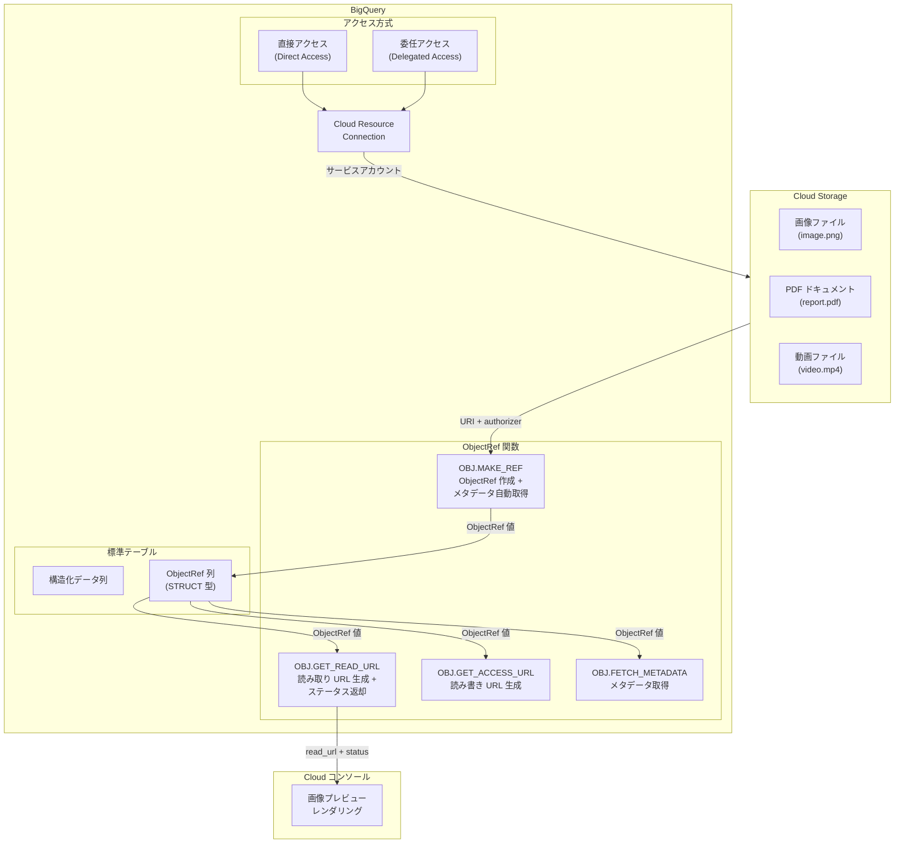

# BigQuery: ObjectRef 関数が GA (一般提供) に昇格

**リリース日**: 2026-03-31

**サービス**: BigQuery

**機能**: ObjectRef 関数の直接アクセス・委任アクセス対応および新関数の一般提供

**ステータス**: GA (Generally Available)

📊 [このアップデートのインフォグラフィックを見る](https://takech9203.github.io/google-cloud-news-summary/20260331-bigquery-objectref-ga.html)

## 概要

BigQuery の ObjectRef 関数群が GA (一般提供) に昇格しました。ObjectRef は Cloud Storage 上の非構造化データ (画像、PDF、動画など) を BigQuery の標準テーブル内で構造化データと統合して扱うための仕組みです。今回の GA リリースにより、直接アクセス (Direct Access) と委任アクセス (Delegated Access) の両方での ObjectRef 関数の実行、OBJ.MAKE_REF による Cloud Storage メタデータの自動取得、および読み取り専用 URL を返す OBJ.GET_READ_URL 関数が本番環境で利用可能になりました。

ObjectRef は、Cloud Storage オブジェクトの URI、バージョン、認証情報 (authorizer)、メタデータを STRUCT 型として BigQuery テーブルに格納します。これにより、SQL クエリだけで構造化データと非構造化データを横断的に分析できるマルチモーダルデータ分析が実現します。Gemini モデルとの連携により、画像の説明文生成やドキュメントの要約など、生成 AI を活用した高度な分析ワークフローも構築できます。

本アップデートは、マルチモーダルデータの分析基盤を BigQuery 上で構築したいデータエンジニア、データサイエンティスト、ML エンジニアにとって特に重要です。Preview 段階での制限が解消され、SLA に基づくサポートのもとで本番ワークロードに安心して導入できるようになりました。

**アップデート前の課題**

- ObjectRef 関数は Preview 段階であり、本番ワークロードでの利用には SLA が適用されず、限定的なサポートしか受けられなかった
- アクセス方式が限定的で、直接アクセスと委任アクセスの両方をサポートする柔軟な権限モデルが整備されていなかった
- Cloud Storage メタデータの取得には明示的な OBJ.FETCH_METADATA 呼び出しが必要で、OBJ.MAKE_REF だけではメタデータが自動的に含まれなかった

**アップデート後の改善**

- ObjectRef 関数が GA となり、SLA に基づくエンタープライズサポートのもとで本番環境に導入可能になった
- 直接アクセスと委任アクセスの両方で ObjectRef 関数を実行でき、組織のセキュリティポリシーに応じた柔軟なアクセス制御が可能になった
- OBJ.MAKE_REF が最新の Cloud Storage メタデータを自動取得し ref.details フィールドに格納するようになり、別途メタデータ取得ステップが不要になった
- OBJ.GET_READ_URL が STRUCT 値で読み取り URL とステータスカラムを返し、Cloud コンソール上で画像結果をレンダリングできるようになった

## アーキテクチャ図



BigQuery の ObjectRef 関数が Cloud Resource Connection を介して Cloud Storage オブジェクトにアクセスする全体フローを示しています。直接アクセスと委任アクセスの両方が Connection を通じて Cloud Storage への認証を行い、OBJ.MAKE_REF でメタデータ付きの ObjectRef 値を作成、OBJ.GET_READ_URL で読み取り専用 URL を生成して Cloud コンソールで画像をプレビューできます。

## サービスアップデートの詳細

### 主要機能

1. **直接アクセスと委任アクセスの両方をサポート**
   - 直接アクセス: ユーザーが Cloud Resource Connection のサービスアカウントに対する権限を直接保持している場合に使用する方式
   - 委任アクセス: 他のユーザーやサービスアカウントに権限を委任して ObjectRef 関数を実行する方式
   - 組織のセキュリティポリシーに応じて、最小権限の原則に基づいたアクセス制御を実現可能

2. **OBJ.MAKE_REF のメタデータ自動取得**
   - OBJ.MAKE_REF 関数が Cloud Storage から最新のメタデータを自動的に取得し、ref.details フィールドに格納するようになった
   - メタデータには content_type、md5_hash、size、updated などの GCS メタデータが含まれる
   - 従来は OBJ.FETCH_METADATA を別途呼び出す必要があったが、1 回の関数呼び出しで完結するようになった

3. **OBJ.GET_READ_URL 関数**
   - 読み取り専用の署名付き URL と、ステータス情報を含む STRUCT 値を返す新関数
   - Cloud コンソール上で画像結果を直接レンダリングして表示可能
   - 書き込み URL が不要なユースケース (分析、レポート作成、プレビュー) で OBJ.GET_ACCESS_URL の代わりに使用できる軽量な代替手段

## 技術仕様

### ObjectRef データ構造

| 項目 | 詳細 |
|------|------|
| データ型 | `STRUCT<uri STRING, version STRING, authorizer STRING, details JSON>` |
| uri | Cloud Storage オブジェクトの URI (例: `gs://mybucket/path/to/file.jpg`) |
| version | Cloud Storage オブジェクトのバージョン |
| authorizer | Cloud Resource Connection の識別子 (例: `us.connection1`) |
| details | GCS メタデータ (content_type, md5_hash, size, updated) を含む JSON |

### 必要な IAM ロール

| ロール | 権限 | 用途 |
|--------|------|------|
| `roles/bigquery.objectRefReader` | `bigquery.objectRefs.read` | 読み取り URL の生成、メタデータ取得 |
| `roles/bigquery.objectRefAdmin` | `bigquery.objectRefs.read`, `bigquery.objectRefs.write` | 読み書き URL の生成、ObjectRef の管理 |
| `roles/storage.objectViewer` | ストレージオブジェクトの読み取り | Connection サービスアカウントに付与 (読み取り用) |
| `roles/storage.objectUser` | ストレージオブジェクトの読み書き | Connection サービスアカウントに付与 (読み書き用) |

### ObjectRef 関数一覧

```sql
-- OBJ.MAKE_REF: ObjectRef 値の作成 (メタデータ自動取得付き)
OBJ.MAKE_REF(uri, authorizer)
OBJ.MAKE_REF(objectref_json)

-- OBJ.GET_READ_URL: 読み取り専用 URL の取得 (GA で新たに追加)
OBJ.GET_READ_URL(objectref)
-- 戻り値: STRUCT<read_url STRING, status STRING>

-- OBJ.GET_ACCESS_URL: 読み取り/書き込み URL の取得
OBJ.GET_ACCESS_URL(objectref, mode [, duration])
-- mode: 'r' (読み取り) または 'rw' (読み書き)

-- OBJ.FETCH_METADATA: メタデータの明示的取得
OBJ.FETCH_METADATA(objectref)
```

## 設定方法

### 前提条件

1. BigQuery が有効化された Google Cloud プロジェクト
2. Cloud Storage バケットとオブジェクトが配置済み
3. BigQuery Connection API が有効化済み

### 手順

#### ステップ 1: Cloud Resource Connection の作成

```bash
# Cloud Resource Connection を作成
bq mk --connection \
  --connection_type='CLOUD_RESOURCE' \
  --location='US' \
  --project_id='my-project' \
  my-connection
```

Cloud Resource Connection を作成し、BigQuery が Cloud Storage にアクセスするための認証基盤を構築します。

#### ステップ 2: Connection サービスアカウントへの権限付与

```bash
# Connection のサービスアカウント情報を取得
bq show --connection my-project.US.my-connection

# サービスアカウントに Storage Object Viewer ロールを付与
gcloud storage buckets add-iam-policy-binding gs://my-bucket \
  --member='serviceAccount:SERVICE_ACCOUNT_EMAIL' \
  --role='roles/storage.objectViewer'
```

Connection のサービスアカウントに Cloud Storage バケットへの読み取り権限を付与します。書き込みも必要な場合は `roles/storage.objectUser` を付与してください。

#### ステップ 3: ObjectRef 列を持つテーブルの作成と OBJ.MAKE_REF の使用

```sql
-- ObjectRef 列を含むテーブルを作成
CREATE OR REPLACE TABLE `my-project.mydataset.products` AS (
  SELECT
    product_name,
    product_id,
    OBJ.MAKE_REF(image_uri, 'US.my-connection') AS product_image
  FROM `my-project.mydataset.product_catalog`
);
```

OBJ.MAKE_REF が Cloud Storage メタデータを自動取得し、product_image 列に ObjectRef 値として格納します。

#### ステップ 4: OBJ.GET_READ_URL で読み取り URL を取得

```sql
-- 読み取り URL を取得して画像をプレビュー
SELECT
  product_name,
  OBJ.GET_READ_URL(product_image) AS image_access
FROM `my-project.mydataset.products`
LIMIT 10;
```

Cloud コンソールで実行すると、画像結果が直接レンダリングされてプレビュー表示されます。

## メリット

### ビジネス面

- **本番環境での信頼性**: GA リリースにより SLA が適用され、ミッションクリティカルなワークロードに安心して導入可能
- **マルチモーダル分析の民主化**: SQL だけで構造化データと非構造化データの統合分析が可能になり、専門的な ML パイプライン構築スキルが不要に
- **運用コスト削減**: 非構造化データの管理に別途 ETL パイプラインを構築する必要がなくなり、BigQuery 内で完結する分析基盤を構築可能

### 技術面

- **簡素化されたメタデータ取得**: OBJ.MAKE_REF の自動メタデータ取得により、従来 2 ステップ必要だった処理が 1 ステップで完了
- **柔軟なアクセス制御**: 直接アクセスと委任アクセスの両方をサポートし、最小権限の原則に沿った権限管理が可能
- **軽量な読み取り専用アクセス**: OBJ.GET_READ_URL により、書き込み権限を付与せずに読み取り URL を取得可能。セキュリティリスクを最小化
- **Cloud コンソール統合**: 画像結果のレンダリングにより、クエリ結果の視覚的確認が容易に

## デメリット・制約事項

### 制限事項

- 同一プロジェクト・リージョン内で使用できる Connection は最大 20 個まで
- ObjectRef 値を参照するクエリは、ObjectRef 値を含むテーブルと同じプロジェクトで実行する必要がある
- OBJ.GET_ACCESS_URL で生成される署名付き URL の有効期限は最大 6 時間 (最短 30 分)
- Connection はクエリ実行先と同じプロジェクト・リージョンに存在する必要がある

### 考慮すべき点

- Cloud Storage オブジェクトが変更された場合、テーブル内の ObjectRef メタデータは自動更新されないため、定期的な更新ワークフローの設計が必要
- 大量のオブジェクトに対する OBJ.MAKE_REF の実行は Cloud Storage API 呼び出しを伴うため、スケーラビリティの観点からはオブジェクトテーブル経由の ObjectRef 管理を推奨
- Nearline / Coldline / Archive ストレージクラスのオブジェクトにアクセスする場合、Cloud Storage のデータ取得料金が発生する可能性がある

## ユースケース

### ユースケース 1: 商品カタログの画像付き分析

**シナリオ**: EC サイトの商品データベースで、商品の売上データと商品画像を統合して分析し、売上上位商品の画像を Cloud コンソール上でプレビューする。

**実装例**:
```sql
-- 売上上位の商品画像を読み取り URL 付きで取得
SELECT
  p.product_name,
  s.total_sales,
  OBJ.GET_READ_URL(p.product_image) AS image_preview
FROM `mydataset.products` p
JOIN `mydataset.sales_summary` s ON p.product_id = s.product_id
ORDER BY s.total_sales DESC
LIMIT 20;
```

**効果**: データアナリストが SQL だけで売上分析と商品画像の視覚的確認を同時に行え、レポート作成の効率が大幅に向上する。

### ユースケース 2: Gemini モデルを使った画像分類パイプライン

**シナリオ**: Cloud Storage に保存された大量の画像を BigQuery の Gemini 連携機能で自動分類し、結果を標準テーブルに格納する。

**実装例**:
```sql
-- Gemini モデルで画像を分類
SELECT
  name,
  result AS ai_classification
FROM AI.GENERATE_TEXT(
  MODEL `mydataset.gemini_model`,
  (
    SELECT
      name,
      ('Classify this image into one of: product, lifestyle, banner',
       OBJ.GET_ACCESS_URL(
         OBJ.MAKE_REF(uri, 'US.my-connection'), 'r'
       )) AS prompt
    FROM `mydataset.image_catalog`
    LIMIT 100
  )
);
```

**効果**: 専用の ML パイプラインを構築せずに、BigQuery SQL だけで大規模な画像分類ワークフローを実現できる。

## 料金

ObjectRef 関数の利用に直接的な追加料金はありませんが、以下のコストが発生します。

### 料金例

| コスト項目 | 課金方式 |
|------------|----------|
| BigQuery クエリ処理 | オンデマンド: 処理バイト数に基づく課金 ($7.50/TB)、エディション: スロット消費 |
| BigQuery ストレージ | ObjectRef メタデータの保存に対する標準ストレージ料金 |
| Cloud Storage データアクセス | オブジェクトの読み取り/書き込みに対する Cloud Storage 標準料金 |
| Cloud Storage ネットワーク | BigQuery とバケットが異なるリージョンの場合のネットワーク転送料金 |
| Vertex AI (Gemini 連携時) | AI.GENERATE_TEXT 等の生成 AI 関数使用時に Vertex AI 料金が発生 |

## 利用可能リージョン

BigQuery ObjectRef 関数は BigQuery がサポートする全てのリージョンおよびマルチリージョン (US, EU) で利用可能です。ただし、Cloud Resource Connection と ObjectRef を含むテーブルは同一のプロジェクトおよびリージョンに配置する必要があります。

## 関連サービス・機能

- **Cloud Storage**: ObjectRef が参照するオブジェクトの実体を格納するストレージサービス
- **BigQuery オブジェクトテーブル**: Cloud Storage オブジェクトを BigQuery テーブルとして表現する機能。ObjectRef 列を大規模に管理する場合に推奨
- **BigQuery ML (Gemini 連携)**: ObjectRef / ObjectRefRuntime 値を入力として Gemini モデルで生成 AI タスクを実行する機能
- **BigQuery DataFrames**: Python で ObjectRef を含むマルチモーダル DataFrame を操作する機能
- **Storage Insights**: Cloud Storage のデータセットを BigQuery ObjectRef 関数と連携して分析する機能

## 参考リンク

- 📊 [インフォグラフィック](https://takech9203.github.io/google-cloud-news-summary/20260331-bigquery-objectref-ga.html)
- [公式リリースノート](https://cloud.google.com/release-notes#March_31_2026)
- [ObjectRef 関数リファレンス](https://cloud.google.com/bigquery/docs/reference/standard-sql/objectref_functions)
- [ObjectRef 列の指定方法](https://cloud.google.com/bigquery/docs/objectref-columns)
- [マルチモーダルデータの分析](https://cloud.google.com/bigquery/docs/analyze-multimodal-data)
- [BigQuery 料金ページ](https://cloud.google.com/bigquery/pricing)
- [Cloud Storage 料金ページ](https://cloud.google.com/storage/pricing)

## まとめ

BigQuery ObjectRef 関数の GA リリースは、BigQuery をマルチモーダルデータ分析プラットフォームとして本格的に活用するための重要なマイルストーンです。直接アクセス・委任アクセスの両方をサポートする柔軟な権限モデル、OBJ.MAKE_REF のメタデータ自動取得、読み取り専用の OBJ.GET_READ_URL 関数により、Cloud Storage 上の非構造化データを BigQuery SQL だけで安全かつ効率的に扱えるようになりました。マルチモーダルデータ分析を検討しているチームは、まず Cloud Resource Connection の作成と既存テーブルへの ObjectRef 列の追加から始めることを推奨します。

---

**タグ**: #BigQuery #ObjectRef #CloudStorage #マルチモーダル #GA #非構造化データ #SQL #データ分析
