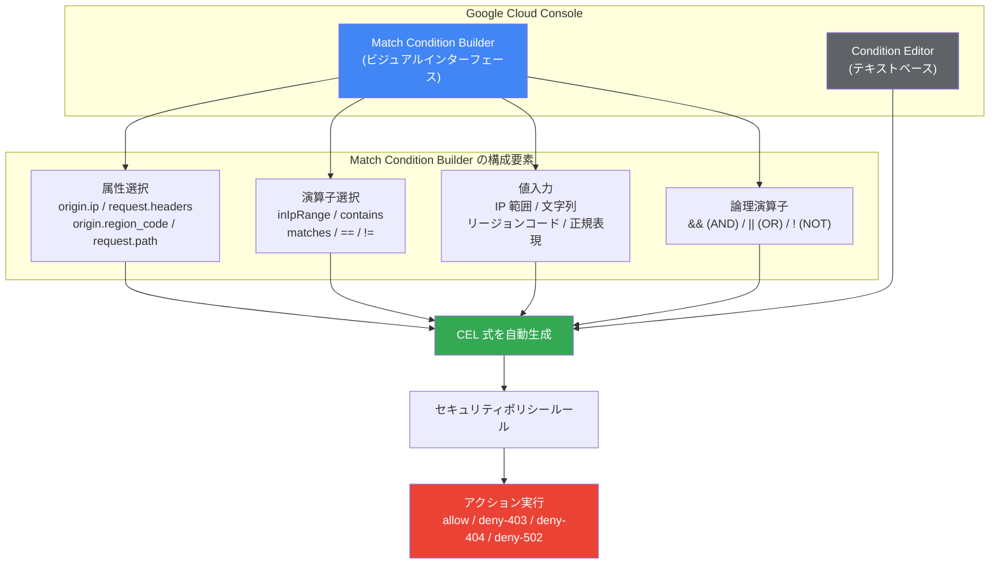

# Google Cloud Armor: Match Condition Builder - ビジュアル CEL 式ビルダー

**リリース日**: 2026-03-31

**サービス**: Google Cloud Armor

**機能**: Match Condition Builder - Visual CEL expression builder

**ステータス**: Feature

[このアップデートのインフォグラフィックを見る](https://takech9203.github.io/google-cloud-news-summary/20260331-cloud-armor-match-condition-builder.html)

## 概要

Google Cloud Armor に、ビジュアルな Match Condition Builder が追加されました。この機能により、Common Expression Language (CEL) の構文を直接記述することなく、GUI ベースのインターフェースを通じて複雑なマッチ条件式を作成できるようになります。

Cloud Armor のセキュリティポリシールールでは、受信トラフィックの評価に CEL ベースの高度なマッチ条件を使用します。これまでは、IP アドレス範囲、リージョンコード、リクエストヘッダー、URL パスなどの属性を組み合わせた条件を作成するには、CEL 構文を直接記述する必要がありました。Match Condition Builder は、セキュリティ管理者やネットワークエンジニアがプログラミング知識がなくても高度なセキュリティルールを構築できるようにする、ビジュアルなインターフェースを提供します。

この機能は、Cloud Armor を利用する全てのユーザーに恩恵をもたらしますが、特にセキュリティポリシーの運用を効率化したいチームや、CEL 構文に不慣れなメンバーが含まれるチームにとって大きな価値があります。

**アップデート前の課題**

- 高度なマッチ条件を作成するには CEL 構文の知識が必要で、学習コストが高かった
- 複数の属性や演算子を組み合わせた複雑な式を手動で記述する際に構文エラーが発生しやすかった
- CEL 式のデバッグが困難で、誤った式がセキュリティポリシーの意図しない動作を引き起こす可能性があった
- セキュリティチーム内で CEL に習熟していないメンバーがルール作成に参加しにくかった

**アップデート後の改善**

- ビジュアルインターフェースにより、ドロップダウンやフォーム入力で CEL 式を構築できるようになった
- 構文エラーのリスクが大幅に低減し、正確なマッチ条件を迅速に作成可能になった
- CEL の専門知識がなくても、高度なセキュリティルールを作成できるようになった
- セキュリティポリシーの作成・管理の効率が向上し、運用負荷が軽減された

## アーキテクチャ図



Match Condition Builder はビジュアルインターフェースとして機能し、ユーザーが選択した属性、演算子、値を組み合わせて CEL 式を自動生成します。生成された式は従来のテキストベースの Condition Editor と同様にセキュリティポリシールールとして適用されます。

## サービスアップデートの詳細

### 主要機能

1. **ビジュアル式構築インターフェース**
   - 属性、演算子、値をドロップダウンやフォームから選択して CEL 式を組み立てる
   - 複数のサブ式を論理演算子 (AND / OR / NOT) で結合可能
   - 生成された CEL 式をリアルタイムでプレビュー可能

2. **対応する属性と演算子**
   - `origin.ip` / `origin.user_ip`: IP アドレスベースのマッチング (`inIpRange`)
   - `origin.region_code`: リージョンコードによるジオベースのフィルタリング
   - `request.headers`: リクエストヘッダーの検査 (`contains`, `startsWith`, `endsWith`)
   - `request.path`: URL パスのマッチング (`matches` による正規表現対応)
   - 文字列変換操作: `lower()`, `upper()`, `base64Decode()`, `urlDecode()`

3. **既存のワークフローとの互換性**
   - Match Condition Builder で作成した式は、従来の Condition Editor (テキストベース) でも編集可能
   - 生成される CEL 式は Cloud Armor カスタムルール言語の仕様に完全準拠

## 技術仕様

### Cloud Armor CEL 式の主要属性

| 属性 | 説明 |
|------|------|
| `origin.ip` | クライアントの送信元 IP アドレス |
| `origin.user_ip` | カスタムクライアント IP ヘッダーの IP アドレス |
| `origin.region_code` | 送信元の ISO 3166-1 alpha-2 リージョンコード |
| `request.headers` | HTTP リクエストヘッダーのマップ |
| `request.path` | HTTP リクエストの URL パス |
| `request.method` | HTTP リクエストメソッド |

### 主要な演算子

| 演算子 | 構文 | 説明 |
|--------|------|------|
| IP 範囲チェック | `inIpRange(x, y)` | IP アドレスが指定範囲内か判定 |
| 部分文字列検索 | `x.contains(y)` | 文字列に部分文字列が含まれるか判定 |
| 正規表現マッチ | `x.matches(y)` | RE2 正規表現パターンでマッチング |
| 前方一致 | `x.startsWith(y)` | 文字列が指定値で始まるか判定 |
| 後方一致 | `x.endsWith(y)` | 文字列が指定値で終わるか判定 |
| 等価比較 | `x == y` | 2 つの値が等しいか判定 |

## 設定方法

### 前提条件

1. Google Cloud プロジェクトで Cloud Armor が有効化されていること
2. セキュリティポリシーが作成済みであること
3. 適切な IAM 権限 (`compute.securityPolicies.update`) を持っていること

### 手順

#### ステップ 1: セキュリティポリシーのルール編集画面を開く

Google Cloud Console で [Cloud Armor ポリシー](https://console.cloud.google.com/net-security/securitypolicies/list) ページに移動し、対象のセキュリティポリシーを選択して「ルールを追加」をクリックします。

#### ステップ 2: Match Condition Builder を使用して条件を構築する

「Advanced mode」を選択し、Match Condition Builder のビジュアルインターフェースを使用して、必要な属性、演算子、値を選択します。複数の条件を追加する場合は、論理演算子 (AND / OR) で結合します。

#### ステップ 3: アクションと優先度を設定する

生成された CEL 式を確認し、ルールのアクション (allow / deny-403 / deny-404 / deny-502) と優先度を設定して保存します。

### gcloud CLI での同等操作

Match Condition Builder は Google Cloud Console の機能ですが、生成された CEL 式は gcloud CLI でも使用できます。

```bash
# Match Condition Builder で生成された式を gcloud CLI で使用する例
gcloud compute security-policies rules create 1000 \
  --security-policy my-policy \
  --expression "origin.region_code == 'JP' && inIpRange(origin.ip, '203.0.113.0/24')" \
  --action allow \
  --description "Allow traffic from Japan in specific IP range"
```

## メリット

### ビジネス面

- **セキュリティ運用の民主化**: CEL の専門知識を持たないチームメンバーでもセキュリティルールの作成に参加可能になり、セキュリティ対応のボトルネックが解消される
- **運用効率の向上**: ルール作成にかかる時間が短縮され、セキュリティインシデントへの迅速な対応が可能になる

### 技術面

- **構文エラーの削減**: ビジュアルインターフェースにより CEL 構文のタイプミスや論理エラーを防止できる
- **学習コストの低減**: CEL 仕様書を参照することなく、利用可能な属性と演算子を直感的に把握できる
- **式の可読性向上**: ビジュアル表現により、複雑な条件式の意図を視覚的に理解しやすくなる

## デメリット・制約事項

### 制限事項

- Cloud Armor の高度なマッチ条件では、1 つのルールにつき最大 5 つのサブ式まで使用可能
- `evaluateThreatIntelligence` を使用する式には Cloud Armor Enterprise サブスクリプションが必要
- `evaluatePreconfiguredExpr('sourceiplist-*')` はグローバルセキュリティポリシーでのみサポート

### 考慮すべき点

- Match Condition Builder は Google Cloud Console での操作に限定され、gcloud CLI や API から直接利用することはできない
- 非常に複雑な式や、Match Condition Builder がサポートしていない高度なパターンの場合は、従来の Condition Editor (テキストベース) を使用する必要がある場合がある

## ユースケース

### ユースケース 1: リージョンベースのアクセス制御

**シナリオ**: 特定の国からのアクセスをブロックしつつ、特定の IP 範囲からのアクセスは許可したい場合。

**実装例**:
Match Condition Builder で以下の条件を構築:
```
属性: origin.region_code == "CN"
AND
NOT inIpRange(origin.ip, '10.0.0.0/8')
```
生成される CEL 式:
```
origin.region_code == "CN" && !inIpRange(origin.ip, '10.0.0.0/8')
```

**効果**: CEL 構文を知らなくても、ビジュアルインターフェースで直感的にジオベースのアクセス制御ルールを作成できる。

### ユースケース 2: WAF ルールとカスタム条件の組み合わせ

**シナリオ**: SQL インジェクション攻撃を防御しつつ、特定のパスへのリクエストのみを対象にしたい場合。

**実装例**:
Match Condition Builder で以下の条件を構築:
```
evaluatePreconfiguredWaf('sqli-stable')
AND
request.path.startsWith('/api/')
```

**効果**: プリコンフィグ WAF ルールとカスタム条件を視覚的に組み合わせて、より精密なセキュリティルールを作成できる。

## 料金

Match Condition Builder 自体は追加料金なしで利用できます。Cloud Armor の料金は既存の料金体系に従います。

| ティア | 料金 |
|--------|------|
| Cloud Armor Standard | ポリシー・ルール・リクエスト単位の従量課金 |
| Cloud Armor Enterprise Paygo | $200/月 (プロジェクトあたり) + $200/月 (保護リソースあたり、最初の 2 リソースを超えた分) |
| Cloud Armor Enterprise Annual | $3,000/月 (請求アカウントあたり) + $30/月 (保護リソースあたり、最初の 100 リソースを超えた分) |

## 関連サービス・機能

- **Cloud Armor カスタムルール言語**: Match Condition Builder が生成する CEL 式のベースとなる言語仕様
- **Cloud Armor Adaptive Protection**: 機械学習ベースの Layer 7 DDoS 防御機能 (Enterprise のみ)
- **Cloud Armor プリコンフィグ WAF ルール**: OWASP Top 10 に基づく事前定義済みの WAF ルールセット
- **Cloud Load Balancing**: Cloud Armor セキュリティポリシーの適用先となるロードバランサー
- **IAM Condition Builder**: IAM でも同様のビジュアル条件ビルダーが提供されており、CEL 式を GUI で構築可能

## 参考リンク

- [インフォグラフィック](https://takech9203.github.io/google-cloud-news-summary/20260331-cloud-armor-match-condition-builder.html)
- [公式リリースノート](https://docs.google.com/release-notes#March_31_2026)
- [Cloud Armor カスタムルール言語リファレンス](https://cloud.google.com/armor/docs/rules-language-reference)
- [セキュリティポリシーの設定](https://cloud.google.com/armor/docs/configure-security-policies)
- [Cloud Armor の概要](https://cloud.google.com/armor/docs/security-policy-overview)
- [Cloud Armor 料金ページ](https://cloud.google.com/armor/pricing)

## まとめ

Google Cloud Armor の Match Condition Builder は、CEL 式の作成を視覚化することで、セキュリティポリシー管理のアクセシビリティを大幅に向上させるアップデートです。特にセキュリティチーム全体での運用効率化やヒューマンエラーの削減に貢献します。Cloud Armor を利用中の組織は、Google Cloud Console からすぐにこの機能を試すことができますので、既存のルール作成ワークフローへの組み込みを検討してください。

---

**タグ**: #GoogleCloudArmor #セキュリティ #WAF #CEL #MatchConditionBuilder #DDoS防御 #セキュリティポリシー #GoogleCloud
