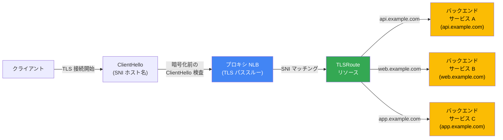

# Cloud Load Balancing: SNI ベースルーティング (プレビュー)

**リリース日**: 2026-03-31

**サービス**: Cloud Load Balancing

**機能**: プロキシ Network Load Balancer における SNI ベースルーティング

**ステータス**: Preview

[このアップデートのインフォグラフィックを見る](https://takech9203.github.io/google-cloud-news-summary/20260331-cloud-load-balancing-sni-routing-preview.html)

## 概要

Google Cloud は、プロキシ Network Load Balancer (NLB) において Server Name Indication (SNI) に基づく TLS トラフィックルーティング機能をプレビューとしてリリースしました。この機能では、新しい `TLSRoute` リソースを使用して、TLS ハンドシェイクの `ClientHello` メッセージに含まれる SNI ホスト名を検査し、適切なバックエンドサービスにコネクションをルーティングします。

この機能の最大の特徴は、ロードバランサでの TLS 終端を行わない純粋な TLS パススルーを実現する点です。これにより、クライアントとオリジンサーバー間でエンドツーエンドの暗号化 (mTLS / TLS) を維持したまま、SNI ホスト名に基づくインテリジェントなトラフィック振り分けが可能になります。リージョナルおよびクロスリージョンのプロキシ Network Load Balancer で利用可能であり、マルチテナント環境やマイクロサービスアーキテクチャにおける IP アドレス管理の簡素化に大きく貢献します。

**アップデート前の課題**

これまでのプロキシ Network Load Balancer では、SNI ホスト名に基づいた L4 レベルのトラフィック振り分けがサポートされていなかったため、以下の課題がありました。

- サービスごとに個別の IP アドレスまたは個別のロードバランサを用意する必要があり、IPv4 アドレスの枯渇問題が深刻化していた
- TLS パススルーでのホスト名ベースのルーティングができず、ロードバランサで TLS を終端するか、単純な TCP ポートベースのルーティングに限定されていた
- プラットフォーム管理者とサービスオーナーの責務分離が難しく、フロントエンドインフラとバックエンドルーティングの管理が一体化していた

**アップデート後の改善**

- `TLSRoute` リソースにより、SNI ホスト名に基づいて複数のバックエンドサービスへのルーティングが可能になった
- TLS パススルーにより、ロードバランサで TLS を終端せずにエンドツーエンド暗号化を維持できるようになった
- 複数のサービスを単一の Private Service Connect (PSC) エンドポイントに集約でき、IP アドレス消費を大幅に削減できるようになった

## アーキテクチャ図



クライアントからの TLS 接続開始時に、暗号化されていない `ClientHello` メッセージから SNI ホスト名を抽出し、`TLSRoute` リソースのルールに基づいて適切なバックエンドサービスにコネクションをルーティングします。TLS セッションはロードバランサで終端されず、クライアントとバックエンド間でエンドツーエンドの暗号化が維持されます。

## サービスアップデートの詳細

### 主要機能

1. **SNI ベースのトラフィックルーティング**
   - TLS ハンドシェイクの `ClientHello` メッセージに含まれる SNI ホスト名を検査
   - ホスト名に基づいて異なるバックエンドサービスにコネクションを振り分け
   - 複数の SNI ホスト名ルールを単一のロードバランサで管理可能

2. **TLS パススルー (エンドツーエンド暗号化)**
   - ロードバランサは TLS を終端せず、コネクションをそのまま転送
   - クライアントとオリジンサーバー間で直接 mTLS / TLS セッションを確立可能
   - 証明書管理をバックエンドサーバー側で完結できる

3. **TLSRoute リソース API**
   - 宣言的な YAML 形式でルーティングルールを定義
   - プラットフォーム管理者がフロントエンドインフラを管理し、サービスオーナーが独立してルートとバックエンドを管理できるロール指向の管理モデル
   - `sniHost` と `alpn` (Application-Layer Protocol Negotiation) によるマッチング条件をサポート

## 技術仕様

### 対応デプロイメントモード

| 項目 | 詳細 |
|------|------|
| リージョナル外部プロキシ NLB | サポート対象 |
| リージョナル内部プロキシ NLB | サポート対象 |
| クロスリージョン内部プロキシ NLB | サポート対象 |
| ロードバランシングスキーム | EXTERNAL_MANAGED / INTERNAL_MANAGED |
| プロトコル | TLS (パススルー) |
| ルーティング基準 | SNI ホスト名、ALPN |

### TLSRoute リソースの定義

```yaml
name: my-tls-route
gateways:
  - projects/PROJECT_NUMBER/locations/REGION/gateways/my-gateway
rules:
  - matches:
      - sniHost:
          - api.example.com
    action:
      destinations:
        - serviceName: projects/PROJECT_NUMBER/locations/REGION/backendServices/api-backend
  - matches:
      - sniHost:
          - web.example.com
    action:
      destinations:
        - serviceName: projects/PROJECT_NUMBER/locations/REGION/backendServices/web-backend
```

## 設定方法

### 前提条件

1. Google Cloud プロジェクトで Compute Engine API が有効化されていること
2. プロキシ Network Load Balancer (リージョナルまたはクロスリージョン) が構成済みであること
3. バックエンドサービスとバックエンド (マネージドインスタンスグループや NEG) が作成済みであること

### 手順

#### ステップ 1: バックエンドサービスの作成

```bash
# リージョナル内部プロキシ NLB の場合
gcloud compute backend-services create api-backend \
    --load-balancing-scheme=INTERNAL_MANAGED \
    --protocol=TCP \
    --region=us-central1

gcloud compute backend-services create web-backend \
    --load-balancing-scheme=INTERNAL_MANAGED \
    --protocol=TCP \
    --region=us-central1
```

サービスごとに個別のバックエンドサービスを作成します。

#### ステップ 2: TLSRoute リソースの作成

```bash
# tls_route.yaml ファイルを作成
cat > tls_route.yaml <<EOF
name: my-tls-route
gateways:
  - projects/PROJECT_NUMBER/locations/us-central1/gateways/my-nlb-gateway
rules:
  - matches:
      - sniHost:
          - api.example.com
    action:
      destinations:
        - serviceName: projects/PROJECT_NUMBER/locations/us-central1/backendServices/api-backend
  - matches:
      - sniHost:
          - web.example.com
    action:
      destinations:
        - serviceName: projects/PROJECT_NUMBER/locations/us-central1/backendServices/web-backend
EOF

# TLSRoute リソースをインポート
gcloud network-services tls-routes import my-tls-route \
    --source=tls_route.yaml \
    --location=us-central1
```

`TLSRoute` リソースを定義し、SNI ホスト名とバックエンドサービスのマッピングを設定します。

#### ステップ 3: 動作確認

```bash
# api.example.com への TLS 接続を検証
curl https://api.example.com --resolve api.example.com:443:LOAD_BALANCER_IP -k

# web.example.com への TLS 接続を検証
curl https://web.example.com --resolve web.example.com:443:LOAD_BALANCER_IP -k

# SNI が一致しない場合の接続拒否を確認 (ネガティブテスト)
curl https://invalid.example.com --resolve invalid.example.com:443:LOAD_BALANCER_IP -k
# 期待される結果: Connection reset by peer
```

## メリット

### ビジネス面

- **コスト削減**: 複数のサービスを単一の IP アドレス / ロードバランサに集約することで、追加の IP アドレスやロードバランサの費用を削減
- **運用効率の向上**: ロール指向の管理モデルにより、プラットフォームチームとサービスチームが独立して作業可能になり、デプロイサイクルが短縮
- **コンプライアンス対応**: エンドツーエンド暗号化により、ロードバランサで平文データが露出しないため、厳格なセキュリティ要件を満たしやすい

### 技術面

- **エンドツーエンド暗号化**: TLS パススルーにより、クライアントからバックエンドまでの完全な暗号化を維持。mTLS のユースケースにも対応
- **IP アドレス管理の簡素化**: 単一の PSC エンドポイントに複数サービスを集約でき、IPv4 アドレス枯渇問題を緩和
- **柔軟なルーティング**: SNI ホスト名に加えて ALPN プロトコルによるマッチングも可能で、きめ細かなトラフィック制御を実現

## デメリット・制約事項

### 制限事項

- 現在プレビュー段階のため、SLA の対象外であり、本番ワークロードでの使用は推奨されない
- TLS パススルーのため、ロードバランサレベルでの TLS 終端や SSL ポリシーの適用はできない
- `ClientHello` の SNI フィールドが暗号化されている場合 (Encrypted Client Hello / ECH) はルーティングが機能しない可能性がある
- グローバル外部プロキシ NLB およびクラシックプロキシ NLB では現時点で利用不可

### 考慮すべき点

- TLS パススルーのため、ロードバランサでの L7 レベルのトラフィック検査やログ取得は制限される
- 各バックエンドサービスで個別に TLS 証明書の管理が必要になるため、証明書管理の運用負荷が増加する可能性がある
- Cloud Armor の一部機能 (L7 ポリシーなど) は TLS パススルーモードでは利用できない

## ユースケース

### ユースケース 1: マルチテナント SaaS プラットフォーム

**シナリオ**: SaaS プロバイダーが複数のテナント (tenant-a.saas.com, tenant-b.saas.com) にサービスを提供しており、各テナントが独自の TLS 証明書と mTLS 要件を持つ。

**実装例**:
```yaml
rules:
  - matches:
      - sniHost:
          - tenant-a.saas.com
    action:
      destinations:
        - serviceName: projects/123/locations/us-central1/backendServices/tenant-a-backend
  - matches:
      - sniHost:
          - tenant-b.saas.com
    action:
      destinations:
        - serviceName: projects/123/locations/us-central1/backendServices/tenant-b-backend
```

**効果**: 単一の IP アドレスで複数テナントのトラフィックを振り分けつつ、各テナント固有の mTLS セッションを維持。IP アドレスの消費を最小化し、テナントごとのセキュリティ要件を満たせる。

### ユースケース 2: Private Service Connect によるサービス集約

**シナリオ**: 大規模組織で複数の内部マイクロサービスが PSC 経由で公開されているが、サービスごとに PSC エンドポイントと IP アドレスが必要で、IP アドレスが不足している。

**効果**: 単一の PSC エンドポイントの背後に複数のサービスを `TLSRoute` で集約し、IPv4 アドレスの消費を劇的に削減。ネットワーク管理の複雑さも軽減される。

### ユースケース 3: 金融機関におけるエンドツーエンド暗号化

**シナリオ**: 金融機関がコンプライアンス要件により、すべてのトラフィックでエンドツーエンド暗号化を必須としている。ロードバランサでの TLS 終端が許可されていない環境で、ホスト名ベースのルーティングが必要。

**効果**: TLS パススルーによりロードバランサで平文データが一切露出せず、規制要件を満たしながら柔軟なルーティングを実現。

## 料金

Cloud Load Balancing の料金は、ロードバランサの種類とデータ処理量に基づきます。SNI ベースルーティング機能自体に追加料金は発生しませんが、プロキシ Network Load Balancer の標準料金が適用されます。

### 料金例

| 項目 | 月額料金 (概算) |
|--------|-----------------|
| 転送ルール (1 個あたり) | 約 $18.25/月 (リージョナル) |
| データ処理 | 約 $0.008 - $0.012/GB (リージョンにより異なる) |
| クロスリージョンデータ転送 | リージョン間の標準ネットワーク料金が適用 |

プレビュー期間中の料金については、公式の料金ページで最新情報を確認してください。

## 利用可能リージョン

リージョナルプロキシ NLB (外部/内部) をサポートするすべての Google Cloud リージョンで利用可能です。クロスリージョン内部プロキシ NLB はグローバルバックエンドサービスを使用するため、複数リージョンにまたがるデプロイメントが可能です。プレビュー段階のため、利用可能なリージョンは変更される可能性があります。

## 関連サービス・機能

- **[Private Service Connect (PSC)](https://cloud.google.com/vpc/docs/private-service-connect)**: 単一の PSC エンドポイントに複数サービスを集約する際に `TLSRoute` と組み合わせて使用。IP アドレス消費の削減に直結
- **[Cloud Armor](https://cloud.google.com/armor/docs)**: プロキシ NLB と連携した DDoS 防御を提供。ただし TLS パススルーモードでは L7 ポリシーは利用不可
- **[Cloud Service Mesh](https://cloud.google.com/service-mesh/docs)**: 既に `TLSRoute` リソースをサポートしており、サービスメッシュ環境での TLS ルーティングの基盤技術を共有
- **[Certificate Manager](https://cloud.google.com/certificate-manager/docs)**: バックエンドサーバー側での TLS 証明書管理に活用可能
- **[Cloud DNS](https://cloud.google.com/dns/docs)**: SNI ホスト名の DNS 解決に使用。適切な DNS レコード設定が前提

## 参考リンク

- [インフォグラフィック](https://takech9203.github.io/google-cloud-news-summary/20260331-cloud-load-balancing-sni-routing-preview.html)
- [公式リリースノート](https://docs.cloud.google.com/release-notes#March_31_2026)
- [リージョナル外部プロキシ NLB の TLS ルート設定](https://docs.cloud.google.com/load-balancing/docs/tcp/set-up-ext-reg-tcp-proxy-migs#configure-lb-tls-routes)
- [リージョナル内部プロキシ NLB の TLS ルート設定](https://docs.cloud.google.com/load-balancing/docs/tcp/set-up-int-tcp-proxy-migs#configure-lb-tls-routes)
- [クロスリージョン内部プロキシ NLB の TLS ルート設定](https://docs.cloud.google.com/load-balancing/docs/tcp/setup-cross-reg-proxy-migs#configure-lb-tls-routes)
- [プロキシ Network Load Balancer 概要](https://cloud.google.com/load-balancing/docs/proxy-network-load-balancer)
- [Cloud Load Balancing 料金](https://cloud.google.com/vpc/network-pricing#lb)

## まとめ

Cloud Load Balancing における SNI ベースルーティングのプレビューリリースは、特にマルチサービス環境での IP アドレス管理の簡素化とエンドツーエンド暗号化の維持を両立する重要な機能です。`TLSRoute` リソースによるロール指向の管理モデルは、プラットフォームチームとサービスチームの責務分離を促進し、大規模組織での運用効率を大幅に向上させます。プレビュー段階ではありますが、mTLS 要件や厳格なコンプライアンス要件を持つワークロードを運用しているチームは、早期に検証を開始することを推奨します。

---

**タグ**: #CloudLoadBalancing #SNI #TLS #TLSRoute #NetworkLoadBalancer #Preview #Networking #Security #PrivateServiceConnect #mTLS
