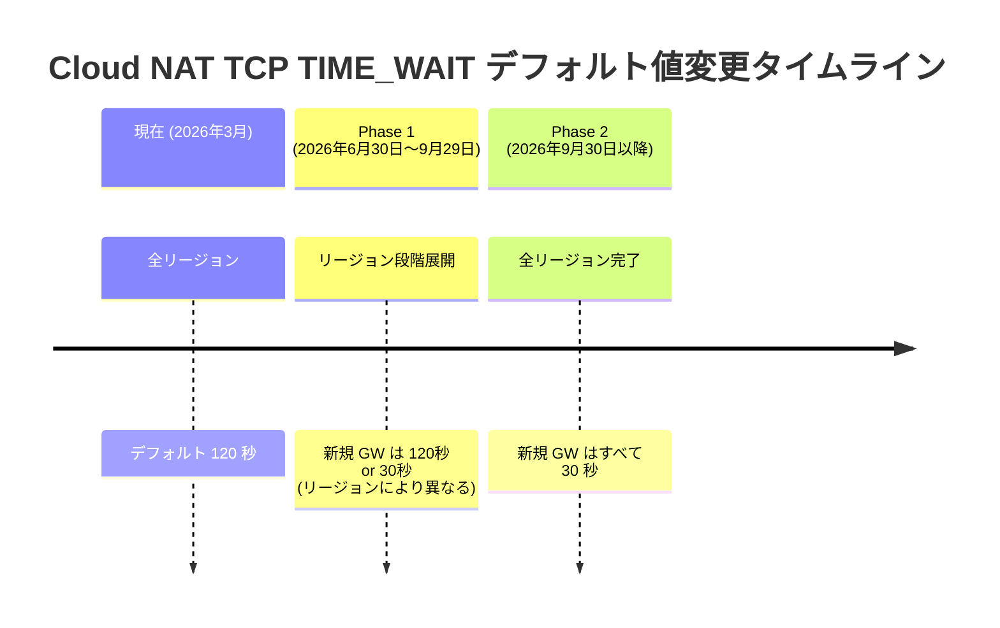
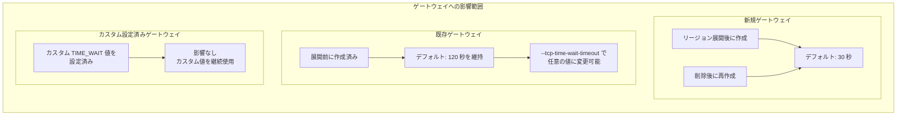

# Cloud NAT: TCP TIME_WAIT タイムアウトのデフォルト値が 120 秒から 30 秒に変更予定

**リリース日**: 2026-03-31

**サービス**: Cloud NAT

**機能**: TCP TIME_WAIT タイムアウトのデフォルト値変更

**ステータス**: Announcement (scheduled change)

📊 [このアップデートのインフォグラフィックを見る](https://takech9203.github.io/google-cloud-news-summary/20260331-cloud-nat-tcp-time-wait-timeout.html)

## 概要

Cloud NAT の TCP TIME_WAIT タイムアウトのデフォルト値が、全リージョンにおいて現行の 120 秒から 30 秒に段階的に引き下げられることが発表されました。この変更は 2026 年 6 月 30 日から 9 月 29 日にかけてリージョンごとにロールアウトされ、2026 年 9 月 30 日以降はすべてのリージョンで新しいデフォルト値が適用されます。

TCP TIME_WAIT タイムアウトは、完全にクローズされた TCP 接続が Cloud NAT マッピング内に保持される時間を制御するパラメータです。このタイムアウトは、クローズ済みの TCP 接続に属する再送パケットが内部エンドポイントに誤って配信されることを防ぐために存在します。デフォルト値を 30 秒に引き下げることで、NAT ポートの再利用効率が向上し、ポート枯渇のリスクが軽減されます。

この変更は主に新規作成されるゲートウェイに影響し、既存のゲートウェイは現行の 120 秒のデフォルト値を維持します。また、カスタム値を設定済みのゲートウェイには一切影響がありません。Cloud NAT を利用する全てのユーザーが移行スケジュールを把握し、必要に応じた対応を計画することが推奨されます。

**アップデート前の課題**

- TCP TIME_WAIT タイムアウトのデフォルト値が 120 秒と長く、クローズ済みの接続が NAT マッピングを長時間占有していた
- 高トラフィック環境では NAT ポートの再利用が遅延し、ポート枯渇が発生するリスクがあった
- 動的ポート割り当て (Dynamic Port Allocation) を使用する場合、120 秒のデフォルト値が最適でないケースが多かった

**アップデート後の改善**

- デフォルト値が 30 秒に短縮されることで、NAT ポートの再利用サイクルが大幅に高速化される
- 新規ゲートウェイではポート枯渇のリスクが低減し、追加のチューニングなしでも効率的に動作する
- 動的ポート割り当てとの組み合わせにおいて、より適切なデフォルト値となる (Google 推奨値は 15 秒以上)

## アーキテクチャ図





上の図はデフォルト値変更のロールアウトタイムラインと、ゲートウェイの種類ごとの影響を示しています。新規ゲートウェイのみが新デフォルト値の対象となり、既存ゲートウェイとカスタム設定済みゲートウェイには影響がありません。

## サービスアップデートの詳細

### 主要機能

1. **デフォルト値の段階的変更**
   - TCP TIME_WAIT タイムアウトのデフォルト値が 120 秒から 30 秒に変更される
   - 2026 年 6 月 30 日から 9 月 29 日にかけてリージョンごとに段階的にロールアウト
   - 2026 年 9 月 30 日以降、全リージョンで新デフォルト値が適用

2. **既存ゲートウェイの保護**
   - リージョン展開前に作成されたゲートウェイは 120 秒のデフォルト値を維持
   - 運用中のワークロードに対する互換性が確保される
   - `--tcp-time-wait-timeout` フラグで任意のタイミングで値を調整可能

3. **カスタム設定の尊重**
   - カスタム TIME_WAIT 値が設定されたゲートウェイは影響を受けない
   - 既にチューニング済みの環境は変更不要

## 技術仕様

### Cloud NAT タイムアウト設定一覧

| タイムアウト種別 | 現行デフォルト | 変更後デフォルト (新規 GW) | 設定可能 |
|------|------|------|------|
| TCP TIME_WAIT Timeout | 120 秒 | 30 秒 | はい |
| TCP Established Connection Idle Timeout | 1200 秒 (20 分) | 変更なし | はい |
| TCP Transitory Connection Idle Timeout | 30 秒 | 変更なし | はい |
| UDP Mapping Idle Timeout | 30 秒 | 変更なし | はい |
| ICMP Mapping Idle Timeout (Public NAT のみ) | 30 秒 | 変更なし | はい |

### 重要な注意事項

| 項目 | 詳細 |
|------|------|
| 追加の処理時間 | タイムアウト値に関わらず、NAT ソース IP / ポートの再利用には最大 30 秒の追加時間が必要 |
| 動的ポート割り当て使用時 | TIME_WAIT タイムアウトは 15 秒以上を推奨 (パケットドロップ防止) |
| タイムアウト精度 | 実際の満了時間は設定値から最大 5 秒の誤差が生じる可能性がある |
| 影響範囲 | 新規ゲートウェイのみ。既存およびカスタム設定済みゲートウェイは対象外 |

## 設定方法

### 前提条件

1. Cloud NAT ゲートウェイが構成された Cloud Router が存在すること
2. `compute.routers.update` 権限を持つ IAM ロール (例: `roles/compute.networkAdmin`) が付与されていること

### 手順

#### ステップ 1: 現在の TIME_WAIT タイムアウト値を確認する

```bash
gcloud compute routers nats describe NAT_CONFIG \
    --router=ROUTER_NAME \
    --region=REGION
```

出力に `tcpTimeWaitTimeoutSec` フィールドが含まれる場合、カスタム値が設定されています。含まれない場合はデフォルト値 (現行 120 秒) が使用されています。

#### ステップ 2: TIME_WAIT タイムアウト値をカスタム設定する (必要な場合)

```bash
gcloud compute routers nats update NAT_CONFIG \
    --router=ROUTER_NAME \
    --region=REGION \
    --tcp-time-wait-timeout=30
```

既存ゲートウェイで新しいデフォルト値 (30 秒) に合わせたい場合、明示的にカスタム値として設定します。

#### ステップ 3: タイムアウトをデフォルト値にリセットする (必要な場合)

```bash
gcloud compute routers nats update NAT_CONFIG \
    --router=ROUTER_NAME \
    --region=REGION \
    --clear-tcp-time-wait-timeout
```

カスタム設定を解除し、デフォルト値に戻す場合はこのコマンドを使用します。デフォルト値は変更のロールアウト状況に依存します。

### Console からの設定

1. Google Cloud コンソールで [Cloud NAT ページ](https://console.cloud.google.com/net-services/nat/list) を開く
2. 対象の Cloud NAT ゲートウェイをクリック
3. 「編集」をクリック
4. 「詳細構成」を開く
5. TCP TIME_WAIT タイムアウト値を変更
6. 「保存」をクリック

## メリット

### ビジネス面

- **ポート枯渇リスクの低減**: 高トラフィック環境での安定性が向上し、サービス中断のリスクが軽減される
- **運用コストの削減**: デフォルト値が最適化されることで、新規構築時のチューニング作業が不要になるケースが増える

### 技術面

- **NAT ポート再利用の効率化**: TIME_WAIT 状態の保持時間が 1/4 に短縮され、同一 NAT IP アドレスでより多くの接続を処理可能
- **動的ポート割り当てとの最適な組み合わせ**: 推奨値 (15 秒以上) を上回る 30 秒がデフォルトとなり、追加設定なしで適切に動作
- **他のタイムアウト値との整合性**: UDP Mapping Idle Timeout や TCP Transitory Connection Idle Timeout と同じ 30 秒に統一される

## デメリット・制約事項

### 制限事項

- 既存ゲートウェイは自動的に新しいデフォルト値に移行されないため、統一したい場合は手動での設定変更が必要
- ゲートウェイを削除して再作成すると、既存の 120 秒デフォルトではなく新しい 30 秒デフォルトが適用される点に注意が必要
- タイムアウト値に関わらず、NAT ポートの再利用には最大 30 秒の追加時間が発生する場合がある

### 考慮すべき点

- TIME_WAIT タイムアウトが短縮されると、クローズ済み接続の再送パケットが新しい接続に誤って配信されるリスクがわずかに増加する
- 遅延の大きいネットワーク環境やパケットロスが多い環境では、短いタイムアウトが問題を引き起こす可能性がある
- ロールアウト期間中 (6 月 30 日~9 月 29 日) はリージョンによってデフォルト値が異なるため、マルチリージョン構成ではゲートウェイ間で挙動が一致しない期間が生じる

## ユースケース

### ユースケース 1: 高頻度 API 呼び出し環境でのポート枯渇対策

**シナリオ**: マイクロサービスアーキテクチャで多数の短命 TCP 接続を使用し、外部 API を高頻度に呼び出す環境。Cloud NAT 経由のポートが枯渇気味の状況。

**実装例**:
```bash
# 新規ゲートウェイでは追加設定不要 (デフォルト 30 秒)
# 既存ゲートウェイでは明示的に設定
gcloud compute routers nats update my-nat-config \
    --router=my-router \
    --region=us-central1 \
    --tcp-time-wait-timeout=30
```

**効果**: TIME_WAIT 状態のポート保持時間が 120 秒から 30 秒に短縮され、ポートの再利用サイクルが 4 倍高速化。ポート枯渇の発生頻度が大幅に低減する。

### ユースケース 2: マルチリージョン構成での統一的なタイムアウト管理

**シナリオ**: 複数リージョンに Cloud NAT ゲートウェイを展開している環境で、ロールアウト期間中もリージョン間で一貫した動作を維持したい。

**実装例**:
```bash
# 全リージョンのゲートウェイに対してカスタム値を明示的に設定
for REGION in us-central1 europe-west1 asia-northeast1; do
  gcloud compute routers nats update nat-config \
      --router=router-${REGION} \
      --region=${REGION} \
      --tcp-time-wait-timeout=30
done
```

**効果**: ロールアウトのタイミングに依存せず、全リージョンで即座に統一されたタイムアウト値を適用できる。

## 料金

この変更による追加料金は発生しません。Cloud NAT の料金体系自体に変更はなく、タイムアウト値の変更は課金に影響しません。

### Cloud NAT 標準料金 (参考)

| 項目 | 料金 |
|--------|-----------------|
| NAT ゲートウェイ (1 時間あたり、32 VM 以下) | $0.044 |
| データ処理 (1 GB あたり) | $0.045 |

## 利用可能リージョン

この変更は Cloud NAT が利用可能なすべてのリージョンに適用されます。段階的ロールアウトのスケジュールは以下の通りです:

- **2026 年 6 月 30 日~9 月 29 日**: リージョンごとに順次展開 (特定リージョンの展開日は個別に通知される可能性があります)
- **2026 年 9 月 30 日以降**: すべてのリージョンで新規ゲートウェイに 30 秒のデフォルト値が適用

## 関連サービス・機能

- **Cloud Router**: Cloud NAT ゲートウェイのホストとなるサービス。NAT 設定は Cloud Router 上で管理される
- **VPC ネットワーク**: Cloud NAT は VPC ネットワーク内の VM インスタンスからの外部通信を仲介する
- **動的ポート割り当て (Dynamic Port Allocation)**: TIME_WAIT タイムアウトと密接に関連する機能。短いタイムアウトと組み合わせることでポート効率が向上する
- **Private NAT**: Public NAT と同様のタイムアウト設定が適用される

## 参考リンク

- 📊 [インフォグラフィック](https://takech9203.github.io/google-cloud-news-summary/20260331-cloud-nat-tcp-time-wait-timeout.html)
- [公式リリースノート](https://cloud.google.com/release-notes#March_31_2026)
- [Cloud NAT タイムアウトのチューニング](https://cloud.google.com/nat/docs/tune-nat-configuration)
- [Cloud NAT 概要](https://cloud.google.com/nat/docs/overview)
- [Cloud NAT 料金](https://cloud.google.com/nat/pricing)

## まとめ

Cloud NAT の TCP TIME_WAIT タイムアウトのデフォルト値が 120 秒から 30 秒に引き下げられるこの変更は、NAT ポートの利用効率を向上させる重要なアップデートです。既存ゲートウェイには影響がないため緊急の対応は不要ですが、2026 年 6 月以降の新規ゲートウェイ作成やゲートウェイの再作成時には新しいデフォルト値が適用される点を認識しておく必要があります。マルチリージョン環境やポート枯渇が懸念される環境では、ロールアウトに先立ってカスタム値の明示的な設定を検討することを推奨します。

---

**タグ**: #CloudNAT #Networking #TCP #TimeWait #ScheduledChange #PortExhaustion #NATGateway
