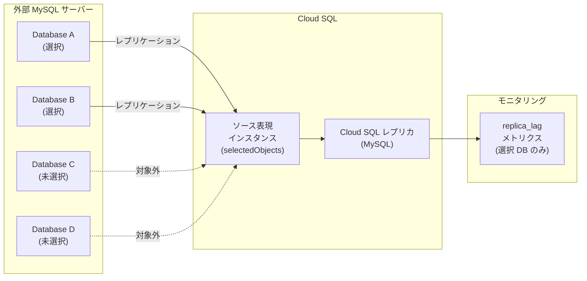

# Cloud SQL for MySQL: 外部サーバーからのデータベースサブセット移行が可能に

**リリース日**: 2026-03-31

**サービス**: Cloud SQL for MySQL

**機能**: 外部サーバーからの選択的データベースサブセット移行

**ステータス**: Feature (GA)

📊 [このアップデートのインフォグラフィックを見る](https://takech9203.github.io/google-cloud-news-summary/20260331-cloud-sql-mysql-subset-migration.html)

## 概要

Cloud SQL for MySQL において、外部サーバーからのレプリケーション設定時に、移行対象のデータベースをサブセットとして選択できる機能が一般提供 (GA) になりました。これまで外部サーバーからの移行ではソースインスタンスの全データベースが一括でレプリケーションされていましたが、今回のアップデートにより `selectedObjects` パラメータを使用して移行対象のデータベースを個別に指定できるようになりました。

この機能は、ソース表現インスタンス (Source Representation Instance) の作成時に JSON リクエストデータの `onPremisesConfiguration` セクションで `selectedObjects` パラメータを設定することで利用できます。マネージドインポート方式およびダンプファイル方式の両方で対応しており、既存のソース表現インスタンスの更新時にも移行対象データベースの変更が可能です。

対象ユーザーは、オンプレミスの MySQL サーバーや Amazon RDS、Amazon Aurora、Azure Database for MySQL などの他クラウドから Cloud SQL for MySQL への移行を計画しているデータベース管理者やインフラストラクチャエンジニアです。

**アップデート前の課題**

- 外部サーバーから Cloud SQL for MySQL へのレプリケーション設定時、ソースインスタンスの全データベースが移行対象となり個別選択ができなかった
- 不要なデータベースも含めてレプリケーションされるため、初期データロードやレプリケーション遅延の解消に余分な時間とリソースが消費されていた
- 特定のデータベースのみを移行したい場合、手動でのダンプ・リストア作業や複雑なフィルタリング設定が必要だった

**アップデート後の改善**

- `selectedObjects` パラメータを使用して移行対象のデータベースを個別に指定可能になった
- 必要なデータベースのみをレプリケーションすることで、移行時間とネットワーク帯域を最適化できるようになった
- データベースごとのレプリケーション遅延メトリクス (`database/mysql/external_sync/replica_lag`) で移行対象データベースのみの状態を監視可能になった
- ソース表現インスタンスの更新時にも移行対象データベースの変更が可能

## アーキテクチャ図



外部 MySQL サーバーから Cloud SQL へのレプリケーション時に、ソース表現インスタンスの `selectedObjects` パラメータで指定されたデータベースのみがレプリケーション対象となります。移行対象外のデータベースはレプリケーションから除外され、モニタリングメトリクスも選択されたデータベースのみを対象とします。

## サービスアップデートの詳細

### 主要機能

1. **selectedObjects パラメータによるデータベース選択**
   - ソース表現インスタンスの JSON リクエストデータで `selectedObjects` パラメータにデータベース名のリストを指定
   - パラメータを省略するか空リストを指定した場合は、従来通り全データベースが移行対象
   - 各データベースは `{"database": "db_name"}` 形式のオブジェクトとして指定

2. **マネージドインポートとダンプファイルの両方に対応**
   - マネージドインポート方式: Cloud SQL が外部サーバーに直接接続してデータダンプを実行し、選択されたデータベースのみをインポート
   - ダンプファイル方式: Cloud Storage 上のダンプファイルを使用し、選択されたデータベースのみをレプリケーション対象として設定

3. **データベースごとのレプリケーション遅延モニタリング**
   - `database/mysql/external_sync/replica_lag` メトリクスが移行対象データベースのみを対象としてレプリケーション遅延を報告
   - 移行対象外のデータベースはメトリクスから除外されるため、正確な移行状態の把握が可能
   - レプリカの昇格タイミングの判断に活用可能

## 技術仕様

### 対応バージョン

| 項目 | 詳細 |
|------|------|
| MySQL バージョン (外部サーバー) | 5.5, 5.6, 5.7, 8.0, 8.4 |
| MySQL バージョン (Cloud SQL レプリカ) | ソースと同一またはそれ以上のメジャーバージョン |
| GTID サポート | MySQL 5.5 では非サポート |
| ストレージエンジン | InnoDB のみ (MyISAM はデータ不整合のリスクあり) |

### 対応ソース

| ソース | サポート |
|--------|---------|
| MySQL Community Edition | 対応 |
| Cloud SQL for MySQL | 対応 |
| Amazon RDS for MySQL | 対応 |
| Amazon Aurora MySQL | 対応 |
| Azure Database for MySQL Flexible Server | 対応 |

### ソース表現インスタンスの設定例

```json
{
  "name": "cloudsql-source-instance",
  "region": "us-central1",
  "databaseVersion": "MYSQL_8_0",
  "onPremisesConfiguration": {
    "selectedObjects": [
      {"database": "app_db"},
      {"database": "user_db"}
    ],
    "hostPort": "192.0.2.0:3306",
    "username": "replicationUser",
    "password": "your-secure-password"
  }
}
```

## 設定方法

### 前提条件

1. 外部 MySQL サーバーでバイナリログが有効化されており、行ベースのバイナリロギングが設定されていること
2. バイナリログが少なくとも 24 時間保持されるよう設定されていること (推奨: 1 週間)
3. Cloud SQL Admin、Storage Admin、Compute Viewer の IAM ロールが付与されていること
4. Google Cloud SDK がインストールされていること

### 手順

#### ステップ 1: ソース表現インスタンスのリクエストデータを作成

移行対象のデータベースを `selectedObjects` パラメータで指定した `source.json` ファイルを作成します。

```json
{
  "name": "my-source-instance",
  "region": "asia-northeast1",
  "databaseVersion": "MYSQL_8_0",
  "onPremisesConfiguration": {
    "selectedObjects": [
      {"database": "production_db"},
      {"database": "analytics_db"}
    ],
    "hostPort": "203.0.113.10:3306",
    "username": "replicationUser",
    "password": "secure-password",
    "caCertificate": "-----BEGIN CERTIFICATE-----\n...\n-----END CERTIFICATE-----"
  }
}
```

#### ステップ 2: ソース表現インスタンスを作成

```bash
# ソース表現インスタンスの作成
curl -X POST \
  "https://sqladmin.googleapis.com/v1/projects/PROJECT_ID/instances" \
  -H "Authorization: Bearer $(gcloud auth print-access-token)" \
  -H "Content-Type: application/json" \
  -d @source.json
```

Cloud SQL API を使用してソース表現インスタンスを作成します。`selectedObjects` で指定したデータベースのみがレプリケーション対象として設定されます。

#### ステップ 3: Cloud SQL レプリカの作成とレプリケーション開始

```bash
# レプリカの作成
curl -X POST \
  "https://sqladmin.googleapis.com/v1/projects/PROJECT_ID/instances" \
  -H "Authorization: Bearer $(gcloud auth print-access-token)" \
  -H "Content-Type: application/json" \
  -d @replica.json
```

レプリカが作成されると、初期データロードが開始され、選択されたデータベースのみがレプリケーションされます。

#### ステップ 4: レプリケーション状態の確認

```bash
# レプリケーションステータスの確認
gcloud sql instances describe REPLICA_NAME \
  --format="value(replicaConfiguration)"
```

`database/mysql/external_sync/replica_lag` メトリクスで移行対象データベースのレプリケーション遅延を確認し、遅延が 0 に収束したことを確認してからレプリカの昇格を検討します。

## メリット

### ビジネス面

- **移行コストの最適化**: 必要なデータベースのみを移行することで、ネットワーク転送コストとレプリケーションに要するコンピューティングリソースを削減できる
- **段階的移行の実現**: アプリケーションやサービス単位で使用するデータベースを段階的に移行することで、リスクを分散し移行の影響を最小化できる
- **移行期間の短縮**: 移行対象データ量の削減により、初期データロードおよびレプリケーションのキャッチアップ時間が短縮される

### 技術面

- **正確なモニタリング**: 移行対象データベースのみを対象としたレプリケーション遅延メトリクスにより、昇格タイミングの正確な判断が可能
- **ネットワーク帯域の効率化**: 不要なデータベースのレプリケーショントラフィックを排除し、帯域を効率的に利用できる
- **柔軟な構成変更**: ソース表現インスタンスの更新 API を使用して、移行対象データベースの追加・変更が可能

## デメリット・制約事項

### 制限事項

- InnoDB 以外のストレージエンジン (MyISAM) を使用しているテーブルは、データ不整合のリスクがあるため、事前に InnoDB への変換が推奨される
- MySQL 5.5 の外部サーバーでは GTID がサポートされておらず、レプリケーション設定手順が異なる
- DEFINER 句を含むビュー、イベント、トリガー、ストアドプロシージャが存在する場合、レプリケーションが失敗する可能性がある

### 考慮すべき点

- データベース間にクロスデータベースの参照 (外部キー、ビュー、ストアドプロシージャ) がある場合、関連する全てのデータベースを移行対象に含める必要がある
- Amazon RDS をソースとする場合、ほとんどの状況で GTID がサポートされない点に注意 (MySQL 5.7 のみ GTID 対応)
- Amazon RDS および Amazon Aurora ではグローバル読み取りロック権限がサポートされない
- 移行後にソースインスタンスで新規作成されたデータベースは自動的には移行対象に追加されないため、ソース表現インスタンスの更新が必要

## ユースケース

### ユースケース 1: マイクロサービスアーキテクチャへの段階的移行

**シナリオ**: モノリシックなアプリケーションが 1 つの MySQL インスタンス上の複数データベースを使用しており、マイクロサービス化に伴い各サービスのデータベースを段階的に Cloud SQL に移行したい場合。

**実装例**:
```json
{
  "name": "microservice-migration-phase1",
  "region": "asia-northeast1",
  "databaseVersion": "MYSQL_8_0",
  "onPremisesConfiguration": {
    "selectedObjects": [
      {"database": "user_service_db"},
      {"database": "auth_service_db"}
    ],
    "hostPort": "10.0.1.100:3306",
    "username": "replication_user",
    "password": "secure-password"
  }
}
```

**効果**: サービス単位で移行を進めることで、各フェーズのリスクを限定し、問題発生時の切り戻しを容易にできる。

### ユースケース 2: 開発・テスト環境への本番データベースの部分複製

**シナリオ**: 本番環境の MySQL インスタンスには 20 以上のデータベースが存在するが、開発チームが必要としているのはそのうち 3 つのデータベースのみ。テスト用に最新データを継続的に同期したい場合。

**効果**: 必要最小限のデータベースのみをレプリケーションすることで、開発環境のストレージコストを削減し、初期セットアップ時間を大幅に短縮できる。

## 料金

Cloud SQL for MySQL の外部サーバーからのレプリケーション自体に追加料金は発生しませんが、以下のリソースに対して通常の料金が適用されます。

### 料金例

| リソース | 料金 |
|---------|------|
| Cloud SQL レプリカインスタンス | Cloud SQL の通常インスタンス料金が適用 |
| ストレージ (レプリカ) | 使用量に応じた Cloud SQL ストレージ料金 |
| ネットワーク (インターネット経由) | ネットワーク egress 料金が適用 |
| Cloud Storage (ダンプファイル方式) | ダンプファイルの保存・転送料金が適用 |

## 利用可能リージョン

Cloud SQL for MySQL がサポートされている全リージョンで利用可能です。主要リージョンは以下の通りです。

- **アジア太平洋**: asia-northeast1 (東京), asia-northeast2 (大阪), asia-southeast1 (シンガポール), asia-south1 (ムンバイ) 他
- **北米**: us-central1, us-east1, us-west1, us-west2, northamerica-northeast1 他
- **ヨーロッパ**: europe-west1, europe-west3, europe-west4, europe-north1 他

## 関連サービス・機能

- **Database Migration Service**: Cloud SQL への移行専用サービス。同種移行でも同様のデータベース選択機能が利用可能
- **Cloud SQL レプリケーション**: Cloud SQL 間のリードレプリカ機能。外部レプリカとの連携も可能
- **VPC ネットワーク**: プライベート IP を使用した外部サーバーとのセキュアな接続に使用
- **Cloud Monitoring**: `database/mysql/external_sync/replica_lag` メトリクスによるレプリケーション状態の監視

## 参考リンク

- 📊 [インフォグラフィック](https://takech9203.github.io/google-cloud-news-summary/20260331-cloud-sql-mysql-subset-migration.html)
- [公式リリースノート](https://cloud.google.com/release-notes#March_31_2026)
- [外部サーバーからのレプリケーション設定](https://docs.cloud.google.com/sql/docs/mysql/replication/configure-replication-from-external)
- [レプリカの管理](https://docs.cloud.google.com/sql/docs/mysql/replication/manage-replicas)
- [Cloud SQL for MySQL 料金](https://cloud.google.com/sql/pricing)

## まとめ

今回のアップデートにより、Cloud SQL for MySQL の外部サーバーレプリケーションにおいて `selectedObjects` パラメータを使用したデータベースのサブセット移行が可能になりました。これにより、大規模な MySQL インスタンスからの段階的な移行戦略の実現やコストの最適化が容易になります。外部サーバーから Cloud SQL for MySQL への移行を計画している場合は、ソース表現インスタンスの作成時に `selectedObjects` パラメータを活用し、必要なデータベースのみを効率的に移行することを推奨します。

---

**タグ**: #CloudSQL #MySQL #データベース移行 #レプリケーション #selectedObjects #外部サーバー
