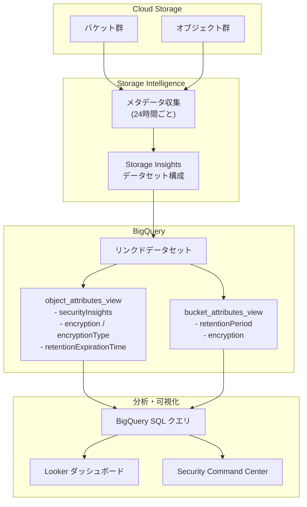

# Cloud Storage: Storage Insights データセットによるセキュリティ・コンプライアンス管理機能の GA

**リリース日**: 2026-03-31

**サービス**: Cloud Storage

**機能**: Storage Insights データセットによるデータセキュリティ・コンプライアンス管理

**ステータス**: GA (一般提供)

[このアップデートのインフォグラフィックを見る](https://takech9203.github.io/google-cloud-news-summary/20260331-cloud-storage-storage-insights-security.html)

## 概要

Cloud Storage の Storage Insights データセットに、データセキュリティとコンプライアンス管理を強化する新機能が一般提供 (GA) されました。これまでプレビューだった「パブリックアクセス可能なオブジェクトの特定」機能が GA となり、さらにバケットおよびオブジェクトのメタデータスキーマに `encryption`、`retentionPeriod`、`encryptionType`、`retentionExpirationTime` といった新しいフィールドが追加されました。

これらの新機能により、組織全体のストレージ資産に対して暗号化構成の監査やデータ保持ポリシーの監視をスケーラブルに実施できるようになります。BigQuery のリンクドデータセットを通じて SQL クエリで分析が可能であり、Looker ダッシュボードと組み合わせることで継続的なセキュリティ監視体制を構築できます。

対象ユーザーは、大規模なストレージ環境を運用するセキュリティチーム、コンプライアンス担当者、クラウドアーキテクト、および DevOps エンジニアです。特に金融・医療・公共分野など、厳格なデータガバナンスが求められる業界において高い価値を提供します。

**アップデート前の課題**

このアップデート以前は、Cloud Storage のセキュリティとコンプライアンスの管理において以下の課題がありました。

- パブリックアクセス可能なオブジェクトを特定する機能はプレビュー段階であり、本番環境での利用に SLA が保証されていなかった
- 暗号化構成（Google 管理キー、CMEK、CSEK など）をオブジェクト単位で一括確認する標準的な方法がなく、カスタムスクリプトや API の反復呼び出しが必要だった
- データ保持ポリシーの遵守状況をオブジェクト単位で大規模に監視する仕組みが不足しており、保持期限の管理が煩雑だった
- セキュリティ監査のたびに手動でのデータ収集・集計が必要で、リアルタイムに近い監視が困難だった

**アップデート後の改善**

今回のアップデートにより、以下の改善が実現しました。

- パブリックアクセス可能なオブジェクトの特定が GA となり、SLA 付きで本番ワークロードに安心して利用可能になった
- `encryption` と `encryptionType` フィールドにより、各オブジェクトの暗号化方式を BigQuery クエリで一括監査できるようになった
- `retentionPeriod` と `retentionExpirationTime` フィールドにより、データ保持ポリシーの遵守状況をスケーラブルに監視可能になった
- BigQuery + Looker との連携により、セキュリティとコンプライアンスの継続的な可視化・監視体制を構築できるようになった

## アーキテクチャ図



Storage Insights データセットが Cloud Storage のバケット・オブジェクトからメタデータを収集し、BigQuery リンクドデータセットとしてセキュリティ関連フィールドを公開します。これを SQL クエリや Looker ダッシュボードで分析・可視化する全体フローを示しています。

## サービスアップデートの詳細

### 主要機能

1. **パブリックアクセス可能なオブジェクトの特定 (GA)**
   - オブジェクトメタデータスキーマの `securityInsights.publicAccessInsight` フィールドを通じて、各オブジェクトのパブリックアクセス状態を確認可能
   - `readPublicAccess` と `writePublicAccess` の 2 つのフィールドで読み取り・書き込みそれぞれのパブリックアクセス状態を個別に判定
   - ステータス値は `PUBLIC`、`NOT_PUBLIC`、`UNSUPPORTED`（マネージドフォルダ内）、`ERROR`（一時的なエラー）の 4 種類
   - パブリックアクセス防止設定、均一バケットレベルアクセス、ACL、IAM ポリシー、組織ポリシーなどを総合的に評価

2. **暗号化構成の監査フィールド**
   - `encryption`: オブジェクトに適用されている暗号化の詳細情報
   - `encryptionType`: 暗号化方式の種類（Google 管理キー、CMEK、CSEK など）を示すフィールド
   - これらのフィールドにより、組織全体の暗号化ポリシー準拠状況を BigQuery で一括クエリ可能

3. **データ保持ポリシーの監視フィールド**
   - `retentionPeriod`: バケットまたはオブジェクトに設定された保持期間
   - `retentionExpirationTime`: オブジェクトが削除可能になる最も早い時刻（RFC 3339 形式）。オブジェクトの保持構成とバケットの保持ポリシーの両方に基づいて計算
   - 保持期限が近づいているオブジェクトや、ポリシーに違反しているオブジェクトの検出が容易に

## 技術仕様

### セキュリティ関連の新規・拡張フィールド

| フィールド | モード | 型 | 説明 |
|------|------|------|------|
| `securityInsights.publicAccessInsight.readPublicAccess` | NULLABLE | STRING | オブジェクトのパブリック読み取り状態 |
| `securityInsights.publicAccessInsight.writePublicAccess` | NULLABLE | STRING | オブジェクトのパブリック書き込み状態 |
| `encryption` | NULLABLE | RECORD | 暗号化構成の詳細 |
| `encryptionType` | NULLABLE | STRING | 暗号化方式の種類 |
| `retentionPeriod` | NULLABLE | STRING | 保持期間の設定 |
| `retentionExpirationTime` | NULLABLE | TIMESTAMP | 削除可能になる最早時刻 (RFC 3339) |

### パブリックアクセスステータスの判定条件

Storage Insights データセットは、以下の構成を総合的に評価してパブリックアクセス状態を判定します。

| 評価対象 | 構成項目 |
|------|------|
| バケット・オブジェクトメタデータ | パブリックアクセス防止、均一バケットレベルアクセス、ACL、IAM ポリシー |
| 組織ポリシー | ポリシー制約、IAM 拒否ポリシー、タグ付き IAM ポリシー |

### データセット対応 BigQuery ロケーション

データセットは以下の BigQuery ロケーションでサポートされています。

| リージョン |
|------|
| EU |
| US |
| asia-south1 |
| asia-south2 |
| asia-southeast1 |
| europe-west1 |
| us-central1 |
| us-east1 |
| us-east4 |

## 設定方法

### 前提条件

1. Storage Intelligence サブスクリプションが有効化されていること（30 日間の無料トライアルも利用可能）
2. Storage Admin ロールおよび必要な権限（`storage.intelligenceConfigs.update`、`storageinsights.datasetConfigs.create`）
3. サービスエージェントへの適切な権限付与

### 手順

#### ステップ 1: Storage Intelligence の有効化

```bash
# gcloud CLI で Storage Intelligence の STANDARD ティアを有効化
gcloud storage intelligence-configs enable \
  --project=PROJECT_ID
```

Storage Intelligence が有効化されると、Storage Insights データセットの機能が利用可能になります。まず試したい場合は、30 日間の無料トライアル (TRIAL ティア) を有効化することもできます。

#### ステップ 2: データセット構成の作成

```bash
# データセット構成を作成し、対象スコープと BigQuery ロケーションを指定
gcloud storage insights dataset-configs create \
  --project=PROJECT_ID \
  --location=us-central1 \
  --retention-period-days=90 \
  --source-projects=PROJECT_ID
```

対象とするプロジェクト、フォルダ、または組織を指定してデータセット構成を作成します。

#### ステップ 3: サービスエージェントへの権限付与

```bash
# サービスエージェントに必要なロールを付与
gcloud projects add-iam-policy-binding PROJECT_ID \
  --member="serviceAccount:SERVICE_AGENT_EMAIL" \
  --role="roles/storage.objectViewer"
```

データセット構成の作成後に表示されるサービスエージェントに、対象リソースへの読み取り権限を付与します。

#### ステップ 4: BigQuery へのリンク

```bash
# データセットを BigQuery にリンク
gcloud storage insights dataset-configs link \
  --project=PROJECT_ID \
  --location=us-central1 \
  --dataset-config=DATASET_CONFIG_ID
```

リンク後、初回データのロードには 24〜48 時間かかります。

#### ステップ 5: セキュリティクエリの実行

```sql
-- パブリックアクセス可能なオブジェクトを検出するクエリ例
SELECT
  bucketName,
  objectName,
  securityInsights.publicAccessInsight.readPublicAccess,
  securityInsights.publicAccessInsight.writePublicAccess,
  encryptionType,
  retentionExpirationTime
FROM
  `PROJECT_ID.DATASET_ID.object_attributes_latest_snapshot_view`
WHERE
  securityInsights.publicAccessInsight.readPublicAccess = 'PUBLIC'
  OR securityInsights.publicAccessInsight.writePublicAccess = 'PUBLIC'
ORDER BY
  bucketName, objectName;
```

このクエリで、パブリックアクセスが可能な全オブジェクトとその暗号化・保持期限情報を一覧取得できます。

## メリット

### ビジネス面

- **コンプライアンス対応の効率化**: 暗号化構成と保持ポリシーの監査を自動化し、監査対応にかかる時間とコストを大幅に削減
- **データ漏洩リスクの低減**: パブリックアクセス可能なオブジェクトを即座に特定し、意図しないデータ公開を防止
- **ガバナンス体制の強化**: 組織全体のストレージセキュリティ状態を一元的に把握し、経営層への報告を容易に

### 技術面

- **スケーラブルな監査**: 数十億オブジェクト規模のストレージ環境でも BigQuery の処理能力により高速に監査を実行可能
- **自動化の容易さ**: BigQuery のスケジュールクエリやアラート機能と組み合わせることで、継続的なセキュリティ監視を自動化
- **統合分析**: 既存の BigQuery データや他のセキュリティツールとの統合が容易で、包括的なセキュリティ分析基盤を構築可能

## デメリット・制約事項

### 制限事項

- マネージドフォルダ内のオブジェクトについては、パブリックアクセスステータスの判定が利用不可（`UNSUPPORTED` が返される）
- VPC Service Controls や IP フィルタリングの構成は、パブリックアクセスステータスの判定に考慮されない
- CMEK で暗号化されたオブジェクトの CRC32C チェックサムと MD5 ハッシュはデータセットで利用不可
- データセットがサポートされる BigQuery ロケーションは現時点で 9 箇所に限定

### 考慮すべき点

- Storage Intelligence サブスクリプション（STANDARD ティア）が必要であり、オブジェクト管理料金が発生する
- 初回データロードに 24〜48 時間、メタデータスナップショットの更新は 24 時間ごとのため、リアルタイム監視には向かない
- 大規模データセットの BigQuery クエリおよび Looker ダッシュボードの可視化は、BigQuery のコンピューティングリソースを消費する
- STANDARD ティアを 30 日以内に解約すると早期解約料が発生する

## ユースケース

### ユースケース 1: パブリックアクセスの継続的監視

**シナリオ**: 金融機関のセキュリティチームが、数千のバケットに分散する顧客データに対して、意図しないパブリックアクセスが設定されていないかを日次で監視したい。

**実装例**:
```sql
-- 日次スケジュールクエリ: パブリックアクセス可能オブジェクトの検出とアラート
SELECT
  bucketName,
  objectName,
  securityInsights.publicAccessInsight.readPublicAccess AS read_access,
  securityInsights.publicAccessInsight.writePublicAccess AS write_access,
  snapshotTime
FROM
  `PROJECT_ID.DATASET_ID.object_attributes_latest_snapshot_view`
WHERE
  securityInsights.publicAccessInsight.readPublicAccess = 'PUBLIC'
  OR securityInsights.publicAccessInsight.writePublicAccess = 'PUBLIC';
```

**効果**: カスタムスクリプトなしで組織全体のパブリックアクセス状況を自動監視し、検出時に即座にアラートを発報できる。

### ユースケース 2: 暗号化ポリシー準拠の監査

**シナリオ**: 規制対応として、全ての機密データが CMEK で暗号化されていることを証明する必要がある。

**実装例**:
```sql
-- CMEK 以外の暗号化方式を使用しているオブジェクトの検出
SELECT
  bucketName,
  objectName,
  encryptionType,
  size
FROM
  `PROJECT_ID.DATASET_ID.object_attributes_latest_snapshot_view`
WHERE
  encryptionType != 'CUSTOMER_MANAGED_ENCRYPTION'
  AND bucketName IN (
    SELECT bucketName FROM `PROJECT_ID.DATASET_ID.bucket_attributes_latest_snapshot_view`
    WHERE labels LIKE '%classification:confidential%'
  );
```

**効果**: 暗号化ポリシーに準拠していないオブジェクトを即座に検出し、是正措置を講じることが可能。

### ユースケース 3: データ保持期限の管理

**シナリオ**: 法的要件により、特定のデータを最低 7 年間保持する必要があり、保持期限が近づいているオブジェクトを事前に把握したい。

**実装例**:
```sql
-- 保持期限が 30 日以内に到来するオブジェクトの検出
SELECT
  bucketName,
  objectName,
  retentionExpirationTime,
  TIMESTAMP_DIFF(retentionExpirationTime, CURRENT_TIMESTAMP(), DAY) AS days_until_expiry
FROM
  `PROJECT_ID.DATASET_ID.object_attributes_latest_snapshot_view`
WHERE
  retentionExpirationTime IS NOT NULL
  AND retentionExpirationTime <= TIMESTAMP_ADD(CURRENT_TIMESTAMP(), INTERVAL 30 DAY)
ORDER BY
  retentionExpirationTime ASC;
```

**効果**: 保持期限切れによるコンプライアンス違反を未然に防止し、必要に応じて保持期間の延長措置を講じることが可能。

## 料金

Storage Insights データセットは Storage Intelligence サブスクリプション (STANDARD ティア) の一部として提供されます。

### 料金体系

| 項目 | 詳細 |
|--------|-----------------|
| Storage Intelligence オブジェクト管理料金 | オブジェクトごとの月額料金（詳細は [Storage Intelligence 料金ページ](https://cloud.google.com/storage/pricing#storage-intelligence) を参照） |
| BigQuery クエリ料金 | リンクドデータセットへのクエリに対する BigQuery の標準クエリ料金 |
| BigQuery ストレージ料金 | データセットのストレージに対する料金 |
| 30 日間無料トライアル | TRIAL ティアではオブジェクト管理料金が無料（ストレージ・クエリ料金は発生） |

### 注意事項

- STANDARD ティアを 30 日以内に解約すると、残存期間分の早期解約料が発生
- TRIAL ティアは 30 日後に自動的に STANDARD ティアにアップグレードされるため、不要な場合は期間内に無効化が必要
- BigQuery のクエリコストは分析量に応じて変動するため、大規模データセットでは on-demand ではなく定額制 (BigQuery Editions) の検討を推奨

## 利用可能リージョン

Storage Insights データセットは以下の BigQuery ロケーションで利用可能です。

- **マルチリージョン**: EU、US
- **シングルリージョン**: asia-south1、asia-south2、asia-southeast1、europe-west1、us-central1、us-east1、us-east4

Cloud Storage バケット自体は全リージョンで利用可能ですが、データセットの格納先はこれらのロケーションに限定されます。

## 関連サービス・機能

- **Security Command Center**: Cloud Storage のセキュリティ検出結果と組み合わせることで、組織全体のセキュリティ態勢を包括的に管理。パブリックアクセスの検出結果を Security Command Center に統合して一元管理が可能
- **BigQuery**: Storage Insights データセットのリンクドデータセットとして分析基盤を提供。SQL クエリ、スケジュールクエリ、UDF などの機能を活用してセキュリティ分析を実行
- **Looker / Looker Studio**: BigQuery のデータを可視化し、セキュリティダッシュボードを構築。Storage Intelligence ダッシュボードテンプレートが提供されている
- **Cloud Storage Batch Operations**: Storage Insights データセットの分析結果に基づいて、数十億オブジェクト規模の一括操作を実行可能
- **Gemini Cloud Assist**: Storage Insights データセットに対して自然言語でクエリを実行し、AI によるストレージ分析を実施
- **Cloud KMS**: CMEK 暗号化の管理サービス。`encryptionType` フィールドと組み合わせて暗号化ポリシーの準拠を監査

## 参考リンク

- [インフォグラフィック](https://takech9203.github.io/google-cloud-news-summary/20260331-cloud-storage-storage-insights-security.html)
- [公式リリースノート](https://docs.cloud.google.com/release-notes#March_31_2026)
- [Storage Insights データセット ドキュメント](https://cloud.google.com/storage/docs/insights/datasets)
- [データセットのテーブルとスキーマ](https://cloud.google.com/storage/docs/insights/dataset-tables-and-schemas)
- [Storage Intelligence 概要](https://cloud.google.com/storage/docs/storage-intelligence/overview)
- [Storage Intelligence 料金](https://cloud.google.com/storage/pricing#storage-intelligence)
- [データセットの構成方法](https://cloud.google.com/storage/docs/insights/configure-datasets)

## まとめ

今回の GA リリースにより、Cloud Storage の Storage Insights データセットがエンタープライズ向けのセキュリティ・コンプライアンス管理ツールとして本番環境で利用可能になりました。パブリックアクセスの特定、暗号化構成の監査、データ保持ポリシーの監視という 3 つの重要なセキュリティ機能が BigQuery を通じてスケーラブルに提供されます。大規模なストレージ環境を運用する組織は、まず 30 日間の無料トライアルで Storage Intelligence を有効化し、自組織のストレージセキュリティ状態を可視化することから始めることを推奨します。

---

**タグ**: #CloudStorage #StorageInsights #StorageIntelligence #セキュリティ #コンプライアンス #暗号化監査 #データ保持 #パブリックアクセス #BigQuery #GA
