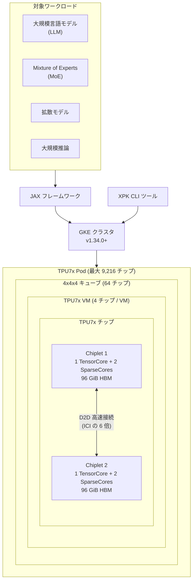

# Cloud TPU: TPU7x (Ironwood) が一般提供開始

**リリース日**: 2026-03-31

**サービス**: Cloud TPU

**機能**: TPU7x (Ironwood) 一般提供 (GA)

**ステータス**: GA (Generally Available)

📊 [このアップデートのインフォグラフィックを見る](https://takech9203.github.io/google-cloud-news-summary/20260331-cloud-tpu-tpu7x-ironwood-ga.html)

## 概要

Google Cloud は、第 7 世代 TPU である Ironwood ファミリーの最初のリリースとなる TPU7x の一般提供 (GA) を発表した。TPU7x は大規模な AI トレーニングと推論を目的に設計されており、大規模言語モデル (LLM)、Mixture of Experts (MoE)、拡散モデルなどの高負荷ワークロードに対して優れたパフォーマンスとコスト効率を提供する。

TPU7x は 1 Pod あたり最大 9,216 チップを搭載し、チップあたり BF16 で 2,307 TFLOPS、FP8 で 4,614 TFLOPS のピーク演算性能を実現する。これは前世代の v6e (Trillium) と比較して BF16 で約 2.5 倍、FP8 で約 5 倍のピーク性能向上となる。また、チップあたり 192 GiB の HBM 容量と 7,380 GBps の HBM 帯域幅を備え、メモリ集約型のワークロードにも対応する。

TPU7x の利用には Google Kubernetes Engine (GKE) が必須であり、JAX フレームワークをサポートする。TensorFlow はサポートされていない点に注意が必要である。

**アップデート前の課題**

- 前世代の v6e (Trillium) はチップあたり 32 GiB の HBM 容量しかなく、大規模モデルのパラメータ保持に制約があった
- v6e の Pod あたり最大チップ数は 256 で、超大規模なトレーニングジョブでのスケーリングに限界があった
- v6e のピーク演算性能は BF16 で 918 TFLOPS であり、最新の大規模モデルのトレーニング・推論には更なる性能が求められていた

**アップデート後の改善**

- チップあたりの HBM 容量が 192 GiB に拡大 (v6e の 6 倍)、大規模モデルのパラメータを効率的に保持可能
- Pod あたり最大 9,216 チップまでスケールアップ可能 (v6e の 36 倍) となり、超大規模な分散トレーニングに対応
- BF16 で 2,307 TFLOPS、FP8 で 4,614 TFLOPS のピーク演算性能を実現し、トレーニングおよび推論の大幅な高速化が可能
- デュアルチップレットアーキテクチャにより製造コスト効率が向上

## アーキテクチャ図



TPU7x はデュアルチップレットアーキテクチャを採用し、各チップは 2 つのチップレットで構成される。GKE を通じてプロビジョニングされ、JAX フレームワークで大規模 AI ワークロードを実行する。

## サービスアップデートの詳細

### 主要機能

1. **デュアルチップレットアーキテクチャ**
   - 各チップは 2 つの独立したチップレットで構成され、それぞれ 1 TensorCore、2 SparseCores、96 GiB の HBM を搭載
   - チップレット間はダイ・ツー・ダイ (D2D) インターフェースで接続され、1D ICI リンクの 6 倍の速度で通信
   - JAX ではチップごとに 2 つのデバイスとして認識され、既存ソフトウェアモデルの最小限の変更で再利用可能

2. **大規模スケーリング**
   - 3D トーラスインターコネクトトポロジにより最大 9,216 チップまでスケール
   - 4x4x4 キューブ単位でスライスを構成 (最小 2x2x1 の 4 チップから最大 8x16x16 の 2,048 チップまで)
   - 軸ごとに双方向 200 GBps の帯域幅でチップ間通信

3. **マルチティアメモリシステム**
   - HBM: チップあたり 192 GiB、約 7.37 TB/s の帯域幅
   - VMEM (Vector Memory): 高速オンチップ SRAM、MXU への高帯域幅アクセス
   - ホストメモリ: PCIe 経由で CPU ホストに接続、アクティベーションやオプティマイザステートのオフロードに活用

4. **TPU Cluster Director 対応**
   - All Capacity モード予約により、予約容量への完全なアクセスとハードウェアトポロジ・稼働状況・ヘルスステータスの可視化を提供

## 技術仕様

### 世代間比較

| 仕様 | v5p | v6e (Trillium) | TPU7x (Ironwood) |
|------|-----|-----------------|-------------------|
| Pod あたりチップ数 | 8,960 | 256 | 9,216 |
| ピーク演算性能 (BF16) | 459 TFLOPS | 918 TFLOPS | 2,307 TFLOPS |
| ピーク演算性能 (FP8) | 459 TFLOPS | 918 TFLOPS | 4,614 TFLOPS |
| HBM 容量 (チップあたり) | 95 GiB | 32 GiB | 192 GiB |
| HBM 帯域幅 (チップあたり) | 2,765 GBps | 1,638 GBps | 7,380 GBps |
| TensorCore 数 (チップあたり) | 2 | 1 | 2 |
| SparseCore 数 (チップあたり) | 4 | 2 | 4 |
| ICI 帯域幅 (双方向、チップあたり) | 1,200 GBps | 800 GBps | 1,200 GBps |
| DCN 帯域幅 (チップあたり) | 50 Gbps | 100 Gbps | 100 Gbps |

### VM 仕様 (4 チップ VM)

| 項目 | 詳細 |
|------|------|
| マシンタイプ | tpu7x-standard-4t |
| vCPU 数 | 224 |
| RAM | 960 GB |
| NUMA ノード数 | 2 |
| チップ数 | 4 |
| ブートディスク | Hyperdisk Balanced (デフォルト) |
| 追加ディスク | Hyperdisk Balanced、Hyperdisk ML |

### サポートされるトポロジ

| トポロジ | チップ数 | ホスト数 | 構成 |
|----------|----------|----------|------|
| 2x2x1 | 4 | 1 | シングルホスト |
| 2x2x2 | 8 | 2 | マルチホスト |
| 2x2x4 | 16 | 4 | マルチホスト |
| 2x4x4 | 32 | 8 | マルチホスト |
| 4x4x4 | 64 | 16 | マルチホスト |
| 4x4x8 | 128 | 32 | マルチホスト |
| 4x8x8 | 256 | 64 | マルチホスト |
| 8x8x8 | 512 | 128 | マルチホスト |
| 8x8x16 | 1,024 | 256 | マルチホスト |
| 8x16x16 | 2,048 | 512 | マルチホスト |

## 設定方法

### 前提条件

1. GKE クラスタが必要 (Standard: v1.34.0-gke.2201000 以降、Autopilot: v1.34.1-gke.3084001 以降)
2. Rapid、No channel、または Regular リリースチャンネルでクラスタを作成すること
3. TPU7x へのアクセスにはアカウントチームへの連絡が必要
4. JAX フレームワークの使用 (TensorFlow は非サポート)

### 手順

#### ステップ 1: GKE クラスタの作成

```bash
# GKE クラスタを作成 (Rapid リリースチャンネル)
gcloud container clusters create tpu7x-cluster \
  --zone=ZONE \
  --release-channel=rapid \
  --project=PROJECT_ID
```

#### ステップ 2: ワークロードポリシーの作成 (マルチホストの場合)

```bash
# マルチホストスライス用のワークロードポリシーを作成
gcloud compute resource-policies create workload-policy POLICY_NAME \
  --type=HIGH_THROUGHPUT \
  --accelerator-topology=4x4x4 \
  --project=PROJECT_ID \
  --region=REGION
```

#### ステップ 3: ワークロードのデプロイ

```yaml
# Kubernetes マニフェスト例
apiVersion: apps/v1
kind: Deployment
metadata:
  name: tpu7x-workload
spec:
  replicas: 1
  template:
    spec:
      nodeSelector:
        cloud.google.com/gke-tpu-accelerator: tpu7x-standard-4t
        cloud.google.com/gke-tpu-topology: 2x2x1
      containers:
      - name: tpu-job
        image: us-docker.pkg.dev/cloud-tpu-images/jax-ai-image/tpu:latest
        command:
        - python
        - -c
        - "import jax; print('Total TPU chips:', jax.device_count())"
        resources:
          requests:
            google.com/tpu: 4
          limits:
            google.com/tpu: 4
```

#### ステップ 4: XPK を使用した簡易デプロイ (オプション)

```bash
# XPK を使用してワークロードを作成
xpk workload create \
  --cluster=CLUSTER_NAME \
  --project=PROJECT_ID \
  --zone=ZONE \
  --tpu-type=tpu7x-16 \
  --num-slices=1 \
  --docker-image=us-docker.pkg.dev/cloud-tpu-images/jax-ai-image/tpu:latest \
  --workload=my-workload \
  --command="python -c 'import jax; print(\"TPU cores:\", jax.device_count())'"
```

## メリット

### ビジネス面

- **大規模モデルのトレーニングコスト削減**: v6e 比で約 2.5 倍 (BF16) のピーク演算性能により、同じタスクをより短時間で完了し、コストを削減可能
- **予約オプションの柔軟性**: カレンダーモード (最大 90 日) や CUD (1〜3 年) による予約で、オンデマンド価格から最大 55% の割引を適用可能
- **スケーラビリティ**: 4 チップの小規模構成から 9,216 チップの超大規模構成まで柔軟にスケール

### 技術面

- **デュアルチップレットアーキテクチャ**: 製造効率の向上と既存ソフトウェアの最小限の変更での移行を両立
- **大容量 HBM**: チップあたり 192 GiB の HBM により、大規模モデルのパラメータを効率的に保持
- **高帯域幅メモリアクセス**: 7.37 TB/s の HBM 帯域幅により、メモリバウンドな処理のボトルネックを軽減
- **NUMA 最適化**: GKE のマルチコンテナセットアップにより、NUMA ノード単位でリソースをバインドしてパフォーマンスを最適化

## デメリット・制約事項

### 制限事項

- GKE 経由でのみ利用可能 (Cloud TPU API 単体での利用不可)
- JAX フレームワークのみサポート (TensorFlow は非サポート)
- アクセスにはアカウントチームへの連絡が必要 (セルフサービスでの即時利用不可)
- GKE クラスタは Rapid、No channel、または Regular リリースチャンネルで作成する必要がある

### 考慮すべき点

- デュアルチップレットアーキテクチャは従来の MegaCore と異なるプログラミングモデルのため、カスタム Pallas カーネルの最適化が必要な場合がある
- VMEM バッファサイズのチューニングがカスタムカーネルのパフォーマンスに大きく影響する
- クロス NUMA アクセスによるパフォーマンス低下を避けるため、マルチコンテナセットアップの検討が推奨される

## ユースケース

### ユースケース 1: 大規模言語モデル (LLM) の事前トレーニング

**シナリオ**: 数千億パラメータ規模の LLM を事前トレーニングする場合、大量の計算リソースと大容量メモリが必要。TPU7x の 9,216 チップ Pod と 192 GiB/チップの HBM を活用し、MaxText フレームワークで効率的な分散トレーニングを実施。

**実装例**:
```bash
# MaxText + XPK を使用した LLM トレーニング
xpk workload create \
  --cluster=llm-cluster \
  --tpu-type=tpu7x-256 \
  --num-slices=4 \
  --docker-image=us-docker.pkg.dev/cloud-tpu-images/jax-ai-image/tpu:latest \
  --workload=llm-pretraining \
  --command="python MaxText/train.py MaxText/configs/base.yml ..."
```

**効果**: v6e と比較してトレーニングスループットの大幅な向上と、大規模バッチサイズの採用によるトレーニング品質の改善が期待される。

### ユースケース 2: MoE モデルの推論サービング

**シナリオ**: Mixture of Experts モデルのデコード重視の推論ワークロードにおいて、TPU7x の SparseCore (チップあたり 4 基) と高帯域幅 HBM を活用し、低レイテンシの推論サービスを構築。

**効果**: SparseCore によるスパース演算の効率化と、大容量 HBM によるモデルパラメータのキャッシュにより、推論レイテンシの低減とスループットの向上が見込まれる。

## 料金

TPU7x の料金は公式料金ページを参照のこと。予約オプションにより以下の割引が利用可能:

| 予約タイプ | 期間 | 割引率 (オンデマンド比) |
|-----------|------|------------------------|
| カレンダーモード予約 | 1〜90 日 | 最大 30% 割引 |
| CUD (コミット利用割引) | 1〜3 年 | 30%〜55% 割引 |

詳細な料金情報は [Cloud TPU 料金ページ](https://cloud.google.com/tpu/pricing) を参照。

## 利用可能リージョン

TPU7x の利用可能リージョンについては、アカウントチームに問い合わせるか、[GKE での TPU の可用性](https://cloud.google.com/kubernetes-engine/docs/concepts/plan-tpus#availability) を参照。

## 関連サービス・機能

- **Google Kubernetes Engine (GKE)**: TPU7x のプロビジョニングと管理に必須。Standard および Autopilot クラスタに対応
- **TPU Cluster Director**: All Capacity モード予約による容量管理とハードウェアヘルス可視化を提供
- **XPK (Accelerated Processing Kit)**: GKE クラスタの作成とワークロード実行を簡素化する CLI ツール
- **Hyperdisk**: TPU7x VM のブートディスクおよび追加ストレージとして Hyperdisk Balanced / Hyperdisk ML をサポート
- **Cloud Monitoring**: TPU ランタイムメトリクスのエクスポートとモニタリング
- **JAX**: TPU7x で唯一サポートされる ML フレームワーク

## 参考リンク

- 📊 [インフォグラフィック](https://takech9203.github.io/google-cloud-news-summary/20260331-cloud-tpu-tpu7x-ironwood-ga.html)
- [公式リリースノート](https://cloud.google.com/release-notes#March_31_2026)
- [TPU7x (Ironwood) ドキュメント](https://cloud.google.com/tpu/docs/tpu7x)
- [Ironwood パフォーマンス最適化](https://cloud.google.com/tpu/docs/ironwood-performance)
- [TPU7x でのモデルトレーニング](https://cloud.google.com/tpu/docs/tpu7x-training)
- [GKE での TPU 利用](https://cloud.google.com/kubernetes-engine/docs/concepts/tpus)
- [GKE での Ironwood (TPU7x)](https://cloud.google.com/kubernetes-engine/docs/concepts/tpu-ironwood)
- [Cloud TPU 料金](https://cloud.google.com/tpu/pricing)
- [Cloud TPU クォータ](https://cloud.google.com/tpu/docs/quota)
- [TPU 予約について](https://cloud.google.com/tpu/docs/about-tpu-reservations)

## まとめ

TPU7x (Ironwood) の GA は、Google Cloud の AI インフラストラクチャにおける大きなマイルストーンである。チップあたり 2,307 TFLOPS (BF16) のピーク演算性能と 192 GiB の HBM 容量は、前世代からの大幅な性能向上を意味し、LLM や MoE モデルの大規模トレーニング・推論ワークロードに最適なプラットフォームを提供する。GKE + JAX 環境で大規模 AI ワークロードを計画しているチームは、TPU7x の採用を検討すべきである。ただし、TensorFlow 非サポートやアカウントチーム経由でのアクセスが必要な点は事前に考慮が必要である。

---

**タグ**: #CloudTPU #TPU7x #Ironwood #AI #MachineLearning #LLM #GKE #GA #Infrastructure
