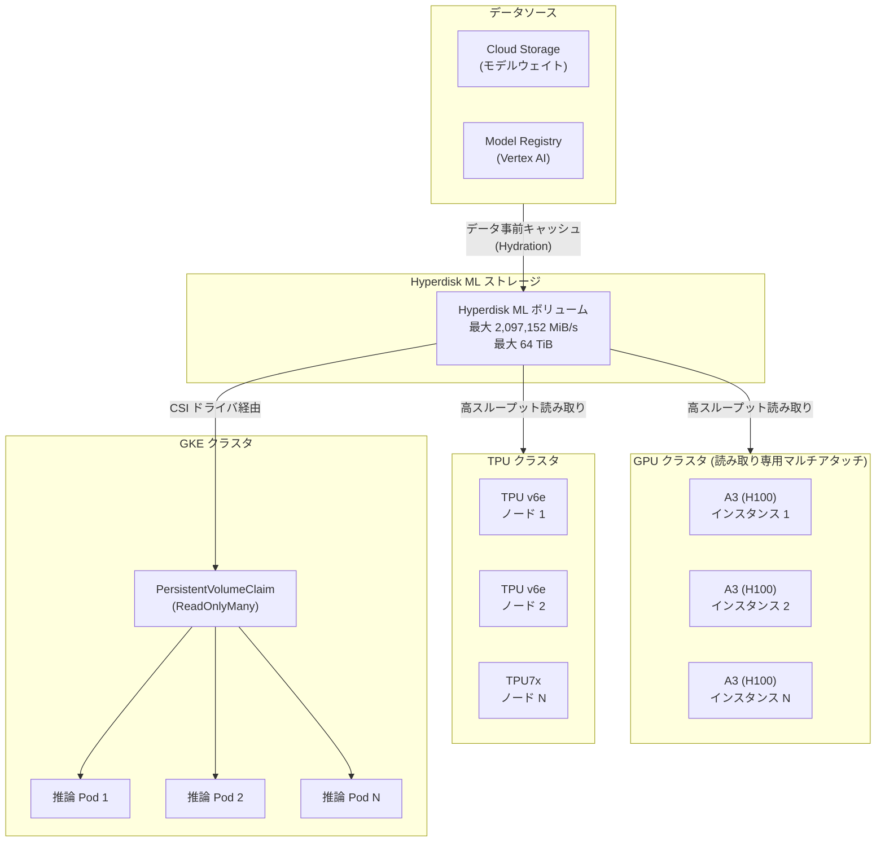

# Compute Engine: Hyperdisk ML の最大スループットが約 75% 増加し 2,097,152 MiB/s に

**リリース日**: 2026-03-31

**サービス**: Compute Engine

**機能**: Hyperdisk ML 最大スループットの引き上げ

**ステータス**: GA (一般提供)

[このアップデートのインフォグラフィックを見る](https://takech9203.github.io/google-cloud-news-summary/20260331-compute-engine-hyperdisk-ml-throughput.html)

## 概要

Google Cloud は Hyperdisk ML ディスクの最大スループットを、従来の 1,200,000 MiB/s から 2,097,152 MiB/s へと大幅に引き上げました。これは約 75% の性能向上に相当し、機械学習ワークロードやイミュータブル(不変)データセットに対する高い読み取りスループットを必要とするワークロードに大きな恩恵をもたらします。

Hyperdisk ML は Google Cloud の Hyperdisk ファミリーの中で最も高いスループットを提供するディスクタイプであり、大規模な推論、トレーニング、HPC ワークロード向けに設計されています。単一の Hyperdisk ML ボリュームを複数のコンピューティングインスタンスに読み取り専用モードでアタッチできるため、モデルウェイトの読み込みをモデルレジストリから直接読み込む場合と比較して最大 11.9 倍高速化できます。今回のスループット上限の引き上げにより、さらに大規模なモデルや高並列なワークロードへの対応が可能になりました。

この機能は GA (一般提供) として利用可能であり、本番環境での使用が推奨されます。A2、A3 (H100)、A4、A4X、G2、G4 シリーズの GPU インスタンスに加え、TPU v5e、v5p、v6e、TPU7x (Ironwood) にも対応しています。

**アップデート前の課題**

従来の Hyperdisk ML には、大規模 AI/ML ワークロードにおいて以下のような制約がありました。

- 最大スループットが 1,200,000 MiB/s (約 1.17 TiB/s) に制限されており、超大規模モデル (数百 GB 以上のモデルウェイト) の読み込みに時間がかかっていた
- 数千ノード規模の推論クラスタでは、ディスクあたりのスループット上限がボトルネックとなり、ノードあたりの読み込み速度を十分に確保できないケースがあった
- 大規模言語モデル (LLM) のサイズが急速に増大する中で、ストレージスループットの上限が AI インフラ全体のスケーラビリティの制約要因となっていた

**アップデート後の改善**

今回のスループット上限引き上げにより、以下の改善が実現しました。

- 最大スループットが 2,097,152 MiB/s (約 2.0 TiB/s) に拡大し、超大規模モデルの読み込み時間が大幅に短縮可能に
- 高並列な推論環境において、より多くのノードに対して十分なスループットを供給可能に
- GPU/TPU アクセラレータのアイドル時間がさらに削減され、コンピューティングコストの最適化が可能に

## アーキテクチャ図



Hyperdisk ML を中心とした ML ワークロードアーキテクチャを示しています。Cloud Storage やモデルレジストリからデータを事前キャッシュし、GPU/TPU クラスタや GKE の推論 Pod から読み取り専用の高スループットアクセスを提供します。

## サービスアップデートの詳細

### 主要機能

1. **最大スループットの引き上げ**
   - 単一ボリュームあたりの最大スループットが 1,200,000 MiB/s から 2,097,152 MiB/s に約 75% 増加
   - IOPS も連動して増加 (16 IOPS/MiB/s) し、最大 33,554,432 IOPS まで対応可能に

2. **読み取り専用マルチアタッチ**
   - 単一の Hyperdisk ML ボリュームを最大 2,500 インスタンスに同時アタッチ可能 (256 GiB 以下のボリュームの場合)
   - 複数 VM 間でのディスク共有に追加料金なし
   - モデルレジストリからの直接読み込みと比較して最大 11.9 倍の高速化

3. **幅広いマシンシリーズサポート**
   - GPU: A2、A3 (H100)、A4、A4X、A4X Max、G2、G4
   - 汎用: C3、C3D、C4A
   - TPU: v5e、v5p、v6e、TPU7x (Ironwood)

## 技術仕様

### スループット性能比較

| 項目 | アップデート前 | アップデート後 |
|------|---------------|---------------|
| 最大スループット | 1,200,000 MiB/s | 2,097,152 MiB/s |
| 増加率 | - | 約 75% |
| 最大 IOPS (推定) | 19,200,000 | 33,554,432 |
| IOPS/MiB/s | 16 | 16 (変更なし) |

### ボリュームサイズとスループットの関係

| ボリュームサイズ | 最小スループット | 最大スループット |
|-----------------|-----------------|-----------------|
| 4 GiB | 400 MiB/s | 6,400 MiB/s |
| 100 GiB | 400 MiB/s | 160,000 MiB/s |
| 500 GiB | 400 MiB/s | 800,000 MiB/s |
| 1,000 GiB (1 TiB) | 400 MiB/s | 2,097,152 MiB/s |
| 64,000 GiB (64 TiB) | 7,680 MiB/s | 2,097,152 MiB/s |

### マルチアタッチ時の最大インスタンス数

| ボリューム容量 | 最大アタッチ数 |
|---------------|---------------|
| 256 GiB 以下 | 2,500 インスタンス |
| 257 GiB - 1 TiB | 600 インスタンス |
| 1.001 TiB - 2 TiB | 300 インスタンス |
| 2.001 TiB - 16 TiB | 128 インスタンス |
| 16.001 TiB 以上 | 30 インスタンス |

## 設定方法

### 前提条件

1. Google Cloud プロジェクトで Compute Engine API が有効化されていること
2. サポートされているマシンシリーズ (A2、A3、A4、G2、G4、C3、TPU 等) を使用すること
3. 4 世代マシン (C4、G4) を使用する場合、2026 年 2 月 4 日以降に作成されたボリュームであること

### 手順

#### ステップ 1: Hyperdisk ML ボリュームの作成

```bash
gcloud compute disks create my-hyperdisk-ml \
    --type=hyperdisk-ml \
    --size=1000 \
    --provisioned-throughput=2097152 \
    --zone=us-central1-a
```

最大スループット 2,097,152 MiB/s を指定して Hyperdisk ML ボリュームを作成します。ボリュームサイズが 1,000 GiB 以上であれば最大値を指定可能です。

#### ステップ 2: インスタンスへのアタッチ (読み取り専用)

```bash
gcloud compute instances attach-disk my-instance \
    --disk=my-hyperdisk-ml \
    --mode=ro \
    --zone=us-central1-a
```

読み取り専用モード (`ro`) で複数のインスタンスにアタッチすることで、高スループットの共有アクセスを実現します。

#### ステップ 3: GKE での利用 (StorageClass の作成)

```yaml
apiVersion: storage.k8s.io/v1
kind: StorageClass
metadata:
  name: hyperdisk-ml-sc
provisioner: pd.csi.storage.gke.io
volumeBindingMode: WaitForFirstConsumer
parameters:
  type: hyperdisk-ml
  provisioned-throughput-on-create: "2097152Mi"
```

GKE 環境では StorageClass を作成し、PersistentVolumeClaim を通じて Hyperdisk ML を動的にプロビジョニングできます。

## メリット

### ビジネス面

- **コスト効率の向上**: GPU/TPU アクセラレータのアイドル時間が削減されることで、高価なコンピューティングリソースの利用効率が向上し、全体的なトレーニング・推論コストを削減可能
- **大規模 AI モデルへの対応**: 数百 GB 規模のモデルウェイト読み込みが高速化されるため、大規模言語モデル (LLM) や大規模ビジョンモデルの本番運用がより実用的に
- **Time-to-Market の短縮**: モデルデプロイ時間が短縮され、新しいモデルバージョンの迅速なロールアウトが可能に

### 技術面

- **約 75% のスループット向上**: 単一ボリュームで 2,097,152 MiB/s (約 2.0 TiB/s) の読み取りスループットを実現
- **スケーラブルな共有ストレージ**: 最大 2,500 ノードへの同時マルチアタッチにより、大規模推論クラスタのストレージアーキテクチャを簡素化
- **GKE ネイティブ統合**: CSI ドライバによる自動プロビジョニングと PersistentVolumeClaim によるシームレスな連携

## デメリット・制約事項

### 制限事項

- Hyperdisk ML は読み取り専用モードでのみマルチアタッチ可能であり、マルチライターモードは非対応
- 読み取り専用モードを有効化すると、書き込みモードに戻すことは不可
- ブートディスクとしては使用不可
- 2026 年 2 月 4 日以前に作成されたボリュームは、第 4 世代マシン (C4、G4) にアタッチ不可 (スナップショットからの再作成が必要)
- ボリュームのスループット変更は 6 時間に 1 回、サイズ変更は 4 時間に 1 回のみ

### 考慮すべき点

- プロビジョニングされたスループットに対して課金されるため、実際のワークロードに見合ったスループット値を設定することが重要
- 単一インスタンスではマシンタイプごとのスループット上限があるため (例: a3-ultragpu-8 で 4,000 MiB/s)、最大スループットを活用するには多数のインスタンスへのマルチアタッチが必要
- リソースベースの確約利用割引 (CUD) や継続利用割引 (SUD) は Hyperdisk に適用されない

## ユースケース

### ユースケース 1: 大規模 LLM の高速推論デプロイ

**シナリオ**: 数百 GB 規模の大規模言語モデル (例: 70B パラメータ以上) を数百台の GPU インスタンスで推論する環境で、モデルウェイトの読み込み時間を最小化したい。

**実装例**:
```bash
# 1. Cloud Storage からモデルウェイトを Hyperdisk ML に事前キャッシュ
gcloud compute disks create llm-weights-disk \
    --type=hyperdisk-ml \
    --size=2000 \
    --provisioned-throughput=2097152 \
    --zone=us-central1-a

# 2. 推論インスタンス群に読み取り専用でアタッチ
for i in $(seq 1 100); do
  gcloud compute instances attach-disk inference-node-$i \
      --disk=llm-weights-disk \
      --mode=ro \
      --zone=us-central1-a
done
```

**効果**: 従来比で約 75% 高いスループットにより、モデル読み込み時間が大幅に短縮。GPU アイドル時間の削減により推論コストを最適化。

### ユースケース 2: GKE 上での ML 推論パイプラインの高速化

**シナリオ**: GKE 上で Kubernetes ネイティブの ML 推論パイプラインを運用しており、Pod のスケールアウト時にモデルウェイトの読み込みがボトルネックとなっている。

**効果**: Hyperdisk ML の ReadOnlyMany モードと GKE CSI ドライバの組み合わせにより、Pod のスケールアウト時にモデルウェイトを事前キャッシュ済みのボリュームから高速に読み込み可能。Pod の起動時間が短縮され、オートスケーリングの応答性が向上。

### ユースケース 3: TPU を用いた大規模トレーニングデータの供給

**シナリオ**: TPU v6e や TPU7x (Ironwood) を用いた大規模トレーニングで、イミュータブルなデータセットを多数の TPU ノードに高速に供給する必要がある。

**効果**: 2,097,152 MiB/s の最大スループットにより、大量の TPU ノードに対してデータ供給のボトルネックを解消。TPU の計算能力をフルに活用可能。

## 料金

Hyperdisk ML の料金は、プロビジョニングされたディスクサイズとスループットに基づいて課金されます。複数の VM に同一ボリュームをアタッチする場合でも追加料金は発生しません。ボリュームが未アタッチの状態やインスタンスが停止中でも課金が継続される点に注意が必要です。

### 料金体系

| 課金項目 | 説明 |
|---------|------|
| ディスク容量 | GiB あたりの月額料金 |
| プロビジョニング済みスループット | MiB/s あたりの月額料金 |
| マルチアタッチ | 追加料金なし |

詳細な料金については [Disk pricing](https://cloud.google.com/compute/disks-image-pricing#disk) を参照してください。リソースベースの確約利用割引 (CUD) や継続利用割引 (SUD) は適用されません。

## 利用可能リージョン

Hyperdisk ML は、サポートされているマシンシリーズが利用可能なリージョンで使用できます。A2、A3、A4、G2、G4 シリーズの GPU インスタンスおよび TPU v5e、v5p、v6e、TPU7x が利用可能なリージョンが対象です。具体的なリージョンの可用性については、各マシンシリーズのドキュメントを参照してください。

## 関連サービス・機能

- **Google Kubernetes Engine (GKE)**: CSI ドライバを通じて Hyperdisk ML を PersistentVolume として動的プロビジョニング可能。ReadOnlyMany モードでの ML ワークロード向けデータ読み込み高速化に対応
- **Vertex AI**: モデルレジストリからのモデルウェイトを Hyperdisk ML に事前キャッシュすることで、Vertex AI Prediction でのモデルデプロイ時間を短縮
- **Cloud TPU**: TPU v5e、v5p、v6e、TPU7x (Ironwood) で Hyperdisk ML をサポート。大規模トレーニングおよび推論ワークロードへの高スループットデータ供給を実現
- **Cloud Storage**: モデルウェイトやデータセットの永続保存先として使用し、Hyperdisk ML へのデータ事前キャッシュ (Hydration) のソースとして連携

## 参考リンク

- [インフォグラフィック](https://takech9203.github.io/google-cloud-news-summary/20260331-compute-engine-hyperdisk-ml-throughput.html)
- [公式リリースノート](https://docs.cloud.google.com/release-notes#March_31_2026)
- [Hyperdisk ML ドキュメント](https://cloud.google.com/compute/docs/disks/hd-types/hyperdisk-ml)
- [GKE での Hyperdisk ML 利用方法](https://cloud.google.com/kubernetes-engine/docs/how-to/persistent-volumes/hyperdisk-ml)
- [料金ページ](https://cloud.google.com/compute/disks-image-pricing#disk)

## まとめ

Hyperdisk ML の最大スループットが 2,097,152 MiB/s に引き上げられたことで、大規模 AI/ML ワークロードにおけるデータ読み込み性能が約 75% 向上しました。特に大規模 LLM の推論デプロイや TPU を活用したトレーニングワークロードにおいて、アクセラレータのアイドル時間削減とコスト最適化に大きく貢献します。GPU/TPU を活用した ML ワークロードを運用している場合は、既存の Hyperdisk ML ボリュームのスループット設定を見直し、新しい上限値の活用を検討することを推奨します。

---

**タグ**: #ComputeEngine #HyperdiskML #MachineLearning #GA #スループット向上 #GPU #TPU #GKE #VertexAI #ストレージ #HPC
