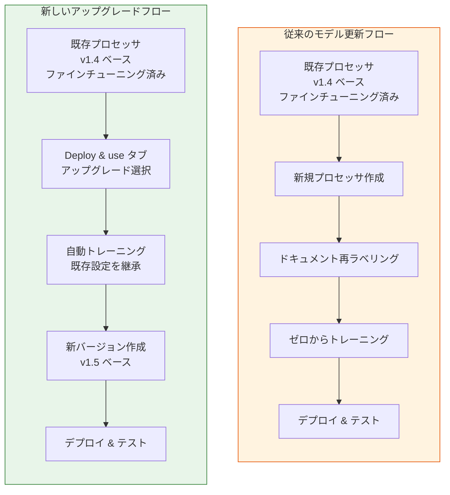

# Document AI: ファインチューニング済みカスタムエクストラクタのアップグレード機能が Preview 提供開始

**リリース日**: 2026-03-31

**サービス**: Document AI

**機能**: ファインチューニング済みカスタムエクストラクタプロセッサバージョンのアップグレード

**ステータス**: Preview

📊 [このアップデートのインフォグラフィックを見る](https://takech9203.github.io/google-cloud-news-summary/20260331-document-ai-custom-extractor-upgrade.html)

## 概要

Document AI のカスタムエクストラクタにおいて、ファインチューニング済みプロセッサバージョンを新しいベースバージョンにアップグレードする機能が Preview として提供開始されました。この機能により、既存のファインチューニング設定 (トレーニングデータ、パラメータ、スキーマ構成) を保持したまま、より新しい基盤モデルバージョンに移行できるようになります。

現時点では、`pretrained-foundation-model-v1.4-2025-02-05` から `pretrained-foundation-model-v1.5-2025-05-05` へのアップグレードがサポートされています。操作は Google Cloud コンソールの「Deploy & use」タブから UI 経由で実行でき、アップグレード後は新しいベースバージョンに基づくプロセッサバージョンが自動的にトレーニングされます。

本機能は、Document AI のカスタムエクストラクタを本番環境で運用しており、基盤モデルの進化による精度向上やレイテンシ改善の恩恵を受けたい組織にとって特に有用です。従来のように再ラベリングや再トレーニングをゼロから行う必要がなくなり、モデル更新のコストと工数を大幅に削減できます。

**アップデート前の課題**

- ファインチューニング済みプロセッサを新しいベースモデルに移行するには、新しいプロセッサを作成し、ドキュメントの再ラベリングと再トレーニングを最初からやり直す必要があった
- ベースモデルのバージョンアップによる品質向上を享受するために、多大な手動作業と時間が必要だった
- 既存のファインチューニング設定 (スキーマ、プロパティ記述、トレーニングパラメータ) を新しいバージョンに引き継ぐ仕組みがなかった

**アップデート後の改善**

- 既存のファインチューニング設定を維持したまま、新しいベースバージョンへのワンクリックアップグレードが可能になった
- ドキュメントの再ラベリングが不要になり、モデル更新の工数が大幅に削減された
- v1.5 基盤モデルの改善 (精度向上、クロスページ3階層ネスティング対応など) を既存のカスタムモデルに容易に適用できるようになった

## アーキテクチャ図



従来は新しいベースモデルへの移行に複数の手動ステップが必要でしたが、新しいアップグレード機能により、UI から簡単な操作で既存設定を引き継いだまま新バージョンを作成できるようになりました。

## サービスアップデートの詳細

### 主要機能

1. **ファインチューニング済みバージョンのアップグレード**
   - 既存のファインチューニング済みプロセッサバージョンを選択し、新しいベースバージョンでアップグレード可能
   - トレーニングデータ、スキーマ設定、プロパティ記述などの構成を自動的に引き継ぎ
   - アップグレード後、新しいベースバージョンに基づいて自動的にトレーニングが実行される

2. **Google Cloud コンソール UI からの操作**
   - プロセッサの「Deploy & use」タブからアップグレード対象のバージョンを選択
   - アップグレードボタンを押して新バージョン名とベースバージョンを指定
   - トレーニング完了後、新バージョンをデプロイして使用可能

3. **v1.5 基盤モデルの改善点の活用**
   - `pretrained-foundation-model-v1.5-2025-05-05` はクロスページでの3階層ネスティングをサポート
   - 品質向上した OCR エンジンと抽出モデルを搭載
   - 複雑なドキュメント構造のより正確な解析が可能

## 技術仕様

### サポートされるアップグレードパス

| 項目 | 詳細 |
|------|------|
| アップグレード元 | `pretrained-foundation-model-v1.4-2025-02-05` |
| アップグレード先 | `pretrained-foundation-model-v1.5-2025-05-05` |
| API バージョン | v1beta3 |
| ステータス | Preview |
| 操作方法 | Google Cloud コンソール UI (Deploy & use タブ) |

### ファインチューニングパラメータ

アップグレード時に引き継がれるファインチューニングの主要パラメータは以下の通りです。

| パラメータ | 範囲 | 説明 |
|-----------|------|------|
| トレーニングステップ数 | 100 - 400 | バッチデータに対して重みが最適化される頻度 |
| 学習率乗数 | 0.1 - 10 | モデルパラメータの最適化速度を制御 |
| スキーマ定義 | - | エンティティ名、プロパティ記述、ネスティング構造 |
| トレーニングデータセット | - | ラベル付きドキュメントのトレーニング/テスト分割 |

## 設定方法

### 前提条件

1. Document AI が有効化された Google Cloud プロジェクト
2. `pretrained-foundation-model-v1.4-2025-02-05` ベースのファインチューニング済みカスタムエクストラクタプロセッサ
3. 必要な IAM ロール: `roles/documentai.admin` および `roles/storage.admin`

### 手順

#### ステップ 1: 対象プロセッサの選択

Google Cloud コンソールで Document AI セクションに移動し、アップグレード対象のカスタムエクストラクタプロセッサを選択します。

```
Google Cloud コンソール > Document AI > プロセッサ > [対象プロセッサ]
```

#### ステップ 2: アップグレードの実行

1. 「Deploy & use」タブを開く
2. アップグレード対象のファインチューニング済みバージョンのチェックボックスを選択
3. 「Upgrade」ボタンをクリック
4. 新しいバージョン名を入力
5. ベースバージョンとして `pretrained-foundation-model-v1.5-2025-05-05` を選択
6. 「Upgrade」をクリックしてトレーニングを開始

#### ステップ 3: デプロイとテスト

```
トレーニング完了後:
1. 「Manage versions」タブで新バージョンのステータスが「trained」になったことを確認
2. 「Deploy version」を選択してデプロイ
3. 「Evaluate & test」タブで F1 スコア、精度、再現率を確認
4. 問題なければ「Set as default」でデフォルトバージョンに設定
```

## メリット

### ビジネス面

- **モデル更新コストの削減**: 再ラベリングや再トレーニングの工数が不要になり、ベースモデル更新にかかるコストを大幅に削減
- **ダウンタイムの最小化**: 既存バージョンを稼働させたまま新バージョンを並行してトレーニング・テストでき、サービス中断なくモデルを更新可能
- **最新モデルの迅速な活用**: 基盤モデルの改善を素早くプロダクション環境に反映でき、抽出精度の向上による業務効率化を早期に実現

### 技術面

- **設定の一貫性**: スキーマ、プロパティ記述、トレーニングパラメータが自動的に引き継がれ、構成のドリフトを防止
- **v1.5 モデルの改善**: クロスページ3階層ネスティング対応、OCR エンジンの改善による抽出品質の向上
- **運用の簡素化**: コンソール UI からのワンクリック操作で複雑なモデル移行プロセスを自動化

## デメリット・制約事項

### 制限事項

- 現時点では v1.4 から v1.5 へのアップグレードパスのみサポート (他のバージョン間のアップグレードは未対応)
- API からのアップグレード操作は未サポートで、Google Cloud コンソール UI からのみ実行可能
- Preview ステータスのため、SLA の対象外であり、本番環境での使用は自己責任
- v1beta3 API での提供のため、API インターフェースが将来変更される可能性あり

### 考慮すべき点

- アップグレード後のモデル性能が既存バージョンと異なる場合があるため、本番デプロイ前に十分な評価・テストが必要
- トレーニングデータの品質がアップグレード後の性能に直接影響するため、ラベルの正確性を事前に確認することを推奨
- アップグレードによって生成された新バージョンには追加のホスティング・予測コストが発生する可能性がある

## ユースケース

### ユースケース 1: 請求書処理の精度向上

**シナリオ**: 金融機関が v1.4 ベースのファインチューニング済みカスタムエクストラクタを使用して請求書からの情報抽出を行っている。v1.5 基盤モデルの精度向上を活用したいが、数千件のラベル付きドキュメントを再処理する工数がない。

**効果**: アップグレード機能を使用して既存の設定を引き継いだまま v1.5 ベースの新バージョンを作成。再ラベリングなしで最新モデルの恩恵を受け、抽出精度が向上する。

### ユースケース 2: 複雑な契約書のクロスページ抽出

**シナリオ**: 法務部門が契約書から条項や当事者情報を抽出するカスタムエクストラクタを運用している。v1.5 で追加されたクロスページ3階層ネスティング機能を活用し、ページをまたぐ複雑なネスト構造の抽出精度を改善したい。

**効果**: アップグレードにより v1.5 のクロスページネスティング機能が利用可能になり、複数ページにまたがる契約条項の親子関係をより正確に抽出できるようになる。

### ユースケース 3: 多言語ドキュメント処理の改善

**シナリオ**: グローバル企業が複数言語の注文書を処理するカスタムエクストラクタを運用。基盤モデルの OCR エンジン改善による多言語対応強化を活用したい。

**効果**: v1.5 の改善された OCR エンジンにより、特に非ラテン文字系言語を含むドキュメントの認識精度が向上し、エンドツーエンドの抽出品質が改善される。

## 料金

トレーニングおよびアップグレード自体は無料です。費用はホスティングと予測 (推論) に対して発生します。

### 料金例

| 項目 | 料金 |
|------|------|
| トレーニング / アップグレード | 無料 |
| Custom Extractor (オンライン処理) | ページあたりの従量課金 |
| Custom Extractor (バッチ処理) | ページあたりの従量課金 (オンラインより割安) |

詳細な料金については [Document AI の料金ページ](https://cloud.google.com/document-ai/pricing) を参照してください。

## 利用可能リージョン

Document AI のカスタムエクストラクタは以下のリージョンで利用可能です。アップグレード機能の利用可能性はリージョンによって異なる場合があります。

- US (米国)
- EU (欧州連合)
- asia-southeast1 (シンガポール)

最新のリージョン対応状況は [Document AI のロケーション](https://cloud.google.com/document-ai/docs/regions) を参照してください。

## 関連サービス・機能

- **Document AI Custom Extractor with Generative AI**: 基盤モデルベースのエンティティ抽出機能。今回のアップグレード機能の対象となるプロセッサ
- **Document AI Custom Classifier**: ドキュメントの分類を行うカスタムプロセッサ。最近 v1.6 モデルが Preview で提供開始
- **Document AI Custom Splitter**: ドキュメントの分割を行うカスタムプロセッサ。v1.5 が GA として提供中
- **Enterprise Document OCR**: Document AI の OCR エンジン。カスタムエクストラクタの基盤技術として使用
- **Cloud Storage**: トレーニングデータの保存に使用。CMEK による暗号化もサポート

## 参考リンク

- 📊 [インフォグラフィック](https://takech9203.github.io/google-cloud-news-summary/20260331-document-ai-custom-extractor-upgrade.html)
- [公式リリースノート](https://cloud.google.com/release-notes#March_31_2026)
- [トレーニング概要 - アップグレード手順](https://cloud.google.com/document-ai/docs/training-overview#upgrade-ui)
- [Custom Extractor with Generative AI ドキュメント](https://cloud.google.com/document-ai/docs/ce-with-genai)
- [カスタムエクストラクタ概要](https://cloud.google.com/document-ai/docs/custom-extractor-overview)
- [プロセッサバージョンの管理](https://cloud.google.com/document-ai/docs/manage-processor-versions)
- [Document AI 料金ページ](https://cloud.google.com/document-ai/pricing)

## まとめ

Document AI のファインチューニング済みカスタムエクストラクタプロセッサのアップグレード機能は、モデルのバージョン更新における最大の課題であった再ラベリングと再トレーニングの手間を解消する重要なアップデートです。v1.4 ベースのカスタムエクストラクタを運用中の組織は、この機能を活用して v1.5 基盤モデルの品質向上を既存の設定を維持したまま取り込むことを検討してください。Preview ステータスであるため、本番適用前に十分なテストと評価を実施することを推奨します。

---

**タグ**: #DocumentAI #CustomExtractor #FineTuning #ModelUpgrade #Preview #GenerativeAI #v1beta3
