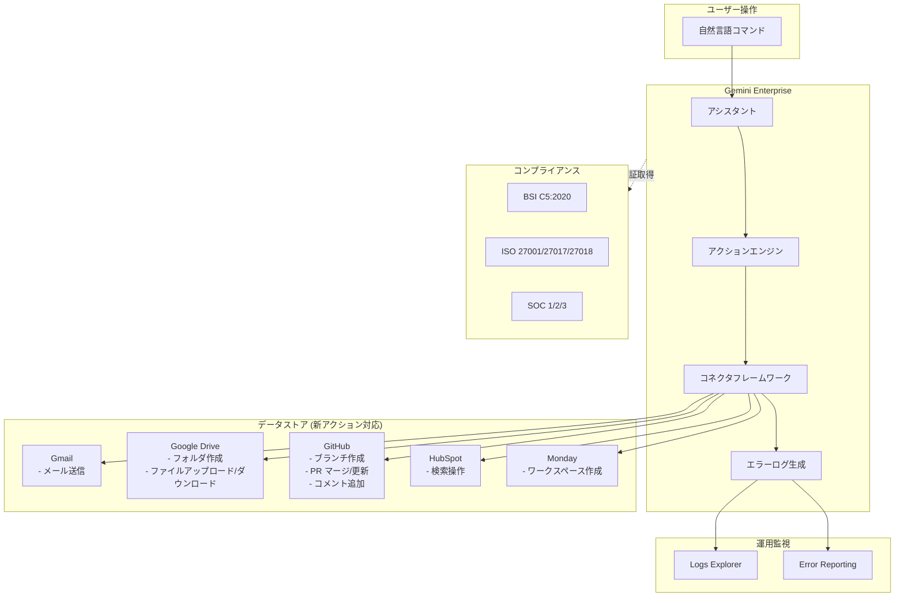

# Gemini Enterprise: BSI C5:2020 コンプライアンス認証、新アクション対応、フェデレーテッドコネクタエラーログ

**リリース日**: 2026-03-31

**サービス**: Gemini Enterprise / NotebookLM Enterprise

**機能**: BSI C5:2020 コンプライアンス認証、新アクションサポート (Preview)、フェデレーテッドコネクタエラーログ

**ステータス**: GA (BSI C5:2020)、Preview (新アクション)、GA (エラーログ)

[このアップデートのインフォグラフィックを見る](https://takech9203.github.io/google-cloud-news-summary/20260331-gemini-enterprise-bsi-c5-actions.html)

## 概要

2026年3月31日、Gemini Enterprise に関する3つの重要なアップデートが同時に発表された。第一に、Gemini Enterprise と NotebookLM Enterprise が BSI C5:2020 コンプライアンス認証を取得した。これはドイツ連邦情報セキュリティ庁 (BSI) が策定したクラウドコンピューティングコンプライアンス基準カタログ (Cloud Computing Compliance Criteria Catalogue) であり、欧州市場においてクラウドサービスのセキュリティを評価する上で重要な基準である。

第二に、Gmail、Google Drive、GitHub、HubSpot、Monday の各データストアに対する新しいアクションが Preview として追加された。これにより、ユーザーは Gemini Enterprise のアシスタントから自然言語を使って、メール送信、フォルダ作成、プルリクエストのマージなど、各種サービスへの操作を直接実行できるようになる。

第三に、フェデレーテッドコネクタのエラーログが Cloud Logging の Logs Explorer で確認可能になった。接続の問題、データ変換エラー、API エラーなどの詳細なログを直接参照でき、コネクタ運用時のトラブルシューティングが大幅に効率化される。

**アップデート前の課題**

- BSI C5:2020 認証がないため、ドイツおよび欧州の規制要件を満たす必要がある組織では Gemini Enterprise / NotebookLM Enterprise の採用が困難だった
- サードパーティデータストアに対する操作は限定的で、Gmail や Google Drive、HubSpot などへのアクション実行には外部ツールやワークフローが必要だった
- フェデレーテッドコネクタでエラーが発生した場合、詳細なエラー情報を把握する手段が限られており、原因特定に時間がかかっていた

**アップデート後の改善**

- BSI C5:2020 認証により、ドイツおよび欧州の厳格なクラウドセキュリティ基準を満たし、規制産業での採用が容易になった
- 5 つのデータストア (Gmail、Google Drive、GitHub、HubSpot、Monday) に対する新アクションが追加され、自然言語による直接操作が可能になった
- Logs Explorer でフェデレーテッドコネクタのエラーログを直接確認でき、接続問題や API エラーの迅速な診断が可能になった

## アーキテクチャ図



Gemini Enterprise のアシスタントが自然言語コマンドを受け取り、アクションエンジンを通じて各データストアに対する操作を実行する。コネクタフレームワークで発生したエラーは Logs Explorer で確認可能となり、全体が BSI C5:2020 を含む各種コンプライアンス認証の下で運用される。

## サービスアップデートの詳細

### 主要機能

1. **BSI C5:2020 コンプライアンス認証**
   - Gemini Enterprise と NotebookLM Enterprise の両方が BSI C5:2020 認証を取得
   - BSI C5:2020 は、ドイツ連邦情報セキュリティ庁が定めるクラウドコンピューティングのセキュリティ基準カタログであり、欧州市場で広く参照される
   - 既存の認証 (ISO 27001/27017/27018/27701、SOC 1/2/3、HIPAA、FedRAMP など) に加えて、欧州市場向けのコンプライアンス基盤がさらに強化された
   - Gemini for Google Cloud 全体では既に BSI C5:2020 認証を保持しており、今回 Gemini Enterprise と NotebookLM Enterprise が個別に認証範囲に含まれた

2. **新アクションのサポート (Preview)**
   - 以下の 5 つのデータストアに対する新しいアクションが Public Preview として利用可能
   - **Gmail**: メール送信 (Send message) アクション
   - **Google Drive**: フォルダ作成 (Create Folder)、ファイルアップロード (Upload File)、ファイルダウンロード (Download File)
   - **GitHub**: レビューコメント追加、Issue コメント追加、ブランチ作成、プルリクエスト更新、プルリクエストマージ
   - **HubSpot**: フェデレーテッド検索およびアクション機能
   - **Monday**: ワークスペース作成 (Create workspace) およびリードオンリーアクション

3. **フェデレーテッドコネクタエラーログ (Logs Explorer)**
   - フェデレーテッドコネクタの詳細なエラーログを Cloud Logging の Logs Explorer で確認可能
   - 接続の問題 (Connection problems)、データ変換エラー (Data transformation issues)、API エラーの 3 種類のエラーを網羅
   - `ConnectorRunErrorContext` メッセージにより、同期タイプ (FULL / INCREMENTAL)、開始・終了時間、データコネクタリソース名などの詳細情報を確認可能

## 技術仕様

### 新アクション一覧

| データストア | アクション | 説明 |
|------|------|------|
| Gmail | Send message | 指定した宛先にメールを送信 |
| Google Drive | Create Folder | Google Drive に新しいフォルダを作成 |
| Google Drive | Upload File | Google Drive にファイルをアップロード |
| Google Drive | Download File | Google Drive からファイルをダウンロード |
| GitHub | Add comment to a pending review | GitHub のレビューにコメントを追加 |
| GitHub | Add comment to an issue | GitHub の Issue にコメントを追加 |
| GitHub | Create branch | GitHub にブランチを作成 |
| GitHub | Update pull request | GitHub のプルリクエストを更新 |
| GitHub | Merge pull request | GitHub のプルリクエストをマージ |
| HubSpot | (検索操作) | HubSpot データに対するフェデレーテッド検索 |
| Monday | Create workspace | Monday に新しいワークスペースを作成 |

### エラーログのクエリ方法

Logs Explorer でフェデレーテッドコネクタのエラーログを確認するには、以下のクエリを使用する。

```
resource.type="consumed_api"
resource.labels.service="discoveryengine.googleapis.com"
```

特定のコネクタ同期エラーを詳細に確認する場合:

```
resource.type="consumed_api"
resource.labels.service="discoveryengine.googleapis.com"
jsonPayload.connector_run_payload.sync_type="FULL"
```

### BSI C5:2020 認証対象

| エディション | BSI C5:2020 認証 |
|------|------|
| Gemini Enterprise Standard edition | 対象 |
| Gemini Enterprise Plus edition | 対象 |
| NotebookLM Enterprise | 対象 |

### 必要な IAM ロール (エラーログ確認)

| ロール | 説明 |
|------|------|
| `roles/logging.viewer` | Logs Explorer でエラーログを閲覧するために必要 |
| `roles/discoveryengine.editor` | データストアの作成・管理に必要 |

## 設定方法

### 前提条件

1. Gemini Enterprise Standard または Plus エディションのライセンスが有効であること
2. 対象プロジェクトで Gemini Enterprise (Discovery Engine) API が有効化されていること
3. エラーログ確認には `roles/logging.viewer` ロールが付与されていること

### 手順

#### ステップ 1: データストアへのアクション追加

```bash
# Google Cloud Console から Gemini Enterprise ページに移動
# Navigation menu > Data Stores を選択
# 対象のデータストアを選択
# Navigation menu > Actions を選択
# "Enable actions" をクリックしてアクションを有効化
```

アクションはデータストア作成時または作成後に追加できる。フェデレーテッドデータストアの場合は、一覧からアクションを選択して有効化する。

#### ステップ 2: エラーログの確認

```bash
# Logs Explorer にアクセス
# https://console.cloud.google.com/logs/query

# 以下のクエリを入力して実行
# resource.type="consumed_api"
# resource.labels.service="discoveryengine.googleapis.com"
```

エラーの詳細は `jsonPayload.message` と `jsonPayload.status` フィールドに記録される。より詳細な分析が必要な場合は、ログを BigQuery にエクスポートすることも可能である。

#### ステップ 3: BSI C5:2020 コンプライアンスの確認

BSI C5:2020 認証は自動的に適用されるため、追加の設定は不要である。コンプライアンスレポートは Google Cloud Console のコンプライアンスセクションから確認できる。

## メリット

### ビジネス面

- **欧州市場でのコンプライアンス強化**: BSI C5:2020 認証により、ドイツおよび EU 諸国の規制要件を満たす組織で Gemini Enterprise の採用が促進される。金融、医療、公共セクターなど規制の厳しい業界での導入障壁が低減される
- **業務効率の向上**: 自然言語による直接アクション実行により、ツール間の切り替えやコンテキストスイッチが削減され、知識労働者の生産性が向上する
- **運用コスト削減**: Logs Explorer でのエラーログ可視化により、コネクタの問題解決にかかる平均時間 (MTTR) が短縮される

### 技術面

- **統合的な操作環境**: 5 つの異なるデータストアに対するアクションを Gemini Enterprise の単一インターフェースから実行可能で、API 連携の複雑さが軽減される
- **観測可能性の向上**: フェデレーテッドコネクタのエラーログにより、接続問題・データ変換エラー・API エラーの 3 種類を体系的に監視でき、BigQuery へのエクスポートによる長期分析も可能
- **セキュリティ監査の簡素化**: BSI C5:2020 認証に加え、ISO、SOC、HIPAA など既存の認証との組み合わせにより、マルチリージョン展開でも一貫したコンプライアンス体制を維持できる

## デメリット・制約事項

### 制限事項

- 新アクションは Public Preview であり、「Pre-GA Offerings Terms」の対象となる。本番環境での利用には注意が必要
- 各データストアでアクションを有効化する際、1 つのアプリケーションに同一コネクタタイプのデータストアを複数関連付けることは推奨されない
- HubSpot コネクタは現時点では検索操作が中心であり、書き込みアクションの対応範囲は限定的
- VPC Service Controls の適用は、既存のサードパーティデータストア (GitHub、HubSpot、Monday) では再作成が必要

### 考慮すべき点

- Gmail および Google Drive のアクションでは、データレジデンシー (DRZ) は Google Cloud 内のデータのみ保証される。Google Workspace 側のデータレジデンシーは別途確認が必要
- CMEK (顧客管理暗号鍵) は Google Cloud 内のデータにのみ適用され、サードパーティサービス内のデータには適用されない
- フェデレーテッド検索ではデータがインデックスに取り込まれないため、検索品質がインジェスト方式と比較して低い場合がある
- サポート対象リージョンは global、us、eu のみ (データストアにより異なる)

## ユースケース

### ユースケース 1: 欧州の金融機関における Gemini Enterprise 導入

**シナリオ**: ドイツの金融機関が、社内ナレッジ管理と業務効率化のために Gemini Enterprise の導入を検討している。BSI C5:2020 認証が調達要件に含まれていた。

**実装例**:
```
1. Gemini Enterprise Plus エディションを EU リージョンでプロビジョニング
2. BSI C5:2020 認証レポートを取得してコンプライアンスチームに提出
3. CMEK を EU リージョンで設定してデータ暗号化を強化
4. VPC Service Controls で外部アクセスを制限
```

**効果**: BSI C5:2020 認証により調達要件をクリアし、ISO 27001 や SOC 2 と併せて包括的なコンプライアンス体制を構築できる。

### ユースケース 2: ソフトウェア開発チームの GitHub 連携

**シナリオ**: ソフトウェア開発チームが、Gemini Enterprise のアシスタントを使って GitHub での日常的な開発タスクを効率化したい。

**実装例**:
```
ユーザー: "Issue #234 にバグ修正の進捗コメントを追加して"
→ GitHub の Add comment to an issue アクションが実行

ユーザー: "feature/auth ブランチを作成して"
→ GitHub の Create branch アクションが実行

ユーザー: "PR #567 をマージして"
→ GitHub の Merge pull request アクションが実行
```

**効果**: GitHub の Web UI やコマンドラインに切り替えることなく、Gemini Enterprise のチャットインターフェースから開発作業を完結できる。

### ユースケース 3: コネクタ障害の迅速な診断

**シナリオ**: 運用チームが、HubSpot コネクタの同期が失敗していることに気づき、原因を特定する必要がある。

**実装例**:
```
# Logs Explorer で以下のクエリを実行
resource.type="consumed_api"
resource.labels.service="discoveryengine.googleapis.com"
severity>=ERROR

# jsonPayload.connector_run_payload でコネクタ固有の情報を確認
# - operation: 同期オペレーションのリソース名
# - entity: 同期対象のエンティティ
# - sync_type: FULL または INCREMENTAL
# - start_time / end_time: 同期の開始・終了時間
```

**効果**: エラーの種類 (接続問題、データ変換、API エラー) を即座に判別し、MTTR を短縮できる。

## 料金

Gemini Enterprise の料金はエディションによるサブスクリプションベースである。BSI C5:2020 認証やエラーログ機能については追加料金は発生しない。

### エディション別の主な違い

| エディション | ストレージ/ユーザー/月 | 全コネクタアクセス | コンプライアンス |
|--------|-----------------|------|------|
| Business | 25 GiB (プール) | 制限あり | 基本 |
| Standard | 30 GiB (プール) | 対応 | エンタープライズグレード |
| Plus | 75 GiB (プール) | 対応 | エンタープライズグレード |
| Frontline | 2 GiB (プール) | 対応 | エンタープライズグレード |

アクション機能は Standard、Plus、Business、Frontline の全エディションで利用可能である。

## 利用可能リージョン

新アクション対応のデータストアは以下のリージョンで利用可能:

| データストア | 利用可能リージョン |
|------|------|
| Gmail | Global、US、EU |
| Google Drive | Global、US、EU |
| GitHub | Global、US、EU |
| HubSpot | Global、US、EU |
| Monday | Global、US、EU |

BSI C5:2020 認証およびエラーログ機能はすべてのリージョンで利用可能である。

## 関連サービス・機能

- **Cloud Logging / Logs Explorer**: フェデレーテッドコネクタのエラーログを表示・分析するための基盤サービス
- **VPC Service Controls**: Gemini Enterprise のセキュリティ境界を定義し、データ流出リスクを軽減するために利用
- **CMEK (Cloud KMS)**: US および EU リージョンでの顧客管理暗号鍵によるデータ暗号化
- **Vertex AI Search (Discovery Engine)**: Gemini Enterprise のコネクタフレームワークとデータストア管理の基盤
- **NotebookLM Enterprise**: Gemini Enterprise と同時に BSI C5:2020 認証を取得した姉妹サービス
- **Error Reporting**: Logs Explorer と連携してエラーグループの分析・トラブルシューティングに利用可能

## 参考リンク

- [インフォグラフィック](https://takech9203.github.io/google-cloud-news-summary/20260331-gemini-enterprise-bsi-c5-actions.html)
- [公式リリースノート](https://docs.cloud.google.com/release-notes#March_31_2026)
- [コンプライアンス認証とセキュリティコントロール](https://cloud.google.com/gemini/enterprise/docs/compliance-security-controls)
- [アクション管理ドキュメント](https://cloud.google.com/gemini/enterprise/docs/connectors/manage-actions)
- [Cloud Logging for Gemini Enterprise](https://cloud.google.com/gemini/enterprise/docs/cloud-logging)
- [Gmail コネクタ](https://cloud.google.com/gemini/enterprise/docs/connectors/gmail)
- [Google Drive コネクタ](https://cloud.google.com/gemini/enterprise/docs/connectors/gdrive)
- [GitHub コネクタ](https://cloud.google.com/gemini/enterprise/docs/connectors/github)
- [HubSpot コネクタ](https://cloud.google.com/gemini/enterprise/docs/connectors/hubspot)
- [Monday コネクタ](https://cloud.google.com/gemini/enterprise/docs/connectors/monday)
- [BSI C5:2020 コンプライアンス](https://cloud.google.com/security/compliance/bsi-c5)

## まとめ

今回の 3 つのアップデートにより、Gemini Enterprise はセキュリティ・コンプライアンス、機能拡張、運用監視の全方面で強化された。特に BSI C5:2020 認証の取得は、ドイツおよび欧州の規制要件を持つ組織にとって導入の決定的な要因となり得る。欧州市場での利用を検討している組織は、既存のコンプライアンス要件と照合した上で、新アクション機能やエラーログ機能と併せて評価することを推奨する。

---

**タグ**: #GeminiEnterprise #NotebookLMEnterprise #BSIC5 #コンプライアンス #コネクタ #アクション #Gmail #GoogleDrive #GitHub #HubSpot #Monday #CloudLogging #LogsExplorer #セキュリティ #エラーログ
