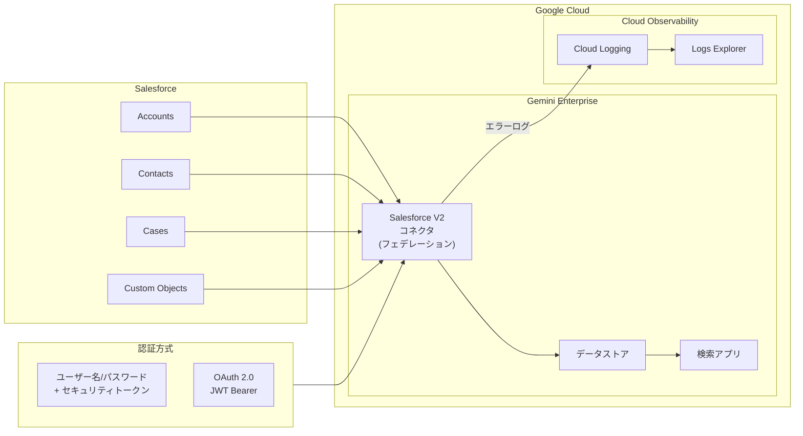

# Gemini Enterprise: Salesforce データフェデレーションによる接続とコネクタエラーログの可視化

**リリース日**: 2026-03-31

**サービス**: Gemini Enterprise

**機能**: Salesforce データフェデレーション接続 / フェデレーテッドコネクタエラーログ

**ステータス**: Preview (Salesforce フェデレーション) / Feature (エラーログ)

📊 [このアップデートのインフォグラフィックを見る](https://takech9203.github.io/google-cloud-news-summary/20260331-gemini-enterprise-salesforce-federation.html)

## 概要

Gemini Enterprise において、データフェデレーションを使用して Salesforce のデータストアを接続する機能が Public Preview として提供開始されました。これにより、Salesforce に格納された顧客データ、商談情報、ケース履歴などを Gemini Enterprise のデータストアに取り込み、AI を活用した検索や回答生成に活用できるようになります。

同時に、フェデレーテッドコネクタのエラーログを Cloud Logging の Logs Explorer で確認できる機能も提供されました。接続の問題、データ変換エラー、API エラーなどの詳細なログを一元的に確認でき、コネクタのトラブルシューティングが大幅に効率化されます。

この 2 つのアップデートは、Gemini Enterprise を CRM データと統合して企業内の情報検索基盤を構築するユースケースにおいて、セットアップと運用の両面を強化するものです。営業チーム、カスタマーサポート、マーケティング部門など、Salesforce を利用する組織全体に恩恵をもたらします。

**アップデート前の課題**

- Salesforce のデータを Gemini Enterprise で活用するには、手動でのデータエクスポートやカスタム ETL パイプラインの構築が必要だった
- フェデレーテッドコネクタでエラーが発生した際、詳細な原因特定のための情報が限られていた
- コネクタの接続障害やデータ同期の問題を迅速に診断する手段が不足していた

**アップデート後の改善**

- データフェデレーションにより、Salesforce のデータを直接 Gemini Enterprise に接続し、ETL パイプラインなしで検索・分析が可能になった
- Logs Explorer でコネクタのエラーログを詳細に確認でき、接続問題・データ変換エラー・API エラーの原因を迅速に特定できるようになった
- Salesforce V2 コネクタの推奨により、より安定した接続とパフォーマンスの向上が期待できる

## アーキテクチャ図



Salesforce の各オブジェクト (Accounts、Contacts、Cases、カスタムオブジェクト) がフェデレーテッドコネクタを介して Gemini Enterprise のデータストアに接続され、検索アプリケーションで活用されます。コネクタのエラーログは Cloud Logging に送信され、Logs Explorer で確認できます。

## サービスアップデートの詳細

### 主要機能

1. **Salesforce データフェデレーション (Public Preview)**
   - Salesforce V2 コネクタを使用して、Salesforce のデータを Gemini Enterprise のデータストアに直接接続
   - Accounts、Contacts、Cases などの標準オブジェクトに加え、`custom_object_name__c` 形式のカスタムオブジェクトにも対応
   - フルシンクとインクリメンタルシンクの両方をサポートし、同期頻度を個別に設定可能
   - Public (パブリック) と Private (プライベート) の 2 つの接続先タイプを選択可能

2. **認証方式の柔軟なサポート**
   - ユーザー名/パスワード + セキュリティトークンによる認証
   - OAuth 2.0 JWT Bearer フローによる認証 (RSA 2048 ビット鍵ペアを使用)
   - OAuth 認証の場合、Salesforce 側で Connected App (外部クライアントアプリ) の設定が必要

3. **フェデレーテッドコネクタエラーログ (Logs Explorer)**
   - コネクタの接続問題、データ変換エラー、API エラーの詳細ログを Cloud Logging で確認可能
   - `resource.type="consumed_api"` および `resource.labels.service="discoveryengine.googleapis.com"` でフィルタリング
   - JSON メタデータによる高度なクエリフィルタリングに対応
   - BigQuery などの長期保存先へのログルーティングも可能

## 技術仕様

### コネクタ設定

| 項目 | 詳細 |
|------|------|
| コネクタバージョン | Salesforce V2 (推奨) |
| 認証方式 | ユーザー名/パスワード、OAuth 2.0 JWT Bearer |
| 同期タイプ | フルシンク、インクリメンタルシンク |
| 接続先タイプ | Public、Private (Service Attachment 経由) |
| カスタムオブジェクト | `custom_object_name__c` 形式で対応 |
| URL フィールドオーバーライド | 任意のカラムを検索結果の URL として指定可能 |

### Salesforce 側の必要権限

| 権限 | 説明 |
|------|------|
| API enabled | API アクセスの有効化 |
| View all users | 全ユーザー情報の閲覧 |
| View roles and role hierarchy | ロール階層の閲覧 |
| View setup and configuration | 設定情報の閲覧 |
| View all records (対象エンティティ) | 同期対象オブジェクトの全レコード閲覧 |

### エラーログクエリ例

```
resource.type="consumed_api"
resource.labels.service="discoveryengine.googleapis.com"
```

## 設定方法

### 前提条件

1. Google Cloud プロジェクトで Gemini Enterprise API が有効化されていること
2. Salesforce 側で適切な認証設定とユーザー権限が構成されていること
3. エラーログの確認には `roles/logging.viewer` IAM ロールが付与されていること

### 手順

#### ステップ 1: Salesforce 側の認証設定 (OAuth 2.0 の場合)

```bash
# RSA 秘密鍵の生成
openssl genrsa -out server.key 2048

# 自己署名証明書の生成
openssl req -new -x509 -sha256 -days 3650 -key server.key -out server.crt
```

生成した `server.crt` を Salesforce の Connected App 設定時にアップロードします。Callback URL には `https://vertexaisearch.cloud.google.com/console/oauth/salesforce_oauth.html` を設定してください。

#### ステップ 2: Gemini Enterprise でデータストアを作成

1. Google Cloud コンソールで Gemini Enterprise ページに移動
2. Data Stores をクリックし、Create Data Store を選択
3. データソースとして Salesforce V2 を選択
4. 認証情報を入力 (ユーザー名/パスワードまたは OAuth 設定)
5. 同期するエンティティを選択し、同期頻度を設定
6. リージョンとデータストア名を指定して作成

#### ステップ 3: エラーログの確認

1. Google Cloud コンソールで Logs Explorer に移動
2. リソースフィルタで Consumed API > Discovery Engine API を選択
3. クエリバーに `resource.type="consumed_api" resource.labels.service="discoveryengine.googleapis.com"` を入力
4. 時間範囲やその他のフィルタで結果を絞り込み

## メリット

### ビジネス面

- **CRM データの即時活用**: Salesforce に蓄積された顧客情報を Gemini Enterprise の AI 検索で直接活用でき、営業・サポート部門の情報アクセスが向上
- **運用コストの削減**: ETL パイプラインの構築・保守が不要になり、データ統合にかかるコストと時間を大幅に削減
- **迅速なトラブルシューティング**: エラーログの可視化により、データ同期の問題を迅速に特定・解決でき、ダウンタイムを最小化

### 技術面

- **マネージドコネクタ**: Google Cloud がコネクタの運用を管理するため、インフラの保守負荷が軽減
- **インクリメンタルシンク**: 差分同期により効率的なデータ更新が可能で、大規模データセットでもパフォーマンスを維持
- **Cloud Logging 統合**: 既存の Cloud Logging 基盤とシームレスに統合され、BigQuery へのログルーティングによる高度な分析も実現

## デメリット・制約事項

### 制限事項

- Salesforce データフェデレーション機能は Public Preview 段階であり、SLA の対象外となる可能性がある
- 旧 Salesforce コネクタは非推奨予定のため、既存のデータストアを Salesforce V2 コネクタで再作成する移行作業が必要
- Private 接続タイプの場合、Service Attachment の追加設定が必要

### 考慮すべき点

- Salesforce 側のオブジェクトアクセスが Private に設定されている場合、権限セットを作成してコネクタ用ユーザーに共有する必要がある
- OAuth 認証を使用する場合、Connected App のインストールと証明書管理の運用が追加で発生する
- データ量によってはインジェストに数分から数時間かかる場合があり、リアルタイム性が求められる要件には注意が必要

## ユースケース

### ユースケース 1: 営業チーム向け統合ナレッジ検索

**シナリオ**: 営業担当者が顧客との商談前に、Salesforce に蓄積された過去の商談履歴、顧客の課題、提案内容を Gemini Enterprise の検索機能で素早く確認する。

**実装例**:
```
Gemini Enterprise データストア設定:
- エンティティ: Accounts, Contacts, Opportunities, Notes
- 同期頻度: フルシンク (毎日)、インクリメンタルシンク (1 時間ごと)
- 接続タイプ: Public
```

**効果**: 営業担当者は自然言語で「A 社の過去 6 ヶ月の商談状況」のような検索が可能になり、商談準備時間が大幅に短縮される。

### ユースケース 2: カスタマーサポートの問い合わせ対応効率化

**シナリオ**: サポートエージェントが顧客からの問い合わせ時に、Salesforce の Cases、Knowledge Articles、顧客プロファイルを横断的に検索し、迅速な回答を提供する。

**効果**: 過去の類似ケースや関連するナレッジ記事を AI が自動的に関連付けて提示することで、初回解決率の向上と平均対応時間の短縮が期待できる。

### ユースケース 3: コネクタ運用の監視とアラート設定

**シナリオ**: インフラ運用チームが Logs Explorer でフェデレーテッドコネクタのエラーログを監視し、Cloud Monitoring のアラートポリシーと連携して異常を検知する。

**効果**: データ同期の失敗や API エラーを即座に検知し、ビジネスユーザーへの影響を最小限に抑えることができる。

## 料金

Gemini Enterprise の料金体系に準拠します。データフェデレーション機能の利用にあたっては、以下の料金要素を考慮してください。

### 料金例

| 項目 | 詳細 |
|------|------|
| Gemini Enterprise | エディションに応じた料金 (検索クエリ数ベース) |
| Cloud Logging | ログの取り込み・保存量に応じた従量課金 |
| データストレージ | 同期されたデータ量に応じた課金 |
| Salesforce API | Salesforce 側の API コール制限・料金に注意 |

料金の詳細は [Gemini Enterprise の料金ページ](https://cloud.google.com/gemini-enterprise/pricing) を参照してください。

## 利用可能リージョン

データストアの作成時にリージョンを選択できます。Gemini Enterprise がサポートするリージョンで利用可能です。具体的な対応リージョンについては [Gemini Enterprise のドキュメント](https://cloud.google.com/gemini/enterprise/docs/locations) を参照してください。

## 関連サービス・機能

- **Gemini Enterprise データストア**: サードパーティデータソースを含む複数のデータソースを統合して検索可能にするコア機能
- **Cloud Logging / Logs Explorer**: コネクタのエラーログを確認し、トラブルシューティングを行うためのオブザーバビリティ基盤
- **BigQuery**: ログルーティングによるコネクタログの長期分析やダッシュボード構築に活用
- **Cloud Monitoring**: エラーログベースのアラートポリシーを設定し、コネクタの異常を自動検知
- **Vertex AI Search**: Gemini Enterprise の基盤となる検索エンジン技術

## 参考リンク

- 📊 [インフォグラフィック](https://takech9203.github.io/google-cloud-news-summary/20260331-gemini-enterprise-salesforce-federation.html)
- [公式リリースノート](https://cloud.google.com/release-notes#March_31_2026)
- [Connect Salesforce ドキュメント](https://cloud.google.com/gemini/enterprise/docs/connectors/salesforce/connect-salesforce)
- [Gemini Enterprise Cloud Logging ドキュメント](https://cloud.google.com/gemini/enterprise/docs/cloud-logging)
- [料金ページ](https://cloud.google.com/gemini-enterprise/pricing)

## まとめ

今回のアップデートにより、Gemini Enterprise は Salesforce との直接的なデータフェデレーション接続を実現し、CRM データを活用した AI 検索基盤の構築が大幅に簡素化されました。同時に提供されたフェデレーテッドコネクタのエラーログ機能は、運用の可視化と安定性向上に貢献します。Salesforce を利用する組織においては、まず Public Preview の段階で検証環境での接続テストを行い、データフェデレーションによるナレッジ検索の有効性を評価することを推奨します。

---

**タグ**: #GeminiEnterprise #Salesforce #DataFederation #Connector #CloudLogging #LogsExplorer #Preview #Search #CRM #AI
