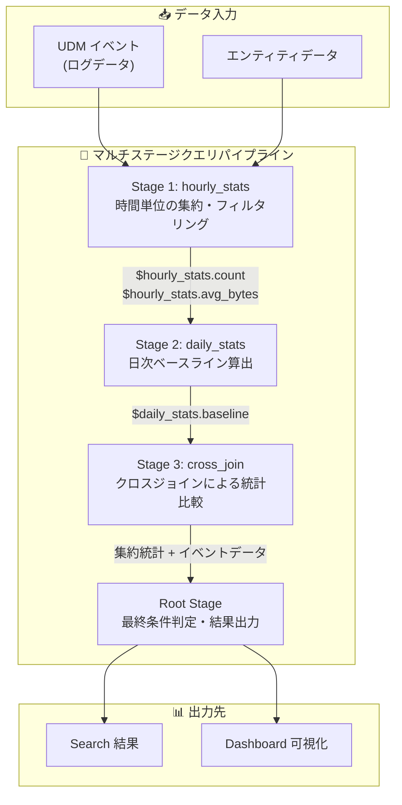

# Google SecOps: YARA-L マルチステージクエリが GA

**リリース日**: 2026-03-31

**サービス**: Google SecOps (SecOps SIEM)

**機能**: YARA-L におけるマルチステージクエリ

**ステータス**: GA (一般提供開始)

📊 [このアップデートのインフォグラフィックを見る](https://takech9203.github.io/google-cloud-news-summary/20260331-google-secops-multi-stage-queries-ga.html)

## 概要

Google SecOps の YARA-L 2.0 におけるマルチステージクエリ機能が GA (一般提供) となった。この機能により、あるクエリステージの出力を次のステージの入力として連結できるようになり、単一のモノリシックなクエリでは実現困難であった高度なデータ変換と検出ロジックの構築が可能になる。

マルチステージクエリは、Google SecOps の Dashboards と Search の両方で利用可能であり、セキュリティアナリストや検出エンジニアが洗練された検出・可視化ロジックを構築できる。この機能の有効化に特別な操作は不要であり、既存のすべての Google SecOps ユーザーが即座に利用を開始できる。これまでプレビュー段階にあった本機能が GA となったことで、本番環境での利用に必要なサポートレベルと安定性が保証されるようになった。

**アップデート前の課題**

- 単一のモノリシックなクエリしか記述できず、複雑な検出ロジックを一つのクエリ内で完結させる必要があった
- 異なる時間窓のデータを比較するベースラインベースの異常検出を単一クエリで表現するのが困難であった
- 複数のデータソースからの集約結果をさらに加工・フィルタリングする場合、クエリが煩雑になり可読性や保守性が低下していた
- Pre-GA の段階であったため、本番ワークロードでの利用にはサポートや互換性の制約があった

**アップデート後の改善**

- クエリを最大 4 つの名前付きステージとルートステージに分割し、段階的にデータを変換できるようになった
- あるステージの集約結果を後続ステージで参照するパイプライン型の分析が可能になった
- クロスジョインを用いて、個別イベントデータと集約統計を比較する高度な検出パターンを簡潔に記述できるようになった
- GA となったことで、本番環境での利用に十分なサポートレベルと安定性が保証された

## アーキテクチャ図



マルチステージクエリでは、各ステージが前段のステージフィールドを参照して段階的にデータを変換する。最終的にルートステージで条件判定を行い、Search または Dashboard に結果を出力する。

## サービスアップデートの詳細

### 主要機能

1. **名前付きステージによるクエリ分割**
   - `stage <名前> { }` 構文で最大 4 つの名前付きステージを定義可能
   - 各ステージは論理的に前方に定義されたステージのみを参照できる
   - ルートステージはすべての名前付きステージの後に処理される

2. **ステージフィールドによるデータ受け渡し**
   - `$<ステージ名>.<変数名>` の構文で前段ステージの match 変数や outcome 変数にアクセス
   - ウィンドウのタイムスタンプにも `$<ステージ名>.window_start` / `$<ステージ名>.window_end` でアクセス可能
   - ステージ間でデータの型 (文字列、整数、浮動小数点) が保持される

3. **クロスジョインによる統計比較**
   - `cross join` キーワードにより、集約統計を個別イベントデータに結合
   - `limit: 1` のステージと他のデータセットの組み合わせで、全体統計との比較が可能
   - 異常検出やベースラインからの逸脱検知に有効

4. **Dashboards と Search の両対応**
   - Search でリアルタイムの脅威ハンティングに利用可能
   - Dashboards で継続的な可視化・モニタリングに利用可能
   - コンポジット検出ルールを補完する機能として位置付けられる

## 技術仕様

### 構造的制約

| 項目 | 詳細 |
|------|------|
| 名前付きステージ数 | 最大 4 ステージ |
| ルートステージ | クエリごとに 1 つのみ |
| 非データテーブルジョイン | 全ステージを通じて最大 4 つ |
| 出力要件 | 各名前付きステージは match セクションまたは outcome セクションが必須 |
| サポート対象 | Search、Dashboards (Rules では非サポート) |

### ウィンドウ制約

| 項目 | 詳細 |
|------|------|
| ウィンドウ種類 | タンブリング、ホップ、スライディング |
| ウィンドウ混在 | 同一クエリ内での異なるウィンドウ種類の混在は非推奨 |
| ホップ/スライディング依存 | ホップまたはスライディングウィンドウを使用するステージ同士の依存は不可 |
| タンブリングウィンドウサイズ差 | 異なるステージ間のサイズ差は 720 倍未満 |
| ジョインのウィンドウ上限 | 最大 2 日 |

### クエリ構文例

```
stage hourly_stats {
    metadata.event_type = "NETWORK_CONNECTION"
    $source = principal.hostname
    $target = target.ip
    $source != ""
    $target != ""

    match:
        $source, $target by hour

    outcome:
        $count = count(metadata.id)
        $avg_recd_bytes = avg(network.received_bytes)
        $std_recd_bytes = stddev(network.received_bytes)

    condition:
        $avg_recd_bytes > 100 and $std_recd_bytes > 50
}

// ルートステージ: hourly_stats の出力を参照
$src_ip = $hourly_stats.source
$dst_ip = $hourly_stats.target

match:
    $src_ip, $dst_ip

outcome:
    $count = count_distinct($hourly_stats.window_start)

condition:
    $count > 3
```

## 設定方法

### 前提条件

1. Google SecOps (Chronicle) のアクティブなサブスクリプション
2. Search または Dashboards へのアクセス権限

### 手順

#### ステップ 1: Search でマルチステージクエリを作成

Google SecOps コンソールにアクセスし、**Investigation > Search** に移動する。

```
stage user_login_counts {
    $user = principal.user.userid
    metadata.event_type = "USER_LOGIN"
    security_result.action = "ALLOW"

    match:
        $user

    outcome:
        $login_count = count(metadata.id)
}

$login_count = $user_login_counts.login_count
$user = $user_login_counts.user

match:
    $login_count

outcome:
    $num_users = count($user)
```

クエリエディタに上記のようなマルチステージクエリを入力して実行する。

#### ステップ 2: Dashboard ウィジェットとして構成

Dashboard に新しいウィジェットを追加し、マルチステージクエリの結果を可視化する。時間ウィンドウの設定により、継続的なモニタリングを実現できる。

## メリット

### ビジネス面

- **脅威検出の高度化**: 単一クエリでは困難であった多段階の分析ロジックにより、APT やラテラルムーブメントなどの複雑な攻撃パターンを検出可能
- **SOC 運用効率の向上**: ベースライン比較を組み込んだクエリにより、誤検出を減らしアラートの精度を向上
- **調査時間の短縮**: 複数のクエリを順次実行する必要がなくなり、1 つのクエリで完結するためインシデント調査のスピードが向上

### 技術面

- **クエリの可読性向上**: ロジックをステージごとに分離することで、複雑なクエリの構造が明確になる
- **段階的データ変換**: 集約、フィルタリング、結合を段階的に行うことで、データパイプラインのような柔軟な処理が可能
- **リアルタイム分析**: コンポジット検出ルールとは異なり、Search でリアルタイムの結果を返却可能

## デメリット・制約事項

### 制限事項

- Rules (検出ルール) での利用は非サポートであり、Search と Dashboards に限定される
- すべてのマルチステージクエリは統計クエリとして動作し、非集約イベントやデータテーブル行をそのまま返すことはできない
- UDM やエンティティイベントとのジョインはデータセットのサイズにより性能が低下する可能性がある
- API サポートは EventService.UDMSearch API に限定され、SearchService.UDMSearch API では非サポート

### 考慮すべき点

- ステージ間のウィンドウサイズの差が大きい場合 (例: 月単位と分単位)、行数の爆発により性能問題が発生する可能性がある
- outcome 変数の上限は、オプトインの有無により 20 または 50 個に制限される
- 統計クエリとしての実行制限 (120 QPH) が適用されるため、高頻度の自動化には注意が必要

## ユースケース

### ユースケース 1: 異常なネットワーク接続の検出

**シナリオ**: SOC チームが、通常とは異なる高トラフィックを維持する IP ペアを検出したい。時間単位で集約した後、3 時間以上継続して高活動が続くペアのみをアラート対象とする。

**実装例**:
```
stage hourly_stats {
    metadata.event_type = "NETWORK_CONNECTION"
    $src_ip = principal.ip
    $dst_ip = target.ip
    $src_ip != ""
    $dst_ip != ""

    match:
        $src_ip, $dst_ip by hour

    outcome:
        $count = count(metadata.id)
        $avg_recd_bytes = avg(network.received_bytes)
        $std_recd_bytes = stddev(network.received_bytes)

    condition:
        $avg_recd_bytes > 100 and $std_recd_bytes > 50
}

$src_ip = $hourly_stats.src_ip
$dst_ip = $hourly_stats.dst_ip

match:
    $src_ip, $dst_ip

outcome:
    $count = count_distinct($hourly_stats.window_start)

condition:
    $count > 3
```

**効果**: 単発の高トラフィックではなく、持続的な異常通信パターンのみを抽出することで、C2 通信やデータ流出の兆候を高精度に検出できる。

### ユースケース 2: 通常と異なるログイン頻度の検出

**シナリオ**: セキュリティチームが、全ユーザーの平均ログイン回数と比較して、異常に多い (または少ない) ログイン回数のユーザーを特定したい。

**実装例**:
```
stage user_login_counts {
    $user = principal.user.userid
    metadata.event_type = "USER_LOGIN"
    security_result.action = "ALLOW"

    match:
        $user

    outcome:
        $login_count = count(metadata.id)
}

stage total_users {
    outcome:
        $count = count($user_login_counts.user)
    limit: 1
}

cross join $total_users, $user_login_counts
$login_count = $user_login_counts.login_count
$user = $user_login_counts.user
$tot_users = $total_users.count

match:
    $login_count

outcome:
    $num_users = count($user)
    $frequency_percent = (count($user) / max($tot_users)) * 100
```

**効果**: クロスジョインを用いて全体統計と個別ユーザーを比較するベースライン分析により、内部不正やアカウント侵害の兆候を早期に発見できる。

## 料金

マルチステージクエリ機能自体に追加料金は発生しない。Google SecOps (Chronicle) のサブスクリプションに含まれる Search および Dashboards の機能として提供される。ただし、クエリの実行量やデータ取り込み量に応じた Google SecOps の標準料金が適用される。

## 利用可能リージョン

Google SecOps が利用可能なすべてのリージョンでマルチステージクエリを使用できる。機能の有効化に特別な操作や設定は不要であり、既存の Google SecOps インスタンスで即座に利用可能である。

## 関連サービス・機能

- **コンポジット検出ルール**: マルチステージクエリを補完する機能。ルールベースの検出にはコンポジット検出ルールを使用し、リアルタイムの調査にはマルチステージクエリを使用する
- **UDM Search**: マルチステージクエリの基盤となる検索機能。UDM に正規化されたデータに対してクエリを実行する
- **Search Joins**: マルチステージクエリ内でデータソース間のジョインを行い、複数ソースからのコンテキストを統合する
- **YARA-L 2.0 検出ルール**: マルチステージクエリと同じ YARA-L 言語を使用するが、ルール (リアルタイム検出) ではマルチステージは非サポート
- **Google SecOps Dashboards**: マルチステージクエリの結果を可視化・モニタリングするためのダッシュボード機能

## 参考リンク

- 📊 [インフォグラフィック](https://takech9203.github.io/google-cloud-news-summary/20260331-google-secops-multi-stage-queries-ga.html)
- [公式リリースノート](https://docs.cloud.google.com/release-notes#March_31_2026)
- [マルチステージクエリのドキュメント](https://docs.cloud.google.com/chronicle/docs/investigation/multi-stage-yaral)
- [YARA-L 2.0 概要](https://docs.cloud.google.com/chronicle/docs/detection/yara-l-2-0-overview)
- [YARA-L ベストプラクティス](https://docs.cloud.google.com/chronicle/docs/detection/yara-l-best-practices)
- [Search Joins のドキュメント](https://docs.cloud.google.com/chronicle/docs/investigation/search-joins)

## まとめ

Google SecOps の YARA-L マルチステージクエリが GA となったことで、セキュリティアナリストは単一のクエリ内で段階的なデータ変換と高度な検出ロジックを構築できるようになった。特に、ベースライン比較やクロスジョインを活用した異常検出パターンは、APT や内部不正の検出精度を大幅に向上させる。Search および Dashboards を活用する SOC チームは、既存のクエリをマルチステージ構成にリファクタリングすることで、検出精度と運用効率の改善を検討すべきである。

---

**タグ**: #GoogleSecOps #SIEM #YARA-L #マルチステージクエリ #脅威検出 #セキュリティ分析 #GA
