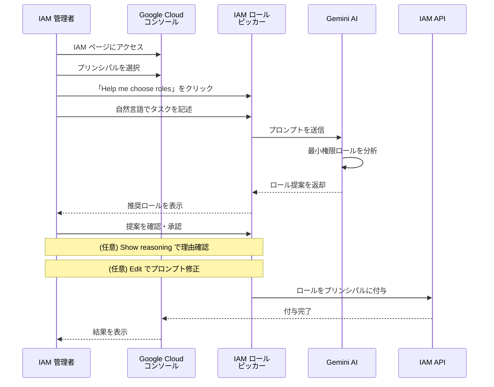

# Identity and Access Management: IAM ロールピッカーにおける Gemini アシスタンスが一般提供開始

**リリース日**: 2026-03-31

**サービス**: Identity and Access Management (IAM)

**機能**: Gemini assistance in IAM role picker (GA)

**ステータス**: 一般提供 (GA)

[このアップデートのインフォグラフィックを見る](https://takech9203.github.io/google-cloud-news-summary/20260331-iam-gemini-role-picker-ga.html)

## 概要

Google Cloud の Identity and Access Management (IAM) において、ロールピッカーでの Gemini アシスタンス機能が一般提供 (GA) となりました。この機能により、ユーザーは自然言語で「このプリンシパルに何をさせたいか」を記述するだけで、Gemini が最小権限の原則に基づいた最適な事前定義ロールを提案してくれます。

IAM には数百の事前定義ロールが存在し、それぞれが異なる権限の組み合わせを持っています。従来、管理者はロールと権限のリファレンスページを手動で検索し、適切なロールを見つける必要がありました。この作業は時間がかかるだけでなく、過剰な権限を付与してしまうリスクも伴っていました。Gemini アシスタンスにより、このプロセスが大幅に簡素化されます。

この機能は、Google Cloud コンソールの IAM ページ、サービスアカウントページ、ダッシュボードページなど、プロジェクトレベルでアクセス権を付与できるページで利用可能です。

**アップデート前の課題**

従来の IAM ロール選択プロセスでは、管理者に大きな負担がかかっていました。

- 1000 以上の事前定義ロールの中から、手動でロールと権限のリファレンスページを検索して適切なロールを特定する必要があった
- 最小権限の原則を遵守するために、各ロールに含まれる権限を一つずつ確認し、不要な権限が含まれていないか検証する必要があった
- 複数のサービスにまたがるタスクの場合、適切なロールの組み合わせを見つけることが特に困難だった

**アップデート後の改善**

Gemini アシスタンスの GA により、以下の改善が実現しました。

- 自然言語でタスクを記述するだけで、Gemini が最小権限の事前定義ロールを自動的に提案してくれるようになった
- 提案理由の表示機能 (Show reasoning) により、なぜそのロールが推奨されるのかを理解でき、検証が容易になった
- プロンプトの修正・再提案機能により、反復的にロール選択を最適化できるようになった

## アーキテクチャ図



IAM 管理者が Google Cloud コンソール上でロールピッカーを起動し、Gemini に自然言語でタスクを記述すると、Gemini が最適な事前定義ロールを提案するフローを示しています。

## サービスアップデートの詳細

### 主要機能

1. **自然言語によるロール提案**
   - 「Cloud Storage バケットにオブジェクトをアップロード・ダウンロードしたい」のような自然言語の記述から、Gemini が最小権限の事前定義ロールを提案
   - gcloud CLI コマンドの実行に必要なロールの特定にも対応 (例: `gcloud compute instances create` の実行に必要なロール)

2. **提案理由の透明性**
   - 「Show reasoning」ボタンにより、Gemini がそのロールを推奨した理由を確認可能
   - ロールと権限リファレンスとの照合による検証をサポート

3. **反復的なプロンプト修正**
   - 初回の提案が適切でない場合、プロンプトを修正して再提案を取得可能
   - 「Edit」ボタンでタスクの記述を更新し、「Update」で新しい提案を取得

4. **直接ロール付与**
   - プロジェクトレベルのロール提案はロールピッカーから直接付与可能
   - 組織・フォルダ・リソースレベルのロールは提案のみ (付与は通常のプロセスで実施)

## 技術仕様

### 対応範囲

| 項目 | 詳細 |
|------|------|
| 提案対象 | 事前定義ロールのみ (カスタムロールは非対応) |
| プリンシパル | 個別のプリンシパルのみ (複数プリンシパルの一括提案は非対応) |
| ロール付与レベル | プロジェクトレベルのロールは直接付与可能 |
| Google Workspace | Google Sheets、Google Docs などの Workspace 製品のロールは非対応 |
| カスタムロール提案 | ロールピッカーでは非対応 (Gemini Cloud Assist チャットパネルで対応可能) |

### 必要な IAM 権限

| ロール | 説明 |
|------|------|
| `roles/resourcemanager.projectIamAdmin` | IAM ロールピッカーを使用するために必要なロール |

```
必要な権限:
- resourcemanager.projects.get
- resourcemanager.projects.getIamPolicy
- resourcemanager.projects.setIamPolicy
```

## 設定方法

### 前提条件

1. Google Cloud プロジェクトが作成済みであること
2. Gemini for Google Cloud API が有効化されていること
3. `roles/resourcemanager.projectIamAdmin` ロールが付与されていること

### 手順

#### ステップ 1: Google Cloud コンソールで IAM ページにアクセス

```
Google Cloud コンソール > IAM と管理 > IAM
https://console.cloud.google.com/iam-admin/iam
```

プロジェクトを選択し、IAM ページを開きます。

#### ステップ 2: プリンシパルを選択

既存のプリンシパルのロールを編集する場合は、対象の行の「編集」アイコンをクリックします。新しいプリンシパルにロールを付与する場合は、「アクセスを許可」をクリックし、プリンシパルの識別子 (例: `my-user@example.com`) を入力します。

#### ステップ 3: Gemini アシスタンスを利用

```
「Help me choose roles」をクリック
  ↓
タスクの説明を自然言語で入力
  (例: "I need to create and manage BigQuery datasets and tables")
  ↓
「Suggest roles」をクリック
  ↓
提案されたロールを確認
  ↓
「Add roles」をクリックして承認
  ↓
「Save」をクリックして適用
```

自然言語でタスクを記述し、Gemini の提案を確認してから適用します。

## メリット

### ビジネス面

- **セキュリティリスクの低減**: 最小権限の原則に基づくロール提案により、過剰な権限付与を防止
- **運用効率の向上**: ロール選択にかかる時間を大幅に短縮し、管理者の生産性を向上
- **コンプライアンス対応の簡素化**: 適切なロール付与の検証プロセスが容易になり、監査対応の負担を軽減

### 技術面

- **最小権限の原則の自動適用**: Gemini が自動的に最小権限のロールを提案するため、手動での権限分析が不要に
- **マルチサービス対応**: 複数の Google Cloud サービスにまたがるタスクでも、適切なロールの組み合わせを提案
- **推論の透明性**: 提案理由を確認できるため、ロールの妥当性を技術的に検証可能

## デメリット・制約事項

### 制限事項

- カスタムロールの提案には対応していない (Gemini Cloud Assist チャットパネルでは可能)
- 複数のプリンシパルに対する一括ロール提案は非対応
- Google Workspace 製品 (Google Sheets、Google Docs など) のロール提案は非対応
- 組織・フォルダ・リソースレベルのロールはロールピッカーから直接付与できない

### 考慮すべき点

- Gemini の提案は AI による推論であり、公式のロールと権限リファレンスとの照合による検証が推奨される
- プロンプトは具体的かつ公式のサービス名を使用することで、より精度の高い提案が得られる
- GA となったが、AI の出力であるため、セキュリティに関わる判断は必ず人間によるレビューを行うべき

## ユースケース

### ユースケース 1: 新しいデータエンジニアへのロール付与

**シナリオ**: データエンジニアリングチームに新しいメンバーが参加し、BigQuery でデータセットの作成・管理とクエリ実行を行う必要がある。

**実装例**:
```
プロンプト: "I need to allow a user to create and manage BigQuery
datasets and tables. What role should I assign?"

Gemini の提案: BigQuery Data Editor (roles/bigquery.dataEditor)
```

**効果**: 従来は BigQuery のロール一覧から手動で適切なロールを探す必要があったが、自然言語での記述だけで最小権限のロールが特定される。

### ユースケース 2: サービスアカウントの権限設定

**シナリオ**: CI/CD パイプラインで使用するサービスアカウントに、Cloud Run へのデプロイに必要な最小限の権限を付与したい。

**実装例**:
```
プロンプト: "I need to grant a service account access to deploy
services to Cloud Run. What's the minimal role required?"

Gemini の提案: Cloud Run Developer (roles/run.developer)
```

**効果**: サービスアカウントに対する過剰な権限付与を防ぎ、セキュリティリスクを最小化できる。

### ユースケース 3: gcloud コマンドの実行権限特定

**シナリオ**: 開発者が特定の gcloud コマンドを実行するために必要なロールを知りたい。

**実装例**:
```
プロンプト: "What IAM role is required to run the following command:
gcloud compute instances create instance-1 --zone=us-central1-a"

Gemini の提案: Compute Instance Admin (v1) (roles/compute.instanceAdmin.v1)
```

**効果**: gcloud コマンドから直接必要なロールを特定でき、ドキュメントの検索時間を削減できる。

## 料金

IAM ロールピッカーの Gemini アシスタンス機能自体に追加料金は発生しません。Gemini for Google Cloud (Gemini Cloud Assist) の利用が前提となります。

| 項目 | 詳細 |
|------|------|
| IAM ロールピッカー | 追加料金なし |
| Gemini for Google Cloud | プロジェクトでの API 有効化が必要 |

## 利用可能リージョン

IAM ロールピッカーの Gemini アシスタンスは、Google Cloud コンソールを通じてグローバルに利用可能です。Gemini for Google Cloud がサポートされているすべてのリージョンで使用できます。

## 関連サービス・機能

- **IAM Recommender**: 既存のロール付与に対して、使用パターンに基づく最小権限のロール推奨を提供。ロールピッカーが「新規付与時」の支援であるのに対し、Recommender は「既存の権限の最適化」を支援
- **Gemini Cloud Assist**: チャットパネルを通じた対話型の Google Cloud 支援。カスタムロールの提案にも対応
- **Policy Intelligence**: IAM ポリシーの分析・トラブルシューティングツール群。Policy Analyzer や Policy Troubleshooter を含む
- **Organization Policy Service**: 組織全体のポリシー制約を管理。ロールピッカーと組み合わせて包括的なアクセス制御を実現

## 参考リンク

- [インフォグラフィック](https://takech9203.github.io/google-cloud-news-summary/20260331-iam-gemini-role-picker-ga.html)
- [公式リリースノート](https://docs.cloud.google.com/release-notes#March_31_2026)
- [ドキュメント: Get predefined role suggestions with Gemini assistance](https://docs.cloud.google.com/iam/docs/role-picker-gemini)
- [ドキュメント: Choose the right predefined roles](https://docs.cloud.google.com/iam/docs/choose-predefined-roles)
- [IAM ロールと権限リファレンス](https://docs.cloud.google.com/iam/docs/roles-permissions)

## まとめ

IAM ロールピッカーにおける Gemini アシスタンスの GA は、Google Cloud のアクセス管理における大きな改善です。最小権限の原則の遵守が自然言語による対話で実現でき、管理者の負担を大幅に軽減します。すべての Google Cloud 管理者に対して、新しいプリンシパルへのロール付与時にこの機能を活用することを推奨します。既存の権限最適化には IAM Recommender と組み合わせて使用することで、包括的なアクセス管理が実現できます。

---

**タグ**: #IAM #Gemini #セキュリティ #アクセス管理 #最小権限 #GA #ロール管理 #GeminiCloudAssist
