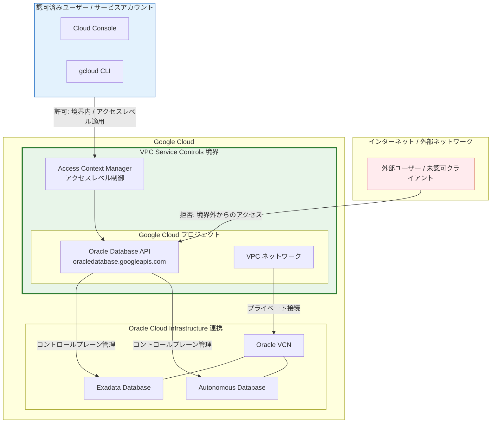

# Oracle Database@Google Cloud: VPC Service Controls サポートが GA に昇格

**リリース日**: 2026-03-31

**サービス**: Oracle Database@Google Cloud

**機能**: VPC Service Controls による Oracle Database@Google Cloud のセキュリティ境界保護

**ステータス**: GA (Generally Available)

📊 [このアップデートのインフォグラフィックを見る](https://takech9203.github.io/google-cloud-news-summary/20260331-oracle-database-vpc-service-controls-ga.html)

## 概要

Oracle Database@Google Cloud が VPC Service Controls に正式対応し、GA (一般提供) となりました。VPC Service Controls はサービス境界 (Service Perimeter) を設定することで、Google Cloud リソースへの不正アクセスやデータ流出のリスクを軽減するセキュリティ機能です。今回のアップデートにより、Oracle Database@Google Cloud のコントロールプレーン API (`oracledatabase.googleapis.com`) を VPC Service Controls の境界内で保護できるようになりました。

Oracle Database@Google Cloud は、Google Cloud のインフラストラクチャ上で Oracle Database を直接運用できるマネージドサービスです。Exadata Database や Autonomous Database といった Oracle のエンタープライズデータベースを Google Cloud のネットワーク内で利用できますが、これまでは VPC Service Controls による境界保護が正式にサポートされていませんでした。今回の GA リリースにより、コントロールプレーン API への外部からのアクセスを制限し、組織のセキュリティポリシーに準拠した運用が可能になります。

本アップデートは、Oracle Database@Google Cloud を利用する金融機関、医療機関、政府機関など、厳格なデータ保護要件を持つ組織にとって特に重要です。規制対応やコンプライアンス要件を満たしつつ、マルチクラウド環境での Oracle Database 運用を安全に行えるようになります。

**アップデート前の課題**

- Oracle Database@Google Cloud のコントロールプレーン API に対して VPC Service Controls の境界保護を適用できず、API アクセスの制御が IAM ポリシーのみに依存していた
- データ流出防止の観点から、Oracle Database@Google Cloud の管理操作を組織の VPC セキュリティ境界内に閉じ込めることができなかった
- 規制産業のお客様が Oracle Database@Google Cloud を導入する際に、VPC Service Controls 非対応がセキュリティ監査上の懸念事項となっていた

**アップデート後の改善**

- Oracle Database@Google Cloud のコントロールプレーン API (`oracledatabase.googleapis.com`) を VPC Service Controls の境界で保護できるようになった
- サービス境界の制限付きサービスとして Oracle Database@Google Cloud を追加し、不正な API アクセスやデータ流出リスクを低減できるようになった
- Access Context Manager と組み合わせて、アクセスレベルによる細かなアクセス制御が可能になり、エンタープライズ環境での柔軟なセキュリティポリシー運用が実現した

## アーキテクチャ図



VPC Service Controls のサービス境界が Oracle Database@Google Cloud のコントロールプレーン API を保護し、境界外からの不正アクセスを遮断します。認可済みユーザーは Access Context Manager のアクセスレベルを通じてアクセスが許可されます。なお、データプレーン (Oracle データベースへの直接接続) は VPC ネットワークと Oracle VCN 間のプライベート接続を通じて行われ、VPC Service Controls の制御対象外となります。

## サービスアップデートの詳細

### 主要機能

1. **サービス境界によるコントロールプレーン API の保護**
   - `oracledatabase.googleapis.com` を VPC Service Controls の制限付きサービスとして登録可能
   - サービス境界内のプロジェクトからのみ Oracle Database@Google Cloud の管理操作 (データベースの作成、削除、構成変更など) を実行可能
   - 境界外からの API リクエストは自動的にブロックされ、データ流出リスクを低減

2. **Access Context Manager との統合**
   - アクセスレベルを設定して、特定の IP 範囲やデバイスポリシーに基づくアクセス許可が可能
   - 境界外の信頼された環境からの管理アクセスを細かく制御
   - イングレスポリシーとエグレスポリシーによる双方向のアクセス制御

3. **Shared VPC 環境でのサポート**
   - ホストプロジェクトとサービスプロジェクトの両方を同一サービス境界に含めることで、Shared VPC 環境でも VPC Service Controls を活用可能
   - ODB Network と ODB Subnet を使用した組織横断的なネットワーク管理との併用が可能

## 技術仕様

### VPC Service Controls 対応状況

| 項目 | 詳細 |
|------|------|
| サービス名 | `oracledatabase.googleapis.com` |
| ステータス | GA (一般提供) |
| 境界保護 | 対応 (コントロールプレーン API のみ) |
| データプレーン保護 | 非対応 (OCI 環境内のデータベース接続は対象外) |
| OCI コントロールプレーン API | 非対応 (VPC SC 境界の制御対象外) |
| Oracle VCN の制御 | 非対応 (Google Cloud 外のため対象外) |

### 制限事項の詳細

| 制限事項 | 説明 |
|----------|------|
| コントロールプレーンのみ | VPC Service Controls はコントロールプレーン API のみを制御し、Exadata Database や Autonomous Database へのデータプレーンアクセスは制御対象外 |
| OCI API 非対応 | OCI コントロールプレーン API は VPC Service Controls の制御を受けない |
| Oracle VCN 非対応 | Oracle Virtual Cloud Networks は Google Cloud 外に存在するため、VPC Service Controls で直接制限できない |
| ネットワーキングレイヤー | Google Cloud と OCI 間のネットワーキングレイヤーは境界の監視・制限対象外 |

## 設定方法

### 前提条件

1. Google Cloud プロジェクトが作成済みで、課金が有効であること
2. Access Context Manager API が有効であること
3. VPC Service Controls の管理に必要な IAM ロール (`roles/accesscontextmanager.policyAdmin`) が付与されていること
4. Oracle Database@Google Cloud がプロジェクト内でプロビジョニング済みであること

### 手順

#### ステップ 1: アクセスポリシーの確認

```bash
# 組織のアクセスポリシーを確認
gcloud access-context-manager policies list \
    --organization=ORGANIZATION_ID
```

組織に既存のアクセスポリシーがない場合は、Google Cloud コンソールの VPC Service Controls ページから新規作成します。

#### ステップ 2: サービス境界の作成

```bash
# サービス境界を作成
gcloud access-context-manager perimeters create oracle-db-perimeter \
    --title="Oracle Database Perimeter" \
    --resources=projects/PROJECT_NUMBER \
    --restricted-services=oracledatabase.googleapis.com \
    --policy=POLICY_ID
```

Oracle Database@Google Cloud を利用するプロジェクトを境界に追加し、`oracledatabase.googleapis.com` を制限付きサービスとして指定します。

#### ステップ 3: 追加の制限付きサービスの設定 (推奨)

```bash
# 関連サービスも境界に追加してセキュリティを強化
gcloud access-context-manager perimeters update oracle-db-perimeter \
    --policy=POLICY_ID \
    --add-restricted-services=compute.googleapis.com,storage.googleapis.com
```

Oracle Database@Google Cloud と連携する可能性のある Compute Engine API や Cloud Storage API も制限付きサービスに追加することで、包括的なデータ流出防止を実現します。

#### ステップ 4: アクセスレベルの設定 (オプション)

```bash
# 特定の IP 範囲からのアクセスを許可するアクセスレベルを作成
gcloud access-context-manager levels create trusted-admin-access \
    --title="Trusted Admin Access" \
    --basic-level-spec=access-level-spec.yaml \
    --policy=POLICY_ID
```

```yaml
# access-level-spec.yaml
- ipSubnetworks:
    - 203.0.113.0/24
    - 198.51.100.0/24
```

境界外から管理操作を行う必要がある場合、アクセスレベルを設定して信頼された IP 範囲からのアクセスを許可します。

## メリット

### ビジネス面

- **コンプライアンス対応の強化**: 金融規制 (PCI DSS)、医療情報保護 (HIPAA)、政府系規制などの要件を満たすための追加的なセキュリティレイヤーを提供
- **セキュリティ監査の簡素化**: VPC Service Controls のログにより、Oracle Database@Google Cloud への API アクセスを一元的に監視・監査でき、コンプライアンス報告が容易に
- **マルチクラウド戦略の安全な推進**: Google Cloud と Oracle Cloud Infrastructure のハイブリッド環境において、Google Cloud 側のセキュリティガバナンスを確立

### 技術面

- **データ流出防止**: サービス境界により、Oracle Database@Google Cloud のコントロールプレーン API を経由した不正なデータアクセスや構成変更を防止
- **ゼロトラストアーキテクチャとの親和性**: IAM に加えてネットワークベースの境界制御を重ねることで、多層防御 (Defense in Depth) を実現
- **既存 VPC SC 境界との統合**: 他の Google Cloud サービス (BigQuery、Cloud Storage など) と同じ境界内で一元管理が可能

## デメリット・制約事項

### 制限事項

- VPC Service Controls はコントロールプレーン API のみを保護し、Oracle データベースへのデータプレーンアクセス (SQL 接続など) は保護対象外
- OCI 側のコントロールプレーン API やネットワーク設定は VPC Service Controls の制御範囲外であり、OCI 側では別途 OCI のセキュリティ機能 (Network Security Groups など) を構成する必要がある
- Google Cloud と OCI 間のネットワーキングレイヤー (プライベート接続の確立) はサービス境界の監視・制限対象外

### 考慮すべき点

- サービス境界の設定後、境界外からの Oracle Database@Google Cloud 管理操作がブロックされるため、運用チームのアクセス要件を事前に整理し、適切なアクセスレベルやイングレスポリシーを設定する必要がある
- Shared VPC 環境では、ホストプロジェクトとサービスプロジェクトの両方を同一境界に含める必要があり、境界設計の複雑性が増す
- VPC Service Controls の変更が反映されるまで最大 30 分かかるため、緊急の構成変更時にはタイムラグを考慮する必要がある
- データプレーンのセキュリティ確保には OCI 側の Network Security Groups や VCN のセキュリティリストなど、別途 OCI 側でのセキュリティ構成が必要

## ユースケース

### ユースケース 1: 金融機関の Oracle Database 基盤移行

**シナリオ**: 金融機関が既存のオンプレミス Oracle Database を Oracle Database@Google Cloud に移行する際、規制要件として管理 API へのアクセスを社内ネットワークからのみに制限する必要がある。

**実装例**:
```bash
# 金融系プロジェクトの境界を作成
gcloud access-context-manager perimeters create finance-oracle-perimeter \
    --title="Finance Oracle DB Perimeter" \
    --resources=projects/FINANCE_PROJECT_NUMBER \
    --restricted-services=oracledatabase.googleapis.com,compute.googleapis.com \
    --policy=POLICY_ID

# 社内ネットワークからのアクセスのみ許可
gcloud access-context-manager levels create corporate-network \
    --title="Corporate Network Access" \
    --basic-level-spec=corporate-access.yaml \
    --policy=POLICY_ID
```

**効果**: コントロールプレーン API への社外からのアクセスが自動的にブロックされ、PCI DSS などの金融規制に準拠したデータベース管理環境を実現。

### ユースケース 2: マルチチーム環境での Oracle Database 管理の分離

**シナリオ**: 大規模組織で複数のチームが異なる Oracle Database@Google Cloud インスタンスを利用しており、チーム間でのコントロールプレーン操作を分離したい。

**効果**: チームごとに異なるサービス境界を設定することで、各チームは自チームのプロジェクト内の Oracle Database のみを管理でき、他チームのリソースへの誤操作や不正アクセスを防止できる。

## 料金

VPC Service Controls 自体の利用に追加料金は発生しません。ただし、以下の関連コストが発生する可能性があります。

### 料金例

| 項目 | 料金 |
|------|------|
| VPC Service Controls | 無料 |
| Access Context Manager | 無料 |
| Oracle Database@Google Cloud (Exadata) | 既存のサブスクリプション料金に従う |
| Oracle Database@Google Cloud (Autonomous Database) | 既存の OCPU / ストレージ料金に従う |
| VPC Service Controls の監査ログ (Cloud Logging) | ログ取り込み量に応じた Cloud Logging の料金 |

## 利用可能リージョン

Oracle Database@Google Cloud が利用可能な全リージョンで VPC Service Controls のサポートが提供されます。Oracle Database@Google Cloud の対応リージョンについては、[Oracle Database@Google Cloud のリージョン](https://cloud.google.com/oracle/database/docs/locations) を参照してください。

## 関連サービス・機能

- **VPC Service Controls**: Google Cloud リソースのセキュリティ境界を定義し、データ流出を防止するサービス
- **Access Context Manager**: VPC Service Controls と連携して、属性ベースのアクセス制御 (IP 範囲、デバイスポリシーなど) を提供
- **Oracle Database@Google Cloud**: Google Cloud 上で Oracle Exadata Database や Autonomous Database を運用するマネージドサービス
- **Cloud Audit Logs**: VPC Service Controls 境界内外の API アクセスを監査ログとして記録
- **Organization Policy Service**: VPC Service Controls と組み合わせて組織全体のセキュリティポリシーを適用

## 参考リンク

- 📊 [インフォグラフィック](https://takech9203.github.io/google-cloud-news-summary/20260331-oracle-database-vpc-service-controls-ga.html)
- [公式リリースノート](https://cloud.google.com/release-notes#March_31_2026)
- [Oracle Database@Google Cloud ドキュメント](https://cloud.google.com/oracle/database/docs)
- [VPC Service Controls 概要](https://cloud.google.com/vpc-service-controls/docs/overview)
- [VPC Service Controls 対応プロダクト一覧](https://cloud.google.com/vpc-service-controls/docs/supported-products)
- [サービス境界の作成](https://cloud.google.com/vpc-service-controls/docs/create-service-perimeters)

## まとめ

Oracle Database@Google Cloud の VPC Service Controls 対応 GA は、エンタープライズ環境でのセキュリティとコンプライアンス要件を満たすための重要なマイルストーンです。コントロールプレーン API をサービス境界で保護することで、データ流出リスクの低減と規制対応の強化を実現します。Oracle Database@Google Cloud を本番運用している組織は、既存の VPC Service Controls 境界に `oracledatabase.googleapis.com` を追加し、包括的なセキュリティ体制を構築することを推奨します。ただし、データプレーンのセキュリティは OCI 側の Network Security Groups で別途対応する必要がある点に留意してください。

---

**タグ**: #OracleDatabase #GoogleCloud #VPCServiceControls #セキュリティ #GA #コンプライアンス #データ流出防止 #マルチクラウド #Exadata #AutonomousDatabase
