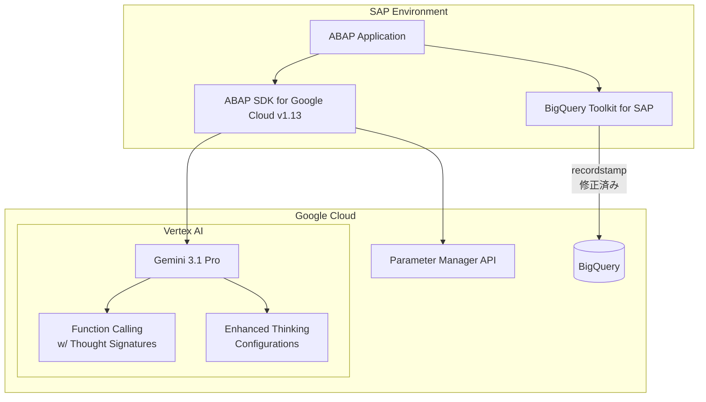

# SAP on Google Cloud: ABAP SDK for Google Cloud バージョン 1.13 (オンプレミスまたは任意のクラウドエディション)

**リリース日**: 2026-03-31

**サービス**: SAP on Google Cloud

**機能**: ABAP SDK for Google Cloud v1.13 - Gemini 3.1 Pro 対応強化、Parameter Manager API サポート、BigQuery Toolkit 修正

**ステータス**: GA (Generally Available)

:bar_chart: [このアップデートのインフォグラフィックを見る](https://takech9203.github.io/google-cloud-news-summary/20260331-sap-abap-sdk-v1-13.html)

## 概要

ABAP SDK for Google Cloud のバージョン 1.13 (オンプレミスまたは任意のクラウドエディション) が一般提供 (GA) となった。本バージョンでは、最新の Gemini 3.1 Pro モデルに対応し、Thought Signatures を用いた Function Calling と強化された Thinking Configurations によるモデル推論の最適化をサポートする。

さらに、Parameter Manager API の新規サポートが追加され、SAP 環境からアプリケーション構成パラメータの一元管理が可能となった。加えて、BigQuery Toolkit for SAP において、同一プライマリキーを持つ複数レコードを BigQuery にレプリケーションする際の recordstamp フィールドに関する不具合が修正されている。

本アップデートは、SAP 環境と Google Cloud の AI 機能および構成管理機能の統合をさらに深化させるものであり、ABAP 開発者が最新の生成 AI 機能を活用したエンタープライズアプリケーションを構築する際に直接的な恩恵をもたらす。

**アップデート前の課題**

- Gemini 3.1 Pro モデルの Thought Signatures を活用した Function Calling がサポートされておらず、モデルの推論プロセスを最適化する手段が限られていた
- SAP 環境から Parameter Manager API を直接利用できず、アプリケーション構成パラメータの管理に別途連携が必要だった
- BigQuery Toolkit for SAP において、同一プライマリキーを持つ複数レコードをレプリケーションする際に recordstamp フィールドが正しく処理されない不具合があった

**アップデート後の改善**

- Gemini 3.1 Pro モデルの Thought Signatures 付き Function Calling と強化された Thinking Configurations により、モデルの推論精度とトレーサビリティが向上した
- Parameter Manager API のサポートにより、SAP 環境から直接アプリケーション構成パラメータ (データベース接続文字列、フィーチャーフラグ、環境設定など) を管理可能になった
- BigQuery Toolkit の recordstamp フィールドの不具合が修正され、同一プライマリキーを持つレコードのレプリケーションが正確に行われるようになった

## アーキテクチャ図



ABAP SDK v1.13 を介した SAP 環境と Google Cloud サービスの連携構成を示す。Vertex AI の Gemini 3.1 Pro モデルとの Function Calling 連携、Parameter Manager API による構成管理、および BigQuery Toolkit を通じたデータレプリケーションの 3 つの主要な連携パスが含まれる。

## サービスアップデートの詳細

### 主要機能

1. **Gemini 3.1 Pro モデル対応: Thought Signatures 付き Function Calling**
   - 最新の Gemini 3.1 Pro モデルにおいて、Thought Signatures を伴う Function Calling をサポート
   - モデルが関数を選択する際の思考プロセス (推論の根拠) を取得可能
   - エンタープライズのセキュリティ情報・イベント管理 (SIEM) ガイドラインに沿った Gemini アクションの検証・追跡・ログ記録が可能
   - SAP Function Module の自動呼び出しと組み合わせることで、より精度の高い AI 駆動のビジネスロジック実行を実現

2. **強化された Thinking Configurations によるモデル推論の最適化**
   - モデルの推論パラメータをより細かく制御可能
   - 出力のランダム性や推論の深さを調整し、ユースケースに応じた最適なレスポンスを取得
   - v1.12 で導入されたモデル推論の可視化機能をさらに拡張

3. **Parameter Manager API のサポート**
   - Secret Manager の拡張機能である Parameter Manager API に対応する ABAP クライアントライブラリを提供
   - JSON、YAML などの構造化フォーマットによるアプリケーション構成パラメータの格納・管理
   - 各パラメータは最大 1 MiB のデータを格納可能 (Secret Manager の 64 KiB に対して大幅に拡大)
   - バージョニングによる変更履歴の追跡とロールバック
   - Secret Manager に格納されたシークレットの参照機能

4. **BigQuery Toolkit for SAP: recordstamp フィールドの不具合修正**
   - 同一プライマリキーを持つ複数レコードを BigQuery にレプリケーションする際の recordstamp フィールドの問題を修正
   - データレプリケーションの正確性と信頼性が向上
   - CDC (Change Data Capture) シナリオにおけるデータ整合性が改善

## 技術仕様

### Gemini 3.1 Pro Function Calling with Thought Signatures

| 項目 | 詳細 |
|------|------|
| 対応モデル | Gemini 3.1 Pro |
| Function Calling 方式 | Thought Signatures 対応 |
| Thinking Configurations | 強化版 (推論最適化) |
| ABAP クラス | `/GOOG/CL_GENERATIVE_MODEL` |
| 自動関数チェーン | サポート (v1.11 以降) |

### Parameter Manager API

| 項目 | 詳細 |
|------|------|
| API | Parameter Manager API |
| データフォーマット | JSON, YAML, プレーンテキスト |
| パラメータサイズ上限 | 1 MiB / バージョン |
| バージョニング | ユーザー定義のバージョン名 |
| シークレット参照 | Secret Manager との連携 (最大 15 参照/バージョン) |
| 暗号化 | AES-256 (保存時), TLS (転送時) |

### BigQuery Toolkit 修正内容

| 項目 | 詳細 |
|------|------|
| 修正対象 | recordstamp フィールド |
| 発生条件 | 同一プライマリキーの複数レコードレプリケーション |
| 影響範囲 | BigQuery Toolkit for SAP |

## 設定方法

### 前提条件

1. SAP NetWeaver 7.50 以降がインストールされていること
2. ABAP SDK for Google Cloud がインストール・構成済みであること
3. Google Cloud プロジェクトで Vertex AI API が有効化されていること
4. Parameter Manager API を使用する場合は、同 API の有効化と適切な IAM ロールの付与が必要

### 手順

#### ステップ 1: SDK のアップグレード

ABAP SDK for Google Cloud をバージョン 1.13 にアップグレードする。SAP のトランスポート管理を使用して、最新のトランスポートパッケージを適用する。

#### ステップ 2: Gemini 3.1 Pro のモデル生成パラメータ設定

```abap
" モデルキーの設定 (トランザクション /GOOG/SDK_IMG)
" Gemini 3.1 Pro モデルを指定してモデル生成パラメータを構成
DATA(lo_model) = NEW /goog/cl_generative_model(
  iv_model_key = 'GEMINI_31_PRO_KEY'
).
```

トランザクション `/GOOG/SDK_IMG` でモデル生成パラメータに Gemini 3.1 Pro モデルを登録する。

#### ステップ 3: Parameter Manager API の有効化

```bash
# Google Cloud コンソールで Parameter Manager API を有効化
gcloud services enable parametermanager.googleapis.com --project=PROJECT_ID
```

サービスアカウントに `roles/parametermanager.parameterAccessor` ロールを付与する。

## メリット

### ビジネス面

- **AI 駆動の業務プロセスの高度化**: Thought Signatures によりモデルの推論根拠が可視化され、AI の意思決定に対する説明責任と監査性が向上する
- **構成管理の一元化**: Parameter Manager API により、複数環境 (本番・開発・テスト) のアプリケーション構成を SAP 環境から統一的に管理可能
- **データレプリケーションの信頼性向上**: recordstamp 修正により、SAP から BigQuery へのデータパイプラインの信頼性が向上し、分析基盤の品質が改善

### 技術面

- **推論の最適化**: 強化された Thinking Configurations により、ユースケースに応じたモデル推論の精度とコストのバランスを最適化可能
- **セキュリティの強化**: Parameter Manager の AES-256 暗号化と IAM による細粒度アクセス制御で、構成データのセキュリティを担保
- **開発生産性の向上**: ABAP クライアントライブラリによる Parameter Manager API のネイティブサポートにより、追加の連携開発が不要

## デメリット・制約事項

### 制限事項

- Thought Signatures 付き Function Calling は Gemini 3.1 Pro モデルに限定される
- Parameter Manager API のパラメータバージョンあたりのシークレット参照数は最大 15 個
- Parameter Manager はシークレットの自動ローテーション機能を持たない (Secret Manager 側で管理が必要)

### 考慮すべき点

- v1.12 以前からのアップグレード時には、既存の Thinking Configurations 設定との互換性を確認すること
- BigQuery Toolkit の recordstamp 修正は、既にレプリケーション済みのデータには遡及適用されないため、影響を受けたデータの再レプリケーションが必要な場合がある
- Parameter Manager API はリージョナルエンドポイントをサポートしているため、データレジデンシー要件に応じて適切なリージョンを選択すること

## ユースケース

### ユースケース 1: AI 駆動の SAP 受注処理自動化

**シナリオ**: 顧客からの自然言語による問い合わせに基づき、Gemini 3.1 Pro が SAP の受注データを検索・処理する。Thought Signatures により、モデルがどの SAP Function Module を選択し、どのような推論でパラメータを決定したかを記録する。

**実装例**:
```abap
" Gemini 3.1 Pro を使用した Function Calling
DATA(lo_model) = NEW /goog/cl_generative_model(
  iv_model_key = 'GEMINI_31_PRO'
).

" SAP Function Module を関数として宣言
lo_model->add_function_declaration(
  iv_name        = 'GET_SALES_ORDER'
  iv_description = 'Retrieve sales order details from SAP'
  iv_fm_name     = 'Z_GET_SALES_ORDER'
).

" Thought Signatures 付きで推論を実行
lo_model->generate_content(
  iv_prompt = 'Show me the latest sales order for customer ABC Corp'
).
```

**効果**: モデルの推論根拠が可視化されることで、監査要件を満たしつつ、顧客対応の自動化と応答速度の向上を実現できる。

### ユースケース 2: マルチ環境構成管理の統合

**シナリオ**: SAP の本番・開発・テスト環境それぞれで異なるデータベース接続文字列やフィーチャーフラグを Parameter Manager で一元管理し、ABAP SDK 経由でランタイムに動的取得する。

**効果**: 環境固有の設定変更時にアプリケーションの再デプロイが不要となり、運用の柔軟性と構成の一貫性が向上する。

## 料金

ABAP SDK for Google Cloud 自体は無料で利用可能。ただし、連携する Google Cloud サービスの利用料金が発生する。

- **Vertex AI (Gemini 3.1 Pro)**: 入出力トークン数に基づく従量課金
- **Parameter Manager API**: Secret Manager の拡張機能として、パラメータバージョンのアクセス操作数に基づく課金
- **BigQuery**: ストレージおよびクエリの従量課金

詳細な料金については、各サービスの料金ページを参照のこと。

## 関連サービス・機能

- **Vertex AI**: Gemini 3.1 Pro モデルの提供元。Function Calling、Thinking Configurations の基盤
- **Secret Manager / Parameter Manager**: アプリケーション構成とシークレットの一元管理サービス
- **BigQuery**: SAP データのレプリケーション先。BigQuery Toolkit for SAP と連携
- **Vertex AI SDK for ABAP**: ABAP 環境から Vertex AI の機能にアクセスするための SDK コンポーネント
- **BigQuery Toolkit for SAP**: SAP テーブルから BigQuery へのプログラマティックなデータレプリケーション
- **Cloud Logging / Cloud Monitoring**: SAP ワークロードの監視・ログ管理

## 参考リンク

- :bar_chart: [インフォグラフィック](https://takech9203.github.io/google-cloud-news-summary/20260331-sap-abap-sdk-v1-13.html)
- [公式リリースノート](https://cloud.google.com/release-notes#March_31_2026)
- [ABAP SDK for Google Cloud - What's New](https://cloud.google.com/sap/docs/abap-sdk/on-premises-or-any-cloud/whats-new)
- [SAP Function Calling with Gemini](https://cloud.google.com/sap/docs/abap-sdk/on-premises-or-any-cloud/latest/vertex-ai-sdk/use-function-calling)
- [Parameter Manager 概要](https://cloud.google.com/secret-manager/parameter-manager/docs/overview)
- [BigQuery Toolkit for SAP 概要](https://cloud.google.com/sap/docs/abap-sdk/on-premises-or-any-cloud/latest/bq-toolkit-for-sap-overview)
- [ABAP SDK for Google Cloud 概要](https://cloud.google.com/sap/docs/abap-sdk/overview)

## まとめ

ABAP SDK for Google Cloud v1.13 は、Gemini 3.1 Pro の Thought Signatures 付き Function Calling、Parameter Manager API サポート、BigQuery Toolkit の recordstamp 修正という 3 つの重要なアップデートを含む。SAP 環境で最新の AI 機能を活用している組織は、推論のトレーサビリティ向上と構成管理の効率化のために早期のアップグレードを推奨する。特に BigQuery Toolkit を使用してデータレプリケーションを行っている環境では、recordstamp の不具合修正のため速やかな適用を検討されたい。

---

**タグ**: #SAP #ABAP-SDK #Google-Cloud #Gemini-3.1-Pro #Function-Calling #Thought-Signatures #Parameter-Manager #BigQuery #BigQuery-Toolkit #Vertex-AI #GA
