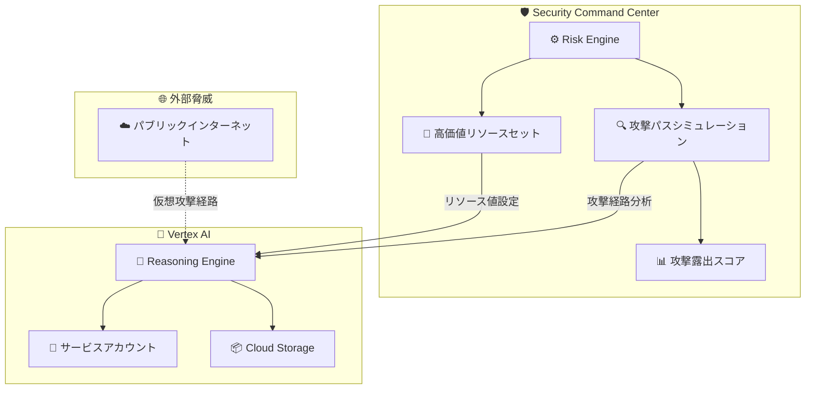

# Security Command Center: Risk Engine が Vertex AI Reasoning Engine をサポート

**リリース日**: 2026-03-31

**サービス**: Security Command Center

**機能**: Risk Engine における Vertex AI Reasoning Engine (aiplatform.googleapis.com/ReasoningEngine) のサポート

**ステータス**: Feature

📊 [このアップデートのインフォグラフィックを見る](https://takech9203.github.io/google-cloud-news-summary/20260331-security-command-center-risk-engine-reasoning.html)

## 概要

Security Command Center の Risk Engine が、Vertex AI の Reasoning Engine (`aiplatform.googleapis.com/ReasoningEngine`) を攻撃パスシミュレーションおよび高価値リソースセットの両方でサポートするようになった。これにより、AI エージェントを構築・デプロイするための基盤である Reasoning Engine リソースが、セキュリティリスク評価の対象として組み込まれ、攻撃露出スコアの計算や攻撃パスの可視化が可能になる。

Vertex AI Reasoning Engine は、LangChain、LangGraph、AG2、LlamaIndex などの OSS エージェントフレームワークを使用して AI エージェントをデプロイするためのマネージドサービスである。AI ワークロードは機密データへのアクセスや重要なビジネスロジックの実行を担うことが多く、セキュリティの観点から保護対象として適切に管理する必要がある。今回のアップデートにより、これらの AI エージェントリソースに対するセキュリティ態勢を Risk Engine で統合的に管理できるようになった。

**アップデート前の課題**

- Reasoning Engine リソースは Risk Engine の攻撃パスシミュレーションの対象外であり、AI エージェントに対する潜在的な攻撃経路を可視化できなかった
- 高価値リソースセットに Reasoning Engine を含めることができず、AI ワークロードのリスク優先度を適切に設定できなかった
- AI エージェントが持つ IAM 権限やサービスアカウントを介した攻撃経路が、セキュリティ評価から漏れる可能性があった

**アップデート後の改善**

- Reasoning Engine リソースが攻撃パスシミュレーションに含まれ、AI エージェントへの潜在的な攻撃経路を可視化できるようになった
- 高価値リソースセットの構成で Reasoning Engine をリソースタイプとして指定し、攻撃露出スコアを算出できるようになった
- AI ワークロード全体のセキュリティリスクを Security Command Center で統合的に管理・優先順位付けできるようになった

## アーキテクチャ図



Risk Engine が Reasoning Engine リソースを攻撃パスシミュレーションと高価値リソースセットの両方で評価対象とし、AI エージェントへの潜在的な攻撃経路と攻撃露出スコアを算出する。

## サービスアップデートの詳細

### 主要機能

1. **攻撃パスシミュレーションでの Reasoning Engine サポート**
   - Risk Engine の攻撃パスシミュレーションが `aiplatform.googleapis.com/ReasoningEngine` リソースを認識するようになった
   - 仮想攻撃者がパブリックインターネットから Reasoning Engine リソースに到達する経路を可視化
   - Reasoning Engine に関連する脆弱性や設定ミスの検出結果に対して攻撃露出スコアを算出

2. **高価値リソースセットへの組み込み**
   - リソース値構成 (Resource Value Configuration) で Reasoning Engine をリソースタイプとして指定可能
   - High / Medium / Low の優先度値を割り当て、組織のセキュリティ要件に応じたリスク評価が可能
   - 最大 1,000 リソースインスタンスを高価値リソースセットに含めることが可能

3. **AI ワークロードのセキュリティ態勢管理**
   - Reasoning Engine が使用するサービスアカウントの権限に関する攻撃経路を分析
   - Cloud Storage へのアクセスや Vertex AI API の利用に関するリスク評価
   - 既存の SCC の脅威検出サービス (Event Threat Detection、Container Threat Detection) と組み合わせた包括的なセキュリティ監視

## 技術仕様

### Risk Engine の対応範囲

| 項目 | 詳細 |
|------|------|
| 対象リソースタイプ | `aiplatform.googleapis.com/ReasoningEngine` |
| 対応機能 | 攻撃パスシミュレーション、高価値リソースセット |
| 必要なサービスティア | Premium または Enterprise (組織レベルのアクティベーションが必要) |
| シミュレーション頻度 | 約 6 時間ごと (最低 1 日 1 回) |
| 高価値リソースセット上限 | クラウドプロバイダーあたり最大 1,000 リソースインスタンス |
| リソース値構成の上限 | 組織あたり最大 100 構成 |

### Reasoning Engine の概要

| 項目 | 詳細 |
|------|------|
| サービス | Vertex AI Reasoning Engine |
| 用途 | AI エージェントの構築・デプロイ |
| 対応フレームワーク | google-adk, langchain, langgraph, ag2, llama-index, custom |
| デプロイ方式 | PackageSpec またはソースコード指定 (InlineSource / DeveloperConnectSource) |
| ID タイプ | SERVICE_AGENT, SERVICE_ACCOUNT, AGENT_IDENTITY |

### 必要な IAM ロール

```
# 攻撃パスの閲覧
roles/securitycenter.attackPathsViewer

# 検出結果の閲覧 (攻撃パス付き)
roles/securitycenter.findingsViewer

# 高価値リソースの攻撃パス閲覧
roles/securitycenter.assetsViewer
roles/securitycenter.valuedResourcesViewer

# リソース値構成の管理
roles/securitycenter.resourceValueConfigEditor
roles/securitycenter.resourceValueConfigsViewer
roles/securitycenter.settingsEditor
```

## 設定方法

### 前提条件

1. Security Command Center Premium または Enterprise ティアが組織レベルで有効化されていること
2. 適切な IAM ロールが付与されていること
3. Vertex AI Reasoning Engine がデプロイ済みであること

### 手順

#### ステップ 1: 高価値リソースセットに Reasoning Engine を追加

Google Cloud Console で Security Command Center の設定ページに移動し、攻撃パスシミュレーションの構成を作成する。

1. **Security Command Center** > **設定** > **攻撃パスシミュレーション** に移動
2. **新しい構成を作成** をクリック
3. 以下の設定を行う:
   - **名前**: 任意の構成名 (例: `reasoning-engine-high-value`)
   - **クラウドプロバイダー**: Google Cloud
   - **スコープ**: 対象のプロジェクトまたはフォルダを選択
   - **リソースタイプ**: `aiplatform.googleapis.com/ReasoningEngine` を選択
   - **リソース値**: High / Medium / Low から適切な値を選択
4. **保存** をクリック

#### ステップ 2: 攻撃パスシミュレーションの実行を確認

```bash
# SCC の検出結果を確認 (gcloud CLI)
gcloud scc findings list organizations/ORGANIZATION_ID \
  --source=organizations/ORGANIZATION_ID/sources/RISK_ENGINE_SOURCE_ID \
  --filter="resourceName:reasoningEngines"
```

次回の攻撃パスシミュレーション実行後 (約 6 時間以内) に、Reasoning Engine リソースに対する攻撃パスと攻撃露出スコアが生成される。

## メリット

### ビジネス面

- **AI ワークロードのリスク可視化**: AI エージェントへの攻撃リスクを定量的に把握し、経営層への報告やリスク管理に活用できる
- **コンプライアンス対応の強化**: AI システムのセキュリティ態勢を体系的に管理し、監査要件への対応を効率化できる

### 技術面

- **統合的なセキュリティ管理**: AI ワークロードのセキュリティリスクを他のクラウドリソースと同じフレームワークで評価・優先順位付けできる
- **攻撃経路の可視化**: Reasoning Engine に到達する具体的な攻撃経路を把握し、効果的な防御策を講じることができる
- **プロアクティブなリスク対応**: シミュレーションベースの分析により、実際の攻撃が発生する前に脆弱性を特定・修正できる

## デメリット・制約事項

### 制限事項

- Security Command Center Premium または Enterprise ティアが必要であり、Standard ティアでは利用不可
- 組織レベルのアクティベーションが必須で、プロジェクトレベルのアクティベーションでは攻撃パスシミュレーションを使用できない
- 攻撃パスシミュレーションは約 6 時間ごとに実行されるため、リアルタイムの評価ではない
- 高価値リソースセットにはクラウドプロバイダーあたり最大 1,000 リソースインスタンスの制限がある

### 考慮すべき点

- 攻撃パスは仮想的なシミュレーション結果であり、実際の攻撃の証拠ではない
- Reasoning Engine のサービスアカウント権限を適切に設定しないと、攻撃露出スコアが不正確になる可能性がある
- リソース値構成の作成・変更後、次回のシミュレーション実行まで反映されない

## ユースケース

### ユースケース 1: AI エージェントのセキュリティリスク評価

**シナリオ**: 企業が Vertex AI Reasoning Engine で複数の AI エージェントをデプロイしており、これらのエージェントが顧客データへのアクセス権を持つサービスアカウントで実行されている。セキュリティチームは、これらの AI エージェントへの潜在的な攻撃経路を把握したい。

**実装例**:
```
# リソース値構成の作成
名前: ai-agents-critical
クラウドプロバイダー: Google Cloud
スコープ: projects/my-ai-project
リソースタイプ: aiplatform.googleapis.com/ReasoningEngine
リソース値: High
```

**効果**: Reasoning Engine リソースに対する攻撃露出スコアが算出され、脆弱性の優先度付けと修正が効率化される。

### ユースケース 2: マルチクラウド環境での AI セキュリティ統合管理

**シナリオ**: Enterprise ティアを使用する組織が Google Cloud と AWS の両方で AI ワークロードを運用しており、Google Cloud 上の Reasoning Engine と他のクラウドリソースを含む統合的なセキュリティ態勢管理を実現したい。

**効果**: Security Command Center Enterprise の攻撃パスシミュレーションにより、クラウド横断的な攻撃経路を可視化し、AI ワークロードを含む組織全体のセキュリティリスクを一元管理できる。

## 料金

Risk Engine の攻撃パスシミュレーションと高価値リソースセットの機能は、Security Command Center の Premium または Enterprise ティアに含まれる。

| ティア | 料金体系 |
|--------|----------|
| Premium (従量課金) | Google Cloud サービスの利用量に基づく課金 |
| Premium (サブスクリプション) | 固定料金のサブスクリプション |
| Enterprise | サブスクリプション (Google Cloud Sales またはパートナー経由) |

詳細な料金については [Security Command Center の料金ページ](https://cloud.google.com/security-command-center/pricing) を参照。

## 利用可能リージョン

Security Command Center の Risk Engine は組織レベルで有効化されるグローバルサービスであり、特定のリージョンに依存しない。Vertex AI Reasoning Engine がデプロイされているリージョンのリソースが攻撃パスシミュレーションの対象となる。

## 関連サービス・機能

- **Vertex AI Reasoning Engine**: AI エージェントの構築・デプロイ基盤。今回のアップデートで Risk Engine のサポート対象に追加
- **Security Command Center AI Protection**: AI ワークロードのセキュリティ態勢管理を支援する機能で、Risk Engine と補完的に機能
- **Event Threat Detection / Container Threat Detection**: 実際の脅威を検出するサービスで、Risk Engine のシミュレーションベースの分析と組み合わせて使用
- **Sensitive Data Protection**: データセンシティビティ分類と連携し、高価値リソースセットの優先度を自動設定

## 参考リンク

- 📊 [インフォグラフィック](https://takech9203.github.io/google-cloud-news-summary/20260331-security-command-center-risk-engine-reasoning.html)
- [公式リリースノート](https://cloud.google.com/release-notes#March_31_2026)
- [攻撃パスシミュレーションの概要](https://cloud.google.com/security-command-center/docs/attack-exposure-learn)
- [攻撃パスシミュレーションの対応機能](https://cloud.google.com/security-command-center/docs/attack-exposure-supported-features)
- [高価値リソースセットの定義](https://cloud.google.com/security-command-center/docs/attack-exposure-define-high-value-resource-set)
- [Vertex AI Reasoning Engine ドキュメント](https://cloud.google.com/vertex-ai/generative-ai/docs/reasoning-engine/overview)
- [Security Command Center のサービスティア](https://cloud.google.com/security-command-center/docs/service-tiers)
- [Security Command Center の料金](https://cloud.google.com/security-command-center/pricing)

## まとめ

Security Command Center の Risk Engine が Vertex AI Reasoning Engine をサポートしたことで、AI エージェントに対する攻撃リスクの可視化と優先順位付けが可能になった。AI ワークロードを本番環境で運用している組織は、Reasoning Engine リソースを高価値リソースセットに追加し、攻撃露出スコアを活用してセキュリティ態勢を強化することを推奨する。特に、サービスアカウントの権限設定や外部からのアクセス経路に関する脆弱性の早期発見と対処が重要である。

---

**タグ**: #SecurityCommandCenter #RiskEngine #VertexAI #ReasoningEngine #AttackPath #HighValueResourceSet #AIセキュリティ #CNAPP
