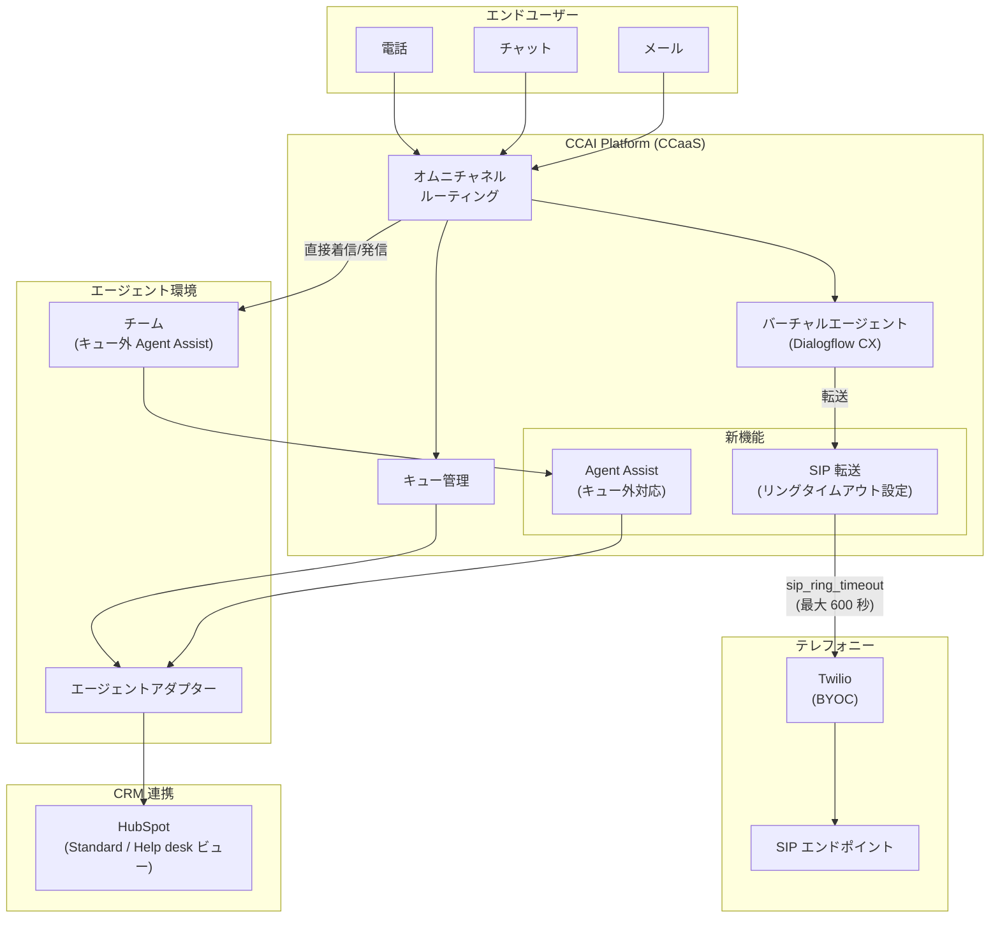

# Google Cloud CCaaS (CCAI Platform): 次期バージョン プレリリースノート

**リリース日**: 2026-04-01

**サービス**: Google Cloud Contact Center as a Service (CCaaS) / CCAI Platform

**機能**: 次期 CCaaS バージョンのプレリリースノート (複数の新機能およびバグ修正)

**ステータス**: Pre-release (Announcement / Feature / Fixed)

[このアップデートのインフォグラフィックを見る](https://takech9203.github.io/google-cloud-news-summary/20260401-ccaas-prerelease-april.html)

## 概要

Google Cloud Contact Center as a Service (CCaaS) / CCAI Platform の次期バージョンに関するプレリリースノートが公開されました。本リリースには、Agent Assist のキュー外インタラクション対応、バーチャルエージェント転送時の SIP リングタイムアウト設定、HubSpot CRM の新しいヘルプデスクビューの 3 つの新機能と、12 件のバグ修正が含まれています。

CCAI Platform は Google Cloud 上にネイティブに構築された AI 駆動のコンタクトセンタープラットフォームであり、Gemini Enterprise for Customer Experience の一部として、音声およびデジタルチャネルにわたるオムニチャネルルーティング、バーチャルエージェント、Agent Assist、Insights 機能を提供しています。今回のアップデートは、コンタクトセンターの柔軟性と安定性を大幅に向上させるものです。

**注意**: これはプレリリースノートであり、正式リリース前に内容が変更される可能性があります。

**アップデート前の課題**

- Agent Assist はキューに関連付けられたインタラクションでのみ利用可能であり、直接着信や発信通話では AI アシスタンス機能を活用できなかった
- バーチャルエージェントから SIP エンドポイントへの転送時にリングタイムアウトのカスタマイズができず、転送先の応答待ち時間を制御できなかった
- HubSpot CRM 連携におけるチケットビューは Standard ビューのみで、リアルタイムのヘルプデスク表示には対応していなかった
- React Native メールアダプター、チャットリダクション、通話録音転送など、複数のコンポーネントでバグが存在していた

**アップデート後の改善**

- Agent Assist をチームレベルで有効化し、キュー外のインタラクション (直接着信、キューなし発信) でも AI アシスタンスを利用可能に
- Twilio ユーザーは `sip_ring_timeout` フィールドを使用して最大 600 秒のリングタイムアウトを設定可能に
- HubSpot CRM 連携で Standard ビューに加えてリアルタイムのヘルプデスクビューを選択可能に
- 12 件のバグ修正により、プラットフォーム全体の安定性と信頼性が向上

## アーキテクチャ図



この図は、CCAI Platform の主要コンポーネントと今回のアップデートで追加・改善された機能の関係を示しています。Agent Assist のキュー外対応、SIP リングタイムアウト設定、HubSpot ヘルプデスクビューの 3 つの新機能がアーキテクチャ上どこに位置するかを表しています。

## サービスアップデートの詳細

### 新機能

1. **Agent Assist のキュー外インタラクション対応**
   - Agent Assist がキューに関連付けられていない通話やチャットでも利用可能になりました
   - チームレベルで Agent Assist を有効化することで、直接着信 (ダイレクトインバウンドコール) やキューなしの発信通話でも AI アシスタンス機能を活用できます
   - これまで Agent Assist はキューに紐づけて設定する必要がありましたが、本機能によりキュー外のインタラクションでもリアルタイムの提案、ナレッジアシスト、センチメント分析などの Agent Assist 機能が利用可能になります

2. **バーチャルエージェント転送時の SIP リングタイムアウト設定**
   - バーチャルエージェントから SIP エンドポイントへの転送時にリングタイムアウトを設定できるようになりました
   - Twilio ユーザーは `sip_ring_timeout` フィールドを使用して、最大 600 秒 (10 分) までのタイムアウトを設定可能です
   - この設定により、転送先の SIP エンドポイントが応答するまでの待機時間をより柔軟に制御できるようになります

3. **HubSpot CRM の新しいヘルプデスクビュー**
   - HubSpot CRM 連携において、新しいリアルタイムのヘルプデスクビューが追加されました
   - 従来の Standard ビューに加えて、Help desk ビューを選択して設定できます
   - Help desk ビューではリアルタイムでチケット情報を確認でき、エージェントの業務効率が向上します

### バグ修正

本リリースでは以下の 12 件のバグが修正されています:

1. **React Native メールアダプター** - React Native 環境でのメールアダプターの問題を修正
2. **チャットリダクション** - チャットメッセージのリダクション (個人情報等の自動マスキング) に関する問題を修正
3. **通話録音転送** - 通話録音の転送処理における問題を修正
4. **メール自動割り当て** - メールセッションの自動割り当て機能の問題を修正
5. **過容量デフレクションメッセージ** - 過容量時のデフレクションメッセージ表示の問題を修正
6. **同一キュー内チャット転送** - 同一キュー内でのチャット転送に関する問題を修正
7. **603 Decline エラー** - SIP 603 Decline レスポンスに関するエラー処理を修正
8. **セッション ID ミスマッチ** - セッション ID の不一致による問題を修正
9. **ユーザー検索** - ユーザー検索機能の問題を修正
10. **メールボックス切り替え** - メールボックス間の切り替え操作の問題を修正
11. **直接通話の過容量デフレクション** - 直接通話における過容量デフレクション処理の問題を修正
12. **Reporting API データ型ミスマッチ** - Reporting API でのデータ型の不一致を修正

## 技術仕様

### SIP リングタイムアウト設定

| 項目 | 詳細 |
|------|------|
| フィールド名 | `sip_ring_timeout` |
| 最大値 | 600 秒 (10 分) |
| 対象テレフォニー | Twilio |
| 適用対象 | バーチャルエージェントから SIP エンドポイントへの転送 |

### SIP 転送カスタムペイロード例

```json
{
  "ujet": {
    "type": "action",
    "action": "deflection",
    "deflection_type": "sip",
    "sip_uri": "sip:1-999-123-4567@voip-provider.example.net",
    "sip_ring_timeout": 120
  }
}
```

### Agent Assist キュー外対応の設定レベル

| 項目 | 詳細 |
|------|------|
| 設定レベル | チームレベル |
| 対応チャネル | 通話 (音声) およびチャット |
| 対象インタラクション | 直接着信 (ダイレクトインバウンド)、キューなし発信 |

### HubSpot CRM ビュー設定

| ビュータイプ | 説明 |
|------|------|
| Standard ビュー | 従来のチケット表示方式 |
| Help desk ビュー | 新しいリアルタイムヘルプデスク表示方式 |

## 設定方法

### Agent Assist のキュー外設定

#### 前提条件

1. CCAI Platform の管理者権限を持つアカウント
2. Agent Assist プラットフォームが設定済みであること
3. Google Cloud サービスアカウントと IAM ロール (Dialogflow Agent Assist Client) の設定

#### ステップ 1: Agent Assist プラットフォームの確認

CCAI Platform ポータルで Settings > Developer Settings に移動し、Agent Assist Platform が追加されていることを確認します。

#### ステップ 2: チームレベルでの Agent Assist 有効化

チーム設定画面から、キュー外インタラクションに対して Agent Assist を有効化します。これにより、直接着信やキューなし発信でも Agent Assist 機能が利用可能になります。

### SIP リングタイムアウトの設定

#### ステップ 1: Dialogflow CX カスタムペイロードの設定

Dialogflow CX のフルフィルメントで、SIP 転送用のカスタムペイロードに `sip_ring_timeout` フィールドを追加します。

#### ステップ 2: Twilio テレフォニーの確認

Twilio をテレフォニープロバイダーとして使用していることを確認し、SIP エンドポイントの設定が正しいことを検証します。

### HubSpot ヘルプデスクビューの設定

#### ステップ 1: HubSpot 連携の確認

CCAI Platform ポータルで Settings > Developer Settings > CRM に移動し、HubSpot が Agent Platform として選択されていることを確認します。

#### ステップ 2: ビュータイプの選択

チケットビューの設定で Standard ビューまたは新しい Help desk ビューを選択します。

## メリット

### ビジネス面

- **エージェント生産性の向上**: キュー外のインタラクションでも Agent Assist による AI サポートが受けられるため、すべての顧客接点でエージェントの対応品質が向上
- **顧客体験の一貫性**: 直接着信や発信通話でもリアルタイムのナレッジアシストやセンチメント分析が利用可能になり、顧客体験の一貫性を確保
- **CRM 業務効率の改善**: HubSpot のヘルプデスクビューにより、リアルタイムでチケット情報を確認でき、エージェントの情報アクセスが迅速化
- **プラットフォーム安定性の向上**: 12 件のバグ修正により、日常業務での信頼性が改善

### 技術面

- **SIP 転送の柔軟性**: リングタイムアウトのカスタマイズにより、複雑なテレフォニー環境でも適切な転送制御が可能に
- **API の信頼性向上**: Reporting API のデータ型ミスマッチ修正により、レポーティングデータの整合性が改善
- **マルチチャネル安定性**: チャットリダクション、メール自動割り当て、メールボックス切り替えなど複数チャネルでのバグ修正により、オムニチャネル運用の安定性が向上

## デメリット・制約事項

### 制限事項

- 本リリースはプレリリースノートであり、正式リリースまでに内容が変更される可能性がある
- SIP リングタイムアウトの設定は現時点で Twilio ユーザーに限定されている
- `sip_ring_timeout` の最大値は 600 秒 (10 分) に制限されている

### 考慮すべき点

- プレリリース段階のため、本番環境への即座の適用は推奨されない
- Agent Assist のキュー外有効化にあたっては、既存の Agent Assist プラットフォーム設定とサービスアカウントの権限確認が必要
- HubSpot ヘルプデスクビューへの切り替え時には、既存のワークフローへの影響を事前に検証することが推奨される

## ユースケース

### ユースケース 1: アウトバウンド営業チームでの Agent Assist 活用

**シナリオ**: アウトバウンド営業チームが、キューに紐づかない発信通話で顧客にコンタクトする際、Agent Assist のナレッジアシストやリアルタイムセンチメント分析を活用したい。

**効果**: 営業エージェントが通話中にリアルタイムで製品情報やFAQ の提案を受けられるようになり、顧客対応の質が向上します。センチメント分析により、顧客の感情を把握しながら適切な対応を行えます。

### ユースケース 2: IVR からの SIP 転送における応答待ち改善

**シナリオ**: バーチャルエージェントが顧客の問い合わせ内容に応じて外部の専門部門 (SIP エンドポイント) に転送する際、部門によって応答までに時間がかかるケースがある。

**効果**: `sip_ring_timeout` を部門の応答時間に合わせて設定することで、早すぎるタイムアウトによる転送失敗を防ぎ、顧客が適切な部門に確実に接続されるようになります。

### ユースケース 3: HubSpot を活用したリアルタイムサポート

**シナリオ**: HubSpot CRM を利用するカスタマーサポートチームが、チケットの状態をリアルタイムで把握しながら顧客対応を行いたい。

**効果**: Help desk ビューにより、エージェントはリアルタイムでチケット情報を確認でき、顧客への応答速度と対応品質が向上します。

## 料金

CCAI Platform の料金は、インスタンスサイズと課金モデルに基づいて決定されます。

| 課金モデル | 説明 |
|--------|-----------------|
| 同時接続エージェント数 | 月間で同時にサインインしているエージェントロールのユーザー数の最大値 |
| 指名エージェント数 | エージェントロールを持つインスタンス内のユーザー数の最大値 |
| 使用分数 | エージェントロールのユーザーがサインインしている分数 |

テレフォニー料金は使用量に基づいて別途課金されます。今回の新機能による追加の料金変更に関する情報はプレリリースノートでは確認されていません。詳細な料金については Google Cloud アカウントチームへのお問い合わせが推奨されます。

## 利用可能リージョン

CCAI Platform の利用可能な国およびリージョンについては、[CCAI Platform のロケーションページ](https://cloud.google.com/contact-center/ccai-platform/docs/localities)を参照してください。

## 関連サービス・機能

- **Dialogflow CX**: バーチャルエージェントの構築基盤。SIP 転送のカスタムペイロード設定に使用
- **Agent Assist**: リアルタイムのエージェント支援機能。ナレッジアシスト、センチメント分析、要約生成等を提供
- **Gemini Enterprise for CX**: CCAI Platform を含む Google Cloud のカスタマーエクスペリエンス AI ソリューション群
- **Customer Experience Insights (CCAI Insights)**: 顧客インタラクションの分析とインサイト生成
- **Twilio (BYOC)**: Bring Your Own Carrier テレフォニー統合。SIP リングタイムアウト設定の対象
- **HubSpot CRM**: CRM 連携パートナー。チケット管理とエージェントワークフローの統合

## 参考リンク

- [インフォグラフィック](https://takech9203.github.io/google-cloud-news-summary/20260401-ccaas-prerelease-april.html)
- [公式リリースノート](https://docs.cloud.google.com/release-notes#April_01_2026)
- [CCAI Platform ドキュメント](https://cloud.google.com/contact-center/ccai-platform/docs)
- [Agent Assist 設定ガイド](https://cloud.google.com/contact-center/ccai-platform/docs/agent-assist)
- [バーチャルエージェント カスタムペイロード](https://cloud.google.com/contact-center/ccai-platform/docs/va-custom-payload)
- [HubSpot CRM 連携](https://cloud.google.com/contact-center/ccai-platform/docs/hubspot)
- [CCAI Platform の開始](https://cloud.google.com/contact-center/ccai-platform/docs/get-started)

## まとめ

Google Cloud CCaaS (CCAI Platform) の次期バージョンのプレリリースノートでは、Agent Assist のキュー外対応、SIP リングタイムアウト設定、HubSpot ヘルプデスクビューの 3 つの新機能と 12 件のバグ修正が発表されました。特に Agent Assist のキュー外対応は、コンタクトセンターのすべての顧客接点で AI アシスタンスを活用できるようにする重要な機能拡張です。プレリリース段階のため、正式リリースを確認した上で、テスト環境での検証を推奨します。

---

**タグ**: #GoogleCloud #CCaaS #CCAIPlatform #AgentAssist #ContactCenter #SIP #HubSpot #CRM #PreRelease #BugFix #Twilio #VirtualAgent #OmniChannel
