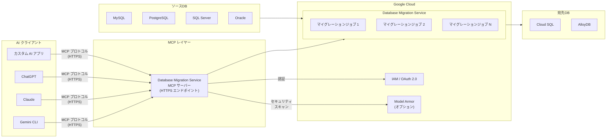

# Cloud Database Migration Service: MCP サーバー対応 (Preview)

**リリース日**: 2026-04-01

**サービス**: Cloud Database Migration Service

**機能**: Database Migration Service MCP サーバー

**ステータス**: Preview

📊 [このアップデートのインフォグラフィックを見る](https://takech9203.github.io/google-cloud-news-summary/20260401-cloud-dms-mcp-server-preview.html)

## 概要

Cloud Database Migration Service に Model Context Protocol (MCP) サーバーが Preview として追加されました。この MCP サーバーを利用することで、AI エージェントや AI アプリケーションから実行中のマイグレーションジョブの表示と管理が可能になります。Gemini CLI、ChatGPT、Claude、その他のカスタム AI アプリケーションから直接 Database Migration Service の機能にアクセスできるようになります。

MCP (Model Context Protocol) は Anthropic が開発したオープンソースプロトコルで、大規模言語モデル (LLM) や AI アプリケーションが外部データソースに接続する方法を標準化しています。Google Cloud はリモート MCP サーバーとしてこのプロトコルをサポートしており、エンタープライズレベルのガバナンス、セキュリティ、アクセス制御を備えた形で提供しています。

本アップデートにより、Database Migration Service は BigQuery、BigQuery Migration、Cloud Run、Pub/Sub、GKE、Bigtable、Cloud Storage、Error Reporting などに続く Google Cloud MCP サーバー対応サービスの一つとなりました。データベースマイグレーションの運用管理に AI を活用する新しいワークフローが実現します。

**アップデート前の課題**

- マイグレーションジョブの監視や管理には Google Cloud コンソール、gcloud CLI、または REST API を直接操作する必要があった
- AI エージェントやチャットボットからマイグレーション状況を確認する標準的な方法がなかった
- 複数のマイグレーションジョブを横断的に管理する際、手動でのステータス確認が必要だった

**アップデート後の改善**

- AI エージェントや AI アプリケーションから MCP プロトコル経由でマイグレーションジョブの表示・管理が可能になった
- Gemini CLI、Claude、ChatGPT などの AI ツールから自然言語でマイグレーション状況を問い合わせ可能になった
- カスタム AI アプリケーションに Database Migration Service の機能を組み込むことが容易になった

## アーキテクチャ図



AI クライアントが MCP プロトコルを通じて Database Migration Service のリモート MCP サーバーに接続し、IAM による認証とオプションの Model Armor によるセキュリティ検査を経て、マイグレーションジョブの表示・管理操作を実行します。

## サービスアップデートの詳細

### 主要機能

1. **マイグレーションジョブの表示**
   - 実行中のマイグレーションジョブの一覧取得
   - 各ジョブの進捗状況やステータスの確認
   - ジョブの詳細情報 (ソース・宛先接続プロファイル、設定内容) の取得

2. **マイグレーションジョブの管理**
   - AI エージェントを通じたジョブの操作
   - マイグレーション進捗のリアルタイムモニタリング
   - 自然言語によるジョブ管理コマンドの実行

3. **Google Cloud MCP サーバー共通機能**
   - 集中化された MCP サーバーの検出 (MCP discovery)
   - マネージドなグローバルまたはリージョナル HTTPS エンドポイント
   - きめ細やかな IAM ベースの認可ポリシー
   - Model Armor によるプロンプト・レスポンスのセキュリティスキャン (オプション)
   - 集約型監査ログ

## 技術仕様

### MCP サーバー構成

| 項目 | 詳細 |
|------|------|
| プロトコル | Model Context Protocol (MCP) |
| トランスポート | HTTPS (リモート MCP サーバー) |
| エンドポイント | `datamigration.googleapis.com/mcp` (推定) |
| 認証方式 | OAuth 2.0 + IAM |
| API キー | 非対応 (OAuth 2.0 が必須) |
| ステータス | Preview |

### 必要な IAM ロール

| ロール | 用途 |
|--------|------|
| `roles/mcp.toolUser` | MCP ツール呼び出しの実行 |
| `roles/datamigration.admin` | Database Migration Service のリソース管理 |

### 必要な権限

```json
{
  "mcp_permissions": [
    "mcp.tools.call"
  ],
  "dms_permissions": [
    "datamigration.migrationJobs.get",
    "datamigration.migrationJobs.list",
    "datamigration.migrationJobs.update",
    "datamigration.connectionProfiles.get",
    "datamigration.connectionProfiles.list"
  ]
}
```

## 設定方法

### 前提条件

1. Google Cloud プロジェクトで Database Migration Service API が有効化されていること
2. MCP サーバーがプロジェクトで有効化されていること
3. 適切な IAM ロールが付与されていること

### 手順

#### ステップ 1: API の有効化

```bash
# Database Migration Service API を有効化
gcloud services enable datamigration.googleapis.com
```

#### ステップ 2: IAM ロールの付与

```bash
# MCP ツール呼び出し権限を付与
gcloud projects add-iam-policy-binding PROJECT_ID \
    --member="user:USER_EMAIL" \
    --role="roles/mcp.toolUser"

# Database Migration Service 管理者ロールを付与
gcloud projects add-iam-policy-binding PROJECT_ID \
    --member="user:USER_EMAIL" \
    --role="roles/datamigration.admin"
```

#### ステップ 3: MCP クライアントの設定

AI アプリケーション (Gemini CLI、Claude など) の MCP クライアント設定で、以下の情報を入力します。

```json
{
  "mcpServers": {
    "database-migration-service": {
      "url": "https://datamigration.googleapis.com/mcp",
      "transport": "http",
      "authentication": {
        "type": "oauth2",
        "credentials": "google-cloud-credentials"
      }
    }
  }
}
```

#### ステップ 4: ツール一覧の確認

```bash
# MCP サーバーの利用可能なツールを確認
curl --location 'https://datamigration.googleapis.com/mcp' \
    --header 'content-type: application/json' \
    --header 'accept: application/json, text/event-stream' \
    --data '{
        "method": "tools/list",
        "jsonrpc": "2.0",
        "id": 1
    }'
```

## メリット

### ビジネス面

- **運用効率の向上**: AI エージェントを活用した自然言語でのマイグレーション管理により、専門知識がなくてもジョブの状況確認が可能
- **インシデント対応の迅速化**: AI チャットボットからリアルタイムでマイグレーション状況を把握し、問題の早期発見・対応が可能
- **開発者体験の改善**: IDE 内の AI アシスタントからマイグレーション状況を確認でき、コンテキストスイッチが不要

### 技術面

- **標準プロトコル準拠**: MCP というオープンスタンダードに準拠しており、特定のベンダーに依存しない
- **セキュリティ**: IAM ベースのきめ細やかなアクセス制御と Model Armor によるプロンプト/レスポンスの保護
- **拡張性**: カスタム AI アプリケーションに容易に統合でき、自動化ワークフローの構築が可能

## デメリット・制約事項

### 制限事項

- Preview 段階のため、本番環境での利用は推奨されない
- Pre-GA 機能は「現状のまま」提供され、サポートが限定的
- SLA の対象外であり、機能の変更や廃止の可能性がある
- API キーによる認証は非対応 (OAuth 2.0 が必須)

### 考慮すべき点

- Preview から GA までの間に API やツールの仕様が変更される可能性がある
- MCP プロトコル自体がまだ発展途上であり、仕様の変更に追従が必要
- AI エージェントからの操作にはセキュリティポリシーの慎重な設計が必要 (最小権限の原則の適用)
- Model Armor の設定を適切に行わないと、意図しない操作がリクエストされるリスクがある

## ユースケース

### ユースケース 1: AI チャットボットによるマイグレーション監視

**シナリオ**: 大規模なデータベースマイグレーションプロジェクトにおいて、チーム全員がマイグレーションの進捗を把握する必要がある。Slack や Teams に統合された AI チャットボットからマイグレーション状況を問い合わせる。

**実装例**:
```
ユーザー: 「現在実行中のマイグレーションジョブの状態を教えて」
AI エージェント: (DMS MCP サーバーに接続してジョブ一覧を取得)
「現在3つのマイグレーションジョブが実行中です:
 1. mysql-to-cloudsql-prod: 進捗 87% - CDC レプリケーション中
 2. postgres-to-alloydb-staging: 進捗 45% - 初期スナップショット中
 3. sqlserver-to-cloudsql-dev: 完了待ち - プロモーション可能」
```

**効果**: 技術チーム以外のステークホルダーもマイグレーション進捗をリアルタイムで把握可能

### ユースケース 2: IDE 統合による開発者向けマイグレーション管理

**シナリオ**: 開発者が VS Code や JetBrains IDE 内の AI アシスタント (Gemini Code Assist、Claude) からマイグレーションジョブの状態確認や簡単な管理操作を行う。

**効果**: コンテキストスイッチなしでマイグレーション管理が可能になり、開発効率が向上

### ユースケース 3: 自動化されたマイグレーション運用パイプライン

**シナリオ**: カスタム AI エージェントが MCP サーバーを通じてマイグレーションジョブを監視し、条件に基づいて自動的にアクション (通知、プロモーション提案など) を実行する。

**効果**: マイグレーション運用の自動化により、人的ミスの削減と対応速度の向上を実現

## 料金

Database Migration Service の同種マイグレーション (Cloud SQL 向け) は追加料金なしで提供されています。ただし、Cloud SQL、AlloyDB、Cloud Storage、Compute Engine などの関連リソースの料金は別途発生します。

MCP サーバー自体の利用料金については、Preview 段階では明示的な料金体系は公開されていません。GA リリース時に料金体系が更新される可能性があります。

### 関連リソースの料金目安

| リソース | 料金 |
|---------|------|
| Database Migration Service (同種マイグレーション) | 無料 |
| Cloud SQL (宛先インスタンス) | インスタンスタイプ・リージョンにより異なる |
| AlloyDB (宛先クラスタ) | インスタンスタイプ・リージョンにより異なる |
| ネットワーク転送 | リージョン間転送に応じて課金 |

## 利用可能リージョン

Database Migration Service MCP サーバーの具体的なリージョン制限は Preview 時点では公開されていません。Google Cloud のリモート MCP サーバーはグローバルまたはリージョナルエンドポイントとして提供されるため、Database Migration Service が利用可能なリージョンで利用できる可能性が高いです。

## 関連サービス・機能

- **Google Cloud MCP サーバー群**: BigQuery、BigQuery Migration、Cloud Run、Pub/Sub、GKE、Bigtable、Cloud Storage、Error Reporting、Google SecOps など、多くの Google Cloud サービスが MCP サーバーを提供
- **Cloud SQL**: Database Migration Service の主要な宛先サービスで、MySQL、PostgreSQL、SQL Server をサポート
- **AlloyDB for PostgreSQL**: Database Migration Service の宛先として利用可能な高性能 PostgreSQL 互換データベース
- **Model Armor**: MCP サーバーへのプロンプト・レスポンスのセキュリティスキャンを提供
- **IAM**: MCP ツール呼び出しのアクセス制御に使用 (`roles/mcp.toolUser`)

## 参考リンク

- 📊 [インフォグラフィック](https://takech9203.github.io/google-cloud-news-summary/20260401-cloud-dms-mcp-server-preview.html)
- [公式リリースノート](https://docs.cloud.google.com/release-notes#April_01_2026)
- [ドキュメント](https://docs.cloud.google.com/database-migration/docs/use-database-migration-service-mcp)
- [Database Migration Service 概要](https://docs.cloud.google.com/database-migration/docs/overview)
- [Google Cloud MCP サーバー概要](https://docs.cloud.google.com/mcp/overview)
- [MCP 認証ガイド](https://docs.cloud.google.com/mcp/authenticate-mcp)
- [料金ページ](https://cloud.google.com/database-migration/pricing)

## まとめ

Cloud Database Migration Service の MCP サーバー対応は、データベースマイグレーションの運用管理に AI を活用する重要な一歩です。AI エージェントから自然言語でマイグレーションジョブの状況確認や管理が可能になることで、運用チームの効率が大幅に向上します。現在は Preview 段階のため本番環境での利用は推奨されませんが、GA リリースに向けて検証環境での評価を開始することを推奨します。

---

**タグ**: #CloudDatabaseMigrationService #MCP #ModelContextProtocol #AIエージェント #データベースマイグレーション #Preview #GoogleCloud #CloudSQL #AlloyDB #自動化
