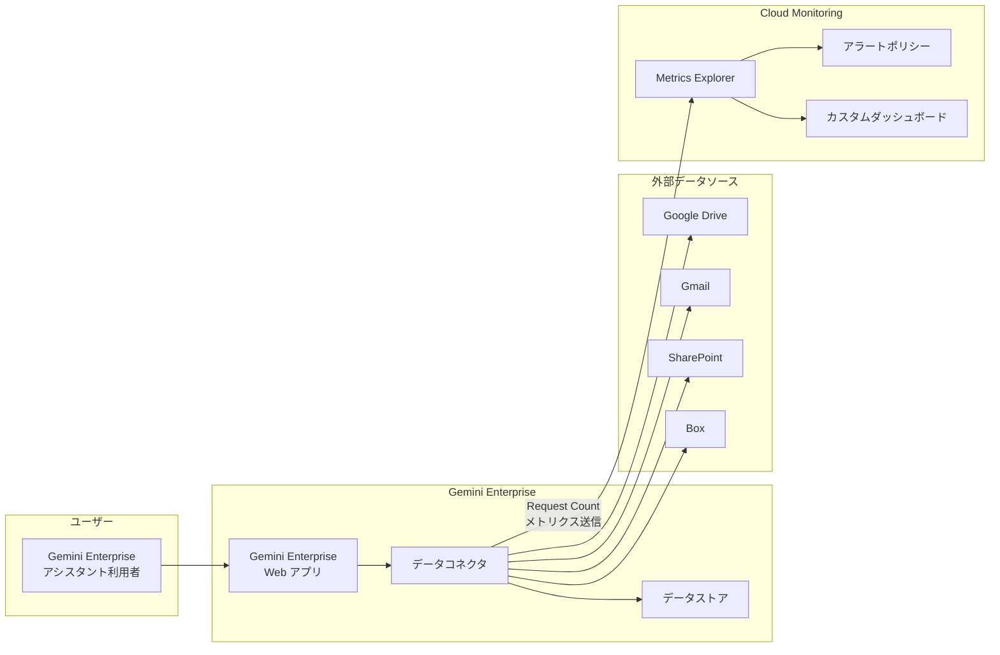

# Gemini Enterprise: Data connector request count metric が GA に

**リリース日**: 2026-04-01

**サービス**: Gemini Enterprise

**機能**: Data connector request count metric

**ステータス**: GA (一般提供)

:bar_chart: [このアップデートのインフォグラフィックを見る](https://takech9203.github.io/google-cloud-news-summary/20260401-gemini-enterprise-data-connector-metrics.html)

## 概要

Gemini Enterprise において、データコネクタおよびデータストアへのリクエスト数を監視するための新しいメトリクス「Gemini Enterprise DataConnector - Gemini Enterprise DataConnector Request Count」が一般提供 (GA) となりました。このメトリクスは Cloud Monitoring の Metrics Explorer で利用可能です。

このアップデートにより、Gemini Enterprise のデータコネクタ (Google Drive、Gmail、SharePoint、Box、Linear など) を通じたリクエストの総数をリアルタイムで把握できるようになります。運用チームはデータコネクタの利用状況を可視化し、パフォーマンスの傾向分析やキャパシティプランニングに活用できます。

対象ユーザーは、Gemini Enterprise を導入してデータコネクタ経由で企業データを検索・活用している組織の管理者、SRE エンジニア、およびプラットフォームチームです。

**アップデート前の課題**

- データコネクタへのリクエスト数を定量的に把握する標準的な手段がなく、利用状況の可視化が困難だった
- データコネクタの負荷状況やトラフィックパターンの分析に、独自のログ解析などの追加作業が必要だった
- コネクタごとの利用傾向を比較・評価するための統一的なメトリクスが提供されていなかった

**アップデート後の改善**

- Metrics Explorer で DataConnector Request Count メトリクスを直接確認できるようになった
- データコネクタやデータストア単位でのリクエスト数の推移をグラフで可視化できるようになった
- Cloud Monitoring のアラートポリシーと組み合わせることで、異常なリクエスト増加の検知が可能になった

## アーキテクチャ図



Gemini Enterprise のデータコネクタがリクエストを処理するたびに、リクエスト数メトリクスが Cloud Monitoring に送信され、Metrics Explorer でリアルタイムに可視化されます。

## サービスアップデートの詳細

### 主要機能

1. **DataConnector Request Count メトリクス**
   - データコネクタまたはデータストアに対するリクエストの総数を計測
   - Metrics Explorer の検索バーで「Gemini Enterprise DataConnector - Gemini Enterprise DataConnector Request Count」として選択可能
   - メトリクスデータは毎分更新

2. **Metrics Explorer との統合**
   - Cloud Monitoring の Metrics Explorer でグラフ表示・分析が可能
   - ラベルフィルタや集計設定を使用した柔軟なデータ分析に対応
   - 時間範囲の調整による任意期間のトレンド分析が可能

3. **運用監視への活用**
   - カスタムダッシュボードへのチャート保存に対応
   - アラートポリシーとの連携により閾値ベースの通知設定が可能
   - CSV 形式でのデータエクスポートにも対応

## 技術仕様

### メトリクス詳細

| 項目 | 詳細 |
|------|------|
| メトリクス名 | Gemini Enterprise DataConnector - Gemini Enterprise DataConnector Request Count |
| メトリクスカテゴリ | Gemini Enterprise DataConnector |
| データ更新間隔 | 毎分 |
| ステータス | GA (一般提供) |

### 必要な IAM ロール

| ロール | 用途 |
|------|------|
| Discovery Engine Admin | Gemini Enterprise アプリの管理 |
| Monitoring Viewer (roles/monitoring.viewer) | Metrics Explorer でのメトリクス参照 |

## 設定方法

### 前提条件

1. Gemini Enterprise Web アプリが作成済みであること
2. OpenTelemetry のトレースとログのインストルメンテーションが有効化されていること
3. 適切な IAM ロール (Discovery Engine Admin、Monitoring Viewer) が付与されていること

### 手順

#### ステップ 1: Observability 設定の有効化

Google Cloud コンソールで Gemini Enterprise ページに移動し、対象アプリの「Configurations」から「Observability」タブを開きます。「Enable instrumentation of OpenTelemetry traces and logs」を有効にしてください。

#### ステップ 2: Metrics Explorer でメトリクスを確認

```
Google Cloud コンソール > Monitoring > Metrics Explorer
```

1. Metrics Explorer ページに移動
2. Gemini Enterprise アプリが作成されたプロジェクトを選択
3. 「Select a metric」をクリック
4. 検索バーで「Gemini Enterprise DataConnector Request Count」を検索
5. メトリクスを選択して「Apply」をクリック

#### ステップ 3: チャートの保存 (任意)

Metrics Explorer で作成したチャートは、カスタムダッシュボードに保存して継続的な監視に活用できます。ツールバーの「Save Chart」を選択し、既存のダッシュボードに追加するか新しいダッシュボードを作成してください。

## メリット

### ビジネス面

- **利用状況の可視化**: データコネクタの利用状況を定量的に把握することで、投資対効果の評価やリソース配分の最適化が可能
- **プロアクティブな問題検知**: リクエスト数の異常な増減をアラートで検知し、ユーザー体験への影響を事前に防止

### 技術面

- **統合監視**: Cloud Monitoring の既存のダッシュボードやアラート機能とシームレスに統合可能
- **トレンド分析**: 時系列データとして蓄積されるため、利用パターンの分析やキャパシティプランニングに活用可能
- **GA による安定性**: 一般提供となったことで、本番環境での利用に対する SLA サポートが提供

## デメリット・制約事項

### 制限事項

- メトリクスの利用には OpenTelemetry のインストルメンテーション設定を事前に有効化する必要がある
- Metrics Explorer の利用には Monitoring Viewer ロールが別途必要

### 考慮すべき点

- Cloud Monitoring のメトリクス保存にはデータ保持期間の制限がある (カスタムメトリクスは通常 24 か月)
- 大量のメトリクスデータを長期保存する場合は、追加のストレージコストが発生する可能性がある

## ユースケース

### ユースケース 1: データコネクタの利用状況モニタリング

**シナリオ**: 企業が Google Drive、SharePoint、Gmail の 3 つのデータコネクタを Gemini Enterprise に接続しており、各コネクタの利用頻度を把握したい。

**実装例**:
```
Metrics Explorer で DataConnector Request Count メトリクスを選択し、
データコネクタ別にフィルタリングしてグラフを作成。
カスタムダッシュボードに保存して日次で確認。
```

**効果**: どのデータソースが最も利用されているかを定量的に把握し、コネクタの優先度付けやリソース配分の意思決定に活用できる。

### ユースケース 2: 異常検知とアラート設定

**シナリオ**: データコネクタへのリクエスト数が通常の範囲を超えた場合に、運用チームへ即座に通知したい。

**効果**: リクエスト数の急増による潜在的な問題 (不正利用、設定ミスなど) を早期に検知し、迅速な対応が可能になる。

## 料金

DataConnector Request Count メトリクスの参照自体は Cloud Monitoring の標準機能として利用可能です。Cloud Monitoring のメトリクスに関する料金体系については、Cloud Monitoring の料金ページを参照してください。

Gemini Enterprise 自体の料金は、選択するエディション (Business、Standard、Plus、Frontline) によって異なります。

## 関連サービス・機能

- **Cloud Monitoring (Metrics Explorer)**: メトリクスの可視化・分析基盤として DataConnector Request Count メトリクスを表示
- **Gemini Enterprise Observability**: OpenTelemetry ベースのトレース、スパン、ログなどの包括的な可観測性機能を提供
- **Cloud Trace (Trace Explorer)**: Gemini Enterprise のリクエストのトレースとスパンを可視化し、パフォーマンス分析を支援
- **Gemini Enterprise Analytics**: 検索数、回答数、クリック率などのアプリケーションレベルの分析ダッシュボードを提供

## 参考リンク

- :bar_chart: [インフォグラフィック](https://takech9203.github.io/google-cloud-news-summary/20260401-gemini-enterprise-data-connector-metrics.html)
- [公式リリースノート](https://docs.google.com/release-notes#April_01_2026)
- [Gemini Enterprise - Access metrics in Metrics Explorer](https://cloud.google.com/gemini/enterprise/docs/access-metrics)
- [Gemini Enterprise - Manage observability settings](https://cloud.google.com/gemini/enterprise/docs/manage-observability-settings)
- [Cloud Monitoring - Metrics Explorer](https://cloud.google.com/monitoring/charts/metrics-explorer)
- [Gemini Enterprise エディション比較](https://cloud.google.com/gemini/enterprise/docs/editions)

## まとめ

Gemini Enterprise の DataConnector Request Count メトリクスが GA となったことで、データコネクタの利用状況を Cloud Monitoring で標準的に監視できるようになりました。既に Gemini Enterprise のデータコネクタを運用している組織は、Observability 設定を有効化し、Metrics Explorer でこの新しいメトリクスを活用したダッシュボードやアラートの設定を検討することを推奨します。

---

**タグ**: #GeminiEnterprise #CloudMonitoring #MetricsExplorer #DataConnector #Observability #GA
