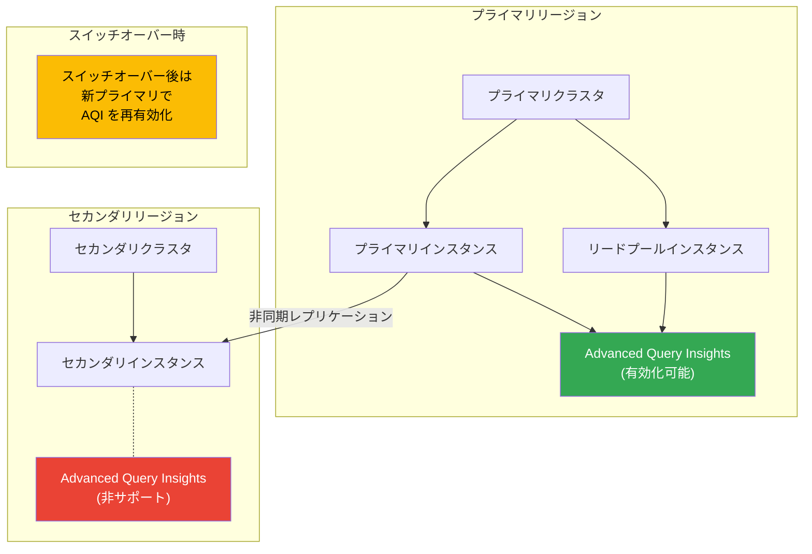

# AlloyDB for PostgreSQL: セカンダリクラスタを持つプライマリクラスタでの Advanced Query Insights 有効化サポート

**リリース日**: 2026-04-02

**サービス**: AlloyDB for PostgreSQL

**機能**: Advanced Query Insights on primary clusters with secondary clusters

**ステータス**: Change

:bar_chart: [このアップデートのインフォグラフィックを見る](https://takech9203.github.io/google-cloud-news-summary/20260402-alloydb-advanced-query-insights.html)

## 概要

AlloyDB for PostgreSQL において、セカンダリクラスタが構成されているプライマリクラスタでも Advanced Query Insights を有効化できるようになりました。これまでは、セカンダリクラスタ（クロスリージョンレプリカ）を持つクラスタでは Advanced Query Insights を利用することができないという制約がありましたが、今回の変更によりこの制限が緩和されました。

Advanced Query Insights は、AlloyDB のクエリパフォーマンス診断機能であり、リアルタイムに近い形でデータベースやクエリのパフォーマンス問題を検出・トラブルシューティング・予防することができます。クロスリージョンレプリケーションを利用するミッションクリティカルなワークロードにおいても、高度なクエリ分析が可能になります。

なお、Advanced Query Insights はセカンダリクラスタ自体ではサポートされません。また、スイッチオーバーを実行した場合は、新しいプライマリクラスタで Advanced Query Insights を再度有効化する必要があります。

**アップデート前の課題**

- セカンダリクラスタが構成されているプライマリクラスタでは Advanced Query Insights を有効化できなかった
- セカンダリインスタンスを作成する前に、クラスタ内の全インスタンスで Advanced Query Insights を無効化する必要があった
- クロスリージョンレプリケーションとクエリパフォーマンス診断の両方を同時に利用できなかった

**アップデート後の改善**

- セカンダリクラスタが構成されたプライマリクラスタでも Advanced Query Insights を有効化できるようになった
- クロスリージョンレプリケーションによる災害復旧体制を維持しながら、高度なクエリ分析が可能になった
- Advanced Query Insights の無効化なしにセカンダリクラスタを追加できるようになった

## アーキテクチャ図



この図は、プライマリクラスタで Advanced Query Insights が有効化可能になった構成と、セカンダリクラスタでは非サポートである点、およびスイッチオーバー時の注意事項を示しています。

## サービスアップデートの詳細

### 主要機能

1. **セカンダリクラスタ構成済みプライマリでの Advanced Query Insights 有効化**
   - セカンダリクラスタ（クロスリージョンレプリカ）が存在するプライマリクラスタで、Advanced Query Insights を有効にできるようになった
   - プライマリインスタンスおよびリードプールインスタンスの両方で利用可能

2. **Advanced Query Insights の主要機能**
   - リアルタイムに近いクエリ統計と相関分析（ユーザー、ホスト、データベースなど複数ディメンション）
   - 完全な SQL 文によるクエリ実行プランの表示
   - Wait Event のテレメトリ分析によるパフォーマンス問題のトラブルシューティング
   - インデックスアドバイザーによるインデックス作成推奨
   - 最大 30 日間のデータ分析

3. **スイッチオーバー時の運用手順**
   - スイッチオーバー実行後、新しいプライマリクラスタで Advanced Query Insights を手動で再有効化する必要がある
   - 災害復旧ドリルやリージョン移行の際に留意が必要

## 技術仕様

### Advanced Query Insights の仕様

| 項目 | 詳細 |
|------|------|
| サンプリングレート | 毎分最大 20 クエリプラン |
| メトリクス利用可能時間 | クエリ完了後約 30 秒 |
| メモリ使用量 | 最大 10 MB（共有メモリ） |
| データ保持期間 | 最大 30 日間 |
| ストレージ目安（7 日分） | 約 36 GB |
| プライマリインスタンスの最大ストレージ | 約 700 GB |
| クエリプラントレースの保存先 | Cloud Trace（30 日間保持） |

### 有効化の API 設定

```json
{
  "observabilityConfig": {
    "enabled": true
  }
}
```

## 設定方法

### 前提条件

1. AlloyDB for PostgreSQL のプライマリクラスタが作成済みであること
2. クラスタにセカンダリクラスタが構成されていること
3. 適切な IAM 権限を持っていること

### 手順

#### ステップ 1: REST API を使用した有効化

```bash
curl -X PATCH \
  "https://alloydb.googleapis.com/v1/projects/PROJECT_ID/locations/LOCATION_ID/clusters/CLUSTER_ID/instances/INSTANCE_ID?updateMask=observabilityConfig.enabled" \
  -H "Authorization: Bearer $(gcloud auth print-access-token)" \
  -H "Content-Type: application/json" \
  -d '{
    "observabilityConfig": {
      "enabled": true
    }
  }'
```

プライマリインスタンスで Advanced Query Insights を有効化します。`PROJECT_ID`、`LOCATION_ID`、`CLUSTER_ID`、`INSTANCE_ID` をそれぞれ環境に合わせて置き換えてください。

#### ステップ 2: リードプールインスタンスでの有効化

```bash
curl -X PATCH \
  "https://alloydb.googleapis.com/v1/projects/PROJECT_ID/locations/LOCATION_ID/clusters/CLUSTER_ID/instances/READ_POOL_INSTANCE_ID?updateMask=observabilityConfig.enabled" \
  -H "Authorization: Bearer $(gcloud auth print-access-token)" \
  -H "Content-Type: application/json" \
  -d '{
    "observabilityConfig": {
      "enabled": true
    }
  }'
```

リードプールインスタンスで有効化する場合は、先にプライマリインスタンスで有効化しておく必要があります。

#### ステップ 3: Google Cloud コンソールでの確認

Google Cloud コンソールの AlloyDB クラスタページからインスタンスを選択し、「Query insights」タブでダッシュボードが表示されることを確認します。

## メリット

### ビジネス面

- **災害復旧体制とパフォーマンス監視の両立**: クロスリージョンレプリケーションによる高可用性を維持しながら、本番環境のクエリパフォーマンスを詳細に把握できる
- **運用効率の向上**: セカンダリクラスタ追加時に Advanced Query Insights を無効化・再有効化する手順が不要になり、運用負荷が軽減される

### 技術面

- **包括的なパフォーマンス診断**: Wait Event 分析、クエリプラン可視化、インデックスアドバイザーなどの高度な機能をクロスリージョン構成でも活用可能
- **アプリケーションレベルの監視**: Sqlcommenter との統合により、ORM を使用したアプリケーションでもクエリの発生元を特定可能

## デメリット・制約事項

### 制限事項

- セカンダリクラスタ自体では Advanced Query Insights は利用不可
- スイッチオーバー実行後、新しいプライマリクラスタで手動で再有効化が必要
- Advanced Query Insights のメトリクスは Cloud Monitoring API 経由では取得不可
- クライアント IP アドレスのサポートなし

### 考慮すべき点

- Advanced Query Insights 有効化時にダッシュボードがリセットされる（標準 Query Insights のメトリクスは Metrics Explorer から引き続きアクセス可能）
- プライマリインスタンスのストレージ消費量は最大 700 GB まで増加する可能性がある
- スイッチオーバーを伴う災害復旧ドリルの手順に、Advanced Query Insights の再有効化ステップを追加する必要がある

## ユースケース

### ユースケース 1: クロスリージョン DR 構成での本番クエリ最適化

**シナリオ**: グローバル展開する EC サイトが、プライマリクラスタ（東京リージョン）とセカンダリクラスタ（大阪リージョン）のクロスリージョン構成を採用している。ピーク時のクエリパフォーマンス低下を分析したい。

**実装例**:
```bash
# プライマリインスタンスで Advanced Query Insights を有効化
gcloud alloydb instances update PRIMARY_INSTANCE_ID \
  --cluster=CLUSTER_ID \
  --region=asia-northeast1 \
  --project=PROJECT_ID \
  --observability-config-enabled
```

**効果**: DR 体制を維持したまま、ピーク時のスロークエリや Wait Event を特定し、インデックス追加やクエリ最適化によるレスポンスタイム改善が可能。

### ユースケース 2: DR ドリル後のモニタリング復旧

**シナリオ**: 定期的な DR ドリルでスイッチオーバーを実行した後、新しいプライマリクラスタでの Query Insights モニタリングを迅速に復旧したい。

**効果**: スイッチオーバー完了後に Advanced Query Insights を再有効化することで、新プライマリでのクエリパフォーマンス監視を速やかに再開できる。

## 料金

Advanced Query Insights は AlloyDB for PostgreSQL の機能として提供されます。AlloyDB の料金は従量課金制で、以下の要素に基づきます。

| 項目 | 説明 |
|------|------|
| インスタンスリソース | vCPU 数とメモリ量に基づくマシンタイプの料金 |
| ストレージ | クラスタのストレージレイヤーに保存されるデータ量 |
| ネットワーク | インスタンスからのネットワーク下り（egress）トラフィック量 |

Advanced Query Insights 自体の追加料金に関する情報は公式ドキュメントで確認してください。なお、CUD（Committed Use Discounts）を利用すると、1 年契約で 25%、3 年契約で 52% の割引が適用されます。

## 利用可能リージョン

AlloyDB for PostgreSQL が利用可能な全リージョンで使用できます。セカンダリクラスタは、プライマリクラスタとは異なるリージョンに配置する必要があります。

## 関連サービス・機能

- **AlloyDB クロスリージョンレプリケーション**: プライマリクラスタのデータを別リージョンのセカンダリクラスタに非同期レプリケーションする機能。災害復旧や地理的分散に対応
- **Cloud Trace**: Advanced Query Insights が正規化された実行プランを保存する先のサービス。30 日間のトレースデータ保持
- **Cloud Monitoring**: 標準 Query Insights のメトリクスをシステムメトリクスとして提供。Metrics Explorer での分析が可能
- **AlloyDB インデックスアドバイザー**: Advanced Query Insights と連携し、クエリパフォーマンス向上のためのインデックス作成を推奨

## 参考リンク

- :bar_chart: [インフォグラフィック](https://takech9203.github.io/google-cloud-news-summary/20260402-alloydb-advanced-query-insights.html)
- [公式リリースノート](https://docs.google.com/release-notes#April_02_2026)
- [Advanced Query Insights 概要ドキュメント](https://cloud.google.com/alloydb/docs/advanced-query-insights-overview)
- [Advanced Query Insights の使用方法](https://cloud.google.com/alloydb/docs/using-advanced-query-insights)
- [クロスリージョンレプリケーション概要](https://cloud.google.com/alloydb/docs/cross-region-replication/about-cross-region-replication)
- [AlloyDB 料金ページ](https://cloud.google.com/alloydb/pricing)

## まとめ

今回のアップデートにより、AlloyDB for PostgreSQL のクロスリージョンレプリケーション構成において、プライマリクラスタでの Advanced Query Insights の利用が可能になりました。これにより、災害復旧体制を維持しつつ高度なクエリパフォーマンス診断を実施できるようになります。クロスリージョン構成を利用中のユーザーは、プライマリクラスタで Advanced Query Insights を有効化し、スイッチオーバー手順にも再有効化ステップを追加することを推奨します。

---

**タグ**: #AlloyDB #PostgreSQL #QueryInsights #CrossRegionReplication #パフォーマンス監視 #災害復旧 #Google Cloud
