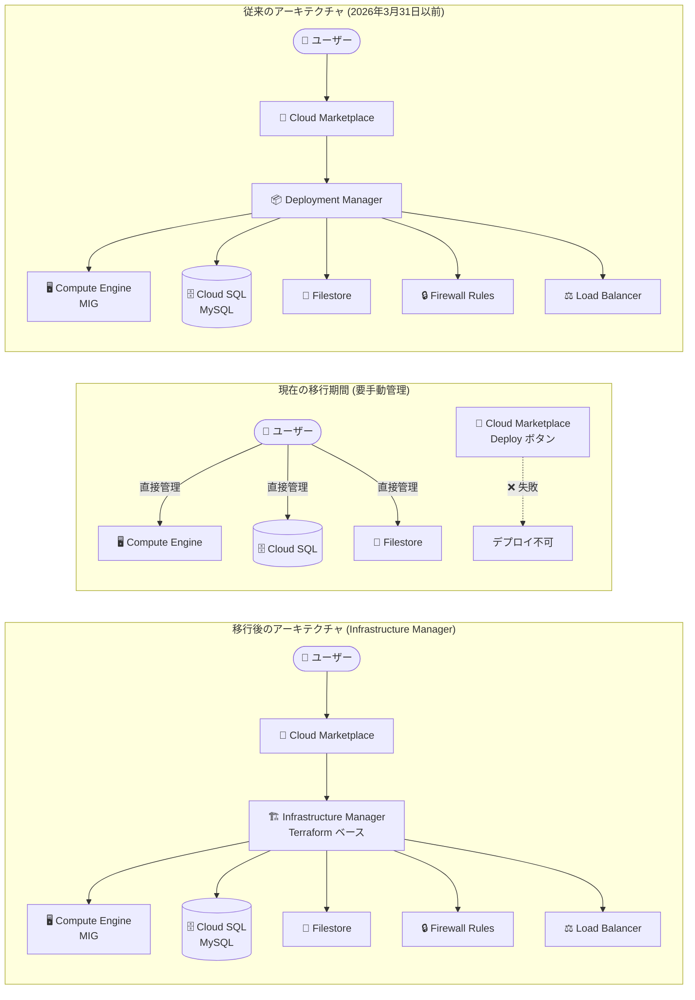

# Apigee X: Drupal Portal デプロイメント中断 (Deployment Manager 廃止に伴う影響)

**リリース日**: 2026-04-02

**サービス**: Apigee X

**機能**: Apigee Drupal Portal (Cloud Marketplace)

**ステータス**: Breaking Change

📊 [このアップデートのインフォグラフィックを見る](https://takech9203.github.io/google-cloud-news-summary/20260402-apigee-drupal-portal-deployment-disruption.html)

## 概要

Google Cloud Deployment Manager が 2026 年 3 月 31 日をもって廃止されたことに伴い、Google Cloud Marketplace 経由の Apigee Drupal Portal のデプロイおよび管理機能に重大な中断が発生している。現在、Google Cloud は Deployment Manager ベースのソリューションを Infrastructure Manager (Terraform ベース) に移行する作業を進めているが、移行期間中は一部の機能が利用できない状態となっている。

これは **Breaking Change** であり、2026 年 4 月 1 日以降、Marketplace の「Deploy」ボタンを使用した新規 Apigee Drupal Portal インスタンスのデプロイは失敗する。既存のデプロイメントについては、VM や Cloud SQL データベースなどの基盤リソースは引き続き正常に動作するが、Marketplace UI や `gcloud deployment-manager` コマンドを通じた管理操作は利用できなくなっている。

Apigee Developer Portal Kickstart を Cloud Marketplace 経由で運用している組織、特に VPC Service Controls 環境内でポータルをホストしている組織に対して直接的な影響がある。

**アップデート前の課題**

- Apigee Drupal Portal は Deployment Manager に依存した Cloud Marketplace ソリューションとして提供されていた
- Deployment Manager の廃止スケジュール (2026 年 3 月 31 日) は事前に告知されていたが、後継ソリューションの準備が間に合わなかった
- Marketplace UI を通じたデプロイメントの構成変更・管理が Deployment Manager に密結合していた

**アップデート後の改善**

- Infrastructure Manager (Terraform ベース) への移行が進行中であり、完了後はよりモダンな IaC ベースの管理が可能になる
- Terraform HCL による構成管理、Git リポジトリとの連携、状態管理の改善が期待される
- 移行完了までの間は、個別の Google Cloud リソース (Compute Engine、Cloud SQL 等) を直接管理することで運用を継続可能

## アーキテクチャ図



上図は Apigee Drupal Portal のデプロイメント管理の変遷を示している。従来は Deployment Manager を介して一元管理されていたが、現在の移行期間中はユーザーが個別リソースを直接管理する必要がある。Infrastructure Manager への移行完了後は Terraform ベースの管理に切り替わる。

## サービスアップデートの詳細

### 主要な影響

1. **新規デプロイの失敗**
   - 2026 年 4 月 1 日以降、Cloud Marketplace の「Deploy」ボタンを使用した新規 Apigee Drupal Portal インスタンスのデプロイは失敗する
   - Deployment Manager API が廃止されているため、新しいデプロイメントの作成は不可能

2. **既存デプロイメントの管理制限**
   - 基盤リソース (VM、Cloud SQL データベース、Filestore) は引き続き正常に動作する
   - Marketplace UI からのデプロイメント管理 (構成変更、スケーリングなど) は利用不可
   - `gcloud deployment-manager` コマンドによる管理操作も利用不可

3. **ワークアラウンド: 個別リソースの直接管理**
   - 構成変更や管理タスクは、個別の Google Cloud リソースに対して直接実行する必要がある
   - Compute Engine、Cloud SQL、Filestore、Load Balancer などを各サービスのコンソールまたは CLI で個別に管理する

## 技術仕様

### Deployment Manager から Infrastructure Manager への移行比較

| 項目 | Deployment Manager (廃止) | Infrastructure Manager (移行先) |
|------|--------------------------|-------------------------------|
| 構成言語 | YAML + Jinja/Python テンプレート | Terraform HCL |
| 状態管理 | 内部管理 | Cloud Storage に保存 |
| ロールバック | 以前のデプロイメントへのロールバック対応 | 以前の Terraform 構成を再デプロイ (手動プロセス) |
| プレビュー機能 | デプロイ前の変更プレビュー | `CreatePreview` で Terraform plan を確認 |
| ソースコード管理 | 各種オプション | Git リポジトリ、Cloud Storage バケット |
| Google Cloud 連携 | 各種サービスと連携 | Terraform プロバイダー経由 (より広範なカバレッジ) |

### Apigee Drupal Portal の構成コンポーネント

| コンポーネント | 説明 | 移行期間中の管理方法 |
|--------------|------|-------------------|
| Compute Engine (MIG) | Drupal アプリケーション実行 | [VM インスタンスページ](https://console.cloud.google.com/compute/instances) から直接管理 |
| Cloud SQL (MySQL) | Drupal データベース | [Cloud SQL インスタンスページ](https://console.cloud.google.com/sql/instances) から直接管理 |
| Filestore | コード・メディアファイル共有ストレージ | [Filestore コンソール](https://console.cloud.google.com/filestore) から直接管理 |
| Load Balancer | トラフィック分散 | [ネットワーキングコンソール](https://console.cloud.google.com/net-services/loadbalancing) から直接管理 |
| Firewall Rules | ネットワークセキュリティ | [VPC ファイアウォールページ](https://console.cloud.google.com/networking/firewalls) から直接管理 |

## 設定方法

### ワークアラウンド: 既存デプロイメントの手動管理

#### ステップ 1: 既存リソースの確認

```bash
# Compute Engine インスタンスの確認
gcloud compute instances list --filter="name~drupal"

# Cloud SQL インスタンスの確認
gcloud sql instances list

# Filestore インスタンスの確認
gcloud filestore instances list
```

既存のデプロイメントで使用されているリソースを特定する。

#### ステップ 2: Compute Engine (MIG) の管理

```bash
# マネージドインスタンスグループの確認
gcloud compute instance-groups managed list

# インスタンスの詳細確認
gcloud compute instances describe INSTANCE_NAME --zone=ZONE
```

VM のスケーリングや構成変更は、Compute Engine コンソールまたは `gcloud compute` コマンドで直接実行する。

#### ステップ 3: Cloud SQL の管理

```bash
# Cloud SQL インスタンスの詳細確認
gcloud sql instances describe INSTANCE_NAME

# バックアップの作成
gcloud sql backups create --instance=INSTANCE_NAME
```

データベースの管理、バックアップ、構成変更は Cloud SQL コンソールまたは `gcloud sql` コマンドで直接実行する。

#### ステップ 4: Drupal コードのバックアップ

```bash
# Compute Engine インスタンスに SSH 接続
gcloud compute ssh INSTANCE_NAME --zone=ZONE

# コードのエクスポート (インスタンス内で実行)
/opt/apigee/scripts/export-code.sh
```

カスタマイズしたコードやモジュールは Filestore にバックアップされる。

## メリット

### ビジネス面

- **既存サービスの継続性**: 基盤リソースは影響を受けないため、エンドユーザー向けの Developer Portal は引き続き稼働する
- **将来的な管理の改善**: Infrastructure Manager への移行完了後は、Terraform ベースのよりモダンな IaC 管理が可能になる

### 技術面

- **Terraform エコシステムの活用**: 移行完了後は Terraform の豊富なモジュール、プロバイダー、ツールチェーンを活用できる
- **Git 連携**: Infrastructure Manager は Git リポジトリとの連携をサポートしており、GitOps ワークフローが実現可能

## デメリット・制約事項

### 制限事項

- 新規 Apigee Drupal Portal のデプロイが不可能 (Infrastructure Manager 版のリリースまで)
- Marketplace UI からの一元的なデプロイメント管理が利用不可
- `gcloud deployment-manager` コマンドによるデプロイメント操作が全て利用不可
- 移行期間の終了時期は未定

### 考慮すべき点

- 移行期間中は個別リソースの管理が必要となり、運用負荷が増加する
- Deployment Manager で管理していたリソースの依存関係を把握しておく必要がある
- 新規プロジェクトで Apigee Drupal Portal が必要な場合、手動でのリソースプロビジョニングが必要
- VPC Service Controls 環境では、Deployment Manager のサービスアカウント設定が不要になるが、Infrastructure Manager 用の新しい権限設定が将来必要になる

## ユースケース

### ユースケース 1: 既存ポータルの運用継続

**シナリオ**: 既に Apigee Drupal Portal を Cloud Marketplace 経由でデプロイし、本番運用している組織

**対応**:
```bash
# 現在のリソース状態を確認
gcloud compute instances list --filter="name~drupal"
gcloud sql instances list
gcloud filestore instances list

# 必要に応じて Cloud SQL のバックアップを定期実行
gcloud sql backups create --instance=PORTAL_SQL_INSTANCE
```

**効果**: 基盤リソースは影響を受けないため、ポータルは正常に稼働し続ける。ただし、スケーリングや構成変更は個別リソースを直接管理する必要がある。

### ユースケース 2: 新規ポータルの代替デプロイ

**シナリオ**: 新規に Apigee Drupal Portal を構築する必要がある組織

**対応**: Cloud Marketplace の「Deploy」ボタンは使用できないため、個別リソースを手動でプロビジョニングするか、Drupal ホスティングパートナーの利用を検討する。

**効果**: 手動プロビジョニングの場合は運用負荷が増加するが、VPC Service Controls が不要な場合は Drupal ホスティングパートナーの利用により運用オーバーヘッドを削減できる。

## 料金

本アップデートは料金に直接的な影響を与えない。既存のリソース (Compute Engine、Cloud SQL、Filestore、Load Balancer) の料金は従来通り発生する。Deployment Manager 自体は無料サービスであったため、その廃止による料金の変更はない。

Infrastructure Manager への移行完了後の料金体系については、[Infrastructure Manager の料金ページ](https://cloud.google.com/infrastructure-manager/pricing)を参照。

## 関連サービス・機能

- **[Google Cloud Deployment Manager](https://cloud.google.com/deployment-manager/docs)**: 2026 年 3 月 31 日に廃止された IaC サービス。本中断の根本原因
- **[Infrastructure Manager](https://cloud.google.com/infrastructure-manager/docs)**: Deployment Manager の後継となる Terraform ベースの IaC サービス。移行先
- **[Compute Engine](https://cloud.google.com/compute/docs)**: Drupal Portal の VM ホスティング基盤。移行期間中は直接管理が必要
- **[Cloud SQL](https://cloud.google.com/sql/docs)**: Drupal の MySQL データベース。移行期間中は直接管理が必要
- **[Filestore](https://cloud.google.com/filestore/docs)**: Drupal コードおよびメディアファイルの共有ストレージ
- **[Cloud Marketplace](https://cloud.google.com/marketplace)**: Apigee Drupal Portal のデプロイ元。現在デプロイ機能が中断中

## 参考リンク

- 📊 [インフォグラフィック](https://takech9203.github.io/google-cloud-news-summary/20260402-apigee-drupal-portal-deployment-disruption.html)
- [公式リリースノート](https://cloud.google.com/release-notes#April_02_2026)
- [Apigee Developer Portal Kickstart - Cloud Marketplace 概要](https://cloud.google.com/apigee/docs/api-platform/publish/drupal/apigee-cloud-marketplace-overview)
- [Apigee Developer Portal Kickstart - カスタマイズガイド](https://cloud.google.com/apigee/docs/api-platform/publish/drupal/apigee-cloud-marketplace-customize)
- [Deployment Manager 廃止ドキュメント](https://cloud.google.com/deployment-manager/docs/deprecations)
- [Infrastructure Manager ドキュメント](https://cloud.google.com/infrastructure-manager/docs)

## まとめ

Deployment Manager の廃止に伴い、Apigee Drupal Portal の Cloud Marketplace 経由のデプロイおよび管理機能が一時的に中断している。既存のポータルは引き続き稼働するが、構成変更やスケーリングは個別リソースを直接管理する必要がある。現在 Marketplace 経由で Apigee Drupal Portal を運用している組織は、各リソースの直接管理手順を確認し、Infrastructure Manager ベースの新しいソリューションがリリースされるまでの運用体制を整備することを推奨する。新規デプロイが必要な場合は、手動プロビジョニングまたは Drupal ホスティングパートナーの利用を検討すること。

---

**タグ**: #ApigeeX #DrupalPortal #DeploymentManager #InfrastructureManager #BreakingChange #CloudMarketplace #Migration
