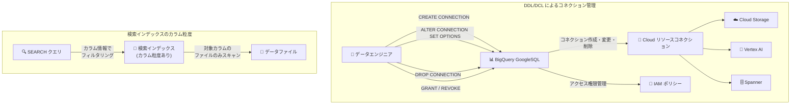

# BigQuery: コネクション DDL/DCL ステートメントと検索インデックスのカラム粒度が GA

**リリース日**: 2026-04-02

**サービス**: BigQuery

**機能**: コネクション管理用 DDL/DCL ステートメントおよび検索インデックスのカラム粒度設定

**ステータス**: GA (一般提供)

📊 [このアップデートのインフォグラフィックを見る](https://takech9203.github.io/google-cloud-news-summary/20260402-bigquery-connections-ddl-dcl-search-index.html)

## 概要

BigQuery に 2 つの重要な機能強化が GA として提供開始された。1 つ目は、Cloud リソースコネクションを GoogleSQL の DDL (Data Definition Language) および DCL (Data Control Language) ステートメントで管理できるようになったこと。2 つ目は、検索インデックス作成時にカラム粒度 (column granularity) を設定できるようになったことである。

コネクション DDL/DCL 対応により、`CREATE CONNECTION`、`ALTER CONNECTION SET OPTIONS`、`DROP CONNECTION` の DDL ステートメントでコネクションのライフサイクルを SQL で完結できるようになった。さらに、`GRANT` および `REVOKE` の DCL ステートメントで "connection" ユーザータイプと "PROJECT" リソースタイプを使用し、コネクションおよびプロジェクトへのアクセス権限を SQL で管理できる。

検索インデックスのカラム粒度設定により、インデックス作成時に追加のカラム情報を格納し、検索クエリのパフォーマンスをさらに最適化できるようになった。特定のカラムに対する検索が、他のカラムに頻出するトークンによる不要なファイルスキャンを回避できるようになる。

**アップデート前の課題**

- Cloud リソースコネクションの作成・変更・削除には Google Cloud コンソール、bq CLI、または BigQuery Connections REST API を使用する必要があり、SQL ワークフロー内で完結できなかった
- コネクションのアクセス権限管理も SQL 外の IAM 操作が必要だった
- 検索インデックスはファイル単位のトークンマッピングのみで、あるトークンが特定のカラムでは稀だが他のカラムでは頻出する場合、不要なファイルスキャンが発生していた

**アップデート後の改善**

- GoogleSQL の DDL ステートメントでコネクションの作成・変更・削除が可能になり、Infrastructure as Code やスクリプト内での一貫した管理が実現
- DCL ステートメントでコネクションおよびプロジェクトレベルのアクセス制御を SQL で直接設定可能に
- 検索インデックスにカラム粒度を設定することで、特定カラムへの検索時に不要なファイルスキャンを削減し、クエリパフォーマンスが向上

## アーキテクチャ図



上図は、DDL/DCL ステートメントによるコネクションのライフサイクル管理フローと、カラム粒度付き検索インデックスによるクエリ最適化の仕組みを示している。

## サービスアップデートの詳細

### 主要機能

1. **コネクション管理用 DDL ステートメント**
   - `CREATE CONNECTION`: 新しい Cloud リソースコネクションを GoogleSQL で作成
   - `ALTER CONNECTION SET OPTIONS`: 既存コネクションのオプションを SQL で変更
   - `DROP CONNECTION`: 不要なコネクションを SQL で削除
   - これまでコンソール、bq CLI、REST API でのみ可能だった操作が SQL で完結

2. **コネクション/プロジェクトアクセス管理用 DCL ステートメント**
   - `GRANT` ステートメントで "connection" ユーザータイプを使用してコネクションへのアクセスを付与
   - `REVOKE` ステートメントでコネクションへのアクセスを取り消し
   - "PROJECT" リソースタイプによるプロジェクトレベルのアクセス制御
   - `roles/bigquery.connectionUser` や `roles/bigquery.connectionAdmin` などのロールを SQL で付与・取り消し可能

3. **検索インデックスのカラム粒度設定**
   - `CREATE SEARCH INDEX` ステートメントの `index_column_option_list` で `index_granularity` オプションを指定
   - カラム粒度を `'COLUMN'` に設定すると、そのカラムに関する追加情報がインデックスに格納される
   - 特定カラムへの SEARCH クエリ実行時に、対象カラムにトークンが含まれるファイルのみをスキャンし、不要なスキャンを回避

## 技術仕様

### コネクション DDL/DCL

| 項目 | 詳細 |
|------|------|
| DDL ステートメント | `CREATE CONNECTION`, `ALTER CONNECTION SET OPTIONS`, `DROP CONNECTION` |
| DCL ステートメント | `GRANT`, `REVOKE` |
| DCL ユーザータイプ | `connection` |
| DCL リソースタイプ | `PROJECT` |
| 対象コネクション | Cloud リソースコネクション |
| 必要な権限 | `bigquery.connections.create`, `bigquery.connections.update`, `bigquery.connections.delete` |

### 検索インデックスのカラム粒度

| 項目 | 詳細 |
|------|------|
| オプション名 | `index_granularity` |
| 設定値 | `'COLUMN'` |
| 設定場所 | `CREATE SEARCH INDEX` の `index_column_option_list` |
| 確認方法 | `INFORMATION_SCHEMA.SEARCH_INDEX_COLUMN_OPTIONS` ビュー |
| 制限事項 | カラム粒度でインデックス可能なカラム数に上限あり (クォータ参照) |

## 設定方法

### コネクション DDL の使用例

#### ステップ 1: コネクションの作成

```sql
-- Cloud リソースコネクションを GoogleSQL で作成
CREATE CONNECTION `my_project.us.my_connection`
  OPTIONS (connection_type = 'CLOUD_RESOURCE');
```

#### ステップ 2: コネクションオプションの変更

```sql
-- コネクションのオプションを変更
ALTER CONNECTION `my_project.us.my_connection`
  SET OPTIONS (friendly_name = 'My Updated Connection');
```

#### ステップ 3: コネクションへのアクセス権限付与

```sql
-- connection ユーザータイプを使用してアクセスを付与
GRANT `roles/bigquery.connectionUser`
  ON CONNECTION `my_project.us.my_connection`
  TO "user:analyst@example.com";
```

#### ステップ 4: コネクションの削除

```sql
-- 不要なコネクションを削除
DROP CONNECTION `my_project.us.my_connection`;
```

### 検索インデックスのカラム粒度設定

#### ステップ 1: カラム粒度付き検索インデックスの作成

```sql
-- カラム粒度を設定して検索インデックスを作成
CREATE SEARCH INDEX my_index
ON my_dataset.job_postings (
  company_name OPTIONS (index_granularity = 'COLUMN'),
  job_description
);
```

この例では、`company_name` カラムにカラム粒度を設定している。`SEARCH(company_name, 'skills')` のようなクエリ実行時に、`company_name` カラムにトークンが含まれるファイルのみをスキャンする。

#### ステップ 2: インデックスオプションの確認

```sql
-- カラム粒度の設定状況を確認
SELECT *
FROM my_dataset.INFORMATION_SCHEMA.SEARCH_INDEX_COLUMN_OPTIONS;
```

## メリット

### ビジネス面

- **運用の一元化**: コネクション管理を SQL ワークフロー内で完結でき、ツールの切り替えが不要になる
- **監査の容易さ**: DDL/DCL ステートメントはクエリジョブとして記録されるため、コネクション操作の監査証跡が残る
- **コスト最適化**: 検索インデックスのカラム粒度設定により、不要なスキャンを削減し、オンデマンド課金モデルでのコスト削減が期待できる

### 技術面

- **Infrastructure as Code 対応**: SQL スクリプトやストアドプロシージャにコネクション管理を組み込み可能
- **自動化の促進**: スケジュールクエリやワークフローでコネクションのプロビジョニングとアクセス制御を自動化
- **クエリパフォーマンス向上**: カラム粒度によりファイルスキャンを最適化し、特に大規模テーブルでの検索クエリが高速化

## デメリット・制約事項

### 制限事項

- カラム粒度でインデックス可能なカラム数にはクォータ上の制限がある
- 検索インデックスはテーブルサイズが 10 GB 未満の場合はポピュレートされない
- DDL/DCL で管理可能なコネクションタイプは Cloud リソースコネクションに限定される

### 考慮すべき点

- カラム粒度の設定により、インデックスのストレージ使用量が増加する可能性がある
- 既存の検索インデックスにカラム粒度を追加するには、インデックスの再作成が必要
- コネクション DCL で使用する権限には、対象リソースに対する適切な IAM 権限が前提として必要

## ユースケース

### ユースケース 1: SQL ベースのコネクション自動プロビジョニング

**シナリオ**: 新しいプロジェクトやチーム向けに、BigQuery の Cloud リソースコネクションとアクセス権限を SQL スクリプトで一括設定する。

**実装例**:
```sql
-- コネクション作成
CREATE CONNECTION `my_project.us-central1.team_a_connection`
  OPTIONS (connection_type = 'CLOUD_RESOURCE');

-- チームメンバーにアクセス権限付与
GRANT `roles/bigquery.connectionUser`
  ON CONNECTION `my_project.us-central1.team_a_connection`
  TO "group:team-a@example.com";
```

**効果**: 手動でのコンソール操作が不要になり、環境構築の再現性と速度が向上する。

### ユースケース 2: ログ分析における検索パフォーマンスの最適化

**シナリオ**: アプリケーションログテーブルに検索インデックスを作成し、特定のカラム (例: `error_code`) に対する検索を高速化する。ログメッセージ全体には頻出するが、エラーコードカラムには稀にしか出現しないトークンに対する検索を効率化する。

**実装例**:
```sql
CREATE SEARCH INDEX log_search_index
ON my_dataset.application_logs (
  error_code OPTIONS (index_granularity = 'COLUMN'),
  log_message,
  trace_id OPTIONS (index_granularity = 'COLUMN')
);

-- 特定のエラーコードを検索 (カラム粒度により最適化)
SELECT *
FROM my_dataset.application_logs
WHERE SEARCH(error_code, 'TIMEOUT_ERROR');
```

**効果**: `error_code` カラムにカラム粒度を設定することで、ログメッセージ全体ではなくエラーコードカラムに該当トークンを含むファイルのみをスキャンし、クエリのレイテンシとスキャンコストを削減できる。

## 料金

検索インデックスのインデックス管理処理は、組織内のインデックス対象テーブルの合計サイズがリージョンごとの上限以下であれば無料。上限を超える場合は専用のリザベーションが必要。インデックスがアクティブな場合、ストレージ料金が発生する。

コネクション DDL/DCL ステートメントの実行自体は、通常の BigQuery ジョブとして課金される。

詳細は [BigQuery 料金ページ](https://cloud.google.com/bigquery/pricing) を参照。

## 関連サービス・機能

- **BigQuery Connections API**: コネクション管理の REST API。今回の DDL/DCL はこの API の機能を SQL インターフェースで提供するもの
- **BigLake**: Cloud リソースコネクションを使用して外部データにアクセスする機能。コネクション DDL でプロビジョニングを SQL 化
- **Cloud Storage**: BigLake テーブルやオブジェクトテーブルのデータソースとして、コネクション経由でアクセス
- **Vertex AI**: BigQuery ML リモートモデルで Vertex AI にアクセスする際に Cloud リソースコネクションを使用
- **BigQuery SEARCH 関数**: カラム粒度付き検索インデックスと組み合わせて使用し、効率的なテキスト検索を実現

## 参考リンク

- 📊 [インフォグラフィック](https://takech9203.github.io/google-cloud-news-summary/20260402-bigquery-connections-ddl-dcl-search-index.html)
- [公式リリースノート](https://cloud.google.com/release-notes#April_02_2026)
- [DDL ステートメントのドキュメント](https://cloud.google.com/bigquery/docs/reference/standard-sql/data-definition-language)
- [DCL ステートメントのドキュメント](https://cloud.google.com/bigquery/docs/reference/standard-sql/data-control-language)
- [Cloud リソースコネクションの作成と設定](https://cloud.google.com/bigquery/docs/create-cloud-resource-connection)
- [コネクションの管理](https://cloud.google.com/bigquery/docs/working-with-connections)
- [検索インデックスの管理](https://cloud.google.com/bigquery/docs/search-index)
- [BigQuery 検索の概要](https://cloud.google.com/bigquery/docs/search-intro)
- [料金ページ](https://cloud.google.com/bigquery/pricing)

## まとめ

今回のアップデートにより、BigQuery のコネクション管理と検索インデックスの両面で SQL ベースの運用がさらに強化された。コネクション DDL/DCL は Infrastructure as Code やワークフロー自動化を推進する上で重要な機能であり、検索インデックスのカラム粒度はログ分析やテキスト検索のパフォーマンス最適化に直接貢献する。BigQuery を中心としたデータ基盤を運用しているチームは、既存のコネクション管理プロセスの SQL 化と、大規模テーブルの検索インデックス最適化を検討することを推奨する。

---

**タグ**: #BigQuery #DDL #DCL #GoogleSQL #Connection #SearchIndex #ColumnGranularity #GA #パフォーマンス最適化
