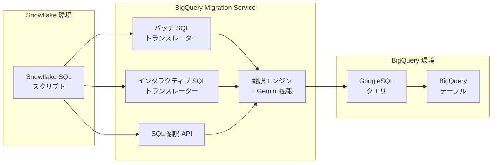

# BigQuery: Migration Service - Snowflake SQL to GoogleSQL 翻訳が GA に

**リリース日**: 2026-04-02

**サービス**: BigQuery

**機能**: BigQuery Migration Service - Snowflake SQL to GoogleSQL translation GA

**ステータス**: GA (一般提供)

[このアップデートのインフォグラフィックを見る](https://takech9203.github.io/google-cloud-news-summary/20260402-bigquery-migration-snowflake-ga.html)

## 概要

BigQuery Migration Service における Snowflake SQL から GoogleSQL への SQL 翻訳機能が、一般提供 (GA) となりました。これにより、Snowflake から BigQuery への移行を検討している企業は、本番環境で安心してこの翻訳機能を利用できるようになります。

今回の GA リリースでは、より幅広い Snowflake SQL 構文がサポートされ、複数のデータ型に対するサポートが改善されています。特に注目すべき変更として、Snowflake の INTEGER 型およびスケール 0 で精度 38 までの NUMERIC 型が、デフォルトで GoogleSQL の INT64 型にマッピングされるようになり、パフォーマンスの向上が期待できます。

この機能は、バッチ SQL トランスレーター、インタラクティブ SQL トランスレーター、SQL 翻訳 API のすべてで利用可能であり、大規模なクエリ移行から個別のアドホッククエリ翻訳まで幅広いユースケースに対応します。

**アップデート前の課題**

- Snowflake SQL から GoogleSQL への翻訳はプレビュー段階であり、本番環境での利用には制約があった
- Snowflake の INTEGER 型は BIGNUMERIC にマッピングされており、INT64 と比較してクエリパフォーマンスが劣る場合があった
- サポートされる Snowflake SQL 構文の範囲が限定的で、手動翻訳が必要なケースが多かった

**アップデート後の改善**

- Snowflake SQL 翻訳が GA となり、本番ワークロードで SLA に基づいた利用が可能になった
- INTEGER 型およびスケール 0 の NUMERIC 型 (精度 38 まで) がデフォルトで INT64 にマッピングされ、クエリパフォーマンスが向上した
- より広範な Snowflake SQL 構文がサポートされ、手動翻訳の必要性が減少した

## アーキテクチャ図



Snowflake SQL スクリプトは BigQuery Migration Service の 3 つの翻訳インターフェース (バッチ、インタラクティブ、API) を通じて翻訳エンジンに渡され、GoogleSQL に変換されて BigQuery 上で実行されます。

## サービスアップデートの詳細

### 主要機能

1. **Snowflake SQL 翻訳の GA 提供**
   - プレビューから GA に昇格し、本番環境での利用に適した信頼性とサポートが提供される
   - バッチ翻訳、インタラクティブ翻訳、API 翻訳の 3 つの方式すべてで GA として利用可能

2. **データ型マッピングの改善**
   - Snowflake の INTEGER 型およびスケール 0 で精度 38 までの NUMERIC 型が、デフォルトで INT64 にマッピングされるようになった
   - INT64 は BIGNUMERIC と比較して BigQuery 内部でのパフォーマンスが優れており、クエリ実行速度の向上が期待できる

3. **Snowflake SQL サポート範囲の拡大**
   - より幅広い Snowflake SQL 構文に対応し、移行時の手動修正作業が削減される
   - Gemini 拡張機能による翻訳品質の向上も利用可能

## 技術仕様

### データ型マッピングの変更点

| Snowflake 型 | 以前の GoogleSQL マッピング | GA 後のデフォルトマッピング |
|------|------|------|
| INTEGER / INT / BIGINT / SMALLINT / TINYINT / BYTEINT | BIGNUMERIC | INT64 |
| NUMERIC (スケール 0、精度 38 以下) | BIGNUMERIC | INT64 |
| NUMBER / DECIMAL / NUMERIC (その他) | NUMERIC / BIGNUMERIC | NUMERIC / BIGNUMERIC (精度とスケールに依存) |
| FLOAT / DOUBLE | FLOAT64 | FLOAT64 (変更なし) |
| VARCHAR / STRING / TEXT | STRING | STRING (変更なし) |

### 主要なデータ型マッピング一覧

| Snowflake 型 | GoogleSQL 型 | 備考 |
|------|------|------|
| NUMBER / DECIMAL / NUMERIC | NUMERIC / BIGNUMERIC | 精度とスケールに応じて自動選択 |
| FLOAT / DOUBLE / REAL | FLOAT64 | NaN の比較動作に差異あり |
| VARCHAR / CHAR / STRING / TEXT | STRING | 最大 16,000 文字 |
| BOOLEAN | BOOL | BigQuery は TRUE/FALSE のみ (NULL は別扱い) |
| DATE | DATE | BigQuery は 'YYYY-[M]M-[D]D' 形式のみ |
| TIMESTAMP_NTZ / DATETIME | DATETIME | -- |
| TIMESTAMP_LTZ / TIMESTAMP_TZ | TIMESTAMP | -- |
| OBJECT / VARIANT | JSON | -- |
| TIME | TIME | Snowflake は 9 ナノ秒精度、BigQuery は 6 ナノ秒精度 |

### 翻訳 API のタスクタイプ

```
Snowflake2BigQuery_Translation
```

SQL 翻訳 API を使用する場合、上記のタスクタイプを指定して Snowflake SQL から GoogleSQL への翻訳ジョブを作成します。

## 設定方法

### 前提条件

1. Google Cloud プロジェクトで BigQuery Migration API が有効であること (2022 年 2 月 15 日以降に作成されたプロジェクトでは自動的に有効)
2. `roles/bigquerymigration.editor` (MigrationWorkflow Editor) IAM ロールが付与されていること

### 手順

#### ステップ 1: バッチ SQL トランスレーターを使用する場合

Google Cloud コンソールから BigQuery Migration Service にアクセスし、ソース言語として「Snowflake SQL」を選択します。翻訳対象の SQL ファイルを Cloud Storage にアップロードし、バッチ翻訳ジョブを実行します。

#### ステップ 2: インタラクティブ SQL トランスレーターを使用する場合

BigQuery コンソールのクエリエディタで翻訳モードを有効にし、ソース言語として「Snowflake SQL」を選択します。クエリを入力すると、リアルタイムで GoogleSQL に翻訳されます。

#### ステップ 3: SQL 翻訳 API を使用する場合

```bash
# BigQuery Migration API を使用した翻訳リクエストの例
curl -X POST \
  "https://bigquerymigration.googleapis.com/v2/projects/PROJECT_ID/locations/LOCATION/workflows" \
  -H "Authorization: Bearer $(gcloud auth print-access-token)" \
  -H "Content-Type: application/json" \
  -d '{
    "tasks": {
      "translation_task": {
        "type": "Snowflake2BigQuery_Translation",
        "translationConfigDetails": {
          "sourceDialect": {
            "snowflakeDialect": {}
          },
          "targetDialect": {
            "bigqueryDialect": {}
          },
          "sourceEnv": {
            "defaultDatabase": "my_database"
          }
        }
      }
    }
  }'
```

## メリット

### ビジネス面

- **移行コストの削減**: 自動翻訳により、手動での SQL 書き換え工数を大幅に削減し、Snowflake から BigQuery への移行プロジェクトを加速できる
- **リスクの低減**: GA リリースにより SLA に基づいたサポートが提供され、本番環境での移行に対する信頼性が向上する
- **クラウドコストの最適化**: BigQuery への移行により、Snowflake のコンピュートコストとの比較でコスト最適化の機会が生まれる

### 技術面

- **パフォーマンス向上**: INTEGER から INT64 へのデフォルトマッピングにより、移行後のクエリパフォーマンスが向上する
- **幅広い SQL 対応**: より多くの Snowflake SQL 構文がサポートされ、翻訳成功率が向上した
- **Gemini 拡張**: AI による翻訳支援で、複雑な SQL 構文の変換品質が向上する

## デメリット・制約事項

### 制限事項

- 翻訳はベストエフォートで行われるため、複雑なクエリや Snowflake 固有の構文については手動修正が必要な場合がある
- Snowflake の VARIANT データ型に対する直接的な同等機能は BigQuery には存在しないが、JSON 型にマッピングされる
- TIME 型の精度が Snowflake の 9 ナノ秒から BigQuery の 6 ナノ秒に制限される

### 考慮すべき点

- 翻訳結果は必ずテストケースで検証し、元の Snowflake クエリの結果と比較することが推奨される
- ヘルパー UDF (bqutil) を使用する翻訳結果は、本番環境では自プロジェクトに UDF をデプロイして利用することが推奨される
- FLOAT 型の NaN 比較動作が Snowflake と BigQuery で異なるため、NaN を含むデータの処理には注意が必要

## ユースケース

### ユースケース 1: 大規模 EDW 移行プロジェクト

**シナリオ**: 企業が Snowflake 上で稼働している数千本の SQL クエリを BigQuery に移行する必要がある場合

**実装例**:
1. バッチ SQL トランスレーターを使用して SQL スクリプトを一括翻訳
2. 翻訳結果の Actions タブで変換エラーを確認・修正
3. Data Validation Tool で翻訳後のクエリ結果を検証

**効果**: 手動翻訳と比較して移行期間を大幅に短縮し、翻訳ミスのリスクを低減できる

### ユースケース 2: 段階的な移行の検証

**シナリオ**: Snowflake と BigQuery を並行運用しながら、クエリ単位で段階的に移行を進める場合

**実装例**:
1. インタラクティブ SQL トランスレーターで個別クエリを翻訳
2. BigQuery 上で翻訳結果を実行し、Snowflake の結果と比較
3. 問題がなければ本番ワークフローを BigQuery に切り替え

**効果**: リスクを最小化しながら段階的に移行を進めることができる

### ユースケース 3: CI/CD パイプラインへの組み込み

**シナリオ**: SQL 翻訳 API を利用して、移行パイプラインに翻訳プロセスを自動化する場合

**実装例**:
```bash
# SQL 翻訳 API をパイプラインに組み込む例
# 1. Snowflake SQL ファイルを Cloud Storage にアップロード
gsutil cp snowflake_queries/ gs://my-bucket/input/

# 2. 翻訳ジョブを実行
# (API 呼び出しにより自動翻訳)

# 3. 翻訳結果を取得して検証
gsutil cp gs://my-bucket/output/ translated_queries/
```

**効果**: 継続的な移行プロセスを自動化し、新規クエリの翻訳も効率的に処理できる

## 料金

BigQuery Migration API (SQL 翻訳) の使用自体には料金は発生しません。ただし、入出力ファイルに使用される Cloud Storage のストレージ料金が通常通り適用されます。

BigQuery への移行後は、BigQuery の料金体系 (ストレージ料金、コンピュート料金) が適用されます。Google Cloud Migration Center のコスト見積もり機能を使用して、移行後の BigQuery 運用コストを事前に見積もることができます。

## 関連サービス・機能

- **BigQuery Data Transfer Service**: Snowflake からのデータ転送に使用。スキーマとデータの移行を自動化する (プレビュー段階)
- **BigQuery Migration Assessment**: 移行前のアセスメントとプランニングを支援し、移行の複雑さやコスト見積もりを提供する
- **Data Validation Tool**: 移行後のデータ整合性を検証するオープンソースツール
- **Cloud Composer**: BigQuery のロードジョブと変換処理のオーケストレーションに使用
- **BigQuery Migration Service MCP Server**: MCP クライアントから翻訳サービスを利用するためのインターフェース

## 参考リンク

- [インフォグラフィック](https://takech9203.github.io/google-cloud-news-summary/20260402-bigquery-migration-snowflake-ga.html)
- [公式リリースノート](https://docs.cloud.google.com/release-notes#April_02_2026)
- [BigQuery Migration Service 概要ドキュメント](https://docs.cloud.google.com/bigquery/docs/migration-intro)
- [Snowflake から BigQuery への移行ガイド](https://docs.cloud.google.com/bigquery/docs/migration/snowflake-migration-intro)
- [Snowflake SQL 翻訳ガイド](https://docs.cloud.google.com/bigquery/docs/migration/snowflake-sql)
- [バッチ SQL トランスレーター](https://docs.cloud.google.com/bigquery/docs/batch-sql-translator)
- [インタラクティブ SQL トランスレーター](https://docs.cloud.google.com/bigquery/docs/interactive-sql-translator)
- [SQL 翻訳 API](https://docs.cloud.google.com/bigquery/docs/api-sql-translator)
- [BigQuery 料金](https://cloud.google.com/bigquery/pricing)

## まとめ

BigQuery Migration Service の Snowflake SQL to GoogleSQL 翻訳機能が GA となったことで、Snowflake から BigQuery への移行が本番環境で安心して実施できるようになりました。特に INTEGER 型から INT64 へのデフォルトマッピング変更はクエリパフォーマンスの向上に直結するため、移行後のワークロードの効率化が期待できます。Snowflake からの移行を検討している組織は、まず Migration Assessment でアセスメントを実施し、バッチ SQL トランスレーターで翻訳の検証を開始することを推奨します。

---

**タグ**: #BigQuery #MigrationService #Snowflake #SQL翻訳 #GoogleSQL #データ移行 #GA
