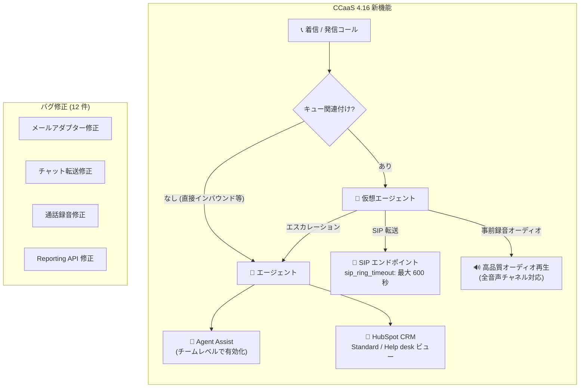

# Google Cloud CCaaS: バージョン 4.16 リリース - 新機能と複数のバグ修正

**リリース日**: 2026-04-02

**サービス**: Google Cloud Contact Center as a Service (CCaaS)

**機能**: CCaaS 4.16 - SIP リングタイムアウト設定、Agent Assist のキュー非関連対応、HubSpot Help desk ビュー、事前録音オーディオ再生、複数バグ修正

**ステータス**: Feature / Fixed / Announcement

:bar_chart: [このアップデートのインフォグラフィックを見る](https://takech9203.github.io/google-cloud-news-summary/20260402-ccaas-features-fixes-v416.html)

## 概要

Google Cloud CCaaS バージョン 4.16 がリリースされた。本リリースでは、仮想エージェントの SIP エンドポイント転送時のリングタイムアウト設定、キューに関連付けられていない通話やチャットでの Agent Assist の利用、HubSpot の新しい Help desk ビュー、Dialogflow による事前録音オーディオの再生など、4 つの新機能が追加された。

加えて、React Native メールアダプター、チャットリダクション、通話転送後の録音、メール自動割り当て、過容量デフレクションメッセージ、同一キュー内チャット転送、603 Decline エラー、セッション ID 不一致、ユーザー検索結果、メールボックス同期、直接インバウンドコールの過容量デフレクション、Reporting API データ型不一致など、12 件のバグ修正が含まれている。

コンタクトセンター運用者、CRM 管理者、仮想エージェント開発者にとって、運用安定性と機能拡張の両面で重要なアップデートである。

**アップデート前の課題**

- 仮想エージェントから SIP エンドポイントへの転送時、リングタイムアウトを設定できず、内部内線や UC 宛先への転送が応答前に切断されることがあった
- Agent Assist はキューに関連付けられたインタラクションでのみ利用可能で、直接インバウンドコールやキュー未選択のアウトバウンドコールでは利用できなかった
- HubSpot CRM チケットビューは Standard ビューのみで、リアルタイムの Help desk ビューを選択できなかった
- 仮想エージェントの応答は標準のテキスト読み上げ (TTS) のみで、高品質な事前録音オーディオを再生する手段がなかった
- 上記 12 件のバグにより、通話録音の欠落、メール割り当ての不具合、チャット転送の失敗などが発生していた

**アップデート後の改善**

- Twilio ユーザーは `sip_ring_timeout` フィールドで最大 600 秒のリングタイムアウトを設定可能になった
- Agent Assist がチームレベルで有効化でき、キュー非関連のインタラクション (直接インバウンド、アウトバウンド) でも利用可能になった
- HubSpot 連携で Standard ビューと Help desk ビューの切り替えが可能になった
- Dialogflow の仮想エージェントが事前録音オーディオで応答でき、全音声チャネルで利用可能になった
- 12 件のバグが修正され、プラットフォーム全体の安定性が向上した

## アーキテクチャ図



CCaaS 4.16 の主要な新機能と修正の全体像を示す。仮想エージェントの SIP 転送強化、Agent Assist のキュー非依存化、HubSpot 連携の拡張、事前録音オーディオ対応が中心となっている。

## サービスアップデートの詳細

### 主要機能

1. **仮想エージェント転送の SIP リングタイムアウト設定**
   - Twilio ユーザー向けの新機能
   - 仮想エージェントのカスタムペイロードに `sip_ring_timeout` フィールドを追加することで、SIP エンドポイントへのアウトバウンドコール転送時のリング期間を設定可能
   - 最大 600 秒 (10 分) まで設定可能
   - 内部内線や Unified Communications (UC) 宛先への転送で、応答までの十分な時間を確保できる

2. **Agent Assist のキュー非関連インタラクション対応**
   - Agent Assist をチームレベルで有効化できるようになった
   - キューに関連付けられていないインタラクション (直接インバウンドコール、キュー未選択のアウトバウンドコール) でも Agent Assist が利用可能
   - 管理者は Settings > Users & Teams > Manage Users & Teams > チーム編集パネルの新しい Agent Assist セクションで設定

3. **HubSpot CRM チケットビュー: Help desk ビュー**
   - HubSpot 連携で使用する CRM チケットビューを選択可能に
   - Standard ビュー (従来) と新しいリアルタイム Help desk ビューから選択
   - 管理者は Settings > Developer Settings > HubSpot パネルの新しい CRM Ticket View セクションで設定

4. **仮想エージェントの事前録音オーディオ再生**
   - Dialogflow が仮想エージェントの応答として事前録音オーディオを再生可能に
   - 標準 TTS の代わりに高品質なオーディオファイルを使用できる
   - インバウンド、アウトバウンドを含む全音声チャネルで利用可能
   - サポート仮想エージェント、タスク仮想エージェント、ポストセッション仮想エージェントに対応

### バグ修正 (12 件)

| # | 修正内容 |
|---|---------|
| 1 | React Native メールアダプターの不具合修正 |
| 2 | チャットリダクション (個人情報マスキング) の不具合修正 |
| 3 | 通話転送後の録音が正しく動作しない問題の修正 |
| 4 | メール自動割り当ての不具合修正 |
| 5 | 過容量デフレクションメッセージの不具合修正 |
| 6 | 同一キュー内でのチャット転送の不具合修正 |
| 7 | 603 Decline エラーの修正 |
| 8 | セッション ID 不一致の修正 |
| 9 | ユーザー検索結果の不具合修正 |
| 10 | メールボックス同期の不具合修正 |
| 11 | 直接インバウンドコールの過容量デフレクションの修正 |
| 12 | Reporting API データ型不一致の修正 |

## 技術仕様

### SIP リングタイムアウト設定

| 項目 | 詳細 |
|------|------|
| 対象ユーザー | Twilio ユーザー |
| 設定フィールド | `sip_ring_timeout` |
| 最大値 | 600 秒 (10 分) |
| 設定場所 | 仮想エージェントのカスタムペイロード |
| 対象 | SIP エンドポイントへのアウトバウンドコール転送 |

### カスタムペイロード設定例

```json
{
  "ujet": {
    "type": "action",
    "action": "deflection",
    "deflection_type": "sip",
    "sip_uri": "sip:1-999-123-4567@voip-provider.example.net:5060",
    "sip_ring_timeout": 120
  }
}
```

### Agent Assist チームレベル設定

| 項目 | 詳細 |
|------|------|
| 設定パス | Settings > Users & Teams > Manage Users & Teams > チーム編集 |
| 新セクション | Agent Assist |
| 対象インタラクション | 直接インバウンドコール、キュー未選択アウトバウンドコール |

### HubSpot Help desk ビュー設定

| 項目 | 詳細 |
|------|------|
| 設定パス | Settings > Developer Settings > HubSpot |
| 新セクション | CRM Ticket View |
| 選択肢 | Standard ビュー / Help desk ビュー |

## 設定方法

### 前提条件

1. Google Cloud CCaaS インスタンスが稼働中であること
2. CCaaS 4.16 へのアップデートが適用されていること (デプロイメントスケジュールに依存)

### 手順

#### ステップ 1: SIP リングタイムアウトの設定 (Twilio ユーザー)

Dialogflow CX コンソールで仮想エージェントのカスタムペイロードに `sip_ring_timeout` フィールドを追加する。値は秒単位で最大 600 を指定する。

#### ステップ 2: Agent Assist のチームレベル有効化

CCAI Platform ポータルで Settings > Users & Teams > Manage Users & Teams から対象チームを編集し、新しい Agent Assist セクションで機能を有効化する。

#### ステップ 3: HubSpot CRM チケットビューの変更

Settings > Developer Settings > HubSpot パネルの CRM Ticket View セクションで、Standard ビューまたは Help desk ビューを選択する。

#### ステップ 4: 事前録音オーディオの設定

Dialogflow CX のフルフィルメントオプションで事前録音オーディオを設定する。オーディオファイルはモノラルの mu-law エンコード (8kHz) で Cloud Storage にホストする必要がある。

## メリット

### ビジネス面

- **顧客体験の向上**: 事前録音オーディオにより、ブランドに合った高品質な音声応答を提供でき、顧客満足度の向上が期待できる
- **エージェント支援の拡大**: Agent Assist がキュー非関連のインタラクションでも利用可能になり、直接インバウンドやアウトバウンドでもリアルタイムの支援を受けられる
- **CRM 運用効率の改善**: HubSpot Help desk ビューにより、チケット管理のリアルタイム性が向上する

### 技術面

- **SIP 転送の信頼性向上**: リングタイムアウトのカスタマイズにより、内部内線や UC 宛先への転送成功率が向上する
- **プラットフォーム安定性の向上**: 12 件のバグ修正により、通話録音、メール処理、チャット転送、Reporting API など幅広い領域の安定性が改善された
- **柔軟なオーディオ対応**: TTS だけでなく事前録音ファイルを使用できることで、音声品質の制御が可能になった

## デメリット・制約事項

### 制限事項

- SIP リングタイムアウトは Twilio ユーザーのみが利用可能 (BYOC 等の他テレフォニー統合では未対応)
- `sip_ring_timeout` の最大値は 600 秒に制限されている
- 事前録音オーディオはモノラルの mu-law エンコード (8kHz) である必要があり、Cloud Storage にホストする必要がある

### 考慮すべき点

- CCaaS 4.16 の適用タイミングはデプロイメントスケジュールに依存するため、即時反映ではない場合がある
- Agent Assist のチームレベル設定は既存のキューレベル設定と併用する形となるため、設定の整合性を確認する必要がある
- HubSpot Help desk ビューは新機能であるため、既存のワークフローとの互換性を事前に確認することを推奨する

## ユースケース

### ユースケース 1: UC 連携のリングタイムアウト最適化

**シナリオ**: 仮想エージェントが IVR 処理後に社内の Unified Communications (UC) システムの内線に転送するケースで、UC 側の応答に時間がかかり転送が切断されていた。

**実装例**:
```json
{
  "ujet": {
    "type": "action",
    "action": "deflection",
    "deflection_type": "sip",
    "sip_uri": "sip:internal-ext-1234@uc.example.com",
    "sip_ring_timeout": 180
  }
}
```

**効果**: リングタイムアウトを 180 秒に設定することで、UC 側のエージェントが応答するまでの十分な猶予を確保でき、転送成功率が向上する。

### ユースケース 2: アウトバウンドセールスでの Agent Assist 活用

**シナリオ**: セールスチームがキューを選択せずにアウトバウンドコールを行う際、これまで Agent Assist が利用できなかった。

**効果**: チームレベルで Agent Assist を有効化することで、アウトバウンドセールスコール中にリアルタイムの提案やナレッジベース情報を表示でき、商談の質が向上する。

### ユースケース 3: ブランド統一の音声体験

**シナリオ**: 金融機関のコンタクトセンターで、仮想エージェントの TTS 音声がブランドイメージと一致しない。

**効果**: プロのナレーターによる事前録音オーディオを使用することで、ブランドに合った一貫性のある音声体験を提供できる。サポート、タスク、ポストセッションの各仮想エージェントタイプで利用可能。

## 料金

CCaaS の料金体系は以下のモデルに基づく:

- **同時接続エージェント数**: 月間の最大同時接続エージェント数に基づく課金
- **指名エージェント数**: エージェントロールを持つユーザー数に基づく課金
- **使用分数**: エージェントがサインインしている分数に基づく課金

テレフォニー料金は使用量に応じて別途課金される。詳細はインスタンスサイズや契約条件により異なるため、Google Cloud の営業担当またはパートナーに確認することを推奨する。

| インスタンスサイズ | 最大同時セッション数 |
|------------------|-------------------|
| Small | 250 (最小 25 エージェント) |
| Medium | 1,600 |
| Large | 3,800 |
| X-Large | 14,000 |
| 2X-Large | 38,000 |
| 3X-Large | 100,000 |

## 利用可能リージョン

CCaaS は複数の国と Google Cloud リージョンで利用可能。詳細は [CCaaS ロケーション](https://cloud.google.com/contact-center/ccai-platform/docs/localities) を参照。

## 関連サービス・機能

- **Dialogflow CX**: 仮想エージェントの構築基盤。事前録音オーディオや SIP 転送のカスタムペイロード設定に使用
- **Agent Assist**: リアルタイムのエージェント支援機能。今回のアップデートでキュー非関連インタラクションにも対応
- **HubSpot CRM**: CRM 連携。Help desk ビューの追加により、チケット管理のリアルタイム性が向上
- **Twilio**: テレフォニー統合。SIP リングタイムアウト設定の対象プラットフォーム
- **Cloud Storage**: 事前録音オーディオファイルのホスティングに使用

## 参考リンク

- :bar_chart: [インフォグラフィック](https://takech9203.github.io/google-cloud-news-summary/20260402-ccaas-features-fixes-v416.html)
- [公式リリースノート](https://cloud.google.com/release-notes#April_02_2026)
- [CCaaS ドキュメント](https://cloud.google.com/contact-center/ccai-platform/docs)
- [Agent Assist ドキュメント](https://cloud.google.com/contact-center/ccai-platform/docs/agent-assist)
- [仮想エージェント カスタムペイロード](https://cloud.google.com/contact-center/ccai-platform/docs/va-custom-payload)
- [Dialogflow CX 事前録音オーディオ](https://cloud.google.com/dialogflow/cx/docs/concept/fulfillment#audio)
- [CCaaS デプロイメントスケジュール](https://cloud.google.com/contact-center/ccai-platform/docs/deployment-schedules)
- [CCaaS 料金・インスタンスサイズ](https://cloud.google.com/contact-center/ccai-platform/docs/get-started)

## まとめ

Google Cloud CCaaS 4.16 は、仮想エージェントの機能強化 (SIP リングタイムアウト、事前録音オーディオ)、Agent Assist の適用範囲拡大、HubSpot 連携の強化という 4 つの新機能と、12 件のバグ修正を含む包括的なリリースである。特に Agent Assist のキュー非関連インタラクション対応は、直接インバウンドやアウトバウンドコールの品質向上に直結するため、コンタクトセンター運用者は早期にチームレベルでの有効化を検討することを推奨する。

---

**タグ**: #GoogleCloud #CCaaS #ContactCenter #AgentAssist #Dialogflow #HubSpot #SIP #VirtualAgent #BugFix
