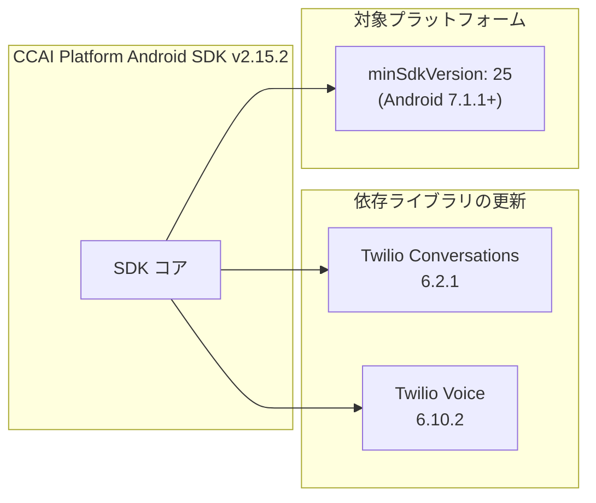

# Google Cloud CCaaS (CCAI Platform): Mobile SDK バージョン 2.15.2 パッチ (Android)

**リリース日**: 2026-04-02

**サービス**: Google Cloud Contact Center as a Service (CCaaS) / CCAI Platform

**機能**: Mobile SDK バージョン 2.15.2 パッチ (Android SDK)

**ステータス**: Announcement

[このアップデートのインフォグラフィックを見る](https://takech9203.github.io/google-cloud-news-summary/20260402-ccaas-mobile-sdk-2-15-2.html)

## 概要

Google Cloud CCaaS (CCAI Platform) の Android 向け Mobile SDK バージョン 2.15.2 パッチがリリースされました。本パッチでは、Android SDK の minSdkVersion が 25 (Android 7.1.1 Nougat) に引き上げられ、依存ライブラリである Twilio Conversations および Twilio Voice のバージョンがアップグレードされています。

これは機能追加やバグ修正を含まないメンテナンスパッチであり、SDK の依存関係を最新化し、基盤となるライブラリのセキュリティおよび安定性を向上させることを目的としています。CCAI Platform の Mobile SDK を Android アプリに組み込んで音声通話やチャットサポートを提供している開発者に影響があります。

**アップデート前の状態**

- minSdkVersion が 25 未満 (API レベル 21 以上) に設定されており、Android 5.0 Lollipop 以降のデバイスをサポート対象としていた
- Twilio Conversations および Twilio Voice の依存ライブラリが旧バージョンであった

**アップデート後の変更**

- minSdkVersion が 25 (Android 7.1.1 Nougat) に引き上げられ、API レベル 21-24 のデバイスはサポート対象外となった
- Twilio Conversations が 6.2.1 にアップグレードされた
- Twilio Voice が 6.10.2 にアップグレードされた

## アーキテクチャ図



この図は、Mobile SDK 2.15.2 パッチで更新された依存ライブラリと対象プラットフォームの変更を示しています。

## サービスアップデートの詳細

### 主要な変更点

1. **minSdkVersion の引き上げ (API 25)**
   - Android SDK の最低サポートバージョンが API レベル 25 (Android 7.1.1 Nougat) に変更されました
   - API レベル 21-24 (Android 5.0 - 7.0) のデバイスでは、本バージョン以降の SDK は動作しません
   - 前バージョン 2.15.1 では Android 16 互換性が追加されており、本パッチと合わせて対象プラットフォームの範囲が更新されています

2. **Twilio Conversations のアップグレード (6.2.1)**
   - チャット機能の基盤となる Twilio Conversations SDK が 6.2.1 にアップグレードされました
   - チャットメッセージングの安定性とセキュリティの向上が期待されます

3. **Twilio Voice のアップグレード (6.10.2)**
   - VoIP 通話機能の基盤となる Twilio Voice SDK が 6.10.2 にアップグレードされました
   - 音声通話の品質と信頼性の向上が期待されます

## 技術仕様

### バージョン変更の詳細

| 項目 | 変更前 | 変更後 (v2.15.2) |
|------|--------|-------------------|
| minSdkVersion | 21 以上 | 25 |
| Twilio Conversations | 旧バージョン | 6.2.1 |
| Twilio Voice | 旧バージョン | 6.10.2 |

### SDK バージョン履歴 (直近)

| バージョン | リリース日 | 主な変更内容 |
|-----------|-----------|-------------|
| 2.15.0 | 2025-12-02 | プッシュ通知のグローバル無効化機能 |
| 2.15.1 | 2025-12-09 | Android 16 互換性、エッジツーエッジ画面対応 |
| 2.15.2 | 2026-04-02 | minSdkVersion 25 への引き上げ、Twilio 依存ライブラリのアップグレード |

### Gradle 依存関係の設定例

```groovy
dependencies {
    def ujetSdkVersion = "2.15.2"
    implementation "co.ujet.android:ujet-android:$ujetSdkVersion"

    // Twilio SDK (パッケージ直接統合の場合)
    api 'com.twilio:voice-android:6.10.2'
    api 'com.twilio:conversations-android:6.2.1'
}
```

## 設定方法

### 前提条件

1. Android Studio がインストールされていること
2. CCAI Platform ポータルの Company Key と Company Secret が取得済みであること
3. アプリの minSdkVersion が 25 以上に設定されていること

### 手順

#### ステップ 1: build.gradle の更新

```groovy
// build.gradle (module: app)
android {
    defaultConfig {
        minSdkVersion 25  // 25 未満の場合は更新が必要
    }
}

dependencies {
    def ujetSdkVersion = "2.15.2"
    implementation "co.ujet.android:ujet-android:$ujetSdkVersion"
}
```

アプリの `build.gradle` ファイルで SDK バージョンを 2.15.2 に更新し、minSdkVersion が 25 以上であることを確認します。

#### ステップ 2: 依存関係の同期とビルド

```bash
./gradlew clean build
```

Gradle の依存関係を同期し、ビルドが正常に完了することを確認します。Twilio 関連の ProGuard ルールは SDK に含まれているため、追加設定は不要です。

## メリット

### 技術面

- **依存ライブラリの最新化**: Twilio Conversations と Twilio Voice の最新パッチにより、既知の不具合やセキュリティ脆弱性への対応が含まれる可能性がある
- **サポート対象の明確化**: minSdkVersion の引き上げにより、古い API レベル向けの互換性コードが不要になり、SDK の安定性が向上
- **モダンな API の活用**: API レベル 25 以降で利用可能な Android プラットフォーム機能を SDK 内部で活用できるようになる

## デメリット・制約事項

### 制限事項

- API レベル 21-24 (Android 5.0 - 7.0) のデバイスでは、SDK 2.15.2 以降は利用できない
- Twilio SDK をパッケージ直接統合している場合は、Twilio のバージョンを手動で合わせる必要がある

### 考慮すべき点

- minSdkVersion の引き上げにより、古いデバイスを使用しているエンドユーザーがアプリを利用できなくなる可能性がある。アップデート前にユーザーベースのデバイス分布を確認することを推奨
- Android 7.1.1 未満のデバイスシェアは非常に小さいものの、特定の市場やユースケースでは影響がある場合がある

## 料金

本パッチは SDK の依存関係更新であり、CCAI Platform の料金体系に変更はありません。CCAI Platform の料金は、同時接続エージェント数、指名エージェント数、または使用分数に基づいて課金されます。詳細は Google Cloud アカウントチームにお問い合わせください。

## 利用可能リージョン

本パッチは CCAI Platform の全リージョンで利用可能です。利用可能な国およびリージョンの詳細については、[CCAI Platform のロケーションページ](https://cloud.google.com/contact-center/ccai-platform/docs/localities)を参照してください。

## 関連サービス・機能

- **CCAI Platform Mobile SDK (iOS)**: iOS 向けの Mobile SDK。本パッチは Android SDK のみが対象
- **Twilio**: CCAI Platform のテレフォニーおよびメッセージング基盤として使用される BYOC (Bring Your Own Carrier) プロバイダー
- **Firebase Cloud Messaging**: Android SDK のプッシュ通知に使用されるメッセージングサービス

## 参考リンク

- [インフォグラフィック](https://takech9203.github.io/google-cloud-news-summary/20260402-ccaas-mobile-sdk-2-15-2.html)
- [公式リリースノート](https://docs.cloud.google.com/release-notes#April_02_2026)
- [CCAI Platform リリースノート](https://docs.cloud.google.com/contact-center/ccai-platform/docs/release-notes)
- [Android SDK ガイド](https://cloud.google.com/contact-center/ccai-platform/docs/android-sdk-guide)
- [Mobile SDK 概要](https://cloud.google.com/contact-center/ccai-platform/docs/mobileSDK-overview)

## まとめ

Google Cloud CCaaS (CCAI Platform) の Mobile SDK バージョン 2.15.2 は、Android SDK の minSdkVersion を 25 に引き上げ、Twilio Conversations (6.2.1) および Twilio Voice (6.10.2) の依存ライブラリをアップグレードするメンテナンスパッチです。機能追加はありませんが、SDK の基盤を最新化することでセキュリティと安定性の向上が期待されます。アップデート前に、アプリの minSdkVersion 設定と、エンドユーザーのデバイス分布を確認することを推奨します。

---

**タグ**: #GoogleCloud #CCaaS #CCAIPlatform #MobileSDK #Android #Twilio #SDK #Patch #ContactCenter
