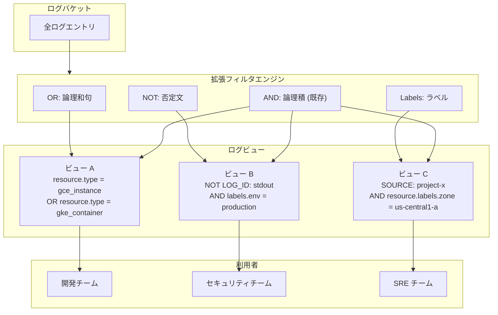

# Cloud Logging: ログビューのフィルタ機能拡張 (論理和句、否定、ラベル対応)

**リリース日**: 2026-04-02

**サービス**: Cloud Logging

**機能**: ログビューのフィルタ機能拡張 (論理和句、否定、ラベル対応)

**ステータス**: GA

[このアップデートのインフォグラフィックを見る](https://takech9203.github.io/google-cloud-news-summary/20260402-cloud-logging-log-view-filters.html)

## 概要

Cloud Logging のログビュー (Log Views) において、フィルタ機能が大幅に拡張されました。従来はログビューのフィルタで AND (論理積) 演算子のみがサポートされていましたが、今回のアップデートにより、OR を使った論理和句 (disjunctive clauses)、NOT を使った否定文 (negation statements)、およびラベル (labels) によるフィルタリングが新たにサポートされました。

ログビューは、ログバケット内のログエントリの可視性を制御するための重要な機能です。この拡張により、より柔軟で精密なログのアクセス制御が可能になり、チームやプロジェクトごとに必要なログだけを効率的に表示できるようになります。

このアップデートは、大規模な組織でログ管理を行うプラットフォームチーム、セキュリティチーム、および複数のプロジェクトやサービスのログを横断的に管理する運用チームに特に有益です。

**アップデート前の課題**

- ログビューのフィルタでは AND 演算子のみがサポートされており、複数の条件を「いずれか一方」でマッチさせることができなかった
- 特定のリソースタイプやログ ID を除外する否定条件は一部サポートされていたが、ラベルを使った柔軟なフィルタリングができなかった
- 複数のリソースタイプを 1 つのログビューで表示するには、それぞれ個別のログビューを作成する必要があった
- ラベルベースのフィルタリングができないため、環境 (本番/ステージング) やチーム別のログビュー作成が困難だった

**アップデート後の改善**

- OR 演算子 (論理和句) により、複数のリソースタイプやログ ID のいずれかにマッチするログを 1 つのビューで表示可能になった
- NOT 演算子 (否定文) の適用範囲が拡張され、より柔軟な除外条件が設定可能になった
- ラベル (labels) によるフィルタリングが追加され、リソースラベルやユーザー定義ラベルを使った精密なフィルタリングが可能になった
- ログビューの数を削減しつつ、より適切なアクセス制御を実現できるようになった

## アーキテクチャ図



ログバケットに格納された全ログエントリに対して、拡張されたフィルタエンジンが OR、NOT、ラベル条件を評価し、各ログビューに適切なログエントリのみを表示します。

## サービスアップデートの詳細

### 主要機能

1. **論理和句 (Disjunctive Clauses / OR)**
   - ログビューフィルタで OR 演算子が使用可能になった
   - 複数のリソースタイプ、ログ ID、データソースのいずれかにマッチするフィルタを記述できる
   - 例: `resource.type = "gce_instance" OR resource.type = "gke_container"`
   - 括弧を使った簡略記法もサポート: `resource.type = ("gce_instance" OR "gke_container")`

2. **否定文 (Negation Statements / NOT)**
   - NOT 演算子の適用範囲が拡張された
   - データソース、ログ ID、リソースタイプに加えて、ラベル条件にも否定を適用可能
   - 例: `SOURCE("projects/myproject") AND NOT LOG_ID("stdout")`

3. **ラベルフィルタリング (Labels)**
   - `resource.labels` や `labels` フィールドを使ったフィルタリングが新たにサポートされた
   - リソースラベル (ゾーン、インスタンス ID など) やユーザー定義ラベルを条件に指定可能
   - 例: `resource.labels.zone = "us-central1-a"` のような条件でログを絞り込み可能

## 技術仕様

### フィルタ構文の拡張

| 項目 | 従来 | 拡張後 |
|------|------|--------|
| 論理演算子 | AND のみ | AND, OR |
| 否定演算子 | NOT (データソース、ログ ID、リソースタイプ) | NOT (全修飾子に適用可能) |
| フィルタ対象 | `SOURCE()`, `resource.type`, `LOG_ID()` | 上記に加え `resource.labels.*`, `labels.*` |
| 括弧によるグルーピング | 非対応 | 対応 |

### フィルタの使用例

```
# 複数リソースタイプを OR で結合
SOURCE("projects/myproject") AND (resource.type = "gce_instance" OR resource.type = "gke_container")

# 否定とラベルの組み合わせ
SOURCE("projects/myproject") AND NOT LOG_ID("stdout") AND resource.labels.zone = "us-central1-a"

# ラベルによる環境別フィルタリング
SOURCE("projects/myproject") AND labels.env = "production"
```

## 設定方法

### 前提条件

1. Cloud Logging が有効化されたプロジェクト
2. ログバケットが作成済みであること
3. `logging.views.create` または `logging.views.update` の IAM 権限

### 手順

#### ステップ 1: gcloud CLI でログビューを作成 (拡張フィルタ付き)

```bash
gcloud logging views create my-view \
  --bucket=my-bucket \
  --location=global \
  --description="Production GCE and GKE logs" \
  --log-filter='SOURCE("projects/my-project") AND (resource.type = "gce_instance" OR resource.type = "gke_container") AND labels.env = "production"'
```

OR 句とラベルフィルタを組み合わせて、本番環境の Compute Engine と GKE のログのみを表示するビューを作成します。

#### ステップ 2: 既存のログビューのフィルタを更新

```bash
gcloud logging views update my-view \
  --bucket=my-bucket \
  --location=global \
  --log-filter='SOURCE("projects/my-project") AND NOT LOG_ID("stdout") AND resource.labels.zone = "us-central1-a"'
```

既存のログビューに対して、否定条件とラベルフィルタを追加してフィルタを更新します。

#### ステップ 3: Google Cloud コンソールでの設定

Google Cloud コンソールの「ログストレージ」画面からもログビューの作成・更新が可能です。フィルタ入力欄で新しい OR、NOT、ラベル構文を使用できます。

## メリット

### ビジネス面

- **運用コスト削減**: 複数の単純なログビューを 1 つの柔軟なビューに統合でき、管理対象が減少する
- **セキュリティ強化**: ラベルや否定条件を活用した精密なアクセス制御により、チームごとに適切なログのみを公開できる

### 技術面

- **フィルタの表現力向上**: OR 演算子とラベルの追加により、複雑なログ分類を 1 つのフィルタで表現可能
- **管理の簡素化**: ログビューの数を削減しつつ、同等以上のアクセス制御を実現できる
- **Logging Query Language との一貫性**: ログビューフィルタが Logging Query Language の構文により近づき、学習コストが低減

## デメリット・制約事項

### 制限事項

- ログビューのフィルタの最大長は引き続き制限がある (Logging API 全体のフィルタ最大長は 20,000 文字)
- NOT 演算子は個々の修飾子に適用可能だが、複合文 (例: `NOT (A AND B)`) には適用不可

### 考慮すべき点

- 既存のログビューのフィルタは引き続き動作するため、即時の移行は不要
- OR 句を多用した複雑なフィルタはクエリパフォーマンスに影響を与える可能性がある
- フィルタの変更はログビューのアクセス範囲に直結するため、セキュリティレビューを経て更新することを推奨

## ユースケース

### ユースケース 1: マルチサービスの統合ログビュー

**シナリオ**: プラットフォームチームが Compute Engine と GKE の両方を運用しており、1 つのログビューで両サービスのログを確認したい。

**実装例**:
```
SOURCE("projects/platform-project") AND (resource.type = "gce_instance" OR resource.type = "gke_container")
```

**効果**: 2 つの個別ログビューを 1 つに統合でき、チームの運用効率が向上する。

### ユースケース 2: 環境別のセキュリティログビュー

**シナリオ**: セキュリティチームが本番環境のログのみを監視する必要があり、デバッグ用の stdout ログは除外したい。

**実装例**:
```
SOURCE("projects/prod-project") AND NOT LOG_ID("stdout") AND labels.env = "production"
```

**効果**: ノイズの少ない本番環境専用のセキュリティログビューにより、インシデント対応が迅速化する。

### ユースケース 3: リージョン別ログの分離

**シナリオ**: コンプライアンス要件により、特定のリージョンのログのみを特定のチームに公開する必要がある。

**実装例**:
```
SOURCE("projects/global-project") AND resource.labels.zone = ("us-central1-a" OR "us-central1-b")
```

**効果**: データレジデンシー要件を満たしつつ、運用チームに必要なログへのアクセスを提供できる。

## 料金

ログビューのフィルタ機能自体には追加料金は発生しません。Cloud Logging の料金は、ログの取り込み量と保持期間に基づきます。

| 項目 | 料金 |
|------|------|
| ログ取り込み (最初の 50 GiB/月) | 無料 |
| ログ取り込み (50 GiB 超過分) | $0.50/GiB |
| ログ保持 (デフォルト保持期間内) | 無料 |
| ログ保持 (デフォルト超過分) | $0.01/GiB |

## 利用可能リージョン

ログビューはログバケットに関連付けられており、ログバケットが配置されている全てのリージョンで利用可能です。`global` ロケーションを含む全てのサポート対象リージョンでフィルタ拡張機能を使用できます。

## 関連サービス・機能

- **Cloud Logging ログバケット**: ログビューはログバケット上に作成され、バケット内のログエントリへのアクセスを制御する
- **Logging Query Language**: ログビューフィルタの構文は Logging Query Language に基づいており、今回の拡張で両者の一貫性が向上した
- **Observability Analytics**: ログビュー上にアナリティクスビューを作成し、SQL クエリによるログ分析が可能
- **Cloud Logging シンク**: ログのルーティングに使用するシンクフィルタでは既に OR や NOT がサポートされており、今回のアップデートでログビューフィルタとの一貫性が向上した
- **IAM**: ログビューへのアクセスは IAM ロールで制御され、フィルタによるデータレベルのアクセス制御と組み合わせて多層防御を実現する

## 参考リンク

- [インフォグラフィック](https://takech9203.github.io/google-cloud-news-summary/20260402-cloud-logging-log-view-filters.html)
- [公式リリースノート](https://docs.cloud.google.com/release-notes#April_02_2026)
- [ログビューのドキュメント](https://cloud.google.com/logging/docs/logs-views)
- [Logging Query Language](https://cloud.google.com/logging/docs/view/logging-query-language)
- [Cloud Logging 料金](https://cloud.google.com/products/observability/pricing)

## まとめ

Cloud Logging のログビューフィルタに OR 演算子、NOT 演算子の拡張、ラベルフィルタリングが追加されたことにより、ログの可視性制御がより柔軟で強力になりました。特に大規模な組織において、ログビューの数を削減しながらセキュリティ要件を満たすアクセス制御を実現できる点が大きな利点です。既存のログビューへの影響はないため、段階的に新しいフィルタ構文を活用してログビュー構成を最適化することを推奨します。

---

**タグ**: #CloudLogging #LogViews #Observability #フィルタ #アクセス制御 #ログ管理
