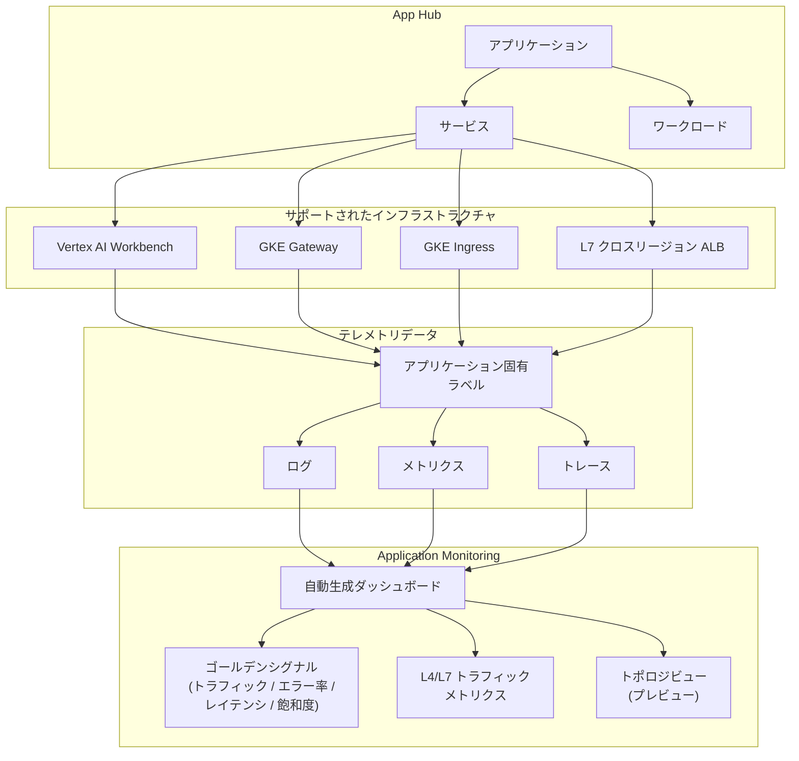

# Cloud Monitoring: Application Monitoring の新リソースサポートと Kubernetes ダッシュボードの L4/L7 トラフィックメトリクス

**リリース日**: 2026-04-02

**サービス**: Cloud Monitoring

**機能**: Application Monitoring - 新リソースサポート (Vertex AI Workbench, GKE Gateway, GKE Ingress, L7 クロスリージョン ALB) + Kubernetes ダッシュボードの L4/L7 トラフィックメトリクス

**ステータス**: Feature

[このアップデートのインフォグラフィックを見る](https://takech9203.github.io/google-cloud-news-summary/20260402-cloud-monitoring-application-monitoring-resources.html)

## 概要

Cloud Monitoring の Application Monitoring に、新たに 4 つのインフラストラクチャリソースのサポートが追加されました。対象リソースは Vertex AI Workbench、GKE Gateway、GKE Ingress、Layer 7 クロスリージョン Application Load Balancer です。これらのリソースが App Hub のサービスまたはワークロードとして登録されている場合、Application Monitoring が自動的にダッシュボードを生成し、ゴールデンシグナル (トラフィック、エラー率、レイテンシ、飽和度) を表示します。

さらに、Kubernetes ワークロード向けのダッシュボードにおいて、L4 (Layer 4) と L7 (Layer 7) の両方のトラフィックメトリクスが利用可能な場合に表示されるようになりました。これにより、ネットワークレイヤーごとのトラフィック状況をより詳細に把握できるようになります。

このアップデートは、Vertex AI を活用した ML ワークロードの運用者、GKE 上でマイクロサービスアーキテクチャを構築するプラットフォームエンジニア、クロスリージョンの内部負荷分散を利用するインフラ管理者にとって有用です。

**アップデート前の課題**

- Vertex AI Workbench インスタンスのモニタリングは Cloud Monitoring の個別メトリクスを使用する必要があり、アプリケーション単位での統合的な監視が困難だった
- GKE Gateway や GKE Ingress のトラフィック状況を Application Monitoring のダッシュボードから直接確認することができなかった
- L7 クロスリージョン Application Load Balancer のパフォーマンスを App Hub のアプリケーションコンテキストで監視する手段がなかった
- Kubernetes ワークロードのダッシュボードでは L4 と L7 のトラフィックメトリクスを統合的に確認できなかった

**アップデート後の改善**

- Vertex AI Workbench、GKE Gateway、GKE Ingress、L7 クロスリージョン ALB が Application Monitoring のサポートインフラストラクチャに追加され、アプリケーション中心の監視が可能になった
- App Hub に登録されたこれらのリソースに対して、自動的にダッシュボードが生成されゴールデンシグナルが表示される
- Kubernetes ダッシュボードで L4/L7 両方のトラフィックメトリクスが表示され、ネットワークレイヤー別の分析が可能になった

## アーキテクチャ図



App Hub に登録されたリソースが生成するテレメトリデータにアプリケーション固有ラベルが付与され、Application Monitoring のダッシュボードでゴールデンシグナルや L4/L7 トラフィックメトリクスとして表示される流れを示しています。

## サービスアップデートの詳細

### 主要機能

1. **Vertex AI Workbench のサポート追加**
   - Vertex AI Workbench インスタンスが Application Monitoring のサポートインフラストラクチャに追加された
   - App Hub にワークロードとして登録することで、Jupyter ノートブック環境のリソース使用状況をアプリケーションコンテキストで監視可能
   - CPU 使用率、ネットワーク、メモリなどのメトリクスがゴールデンシグナルとして表示される

2. **GKE Gateway のサポート追加**
   - GKE Gateway コントローラーが管理する Gateway リソースのモニタリングが Application Monitoring に統合された
   - シングルクラスタおよびマルチクラスタの Gateway (gke-l7-global-external-managed、gke-l7-rilb など) が対象
   - トラフィックルーティング、リクエスト率、エラー率などのメトリクスを確認可能

3. **GKE Ingress のサポート追加**
   - GKE Ingress コントローラーが管理するリソースが Application Monitoring のダッシュボードに表示されるようになった
   - 外部 Ingress および内部 Ingress の両方が対象
   - ロードバランサのパフォーマンスメトリクスをアプリケーション単位で確認可能

4. **L7 クロスリージョン Application Load Balancer のサポート追加**
   - GatewayClass `gke-l7-cross-regional-internal-managed-mc` に対応する内部クロスリージョン ALB のモニタリングが追加された
   - 複数リージョンにまたがる内部 L7 ロードバランシングのパフォーマンスを一元的に監視可能

5. **Kubernetes ダッシュボードの L4/L7 トラフィックメトリクス表示**
   - Kubernetes ワークロード用ダッシュボードで L4 (TCP/UDP レイヤー) と L7 (HTTP/HTTPS レイヤー) の両方のトラフィックメトリクスが表示されるようになった
   - 両方のメトリクスが利用可能な場合に自動的に表示される

## 技術仕様

### Application Monitoring が表示するゴールデンシグナル

| ゴールデンシグナル | 説明 |
|------|------|
| Traffic | 選択した期間内のサービスまたはワークロードへの受信リクエスト率 |
| Server error rate | 5xx HTTP レスポンスコードを生成またはマッピングする受信リクエストの平均割合 |
| P95 latency | リクエスト処理のレイテンシの 95 パーセンタイル値 (ミリ秒) |
| Saturation | サービスまたはワークロードの使用率 (例: CPU 使用率) |

### 新規サポートリソース一覧

| リソース | カテゴリ | 主な用途 |
|------|------|------|
| Vertex AI Workbench | ワークロード | ML ノートブック環境のモニタリング |
| GKE Gateway | サービス | Kubernetes Gateway API ベースのロードバランシング |
| GKE Ingress | サービス | Kubernetes Ingress ベースのロードバランシング |
| L7 クロスリージョン ALB | サービス | 内部クロスリージョン L7 ロードバランシング |

### アプリケーション固有ラベル

Application Monitoring は、サポートされたインフラストラクチャから生成されるテレメトリデータにアプリケーション固有のラベルを自動的に付与します。これらのラベルは App Hub アプリケーションを識別し、Logs Explorer、Metrics Explorer、Trace Explorer でフィルタリングや集約に使用できます。

## 設定方法

### 前提条件

1. App Hub が有効化されたプロジェクト
2. 対象リソースが App Hub にサービスまたはワークロードとして登録されていること
3. Cloud Monitoring API が有効化されていること

### 手順

#### ステップ 1: App Hub でアプリケーションを作成

Google Cloud コンソールで App Hub にアクセスし、アプリケーションを作成します。

```bash
# App Hub API の有効化
gcloud services enable apphub.googleapis.com
```

#### ステップ 2: リソースをサービスまたはワークロードとして登録

対象の GKE Gateway、GKE Ingress、Vertex AI Workbench、L7 クロスリージョン ALB を App Hub のアプリケーションにサービスまたはワークロードとして登録します。

#### ステップ 3: Application Monitoring ダッシュボードを確認

```
Google Cloud コンソール > Monitoring > Application Monitoring
```

登録されたリソースに対して自動生成されたダッシュボードが表示されます。ゴールデンシグナル、ログデータ、オープンインシデント情報を確認できます。

## メリット

### ビジネス面

- **統合的な可視性の向上**: ML ワークロード (Vertex AI Workbench) からネットワーキング (GKE Gateway/Ingress、ALB) まで、アプリケーション全体の健全性を一つのビューで把握できる
- **MTTR (平均復旧時間) の短縮**: アプリケーション中心のアプローチにより、問題の発生箇所を素早く特定し、対応時間を削減できる

### 技術面

- **自動ダッシュボード生成**: App Hub に登録するだけで、手動でダッシュボードを構築する必要がなくなる
- **L4/L7 統合メトリクス**: ネットワークレイヤー別のトラフィック分析が可能になり、パフォーマンスのボトルネック特定が容易になる
- **アプリケーション固有ラベル**: テレメトリデータにラベルが自動付与されるため、Logs Explorer や Metrics Explorer でのフィルタリングが効率化される

## デメリット・制約事項

### 制限事項

- Application Monitoring のダッシュボードは App Hub に登録されたリソースのみが対象であり、未登録のリソースは表示されない
- トポロジビュー機能はプレビュー段階であり、GA での動作とは異なる可能性がある
- ゴールデンシグナルの表示にはリソースが対応するメトリクスを生成している必要があり、すべてのシグナルがすべてのリソースで利用可能とは限らない

### 考慮すべき点

- App Hub の導入が前提となるため、既存環境への適用にはリソースの登録作業が必要
- L4/L7 トラフィックメトリクスは両方が利用可能な場合にのみ表示されるため、L4 のみまたは L7 のみの環境では一部の情報のみが表示される

## ユースケース

### ユースケース 1: ML プラットフォームの統合モニタリング

**シナリオ**: データサイエンスチームが複数の Vertex AI Workbench インスタンスを使用して ML モデルの開発・実験を行っている。プラットフォームエンジニアは、これらのインスタンスの健全性をアプリケーション単位で監視したい。

**効果**: App Hub にアプリケーションを作成し、Vertex AI Workbench インスタンスをワークロードとして登録することで、Application Monitoring が自動的にダッシュボードを生成。CPU 使用率やネットワークトラフィックなどのゴールデンシグナルをアプリケーションコンテキストで確認でき、リソースの過不足を迅速に判断できる。

### ユースケース 2: マルチリージョン GKE アプリケーションの L4/L7 トラフィック分析

**シナリオ**: 複数リージョンに展開された GKE クラスタ上で、GKE Gateway (gke-l7-cross-regional-internal-managed-mc) を使用した内部ロードバランシングを構成している。リージョン間のトラフィック分散状況とレイテンシを監視したい。

**効果**: GKE Gateway と L7 クロスリージョン ALB が Application Monitoring でサポートされたことで、クロスリージョンのトラフィック状況を一元的に把握可能。L4/L7 の両メトリクスにより、TCP レベルの接続状況と HTTP レベルのリクエストパターンを同時に分析でき、パフォーマンス最適化に役立てられる。

### ユースケース 3: GKE Ingress を使用したマイクロサービスの障害診断

**シナリオ**: GKE Ingress を使用して複数のマイクロサービスを公開している。特定のサービスへのリクエストでエラー率が上昇した際に、原因を迅速に特定したい。

**効果**: GKE Ingress が Application Monitoring に統合されたことで、Ingress のエラー率やレイテンシをアプリケーションダッシュボードから直接確認可能。ログデータやトレースデータと組み合わせることで、問題の根本原因を効率的に特定できる。

## 料金

Cloud Monitoring の Application Monitoring 機能自体は、Cloud Monitoring の標準的な料金体系に基づいて課金されます。

- **システムメトリクス**: Google Cloud のシステムメトリクスは無料
- **カスタムメトリクス**: バイトベースまたはサンプルベースの従量課金
  - バイトベース: スカラー値は 8 バイト、ディストリビューションは 80 バイトとして計算
  - サンプルベース: スカラー値は 1 サンプル、ディストリビューションは 2 サンプル + 非ゼロバケット数

詳細な料金については [Google Cloud Observability の料金ページ](https://cloud.google.com/products/observability/pricing) を参照してください。

## 関連サービス・機能

- **App Hub**: Application Monitoring の前提となるアプリケーション管理サービス。リソースをアプリケーション、サービス、ワークロードとして組織化する
- **Vertex AI Workbench**: マネージド Jupyter ノートブック環境。今回 Application Monitoring のサポートインフラストラクチャに追加された
- **GKE Gateway コントローラー**: Kubernetes Gateway API の Google Cloud 実装。シングルクラスタおよびマルチクラスタのロードバランシングを管理
- **GKE Ingress コントローラー**: Kubernetes Ingress リソースを管理し、Cloud Load Balancing と統合するコントローラー
- **Cloud Load Balancing**: L7 クロスリージョン Application Load Balancer を含む Google Cloud のロードバランシングサービス
- **Application Design Center**: アプリケーションの設計とデプロイを支援するサービス。App Hub と連携して Application Monitoring のワークフローに統合される

## 参考リンク

- [インフォグラフィック](https://takech9203.github.io/google-cloud-news-summary/20260402-cloud-monitoring-application-monitoring-resources.html)
- [公式リリースノート](https://docs.google.com/release-notes#April_02_2026)
- [Application Monitoring の概要](https://cloud.google.com/monitoring/docs/about-application-monitoring)
- [Application Monitoring サポートインフラストラクチャ](https://cloud.google.com/monitoring/docs/application-monitoring-services)
- [App Hub の概要](https://cloud.google.com/app-hub/docs/overview)
- [Google Cloud Observability の料金](https://cloud.google.com/products/observability/pricing)

## まとめ

今回のアップデートにより、Application Monitoring のサポート範囲が Vertex AI Workbench、GKE Gateway、GKE Ingress、L7 クロスリージョン ALB に拡大され、ML ワークロードからネットワーキングリソースまでをアプリケーション中心の視点で統合的に監視できるようになりました。Kubernetes ダッシュボードでの L4/L7 トラフィックメトリクスの同時表示も加わり、ネットワークレイヤー別の分析が容易になっています。App Hub を既に利用している、または導入を検討している組織は、対象リソースを登録して Application Monitoring の自動ダッシュボード機能を活用することを推奨します。

---

**タグ**: #CloudMonitoring #ApplicationMonitoring #AppHub #VertexAI #GKE #Gateway #Ingress #LoadBalancing #Kubernetes #Observability
