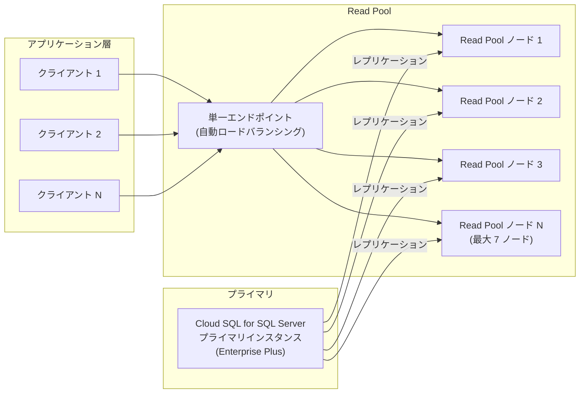

# Cloud SQL for SQL Server: Read Pools が GA (一般提供開始)

**リリース日**: 2026-04-02

**サービス**: Cloud SQL for SQL Server

**機能**: Read Pools (読み取りプール)

**ステータス**: GA (一般提供)

📊 [このアップデートのインフォグラフィックを見る](https://takech9203.github.io/google-cloud-news-summary/20260402-cloud-sql-server-read-pools-ga.html)

## 概要

Cloud SQL for SQL Server の Read Pools (読み取りプール) が一般提供 (GA) となりました。Read Pools は、読み取りワークロードに対する運用のシンプルさとスケーラビリティを提供する機能です。最大 7 つの Read Pool ノードの前面に単一のエンドポイントを配置し、トラフィックを自動的にロードバランシングします。

これまで Cloud SQL の Read Pools は MySQL と PostgreSQL で先行して GA となっていましたが、今回 SQL Server でも GA に到達しました。SQL Server ユーザーは、読み取り負荷の高いアプリケーションにおいて、個別のリードレプリカを手動で管理することなく、単一エンドポイントを通じて自動的にトラフィックを分散できるようになります。

本機能は Cloud SQL Enterprise Plus エディションのインスタンスで利用可能であり、水平スケーリング (ノード数の増減) と垂直スケーリング (マシンタイプの変更) の両方に対応しています。

**アップデート前の課題**

- 読み取りワークロードをスケールするには、個別のリードレプリカを作成し、アプリケーション側で接続先を管理する必要があった
- 複数のリードレプリカ間でのトラフィック分散はアプリケーション側またはプロキシ層で実装する必要があった
- リードレプリカのスケーリング (追加・削除) のたびに、アプリケーションの接続設定を変更する必要があった

**アップデート後の改善**

- 単一エンドポイントを通じて最大 7 つの Read Pool ノードへ自動的にトラフィックが分散されるようになった
- ノード数の変更 (1-7 ノード) やマシンタイプの変更によるスケーリングが、アプリケーション側の変更なしに実行できるようになった
- Read Pool の設定が全ノードに均一に適用されるため、運用管理が大幅に簡素化された

## アーキテクチャ図



アプリケーションは Read Pool の単一エンドポイントに接続し、トラフィックは自動的に各ノードに分散されます。各ノードはプライマリインスタンスからレプリケーションを受け取ります。

## サービスアップデートの詳細

### 主要機能

1. **単一エンドポイントによるロードバランシング**
   - 複数の Read Pool ノードの前面に単一のエンドポイントを提供
   - アプリケーションは 1 つの接続先を指定するだけで自動的にトラフィックが分散される
   - ノード数の変更時にアプリケーション側の設定変更が不要

2. **水平スケーリング (スケールイン / スケールアウト)**
   - Read Pool ノードの数を 1 から 7 の範囲で変更可能
   - ノードを追加することで読み取りキャパシティを水平に拡張
   - 負荷が減少した場合はノードを削減してコストを最適化

3. **垂直スケーリング (スケールアップ / スケールダウン)**
   - Read Pool ノードに関連付けるマシンタイプを変更可能
   - 設定変更は全ノードに均一に適用される
   - ワークロードの特性に応じて vCPU やメモリを調整可能

## 技術仕様

### Read Pool の仕様

| 項目 | 詳細 |
|------|------|
| 最大ノード数 | 7 ノード (SQL Server) |
| 必要エディション | Cloud SQL Enterprise Plus |
| ロードバランシング | 自動 (データベースのヘルス状態に基づく) |
| スケーリング方式 | 水平 (ノード数変更) + 垂直 (マシンタイプ変更) |
| レプリケーション | プライマリインスタンスから直接レプリケーション |
| 設定の適用 | 全ノードに均一適用 |

### 接続に必要なコネクタの最小バージョン

| コネクタ | 最小バージョン |
|----------|----------------|
| Cloud SQL Auth Proxy | v2.15.2 |
| Cloud SQL Python Connector | v1.18.0 |
| Cloud SQL Go Connector | v1.16.0 |
| Cloud SQL Node Connector | v1.7.0 |
| Cloud SQL Java Connector | v1.24.0 |

## 設定方法

### 前提条件

1. Cloud SQL Enterprise Plus エディションのプライマリインスタンスが作成済みであること
2. プライマリインスタンスがプライベート IP (PSA) 接続またはパブリック IP 接続で構成されていること

### 手順

#### ステップ 1: Read Pool の作成

```bash
gcloud sql instances create READ_POOL_NAME \
  --tier=TIER --edition=ENTERPRISE_PLUS \
  --instance-type=READ_POOL_INSTANCE --node-count=NODE_COUNT \
  --master-instance-name=PRIMARY_INSTANCE_NAME
```

以下のパラメータを置き換えてください:
- `READ_POOL_NAME`: Read Pool の名前
- `TIER`: マシンタイプ (例: `db-perf-optimized-N-4`)
- `NODE_COUNT`: ノード数 (1-7)
- `PRIMARY_INSTANCE_NAME`: プライマリインスタンスの名前

#### ステップ 2: Read Pool への接続

```bash
# Cloud SQL Auth Proxy を使用した接続例
cloud-sql-proxy PROJECT_ID:REGION:READ_POOL_NAME
```

Google Cloud コンソールの Cloud SQL インスタンスページから Read Pool の詳細 (プライベート IP アドレスや接続名) を確認し、接続に使用します。

#### ステップ 3: ノード数のスケーリング

```bash
# ノード数を変更する場合
gcloud sql instances patch READ_POOL_NAME \
  --node-count=NEW_NODE_COUNT
```

## メリット

### ビジネス面

- **運用コスト削減**: 個別のリードレプリカを手動管理する必要がなくなり、運用の複雑さとコストが削減される
- **柔軟なスケーリング**: 需要の変動に応じてノード数やマシンタイプを調整でき、コスト最適化が可能

### 技術面

- **アプリケーション変更不要のスケーリング**: 単一エンドポイントにより、バックエンドのノード構成変更がアプリケーションに影響しない
- **均一な設定管理**: マシンタイプなどの設定が全ノードに均一適用されるため、構成のドリフトが発生しない
- **自動ロードバランシング**: トラフィック分散のためのプロキシ層を別途構築する必要がない

## デメリット・制約事項

### 制限事項

- Cloud SQL Enterprise Plus エディションでのみ利用可能 (Enterprise エディションでは利用不可)
- SQL Server の Read Pool は最大 7 ノード (MySQL / PostgreSQL は最大 20 ノード)
- Read Pool ノードのメジャーまたはマイナーバージョンの更新は手動ではサポートされない (メンテナンス更新は自動で適用)
- ノードの個別の起動・停止はサポートされない
- レプリケーションラグに基づくルーティングは行われず、データベースのヘルス状態のみに基づいてトラフィックが分散される
- 同一セッション内のリクエストが異なるノードにルーティングされる可能性があり、データの一貫性に影響する場合がある

### 考慮すべき点

- レプリケーションラグのあるノードからもトラフィックが提供されるため、強い一貫性が必要なワークロードには適さない
- Read Pool の作成やスケーリング中は、同一プライマリに関連する他の Read Pool 操作がブロックされる
- 共有 CA や顧客管理 CA の SSL/TLS 証明書は Read Pool では使用できない
- カスケードレプリカとしての利用や、別のインスタンスへのレプリケーションはサポートされない

## ユースケース

### ユースケース 1: レポーティング / 分析ワークロードの分離

**シナリオ**: SQL Server 上で OLTP ワークロードを処理しつつ、同じデータに対して重い分析クエリやレポート生成を実行する必要がある場合。

**実装例**:
```bash
# レポーティング用に 3 ノードの Read Pool を作成
gcloud sql instances create my-reporting-pool \
  --tier=db-perf-optimized-N-4 --edition=ENTERPRISE_PLUS \
  --instance-type=READ_POOL_INSTANCE --node-count=3 \
  --master-instance-name=my-primary-instance
```

**効果**: プライマリインスタンスへの負荷を軽減しつつ、レポーティングツールは Read Pool の単一エンドポイントに接続するだけで、3 ノード分の読み取りキャパシティを活用できる。

### ユースケース 2: 読み取りヘビーな Web アプリケーション

**シナリオ**: E コマースサイトなど、読み取りが書き込みに対して圧倒的に多いアプリケーションで、ピーク時に読み取りスループットを柔軟にスケールしたい場合。

**効果**: 通常時は少数ノードで運用し、セール時期などのピーク時にノード数を増やすことで、アプリケーションのコード変更なしに読み取りキャパシティを拡張できる。

## 料金

Read Pool の料金は、各 Read Pool ノードに対して Cloud SQL Enterprise Plus エディションの標準料金が適用されます。具体的には、選択したマシンタイプとノード数に基づいて課金されます。詳細な料金情報は [Cloud SQL の料金ページ](https://cloud.google.com/sql/pricing) を参照してください。

## 利用可能リージョン

Cloud SQL for SQL Server Enterprise Plus エディションが利用可能なすべてのリージョンで Read Pools を使用できます。リージョンの詳細については [Cloud SQL for SQL Server のリージョン可用性](https://cloud.google.com/sql/docs/sqlserver/region-availability-overview) を参照してください。

## 関連サービス・機能

- **Cloud SQL for MySQL / PostgreSQL Read Pools**: 同様の Read Pool 機能は MySQL と PostgreSQL では 2025 年 9 月に GA 済み。MySQL / PostgreSQL では最大 20 ノードをサポート
- **Cloud SQL Enterprise Plus エディション**: Read Pools の利用に必要なエディション。データキャッシュ、高可用性 SLA (99.99%)、高度な災害復旧機能なども提供
- **Cloud SQL Auth Proxy**: Read Pool への安全な接続を提供するプロキシ。v2.15.2 以降で Read Pool をサポート
- **Cloud SQL リードレプリカ**: 従来の読み取りスケーリング手段。特定のセカンダリインデックスなど専用レプリカが必要な場合は引き続き有用

## 参考リンク

- 📊 [インフォグラフィック](https://takech9203.github.io/google-cloud-news-summary/20260402-cloud-sql-server-read-pools-ga.html)
- [公式リリースノート](https://docs.cloud.google.com/release-notes#April_02_2026)
- [Cloud SQL for SQL Server Read Pools について](https://cloud.google.com/sql/docs/sqlserver/about-read-pools)
- [Read Pool の作成と管理](https://cloud.google.com/sql/docs/sqlserver/create-read-pool)
- [Cloud SQL エディション概要](https://cloud.google.com/sql/docs/sqlserver/editions-intro)
- [料金ページ](https://cloud.google.com/sql/pricing)

## まとめ

Cloud SQL for SQL Server における Read Pools の GA は、SQL Server ユーザーにとって読み取りワークロードのスケーリングを大幅に簡素化する重要なアップデートです。単一エンドポイントと自動ロードバランシングにより、アプリケーション側の変更を最小限に抑えながら読み取りキャパシティを柔軟に調整できます。Cloud SQL Enterprise Plus エディションを使用している SQL Server ユーザーは、読み取り負荷の高いワークロードに対して Read Pool の導入を検討することを推奨します。

---

**タグ**: #CloudSQL #SQLServer #ReadPools #GA #スケーリング #ロードバランシング #EnterprisePlus #データベース
