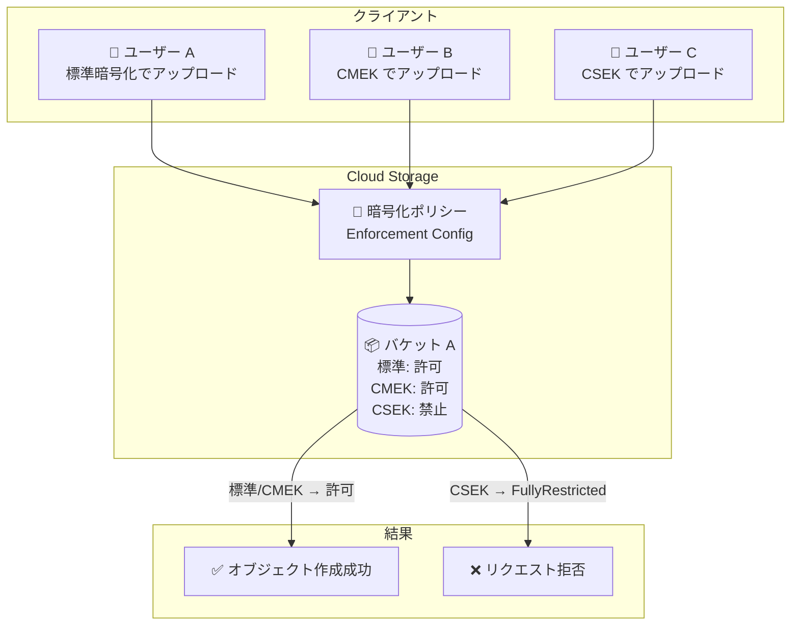

# Cloud Storage: バケットレベルの暗号化タイプ制御機能

**リリース日**: 2026-04-02

**サービス**: Cloud Storage

**機能**: バケットの暗号化タイプの強制・制限 (Enforce or restrict the encryption types for a bucket)

**ステータス**: Feature

:bar_chart: [このアップデートのインフォグラフィックを見る](https://takech9203.github.io/google-cloud-news-summary/20260402-cloud-storage-encryption-enforcement.html)

## 概要

Cloud Storage に、バケット単位で新しいオブジェクトに許可する暗号化タイプを制御できる機能が追加されました。管理者は標準暗号化 (Google デフォルト暗号化)、顧客管理暗号鍵 (CMEK)、顧客指定暗号鍵 (CSEK) の各暗号化方式について、バケットごとに許可または禁止を設定できます。

この機能により、組織のセキュリティポリシーやコンプライアンス要件に基づいて、データの暗号化方式をバケットレベルで厳密に管理することが可能になります。例えば、ランサムウェア対策として CSEK の使用を制限し、標準暗号化または CMEK のみを許可するといった運用が実現できます。

対象ユーザーはセキュリティ管理者、クラウドインフラ管理者、コンプライアンス担当者であり、特に金融・医療・公共セクターなど厳格なデータ保護要件を持つ組織に有用です。

**アップデート前の課題**

- バケットレベルで暗号化タイプを強制する手段がなく、ユーザーが任意の暗号化方式でオブジェクトをアップロードできた
- CSEK を使用したオブジェクトが作成されると、鍵の紛失によるデータ喪失リスクがあった
- 組織のセキュリティポリシーで特定の暗号化方式を義務付けている場合でも、Cloud Storage 側で自動的に制御する仕組みがなかった
- コンプライアンス監査において、暗号化方式の統一性を保証することが困難だった

**アップデート後の改善**

- バケット作成時または既存バケットの更新時に、許可する暗号化タイプを明示的に設定できるようになった
- 標準暗号化、CMEK、CSEK の各方式について `NotRestricted` (許可) または `FullyRestricted` (禁止) を個別に指定可能
- 設定に違反するオブジェクト作成リクエスト (アップロード、コピー、合成、ソフト削除からの復元) が自動的に拒否される
- gcloud CLI、JSON API、XML API のすべてのインターフェースから設定可能

## アーキテクチャ図



Cloud Storage バケットに設定された暗号化ポリシーが、オブジェクト作成リクエストの暗号化タイプを検証し、ポリシーに違反するリクエストを自動的に拒否する流れを示しています。

## サービスアップデートの詳細

### 主要機能

1. **暗号化タイプの制御設定**
   - 標準暗号化 (Google デフォルト暗号化)、CMEK、CSEK の 3 種類について個別に制御可能
   - 各暗号化タイプに対して `NotRestricted` (許可) または `FullyRestricted` (禁止) を設定
   - 最低 1 つの暗号化タイプを許可する必要がある

2. **新規オブジェクト作成時の自動検証**
   - オブジェクトのアップロード、コピー、合成 (compose)、ソフト削除からの復元の全操作に適用
   - ポリシー違反のリクエストは自動的に拒否される
   - 既存オブジェクトの暗号化タイプには影響しない

3. **デフォルト KMS 鍵との整合性チェック**
   - バケットにデフォルト KMS 鍵が設定されている場合、CMEK と CSEK の両方を同時に制限することはできない
   - 整合性のない設定を防止するバリデーションが組み込まれている

## 技術仕様

### 暗号化タイプと制御モード

| 暗号化タイプ | 設定キー | 説明 |
|------|------|------|
| 標準暗号化 (Google デフォルト) | `gmekEnforcement` / `googleManagedEncryptionEnforcementConfig` | Google が管理する AES-256 暗号化 |
| CMEK (顧客管理暗号鍵) | `cmekEnforcement` / `customerManagedEncryptionEnforcementConfig` | Cloud KMS で管理する暗号鍵 |
| CSEK (顧客指定暗号鍵) | `csekEnforcement` / `customerSuppliedEncryptionEnforcementConfig` | ユーザーが各リクエストで提供する暗号鍵 |

### 制限モード

| モード | 値 | 動作 |
|--------|-----|------|
| 許可 | `NotRestricted` | その暗号化タイプで新しいオブジェクトを作成可能 |
| 禁止 | `FullyRestricted` | その暗号化タイプでの新しいオブジェクト作成を拒否 |

### 必要な IAM 権限

| 操作 | 必要な権限 |
|------|-----------|
| 新規バケット作成時に設定 | `storage.buckets.create` |
| 既存バケットの設定更新 | `storage.buckets.update` |
| 推奨される事前定義ロール | `roles/storage.admin` (Storage Admin) |

## 設定方法

### 前提条件

1. `roles/storage.admin` ロールまたは `storage.buckets.create` / `storage.buckets.update` 権限を持つ IAM アカウント
2. gcloud CLI がインストールおよび初期化されていること

### 手順

#### ステップ 1: 暗号化ポリシーの JSON ファイルを作成

```json
{
  "gmekEnforcement": {
    "restrictionMode": "NotRestricted"
  },
  "cmekEnforcement": {
    "restrictionMode": "NotRestricted"
  },
  "csekEnforcement": {
    "restrictionMode": "FullyRestricted"
  }
}
```

この例では、標準暗号化と CMEK を許可し、CSEK を禁止する設定です。

#### ステップ 2: 既存バケットに暗号化ポリシーを適用

```bash
gcloud storage buckets update gs://BUCKET_NAME \
  --encryption-enforcement-file=ENCRYPTION_ENFORCEMENT_FILE
```

`BUCKET_NAME` をバケット名、`ENCRYPTION_ENFORCEMENT_FILE` をステップ 1 で作成した JSON ファイルのパスに置き換えてください。設定が反映されるまで最大 2 分かかる場合があります。

#### ステップ 3: JSON API を使用する場合

```bash
curl -X PATCH --data-binary @encryption_policy.json \
  -H "Authorization: Bearer $(gcloud auth print-access-token)" \
  -H "Content-Type: application/json" \
  "https://storage.googleapis.com/storage/v1/b/BUCKET_NAME?fields=encryption"
```

JSON API を使用する場合は、設定キー名が異なります (`googleManagedEncryptionEnforcementConfig` 等)。

## メリット

### ビジネス面

- **コンプライアンス強化**: PCI-DSS、HIPAA、SOC 2 などの規制要件に基づく暗号化ポリシーをバケットレベルで技術的に強制できる
- **データガバナンスの向上**: 組織全体で統一された暗号化基準を適用し、監査対応を簡素化できる
- **リスク低減**: CSEK の使用を制限することで、鍵紛失によるデータ喪失リスクを排除できる

### 技術面

- **宣言的なセキュリティ設定**: バケット設定として暗号化ポリシーを宣言的に管理でき、IaC (Infrastructure as Code) との統合が容易
- **自動適用**: オブジェクト作成の全操作 (アップロード、コピー、合成、復元) に自動的に適用されるため、抜け漏れがない
- **既存データへの非影響**: 既存オブジェクトには影響しないため、段階的な移行が可能

## デメリット・制約事項

### 制限事項

- 既存オブジェクトの暗号化タイプは変更されない (新規オブジェクト作成時のみ適用)
- デフォルト KMS 鍵が設定されたバケットでは、CMEK と CSEK の両方を同時に制限できない
- 設定が反映されるまで最大 2 分の遅延がある
- 最低 1 つの暗号化タイプを許可する必要がある (全暗号化タイプを禁止にはできない)

### 考慮すべき点

- 既存バケットにポリシーを適用する際、影響を受けるワークロードの事前調査が必要
- CSEK を使用している既存ワークロードがある場合、ポリシー適用前に CMEK への移行を計画する必要がある
- 省略された暗号化タイプは既存の設定が維持される (gcloud/JSON API) か、デフォルトで許可される (XML API) という動作の違いに注意

## ユースケース

### ユースケース 1: ランサムウェア対策としての CSEK 制限

**シナリオ**: 攻撃者が CSEK を使用してデータを暗号化し、鍵を人質に身代金を要求するランサムウェア攻撃を防止したい。

**実装例**:
```json
{
  "gmekEnforcement": { "restrictionMode": "NotRestricted" },
  "cmekEnforcement": { "restrictionMode": "NotRestricted" },
  "csekEnforcement": { "restrictionMode": "FullyRestricted" }
}
```

**効果**: CSEK によるオブジェクト作成が拒否されるため、攻撃者が独自の暗号鍵でデータを上書きすることを防止できる。

### ユースケース 2: CMEK 必須化によるコンプライアンス対応

**シナリオ**: 規制要件により、すべてのデータを組織管理の暗号鍵で暗号化する必要がある。標準暗号化や CSEK の使用を禁止し、CMEK のみを許可したい。

**実装例**:
```json
{
  "gmekEnforcement": { "restrictionMode": "FullyRestricted" },
  "cmekEnforcement": { "restrictionMode": "NotRestricted" },
  "csekEnforcement": { "restrictionMode": "FullyRestricted" }
}
```

**効果**: Cloud KMS で管理された CMEK のみが許可されるため、鍵のライフサイクル管理、ローテーション、監査ログを一元的に制御できる。

## 料金

暗号化タイプの制御設定自体には追加料金は発生しません。ただし、CMEK を使用する場合は Cloud KMS の料金が別途発生します。

### Cloud KMS の料金例

| 鍵の種類 | 月額料金 (概算) |
|----------|-----------------|
| ソフトウェア鍵 (Cloud KMS) | $0.06 / 鍵バージョン |
| ハードウェア鍵 (Cloud HSM) | $1.00 ~ $2.50 / 鍵バージョン |
| 外部鍵 (Cloud EKM) | $3.00 / 鍵バージョン |

標準暗号化 (Google デフォルト暗号化) は無料で提供されます。詳細は [Cloud KMS の料金ページ](https://cloud.google.com/kms/pricing) を参照してください。

## 利用可能リージョン

Cloud Storage の暗号化タイプ制御機能は、Cloud Storage が利用可能なすべてのリージョンおよびマルチリージョンで使用できます。詳細は [Cloud Storage のロケーション](https://cloud.google.com/storage/docs/locations) を参照してください。

## 関連サービス・機能

- **Cloud Key Management Service (Cloud KMS)**: CMEK の鍵管理サービス。鍵の作成、ローテーション、アクセス制御を担当
- **Cloud KMS Autokey**: CMEK の鍵作成と割り当てを自動化する機能。暗号化ポリシーの運用負荷を軽減
- **組織ポリシー (Organization Policy)**: `constraints/gcp.restrictCmekCryptoKeyProjects` などの組織ポリシーと組み合わせることで、プロジェクト横断的な暗号化ガバナンスを実現
- **Cloud Audit Logs**: 暗号化ポリシーの変更やポリシー違反のリクエストを監査ログに記録
- **VPC Service Controls**: データ境界と暗号化ポリシーを組み合わせた多層防御の実現

## 参考リンク

- :bar_chart: [インフォグラフィック](https://takech9203.github.io/google-cloud-news-summary/20260402-cloud-storage-encryption-enforcement.html)
- [公式リリースノート](https://cloud.google.com/release-notes#April_02_2026)
- [暗号化タイプの強制・制限 - ドキュメント](https://cloud.google.com/storage/docs/encryption/enforce-encryption-types)
- [Cloud Storage 暗号化オプション](https://cloud.google.com/storage/docs/encryption)
- [Cloud KMS 料金ページ](https://cloud.google.com/kms/pricing)

## まとめ

Cloud Storage のバケットレベル暗号化タイプ制御機能は、データセキュリティとコンプライアンスの強化に直結する重要なアップデートです。特にランサムウェア対策として CSEK を制限するケースや、規制要件に基づき CMEK を必須化するケースにおいて即座に活用できます。セキュリティ管理者は、既存バケットの暗号化ポリシーを見直し、組織の要件に合わせた設定の適用を検討することを推奨します。

---

**タグ**: #CloudStorage #Encryption #Security #CMEK #CSEK #Compliance #DataProtection
