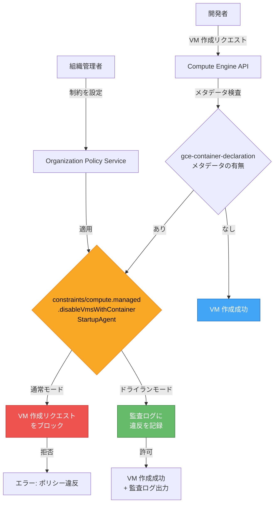

# Compute Engine: コンテナ起動エージェントの組織ポリシー制約 (Preview)

**リリース日**: 2026-04-02

**サービス**: Compute Engine

**機能**: Container startup agent org policy constraint (Preview)

**ステータス**: Preview

[このアップデートのインフォグラフィックを見る](https://takech9203.github.io/google-cloud-news-summary/20260402-compute-engine-container-startup-agent-policy.html)

## 概要

Compute Engine において、非推奨となったコンテナ起動エージェント (konlet) の使用を組織レベルで制御するための新しいマネージド制約 `constraints/compute.managed.disableVmsWithContainerStartupAgent` が Preview として提供されました。この制約を適用することで、`gce-container-declaration` メタデータを使用する Compute Engine インスタンスの新規作成をブロックできます。

コンテナ起動エージェントは、VM 作成時にコンテナを直接デプロイする機能として提供されてきましたが、現在は非推奨となっており、2026 年 7 月 31 日以降、この機能に依存するワークフローは動作しなくなります。今回の組織ポリシー制約により、組織管理者は非推奨機能の使用状況を可視化し、段階的な移行を推進できるようになります。

特に注目すべき点として、この制約はドライランモードでの適用にも対応しています。ドライランモードでは、リソースの作成をブロックせずに、非推奨メタデータを使用しているプロジェクトを監査ログで特定できます。

**アップデート前の課題**

- 組織レベルで `gce-container-declaration` メタデータの使用を一括して禁止する手段がなかった
- 非推奨のコンテナ起動エージェントを使用しているプロジェクトを特定するには、各プロジェクトで個別に `gcloud compute instances list` コマンドを実行する必要があった
- 非推奨機能の使用を段階的に制限する仕組みがなく、移行計画の策定が困難だった

**アップデート後の改善**

- 組織ポリシー制約により、組織、フォルダ、プロジェクト単位で非推奨のコンテナ起動エージェントの使用を一括制御可能になった
- ドライランモードを活用し、既存のワークフローに影響を与えずに使用状況を監査できるようになった
- インスタンステンプレートを含むマネージドインスタンスグループ (MIG) に対しても制約が適用され、包括的な制御が可能になった

## アーキテクチャ図



この図は、組織ポリシー制約の適用フローを示しています。通常モードでは `gce-container-declaration` メタデータを含む VM 作成がブロックされ、ドライランモードでは作成を許可しつつ監査ログに記録されます。

## サービスアップデートの詳細

### 主要機能

1. **マネージド制約によるコンテナ起動エージェントの使用制限**
   - ブール型のマネージド制約 `constraints/compute.managed.disableVmsWithContainerStartupAgent` を適用することで、`gce-container-declaration` メタデータキーを持つ Compute Engine インスタンスの新規作成を防止
   - インスタンステンプレートに `gce-container-declaration` メタデータキーが含まれている場合、そのテンプレートを使用したインスタンス作成もブロック対象

2. **マネージドインスタンスグループ (MIG) への適用**
   - `gce-container-declaration` メタデータキーを含むインスタンステンプレートを使用する MIG に対しても制約が適用される
   - 新規の MIG 作成やスケールアウト時に非推奨メタデータの使用を防止

3. **ドライランモード対応**
   - 組織ポリシーをドライランモードで適用し、実際のリソース作成をブロックせずに違反を検出
   - 監査ログを通じて、非推奨メタデータを使用しているプロジェクトやワークフローを特定
   - ドライランの結果を確認した上で、本番ポリシーへの昇格が可能

## 技術仕様

### 制約の詳細

| 項目 | 詳細 |
|------|------|
| 制約名 | `constraints/compute.managed.disableVmsWithContainerStartupAgent` |
| 制約タイプ | マネージド制約 (ブール型) |
| ステータス | Preview |
| 適用スコープ | 組織、フォルダ、プロジェクト |
| ブロック対象メタデータ | `gce-container-declaration` |
| 既存 VM への影響 | なし (新規作成のみが対象) |
| ドライランモード | 対応 |

### 非推奨のコンテナデプロイ方法

| 非推奨の方法 | 説明 |
|------|------|
| `gcloud compute instances create-with-container` | VM 作成時にコンテナを指定するコマンド |
| `gcloud compute instances update-container` | 既存 VM のコンテナを更新するコマンド |
| `gcloud compute instance-templates create-with-container` | コンテナ付きインスタンステンプレートを作成するコマンド |
| `--metadata gce-container-declaration=...` | メタデータフラグによるコンテナ宣言の指定 |
| Terraform `gce-container` モジュール | Terraform によるコンテナ VM の作成 |

### 非推奨のタイムライン

| マイルストーン | 日付 |
|------|------|
| 非推奨通知 | 発表済み |
| 新規 VM/MIG 作成の停止 | 2026 年 7 月 31 日 |
| 既存ワークロードのサポート終了 | 2027 年 7 月 31 日 |

## 設定方法

### 前提条件

1. 組織ポリシー管理者ロール (`roles/orgpolicy.policyAdmin`) が付与されていること
2. ドライランモードの監査ログを確認するには、ログ閲覧者ロールが必要

### 手順

#### ステップ 1: 影響を受けるインスタンスの特定

```bash
# プロジェクト内で gce-container-declaration メタデータを使用している VM を一覧表示
gcloud compute instances list \
  --filter="metadata.items.key:gce-container-declaration"
```

このコマンドにより、非推奨のコンテナ起動エージェントを使用している VM を特定できます。複数プロジェクトがある場合は、各プロジェクトで実行してください。

#### ステップ 2: ドライランモードで組織ポリシーを設定

```bash
# ドライランモードのポリシーを YAML ファイルで定義
cat > policy-dryrun.yaml << 'EOF'
name: organizations/ORGANIZATION_ID/policies/compute.managed.disableVmsWithContainerStartupAgent
dryRunSpec:
  rules:
    - enforce: true
EOF

# ドライランモードでポリシーを適用
gcloud org-policies set-policy policy-dryrun.yaml \
  --update-mask=dryRunSpec
```

ドライランモードでは、リソース作成をブロックせずに違反を監査ログに記録します。

#### ステップ 3: 監査ログで違反を確認

Google Cloud Console の「組織ポリシー」ページで、該当する制約の「ドライラン」タブから違反ログを確認できます。

#### ステップ 4: 本番ポリシーとして適用

```bash
# 本番ポリシーを YAML ファイルで定義
cat > policy-enforce.yaml << 'EOF'
name: organizations/ORGANIZATION_ID/policies/compute.managed.disableVmsWithContainerStartupAgent
spec:
  rules:
    - enforce: true
EOF

# 本番ポリシーを適用
gcloud org-policies set-policy policy-enforce.yaml \
  --update-mask=spec
```

本番ポリシーを適用すると、`gce-container-declaration` メタデータを使用する VM の新規作成がブロックされます。

## メリット

### ビジネス面

- **コンプライアンスの強化**: 非推奨機能の使用を組織全体で統一的に管理でき、非推奨化のタイムラインに合わせた計画的な移行が可能
- **リスクの可視化**: ドライランモードにより、影響範囲を事前に把握した上でポリシーを適用でき、予期しない業務停止を回避

### 技術面

- **段階的な移行の実現**: ドライランモードと本番モードの 2 段階で制約を適用でき、安全に移行を推進
- **包括的な制御**: 個別の VM だけでなく、インスタンステンプレートや MIG を含めた包括的な制御が可能
- **階層的なポリシー管理**: 組織、フォルダ、プロジェクトの階層に沿ってポリシーを継承・上書きできる

## デメリット・制約事項

### 制限事項

- 本機能は Preview のため、SLA の対象外であり、本番環境での使用は推奨されない場合がある
- 既存の VM には影響しないため、既にデプロイされているコンテナ起動エージェントを使用する VM は引き続き動作する
- 制約は新規作成のみを対象としており、既存 VM のメタデータ更新には適用されない

### 考慮すべき点

- ドライランモードの監査ログを確認するには、適切な IAM ロールとログ設定が必要
- 非推奨のコンテナ起動エージェントからの移行先 (startup scripts、cloud-init、Cloud Run、Batch、GKE) を事前に検討しておく必要がある
- インスタンステンプレートを使用する MIG が制約の対象となるため、自動スケーリング中のインスタンス作成にも影響する

## ユースケース

### ユースケース 1: 大規模組織での非推奨機能の段階的廃止

**シナリオ**: 数十のプロジェクトを持つ大規模組織で、コンテナ起動エージェントを使用している VM を把握し、2026 年 7 月 31 日のデッドラインまでに移行を完了したい。

**実装例**:
```bash
# 1. まずドライランモードで制約を組織全体に適用
gcloud org-policies set-policy policy-dryrun.yaml \
  --update-mask=dryRunSpec

# 2. 監査ログで影響を受けるプロジェクトを特定
# (Cloud Console の組織ポリシーページでドライラン違反ログを確認)

# 3. 各プロジェクトでの移行完了後、本番ポリシーを適用
gcloud org-policies set-policy policy-enforce.yaml \
  --update-mask=spec
```

**効果**: 影響範囲を事前に把握した上で、プロジェクトごとに移行を進め、最終的に組織全体で非推奨機能の使用を禁止できる。

### ユースケース 2: セキュリティチームによるガバナンス強化

**シナリオ**: セキュリティチームが、新規プロジェクトで非推奨のデプロイ方法が使用されることを防ぎたい。

**効果**: 組織ポリシー制約を適用することで、新規プロジェクトでの非推奨機能の使用を自動的にブロックし、推奨されるコンテナデプロイ方法 (startup scripts、cloud-init、Cloud Run、Batch、GKE) の採用を促進できる。

## 料金

組織ポリシーの設定・適用自体に追加料金は発生しません。ドライランモードの監査ログは Cloud Logging に記録されるため、ログの保存量に応じた Cloud Logging の料金が適用されます。

## 利用可能リージョン

組織ポリシー制約はグローバルリソースであり、全リージョンの Compute Engine インスタンスに対して適用されます。

## 関連サービス・機能

- **Organization Policy Service**: 組織全体のリソース設定を一元管理するサービス。今回のマネージド制約の基盤
- **Cloud Logging**: ドライランモードの監査ログが記録される先。違反検出と分析に使用
- **Container-Optimized OS**: Compute Engine 上でコンテナを実行するための OS イメージ。非推奨対象はコンテナ起動エージェント (konlet) であり、Container-Optimized OS 自体は引き続きサポートされる
- **Cloud Run**: ステートレスなコンテナアプリケーションの移行先として推奨されるサーバーレスサービス
- **Google Kubernetes Engine (GKE)**: 高度な制御とスケーラビリティが必要な場合の移行先
- **Cloud Batch**: 明確な終了状態を持つバッチジョブの移行先として推奨

## 参考リンク

- [インフォグラフィック](https://takech9203.github.io/google-cloud-news-summary/20260402-compute-engine-container-startup-agent-policy.html)
- [公式リリースノート](https://docs.cloud.google.com/release-notes#April_02_2026)
- [コンテナメタデータを使用する VM の作成防止](https://cloud.google.com/compute/docs/containers/prevent-container-metadata-vms)
- [VM 作成時にデプロイされたコンテナの移行ガイド](https://cloud.google.com/compute/docs/containers/migrate-containers)
- [コンテナ起動エージェント非推奨に関する FAQ](https://cloud.google.com/compute/docs/containers/prepare-for-container-agent-shutdown)
- [組織ポリシーのドライランモード](https://cloud.google.com/organization-policy/test-policies)
- [Compute Engine マネージド制約一覧](https://cloud.google.com/compute/docs/access/managed-constraints)
- [組織ポリシー制約リファレンス](https://cloud.google.com/organization-policy/reference/org-policy-constraints)

## まとめ

今回の `constraints/compute.managed.disableVmsWithContainerStartupAgent` マネージド制約の Preview リリースにより、非推奨のコンテナ起動エージェントの使用を組織レベルで制御できるようになりました。2026 年 7 月 31 日の非推奨機能停止に向けて、まずドライランモードで影響範囲を特定し、移行先 (startup scripts、cloud-init、Cloud Run、Batch、GKE) への計画的な移行を開始することを推奨します。

---

**タグ**: #ComputeEngine #OrganizationPolicy #コンテナ #非推奨 #マネージド制約 #ドライラン #セキュリティ #ガバナンス #Preview
