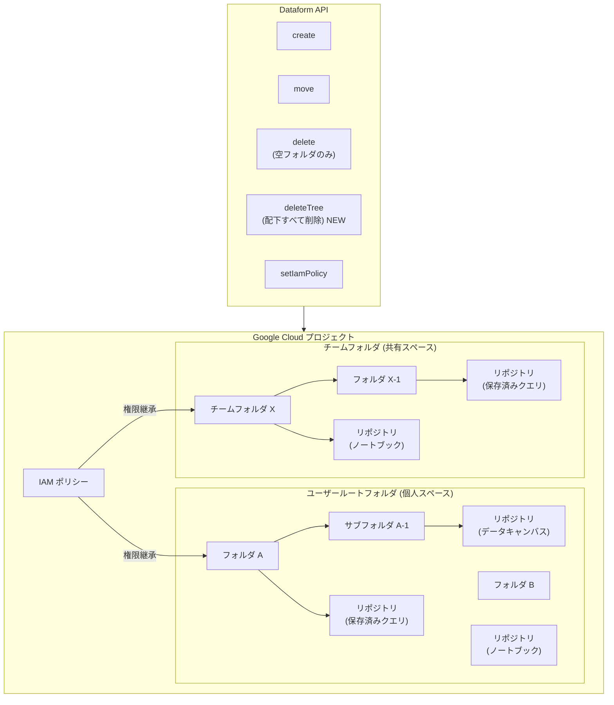

# Dataform: フォルダとリポジトリによるコード資産の整理機能が GA

**リリース日**: 2026-04-02

**サービス**: Dataform

**機能**: フォルダとリポジトリ (GA) + deleteTree API

**ステータス**: GA (一般提供)

📊 [このアップデートのインフォグラフィックを見る](https://takech9203.github.io/google-cloud-news-summary/20260402-dataform-folders-repositories-ga.html)

## 概要

Dataform のフォルダとリポジトリ機能が一般提供 (GA) となりました。この機能により、ノートブック、保存済みクエリ、データキャンバス、データプレパレーションなどのコード資産を、OS のファイルシステムに類似した階層構造で整理できるようになります。フォルダ単位で IAM ポリシーを設定でき、権限がサブツリー全体に自動的に継承されるため、大規模チームでのアクセス制御が容易になります。

本リリースでは、フォルダとチームフォルダの一括削除を可能にする deleteTree API メソッドも新たに導入されました。従来の delete メソッドでは空のフォルダのみ削除可能でしたが、deleteTree を使用することでフォルダとその配下のすべてのリソースをまとめて削除できます。

この機能は、BigQuery エコシステム内でデータ変換ワークフローを管理する組織や、複数チームが共同でコード資産を管理する必要がある環境に特に有用です。個人用のユーザールートフォルダとチーム共有用のチームフォルダの両方をサポートし、Google Drive の共有ドライブに類似した柔軟な共同作業環境を提供します。

**アップデート前の課題**

- コード資産 (ノートブック、保存済みクエリなど) をフォルダ階層で整理する標準的な方法がなかった
- IAM ポリシーを個々のリソースに対して個別に設定する必要があり、大規模環境での権限管理が煩雑だった
- フォルダ内のリソースを一括削除する API がなく、空のフォルダのみ削除可能だった
- チーム単位での専用スペースを作成し、厳格なアクセス制御を適用する仕組みがなかった

**アップデート後の改善**

- フォルダとリポジトリの階層構造でコード資産を体系的に整理可能になった
- フォルダレベルで IAM ポリシーを設定し、配下のすべてのリソースに権限を自動継承できるようになった
- deleteTree API により、フォルダとその配下のリソースを一括で削除可能になった
- チームフォルダ機能により、チーム単位で専用の共有スペースと厳格なアクセス制御を実現できるようになった
- Preview から GA に昇格したことで、本番環境での利用が SLA の対象となった

## アーキテクチャ図



フォルダとチームフォルダの階層構造を示しています。IAM ポリシーはフォルダレベルで設定され、配下のすべてのサブフォルダとリポジトリに自動的に継承されます。新しい deleteTree API により、フォルダとその配下のリソースを一括削除できます。

## サービスアップデートの詳細

### 主要機能

1. **フォルダによる階層構造の管理**
   - OS のファイルシステムに類似した階層構造でコード資産を整理
   - フォルダのネスト (入れ子) が可能で、サブフォルダを作成して細かく分類可能
   - フォルダ間でのリソースの移動 (move) がアトミック操作として実行され、部分的な失敗が発生しない

2. **チームフォルダ**
   - Google Drive の共有ドライブに類似したチーム共同作業用のスペース
   - チーム専用の厳格な共有・アクセス権限の設定が可能
   - チームフォルダ名はプロジェクト全体で一意である必要がある

3. **IAM ポリシーの継承**
   - フォルダやチームフォルダに設定した IAM ポリシーがサブツリー全体に自動継承
   - フォルダ単位できめ細やかなアクセス制御を実現
   - Code Owner、Code Editor、Code Viewer など専用の IAM ロールを提供

4. **deleteTree API メソッド**
   - フォルダとその配下のすべてのリソースを一括削除
   - `folders.deleteTree` および `teamFolders.deleteTree` の両方で利用可能
   - 従来の `delete` メソッド (空フォルダのみ削除可能) を補完する機能

## 技術仕様

### リソースタイプと対応資産

| リソースタイプ | 説明 |
|--------------|------|
| フォルダ (Folder) | リソースを整理する基本コンテナ。ネスト可能 |
| チームフォルダ (Team Folder) | チーム共同作業用の専用コンテナ。厳格なアクセス制御をサポート |
| ユーザールートフォルダ | ユーザー個人のスペース。仮想的な概念で API リソースは存在しない |
| リポジトリ (Repository) | 単一ファイル資産 (ノートブック、保存済みクエリ、データキャンバス、データプレパレーション) を格納 |

### フォルダ API メソッド

| API メソッド | 説明 |
|-------------|------|
| `create` | 新しいフォルダを作成 |
| `get` | フォルダのプロパティを取得 |
| `patch` | フォルダのプロパティ (名前など) を更新 |
| `queryFolderContents` | フォルダ内のアイテムを一覧取得 |
| `move` | フォルダとそのサブツリー全体を別のフォルダに移動 (アトミック操作) |
| `delete` | 空のフォルダを削除 |
| `deleteTree` | フォルダとその配下のすべてのリソースを削除 **(新規)** |
| `setIamPolicy` | フォルダに IAM ロールを付与 (サブツリー全体に継承) |

### IAM ロール

| ロール | 付与対象 | 用途 |
|--------|---------|------|
| `roles/dataform.codeOwner` | フォルダまたはファイル | リソースの完全な制御 (削除、IAM 設定、移動を含む) |
| `roles/dataform.codeEditor` | フォルダまたはファイル | コンテンツの編集・管理。移動先フォルダにも必要 |
| `roles/dataform.codeCommenter` | フォルダまたはファイル | コード資産やフォルダへのコメント |
| `roles/dataform.codeViewer` | フォルダまたはファイル | 読み取り専用アクセス |
| `roles/dataform.codeCreator` | プロジェクト | プロジェクト内でのフォルダ・ファイル作成 |
| `roles/dataform.teamFolderOwner` | チームフォルダ | チームフォルダの完全な制御 |
| `roles/dataform.teamFolderContributor` | チームフォルダ | チームフォルダ内のコンテンツ管理 |
| `roles/dataform.teamFolderViewer` | チームフォルダ | チームフォルダの読み取り専用アクセス |
| `roles/dataform.teamFolderCreator` | プロジェクト | プロジェクト内でのチームフォルダ作成 |

## 設定方法

### 前提条件

1. Google Cloud プロジェクトで Dataform API が有効化されていること
2. 適切な IAM ロール (`roles/dataform.codeCreator` または `roles/dataform.teamFolderCreator`) が付与されていること

### 手順

#### ステップ 1: API の有効化

```bash
gcloud services enable dataform.googleapis.com
```

#### ステップ 2: ルートレベルのフォルダを作成

```bash
curl -H "Authorization: Bearer $(gcloud auth print-access-token)" \
    -H "Content-Type: application/json" \
    -X POST \
    -d '{ "displayName": "my-project-folder" }' \
    "https://dataform.googleapis.com/v1beta1/projects/PROJECT_ID/locations/LOCATION/folders"
```

`PROJECT_ID` と `LOCATION` をそれぞれプロジェクト ID とロケーションに置き換えてください。

#### ステップ 3: ネストされたサブフォルダを作成

```bash
curl -H "Authorization: Bearer $(gcloud auth print-access-token)" \
    -H "Content-Type: application/json" \
    -X POST \
    -d '{
        "displayName": "sub-folder",
        "containingFolder": "projects/PROJECT_ID/locations/LOCATION/folders/PARENT_FOLDER_ID"
    }' \
    "https://dataform.googleapis.com/v1beta1/projects/PROJECT_ID/locations/LOCATION/folders"
```

`PARENT_FOLDER_ID` を親フォルダの ID に置き換えてください。

#### ステップ 4: フォルダに IAM ポリシーを設定

```bash
curl -H "Authorization: Bearer $(gcloud auth print-access-token)" \
    -H "Content-Type: application/json" \
    -X POST \
    -d '{
        "policy": {
            "bindings": [
                {
                    "role": "roles/dataform.codeEditor",
                    "members": ["user:editor@example.com"]
                },
                {
                    "role": "roles/dataform.codeViewer",
                    "members": ["group:viewers@example.com"]
                }
            ]
        }
    }' \
    "https://dataform.googleapis.com/v1beta1/projects/PROJECT_ID/locations/LOCATION/folders/FOLDER_ID:setIamPolicy"
```

設定した権限はフォルダ配下のすべてのサブフォルダとリポジトリに自動的に継承されます。

## メリット

### ビジネス面

- **ガバナンスの強化**: フォルダ階層と IAM ポリシーの継承により、組織全体のデータ資産に対するアクセス制御を体系的に管理できる
- **チーム生産性の向上**: チームフォルダにより、チーム専用の共有スペースを作成し、共同作業を効率化できる
- **運用管理の簡素化**: フォルダ単位での権限管理により、個々のリソースへの権限設定の手間が大幅に削減される

### 技術面

- **IAM ポリシーの自動継承**: フォルダに設定した権限がサブツリー全体に自動伝搬するため、権限管理の一貫性が保たれる
- **アトミックな移動操作**: フォルダの move 操作はアトミックに実行され、部分的な失敗が発生しない
- **deleteTree による一括削除**: 不要になったフォルダ構造を配下のリソースごと一括で削除でき、クリーンアップ作業が効率化される
- **GA による安定性**: Preview から GA に移行したことで、SLA の対象となり本番環境での安定した利用が保証される

## デメリット・制約事項

### 制限事項

- フォルダ構造と連携できるのは単一ファイル資産 (ノートブック、保存済みクエリ、データキャンバス、データプレパレーション) のみ
- フォルダの `display_name` にはスコープごとの一意性制約がある (同一フォルダ内でフォルダ名とリポジトリ名の重複不可など)
- チームフォルダの `display_name` はプロジェクト全体で一意である必要がある
- ユーザールートフォルダは仮想的な概念であり、API リソースとして直接操作することはできない

### 考慮すべき点

- 既存のコード資産を新しいフォルダ構造に移行する際の計画が必要
- IAM ポリシーの継承設計を事前に十分に検討し、最小権限の原則に従った権限設計を行うこと
- deleteTree API は配下のすべてのリソースを削除するため、誤操作に注意が必要

## ユースケース

### ユースケース 1: 部門別のデータ分析資産管理

**シナリオ**: 大規模な組織で複数の部門 (マーケティング、ファイナンス、エンジニアリング) がそれぞれの分析用ノートブックや保存済みクエリを管理する必要がある。各部門にチームフォルダを作成し、部門内のメンバーには Code Editor ロール、他部門のメンバーには Code Viewer ロールを付与する。

**実装例**:
```bash
# マーケティング部門のチームフォルダを作成
curl -H "Authorization: Bearer $(gcloud auth print-access-token)" \
    -H "Content-Type: application/json" \
    -X POST \
    -d '{ "displayName": "marketing-analytics" }' \
    "https://dataform.googleapis.com/v1beta1/projects/PROJECT_ID/locations/us-central1/teamFolders"

# チームフォルダに IAM ポリシーを設定
curl -H "Authorization: Bearer $(gcloud auth print-access-token)" \
    -H "Content-Type: application/json" \
    -X POST \
    -d '{
        "policy": {
            "bindings": [
                {
                    "role": "roles/dataform.teamFolderContributor",
                    "members": ["group:marketing-team@example.com"]
                },
                {
                    "role": "roles/dataform.teamFolderViewer",
                    "members": ["group:all-analysts@example.com"]
                }
            ]
        }
    }' \
    "https://dataform.googleapis.com/v1beta1/projects/PROJECT_ID/locations/us-central1/teamFolders/TEAM_FOLDER_ID:setIamPolicy"
```

**効果**: 部門ごとのアクセス制御が自動的に継承され、新しいリソースを追加するたびに個別の権限設定が不要になる

### ユースケース 2: プロジェクトライフサイクルに応じたリソース管理

**シナリオ**: 一時的な分析プロジェクト用にフォルダを作成し、プロジェクト完了後に deleteTree API で関連するすべてのリソースを一括削除する。

**実装例**:
```bash
# プロジェクト完了後にフォルダとその配下のリソースを一括削除
curl -H "Authorization: Bearer $(gcloud auth print-access-token)" \
    -H "Content-Type: application/json" \
    -X POST \
    "https://dataform.googleapis.com/v1beta1/projects/PROJECT_ID/locations/LOCATION/folders/FOLDER_ID:deleteTree"
```

**効果**: 不要になったリソースを漏れなく一括でクリーンアップでき、コスト管理と環境の整理が容易になる

## 料金

Dataform は無料のサービスです。フォルダとリポジトリの機能自体に追加料金は発生しません。ただし、Dataform を通じて BigQuery でクエリを実行する際には、BigQuery の料金が適用されます。

### 関連コストの参考

| 項目 | 料金 |
|------|------|
| Dataform (フォルダ・リポジトリ機能含む) | 無料 |
| BigQuery クエリ実行 (オンデマンド) | $7.50/TB (処理データ量に応じて課金) |
| BigQuery ストレージ | $0.02/GB/月 (アクティブストレージ) |

## 利用可能リージョン

Dataform のフォルダとリポジトリ機能は、Dataform がサポートするすべてのロケーションで利用可能です。リポジトリ作成時に指定したロケーションでリソースが管理されます。

## 関連サービス・機能

- **BigQuery**: Dataform の主要な連携先であり、データ変換ワークフローの実行基盤。ノートブック、保存済みクエリ、データキャンバスなどのコード資産を BigQuery 上で実行
- **IAM (Identity and Access Management)**: フォルダとチームフォルダの権限管理に使用。ポリシーの継承によりサブツリー全体のアクセス制御を実現
- **BigQuery Studio**: BigQuery のウェブ UI からフォルダ構造を視覚的に操作可能

## 参考リンク

- 📊 [インフォグラフィック](https://takech9203.github.io/google-cloud-news-summary/20260402-dataform-folders-repositories-ga.html)
- [公式リリースノート](https://docs.cloud.google.com/release-notes#April_02_2026)
- [フォルダとリポジトリによるコード資産の整理 (ドキュメント)](https://docs.cloud.google.com/dataform/docs/organize-code-assets)
- [Dataform アクセス制御](https://docs.cloud.google.com/dataform/docs/access-control)
- [Dataform API リファレンス](https://docs.cloud.google.com/dataform/reference/rest)
- [Dataform 概要](https://docs.cloud.google.com/dataform/docs/overview)
- [料金ページ](https://cloud.google.com/dataform/pricing)

## まとめ

Dataform のフォルダとリポジトリ機能の GA リリースにより、BigQuery エコシステム内でのコード資産管理が大幅に強化されました。階層構造によるリソースの整理、IAM ポリシーの自動継承、チームフォルダによる共同作業環境の提供、そして新しい deleteTree API によるリソースの一括削除が可能になります。複数チームでデータ分析資産を管理する組織は、本機能を活用してガバナンスの強化と運用効率の向上を実現することを推奨します。

---

**タグ**: #Dataform #BigQuery #フォルダ #リポジトリ #IAM #deleteTree #GA #コード資産管理 #チームフォルダ #GoogleCloud
