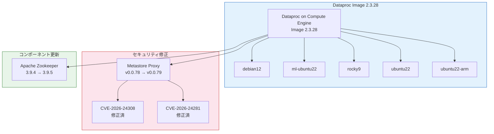

# Dataproc: イメージバージョン 2.3.28 リリースと CVE 修正、Zookeeper アップグレード

**リリース日**: 2026-04-02

**サービス**: Dataproc

**機能**: サブマイナーイメージバージョン更新、CVE 修正、Apache Zookeeper アップグレード

**ステータス**: Announcement / Fixed / Change

:bar_chart: [このアップデートのインフォグラフィックを見る](https://takech9203.github.io/google-cloud-news-summary/20260402-dataproc-image-versions-cve-fixes.html)

## 概要

Dataproc on Compute Engine の新しいサブマイナーイメージバージョン 2.3.28 が複数の OS バリアント (Debian 12、ML Ubuntu 22、Rocky 9、Ubuntu 22、Ubuntu 22 ARM) でリリースされた。今回のリリースでは、セキュリティ面で重要な修正が 2 つ含まれている。

まず、Dataproc Metastore Proxy が v0.0.79 にアップグレードされ、CVE-2026-24308 および CVE-2026-24281 の 2 件の脆弱性が修正された。これにより、Dataproc Metastore を利用する環境のセキュリティが強化されている。

さらに、イメージバージョン 2.3 において Apache Zookeeper が 3.9.5 にアップグレードされた。Zookeeper は分散システムの調整サービスとして Hadoop エコシステムの中核を担っており、このアップグレードにより安定性とセキュリティが向上している。2026 年 2 月には 2.3.22 で Zookeeper 3.9.4 が導入されていたため、今回は 3.9.4 から 3.9.5 へのマイナーアップデートとなる。

**アップデート前の課題**

- 以前のイメージバージョンでは CVE-2026-24308 および CVE-2026-24281 の脆弱性が Dataproc Metastore Proxy に存在していた
- Apache Zookeeper 3.9.4 を使用しており、3.9.5 で修正されたバグやセキュリティ改善が適用されていなかった
- 2.3.27 以前のサブマイナーイメージを使用しているクラスタでは、これらの修正が反映されていなかった

**アップデート後の改善**

- Dataproc Metastore Proxy v0.0.79 への更新により CVE-2026-24308 と CVE-2026-24281 が修正され、セキュリティリスクが軽減された
- Apache Zookeeper 3.9.5 への更新により、分散調整サービスの安定性とセキュリティが向上した
- 5 つの OS バリアント (debian12、ml-ubuntu22、rocky9、ubuntu22、ubuntu22-arm) でイメージが提供され、幅広い環境で利用可能になった

## アーキテクチャ図



Dataproc イメージ 2.3.28 のリリースに含まれる変更の全体像を示す。5 つの OS バリアントが提供され、Metastore Proxy の CVE 修正と Zookeeper のアップグレードが適用されている。

## サービスアップデートの詳細

### 主要機能

1. **新しいサブマイナーイメージバージョン 2.3.28**
   - 対応 OS: Debian 12、ML Ubuntu 22、Rocky 9、Ubuntu 22、Ubuntu 22 ARM
   - 具体的なイメージ名:
     - `2.3.28-debian12`
     - `2.3.28-ml-ubuntu22`
     - `2.3.28-rocky9`
     - `2.3.28-ubuntu22`
     - `2.3.28-ubuntu22-arm`
   - イメージバージョン 2.3 はコアコンポーネントのみを含む軽量イメージであり、CVE への露出を削減するために設計されている
   - `ml-ubuntu22` バリアントは ML 専用ライブラリを含む拡張イメージ

2. **Dataproc Metastore Proxy の CVE 修正**
   - Metastore Proxy を v0.0.79 にアップグレード
   - 修正された脆弱性:
     - **CVE-2026-24308**: Dataproc Metastore Proxy に関連するセキュリティ脆弱性
     - **CVE-2026-24281**: Dataproc Metastore Proxy に関連するセキュリティ脆弱性
   - 前回 (2026-03-08) の v0.0.78 からのアップデート

3. **Apache Zookeeper 3.9.5 へのアップグレード**
   - イメージバージョン 2.3 における Zookeeper を 3.9.5 に更新
   - 2026-02-05 のリリースで 3.9.4 に更新されていたものからの継続的なアップデート
   - Zookeeper は Hadoop エコシステムにおける分散調整サービスとして、NameNode のフェイルオーバーや HBase の調整などに使用される

## 技術仕様

### Dataproc イメージバージョン 2.3 の特徴

| 項目 | 詳細 |
|------|------|
| イメージバージョン | 2.3.28 |
| コンセプト | コアコンポーネントのみの軽量イメージ |
| 目的 | CVE 露出の削減、高セキュリティコンプライアンス対応 |
| オプションコンポーネント | オンデマンドでデプロイ可能 |
| GA リリース日 | 2025-06-09 |

### コンポーネントバージョン変更

| コンポーネント | 変更前 | 変更後 |
|---------------|--------|--------|
| Dataproc Metastore Proxy | v0.0.78 | v0.0.79 |
| Apache Zookeeper (2.3 イメージ) | 3.9.4 | 3.9.5 |

### クラスタ作成コマンド例

```bash
# 新しいイメージバージョンでクラスタを作成
gcloud dataproc clusters create my-cluster \
    --region=us-central1 \
    --image-version=2.3.28-debian12 \
    --num-workers=2
```

## 設定方法

### 前提条件

1. Google Cloud プロジェクトで Dataproc API が有効化されていること
2. 適切な IAM 権限 (roles/dataproc.editor 以上) が付与されていること

### 手順

#### ステップ 1: 既存クラスタのイメージバージョン確認

```bash
# 既存クラスタのイメージバージョンを確認
gcloud dataproc clusters describe my-cluster \
    --region=us-central1 \
    --format="value(config.softwareConfig.imageVersion)"
```

現在使用中のイメージバージョンを確認し、2.3.28 より古い場合はクラスタの再作成を検討する。

#### ステップ 2: 新しいイメージバージョンでクラスタを作成

```bash
# Debian 12 ベースのクラスタを作成
gcloud dataproc clusters create my-cluster-v2 \
    --region=us-central1 \
    --image-version=2.3.28-debian12 \
    --num-workers=2 \
    --worker-machine-type=n2-standard-4

# ML ワークロード用のクラスタを作成
gcloud dataproc clusters create my-ml-cluster \
    --region=us-central1 \
    --image-version=2.3.28-ml-ubuntu22 \
    --num-workers=2
```

新しいイメージバージョンを指定してクラスタを作成する。Dataproc はインプレースアップグレードをサポートしていないため、新しいクラスタを作成して移行する。

## メリット

### ビジネス面

- **セキュリティコンプライアンスの維持**: CVE 修正により、セキュリティ監査やコンプライアンス要件への対応が容易になる
- **運用リスクの軽減**: 既知の脆弱性を迅速に解消することで、セキュリティインシデントのリスクを低減できる

### 技術面

- **Metastore のセキュリティ強化**: Metastore Proxy の脆弱性修正により、メタデータ管理の安全性が向上した
- **Zookeeper の安定性向上**: 最新バージョンへの更新により、分散調整サービスの信頼性とパフォーマンスが改善される
- **複数 OS バリアント対応**: ARM アーキテクチャを含む 5 つの OS バリアントにより、多様なインフラ要件に対応可能

## デメリット・制約事項

### 制限事項

- Dataproc クラスタのインプレースイメージアップグレードはサポートされていないため、新しいイメージを適用するにはクラスタの再作成が必要
- イメージバージョン 2.3 は軽量設計のため、一部のオプションコンポーネントは別途デプロイが必要

### 考慮すべき点

- サブマイナーイメージバージョンはロールバックされる可能性がある (過去に複数回のロールバック事例あり)
- 本番環境に適用する前に、開発・テスト環境での検証を推奨
- Zookeeper のアップグレードに伴い、既存の分散調整設定に影響がないか確認が必要

## ユースケース

### ユースケース 1: セキュリティ重視の本番環境

**シナリオ**: 金融機関や医療機関など、高いセキュリティコンプライアンスが求められる環境で Dataproc を使用している場合

**実装例**:
```bash
# セキュリティ強化されたクラスタの作成
gcloud dataproc clusters create secure-cluster \
    --region=us-central1 \
    --image-version=2.3.28-debian12 \
    --num-workers=3 \
    --enable-component-gateway \
    --properties="dataproc:dataproc.logging.stackdriver.enable=true"
```

**効果**: CVE-2026-24308 および CVE-2026-24281 の修正が適用された最新イメージにより、セキュリティリスクを最小化できる

### ユースケース 2: ML パイプラインの運用

**シナリオ**: Dataproc クラスタ上で機械学習のトレーニングや推論パイプラインを実行している場合

**効果**: `2.3.28-ml-ubuntu22` イメージを使用することで、ML 専用ライブラリを含むセキュリティ修正済みの環境でパイプラインを運用できる

## 料金

Dataproc の料金体系は、クラスタの仮想 CPU (vCPU) 数と稼働時間に基づいて計算される。イメージバージョンの更新による追加料金は発生しない。

| 項目 | 料金 |
|------|------|
| Dataproc ライセンス料 | $0.010 / vCPU / 時間 |
| Compute Engine VM | マシンタイプにより異なる |
| 最小課金単位 | 1 分 (秒単位で課金) |

詳細は [Dataproc 料金ページ](https://cloud.google.com/dataproc/pricing) を参照。

## 利用可能リージョン

Dataproc は Google Cloud の全リージョンおよびゾーンで利用可能。詳細は [Dataproc リージョンとゾーン](https://cloud.google.com/dataproc/docs/concepts/configuring-clusters/regional-endpoints) を参照。

## 関連サービス・機能

- **Dataproc Metastore**: Apache Hive Metastore のフルマネージドサービス。今回の Metastore Proxy アップグレードにより、Dataproc クラスタとの接続セキュリティが向上
- **Apache Zookeeper**: 分散システムの調整サービス。Hadoop の NameNode HA、HBase のリージョンサーバー調整などに使用される
- **Cloud Monitoring / Cloud Logging**: Dataproc クラスタの監視とログ管理に統合利用可能
- **Dataproc Serverless for Apache Spark**: サーバーレス版の Spark 実行環境。クラスタ管理が不要な代替選択肢

## 参考リンク

- :bar_chart: [インフォグラフィック](https://takech9203.github.io/google-cloud-news-summary/20260402-dataproc-image-versions-cve-fixes.html)
- [公式リリースノート](https://cloud.google.com/release-notes#April_02_2026)
- [Dataproc イメージバージョン一覧](https://cloud.google.com/dataproc/docs/concepts/versioning/dataproc-version-clusters#supported-dataproc-image-versions)
- [Dataproc イメージバージョン 2.3 リリース情報](https://cloud.google.com/dataproc/docs/concepts/versioning/dataproc-release-2.3)
- [Dataproc Metastore 概要](https://cloud.google.com/dataproc-metastore/docs/overview)
- [Dataproc 料金ページ](https://cloud.google.com/dataproc/pricing)

## まとめ

今回のアップデートは、Dataproc イメージバージョン 2.3.28 のリリースに伴うセキュリティ修正とコンポーネントアップグレードである。CVE-2026-24308 および CVE-2026-24281 の修正を含む Metastore Proxy v0.0.79 と Apache Zookeeper 3.9.5 への更新により、セキュリティと安定性が向上している。セキュリティコンプライアンスが求められる環境では、早期に新しいイメージバージョンでのクラスタ再作成を推奨する。

---

**タグ**: #Dataproc #ComputeEngine #ImageVersion #CVE #Security #Zookeeper #MetastoreProxy #GoogleCloud
