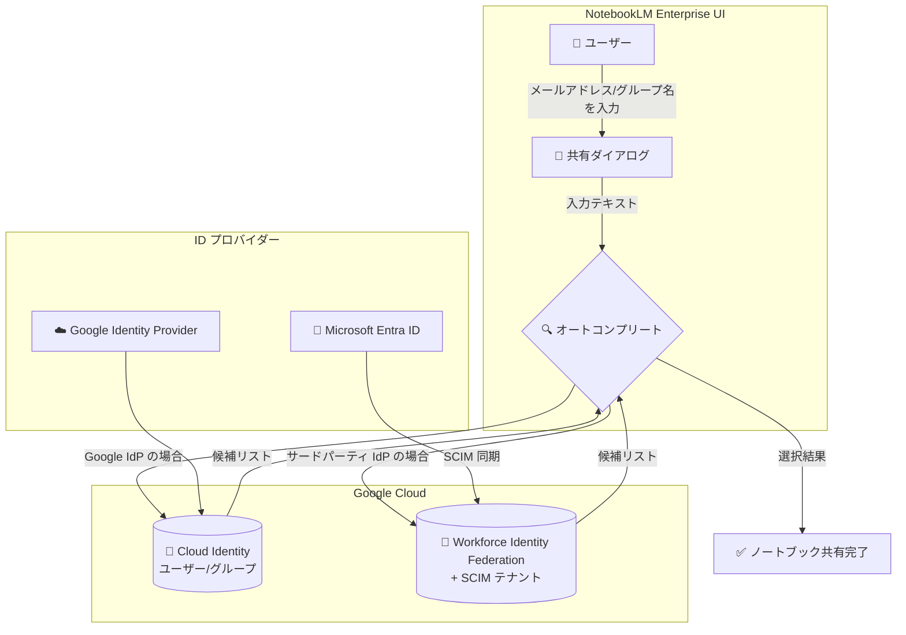

# Gemini Enterprise: NotebookLM Enterprise ノートブック共有時のオートコンプリート機能

**リリース日**: 2026-04-02

**サービス**: Gemini Enterprise / NotebookLM Enterprise

**機能**: ノートブック共有時のメールアドレス・グループ名オートコンプリート

**ステータス**: GA (一般提供)

:bar_chart: [このアップデートのインフォグラフィックを見る](https://takech9203.github.io/google-cloud-news-summary/20260402-gemini-enterprise-notebooklm-autocomplete.html)

## 概要

NotebookLM Enterprise において、ノートブックを他のユーザーやグループと共有する際に、メールアドレスおよびグループ名のオートコンプリート機能が一般提供 (GA) となった。これにより、共有ダイアログでメールアドレスやグループ名を入力する際に、候補が自動的に表示され、正しい宛先を素早く選択できるようになる。

この機能は、Google Identity Provider を使用している組織ではそのまま利用可能である。サードパーティの ID プロバイダーとして Microsoft Entra ID を使用し、Workforce Identity Federation を構成している組織では、Gemini Enterprise 管理者が SCIM (System for Cross-domain Identity Management) テナントをプロビジョニングする必要がある。

NotebookLM Enterprise は、Gemini Enterprise の一部として提供されるエンタープライズ向けの AI ノートブックサービスであり、企業内でのナレッジ共有・コラボレーションを支援する。今回のオートコンプリート機能により、ノートブック共有のユーザーエクスペリエンスが大幅に向上する。

**アップデート前の課題**

- ノートブックを共有する際、共有相手のメールアドレスを正確に手入力する必要があった
- グループ名での共有時、Microsoft Entra ID 環境ではグループのオブジェクト ID (UUID) を入力する必要があり、ユーザーにとって分かりにくかった
- メールアドレスの入力ミスにより、意図しないユーザーへの共有や共有失敗が発生する可能性があった

**アップデート後の改善**

- メールアドレス入力時にオートコンプリート候補が表示され、正しいアドレスを素早く選択できるようになった
- グループ名でのオートコンプリートにより、UUID ではなく人間が読めるグループ名で共有できるようになった (SCIM 構成済みの場合)
- 入力ミスのリスクが軽減され、ノートブック共有の操作性が向上した

## アーキテクチャ図



オートコンプリート機能は、組織の ID プロバイダー構成に応じて Cloud Identity または Workforce Identity Federation (SCIM) 経由でユーザー・グループ情報を参照し、候補を表示する。

## サービスアップデートの詳細

### 主要機能

1. **メールアドレスのオートコンプリート**
   - ノートブック共有ダイアログでメールアドレスの入力を開始すると、同一プロジェクト内のユーザー候補が表示される
   - 候補から選択することで、正確なメールアドレスを素早く入力できる

2. **グループ名のオートコンプリート**
   - Google グループや Microsoft Entra ID グループの名前を入力すると、候補が表示される
   - SCIM が構成されている場合、グループのオブジェクト ID (UUID) ではなく、人間が読めるグループ名で検索・選択が可能

3. **ID プロバイダー別の動作**
   - Google Identity Provider: 追加設定なしでオートコンプリートが利用可能
   - サードパーティ IdP (Microsoft Entra ID): SCIM テナントのプロビジョニングが必要

## 技術仕様

### ID プロバイダー別の要件

| 項目 | Google Identity Provider | Microsoft Entra ID (Workforce Identity Federation) |
|------|--------------------------|---------------------------------------------------|
| 追加設定 | 不要 | SCIM テナントのプロビジョニングが必要 |
| オートコンプリート対象 | メールアドレス、グループ名 | メールアドレス、グループ名 (SCIM 構成時) |
| グループ指定方法 | グループ名 | グループ名 (SCIM あり) / オブジェクト ID (SCIM なし) |
| 対応プロトコル | - | OIDC、SAML 2.0 |

### 共有の前提条件

| 項目 | 詳細 |
|------|------|
| 共有対象 | 同一プロジェクト内のユーザーおよびグループ |
| 必要なロール | Cloud NotebookLM User ロール |
| 必要なライセンス | NotebookLM Enterprise または Gemini Enterprise ライセンス |
| Workforce プール | 同一 Workforce プール内のユーザーであること |
| 共有権限 | Viewer (閲覧者) または Editor (編集者) |

### SCIM の主要機能

SCIM を構成することで、以下の機能が利用可能になる:

- **ID 同期**: IdP からユーザーデータの読み取り専用コピーを同期
- **グループフラッテニング**: ネストされたグループメンバーシップを展開して同期
- **グループ名による共有**: オブジェクト ID ではなくグループ名でノートブックを共有可能

## 設定方法

### 前提条件

1. NotebookLM Enterprise が有効化されたプロジェクトがあること
2. Cloud NotebookLM Admin ロールが付与されていること
3. ユーザーに NotebookLM Enterprise または Gemini Enterprise ライセンスが割り当てられていること

### 手順

#### Google Identity Provider を使用している場合

追加の設定は不要。ノートブック共有ダイアログでオートコンプリートが自動的に有効になる。

#### Microsoft Entra ID + Workforce Identity Federation を使用している場合

#### ステップ 1: Workforce Identity Federation の構成確認

Workforce Identity Federation が正しく構成されていることを確認する。`google.subject` 属性がユーザーのメールアドレスにマッピングされている必要がある。

```
# Entra ID with OIDC の場合の属性マッピング例
google.subject=assertion.email.lowerAscii()
google.groups=assertion.groups
google.display_name=assertion.given_name
```

#### ステップ 2: SCIM テナントのプロビジョニング

Gemini Enterprise 管理者が SCIM テナントをプロビジョニングする。これにより、ユーザーおよびグループ情報が Google Cloud に同期される。

詳細な手順は [Workforce Identity Federation SCIM の構成](https://cloud.google.com/iam/docs/workforce-identity-federation-scim) を参照。

#### ステップ 3: オートコンプリートの動作確認

SCIM テナントのプロビジョニング完了後、NotebookLM Enterprise の共有ダイアログでグループ名によるオートコンプリートが利用可能になる。

## メリット

### ビジネス面

- **コラボレーション効率の向上**: ノートブック共有が容易になり、チーム間のナレッジ共有が促進される
- **オンボーディングの簡素化**: 新しいチームメンバーへのノートブック共有が直感的に行える

### 技術面

- **入力ミスの削減**: オートコンプリートにより、メールアドレスの誤入力を防止できる
- **グループ管理の改善**: SCIM 連携により、グループ名でのノートブック共有が可能になり、UUID を覚える必要がなくなる
- **ID プロバイダーとのシームレスな統合**: 既存の ID 基盤をそのまま活用できる

## デメリット・制約事項

### 制限事項

- オートコンプリートは同一プロジェクト内のユーザー・グループに限定される
- NotebookLM Enterprise と個人版 NotebookLM / NotebookLM Plus 間でのノートブック共有はできない
- Gemini Enterprise 検索結果からソースを追加したノートブックは共有できない
- SCIM の制限として、フィルタ式は `eq` (equals) 演算子のみサポート
- SCIM のユーザーリスト取得は最大 100 件まで

### 考慮すべき点

- Microsoft Entra ID 環境で SCIM なしの場合、グループ共有にはオブジェクト ID (UUID) の入力が引き続き必要
- SCIM テナントのプロビジョニングには管理者権限が必要
- SCIM で同期される属性値 (`google.subject` や `google.group` にマッピングされる値) は不変として扱われるため、変更する場合は IdP 側でユーザー/グループを削除して再作成する必要がある

## ユースケース

### ユースケース 1: チーム内のプロジェクトナレッジ共有

**シナリオ**: 技術チームのリーダーが、プロジェクトの技術調査結果をまとめた NotebookLM ノートブックをチームメンバー全員と共有したい。

**効果**: オートコンプリート機能により、チームメンバーのメールアドレスを素早く入力でき、共有操作にかかる時間が短縮される。グループ名での共有を使えば、チーム全体への一括共有も容易になる。

### ユースケース 2: 大規模組織でのグループベース共有

**シナリオ**: Microsoft Entra ID を ID プロバイダーとして使用する大規模組織で、部門ごとのグループにノートブックを共有したい。

**効果**: SCIM テナントを構成することで、管理者や一般ユーザーがグループの UUID を調べる必要がなくなり、グループ名を入力するだけで正しいグループを選択して共有できる。

## 料金

NotebookLM Enterprise は Gemini Enterprise の一部として提供される。ライセンスはサブスクリプション単位で購入する。

- 最小 15 ライセンスから購入可能 (最大 5,000 ライセンス/サブスクリプション)
- 14 日間の無料トライアル (5,000 ライセンス) が利用可能
- 月額または年間サブスクリプションを選択可能
- ライセンスはマルチリージョン (US、EU、Global) ごとに管理される

詳細な料金については [Gemini Enterprise の料金ページ](https://cloud.google.com/gemini-enterprise#pricing) を参照。

## 関連サービス・機能

- **[Gemini Enterprise](https://cloud.google.com/gemini-enterprise)**: NotebookLM Enterprise の親プロダクト。検索機能と NotebookLM を統合して提供
- **[Workforce Identity Federation](https://cloud.google.com/iam/docs/workforce-identity-federation)**: サードパーティ ID プロバイダーとの連携を実現するサービス。SCIM テナントのプロビジョニングに必要
- **[Cloud Identity](https://cloud.google.com/identity/docs)**: Google Cloud のユーザー・グループ管理サービス。Google IdP を使用する場合のオートコンプリートの基盤
- **[IAM (Identity and Access Management)](https://cloud.google.com/iam/docs)**: NotebookLM Enterprise のロール (Admin、User、Owner、Editor、Viewer) を管理

## 参考リンク

- :bar_chart: [インフォグラフィック](https://takech9203.github.io/google-cloud-news-summary/20260402-gemini-enterprise-notebooklm-autocomplete.html)
- [公式リリースノート](https://cloud.google.com/release-notes#April_02_2026)
- [ノートブックの共有ドキュメント](https://cloud.google.com/gemini/enterprise/notebooklm-enterprise/docs/share-notebooks)
- [NotebookLM Enterprise のセットアップ](https://cloud.google.com/gemini/enterprise/notebooklm-enterprise/docs/set-up-notebooklm)
- [Workforce Identity Federation SCIM](https://cloud.google.com/iam/docs/workforce-identity-federation-scim)
- [NotebookLM Enterprise 概要](https://cloud.google.com/gemini/enterprise/notebooklm-enterprise/docs/overview)

## まとめ

NotebookLM Enterprise のノートブック共有時にオートコンプリート機能が GA となったことで、企業環境でのナレッジ共有がより効率的になる。Google Identity Provider を使用する組織は追加設定なしで利用開始でき、Microsoft Entra ID を使用する組織は SCIM テナントをプロビジョニングすることでグループ名でのオートコンプリートも含めた完全な機能を利用できる。ノートブック共有を活用している組織は、SCIM の構成状況を確認し、必要に応じてプロビジョニングを実施することを推奨する。

---

**タグ**: #GeminiEnterprise #NotebookLM #NotebookLMEnterprise #SCIM #WorkforceIdentityFederation #コラボレーション #GA
