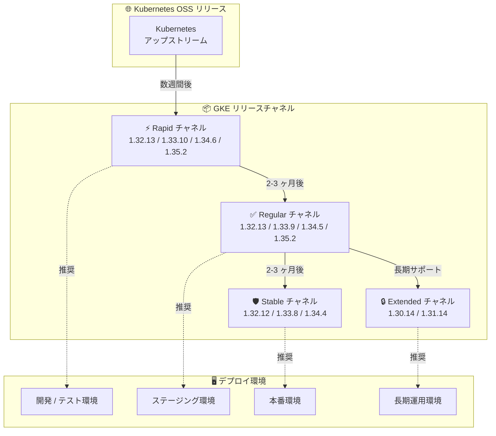

# Google Kubernetes Engine (GKE): バージョンアップデート 2026-R13

**リリース日**: 2026-04-02

**サービス**: Google Kubernetes Engine (GKE)

**機能**: クラスタバージョンアップデート (2026-R13)

**ステータス**: Change

📊 [このアップデートのインフォグラフィックを見る](https://takech9203.github.io/google-cloud-news-summary/20260402-gke-version-updates-2026-r13.html)

## 概要

Google Kubernetes Engine (GKE) のクラスタバージョンが 2026-R13 として更新された。Rapid、Regular、Stable、Extended の全 4 チャネルにおいて、新しいバージョンが新規クラスタの作成および既存クラスタのアップグレード用に利用可能になっている。

今回のアップデートでは、Rapid チャネルで最新の Kubernetes 1.35 系パッチ (1.35.2-gke.1962000) が提供されているほか、Regular チャネルでも 1.35 系 (1.35.2-gke.1485000) が利用可能となっている。Stable チャネルは 1.32 から 1.34 までの安定版パッチを提供し、Extended チャネルでは長期サポート対象の 1.30 および 1.31 のセキュリティパッチが引き続き提供されている。

このバージョンアップデートは、GKE を運用するすべてのユーザーに影響する定期的なメンテナンスリリースであり、セキュリティパッチ、バグ修正、安定性向上が含まれている。

**アップデート前の課題**

- 以前のパッチバージョンに含まれていたセキュリティ脆弱性やバグが修正されていない状態だった
- 最新の Kubernetes 機能やパフォーマンス改善を利用できなかった
- 古いパッチバージョンではサポート終了に近づいているものがあり、計画的なアップグレードが必要だった

**アップデート後の改善**

- 各チャネルで最新のセキュリティパッチとバグ修正が適用されたバージョンが利用可能になった
- Rapid および Regular チャネルで Kubernetes 1.35 系の最新パッチが提供され、新機能を活用できるようになった
- Extended チャネルで 1.30/1.31 の長期サポートバージョンが更新され、レガシーワークロードの安全な運用が継続できる

## アーキテクチャ図



GKE のリリースチャネルは、Kubernetes アップストリームから段階的にバージョンが提供される仕組みになっている。各チャネルの安定性レベルに応じて、適切なデプロイ環境での利用が推奨される。

## サービスアップデートの詳細

### 主要機能

1. **Rapid チャネルの更新バージョン**
   - `1.32.13-gke.1205000` - Kubernetes 1.32 系最新パッチ
   - `1.33.10-gke.1067000` - Kubernetes 1.33 系最新パッチ
   - `1.34.6-gke.1068000` - Kubernetes 1.34 系最新パッチ
   - `1.35.2-gke.1962000` - Kubernetes 1.35 系最新パッチ (最新メジャーバージョン)

2. **Regular チャネルの更新バージョン**
   - `1.32.13-gke.1090000` - Kubernetes 1.32 系
   - `1.33.9-gke.1117000` - Kubernetes 1.33 系
   - `1.34.5-gke.1153000` - Kubernetes 1.34 系
   - `1.35.2-gke.1485000` - Kubernetes 1.35 系

3. **Stable チャネルの更新バージョン**
   - `1.32.12-gke.1127000` - Kubernetes 1.32 系
   - `1.33.8-gke.1169000` - Kubernetes 1.33 系
   - `1.34.4-gke.1193000` - Kubernetes 1.34 系

4. **Extended チャネルの更新バージョン**
   - `1.30.14-gke.2286000` - Kubernetes 1.30 系 (長期サポート)
   - `1.31.14-gke.1681000` - Kubernetes 1.31 系 (長期サポート)

## 技術仕様

### チャネル別バージョン一覧

| チャネル | Kubernetes 1.30 | Kubernetes 1.31 | Kubernetes 1.32 | Kubernetes 1.33 | Kubernetes 1.34 | Kubernetes 1.35 |
|----------|-----------------|-----------------|-----------------|-----------------|-----------------|-----------------|
| Rapid | - | - | 1.32.13-gke.1205000 | 1.33.10-gke.1067000 | 1.34.6-gke.1068000 | 1.35.2-gke.1962000 |
| Regular | - | - | 1.32.13-gke.1090000 | 1.33.9-gke.1117000 | 1.34.5-gke.1153000 | 1.35.2-gke.1485000 |
| Stable | - | - | 1.32.12-gke.1127000 | 1.33.8-gke.1169000 | 1.34.4-gke.1193000 | - |
| Extended | 1.30.14-gke.2286000 | 1.31.14-gke.1681000 | - | - | - | - |

### リリースチャネルの特性

| チャネル | 安定性 | 新機能の利用可能時期 | 推奨用途 | SLA |
|----------|--------|---------------------|----------|-----|
| Rapid | 低 (最新) | アップストリーム GA の数週間後 | 開発・テスト環境 | GKE SLA 対象外 |
| Regular (デフォルト) | 中 | Rapid の 2-3 ヶ月後 | 一般的な本番環境 | GKE SLA 対象 |
| Stable | 高 | Regular の 2-3 ヶ月後 | ミッションクリティカルな本番環境 | GKE SLA 対象 |
| Extended | 長期サポート | Regular と同期 | 長期運用環境 (最大 24 ヶ月) | GKE SLA 対象 |

### バージョンアップグレードの確認

```bash
# 利用可能なバージョンの確認
gcloud container get-server-config --zone=ZONE

# クラスタの現在のバージョンを確認
gcloud container clusters describe CLUSTER_NAME \
  --zone=ZONE \
  --format="value(currentMasterVersion)"
```

## 設定方法

### 前提条件

1. Google Cloud プロジェクトで GKE API が有効化されていること
2. `gcloud` CLI がインストールされ、認証済みであること
3. 対象クラスタに対する `container.clusters.update` 権限があること

### 手順

#### ステップ 1: クラスタのリリースチャネルを確認

```bash
gcloud container clusters describe CLUSTER_NAME \
  --zone=ZONE \
  --format="value(releaseChannel.channel)"
```

#### ステップ 2: 利用可能なバージョンを確認

```bash
gcloud container get-server-config \
  --zone=ZONE \
  --format="yaml(channels)"
```

#### ステップ 3: 手動アップグレード (必要な場合)

```bash
# コントロールプレーンのアップグレード
gcloud container clusters upgrade CLUSTER_NAME \
  --zone=ZONE \
  --master \
  --cluster-version=VERSION

# ノードプールのアップグレード
gcloud container clusters upgrade CLUSTER_NAME \
  --zone=ZONE \
  --node-pool=NODE_POOL_NAME \
  --cluster-version=VERSION
```

#### ステップ 4: リリースチャネルの変更 (必要な場合)

```bash
# リリースチャネルを変更
gcloud container clusters update CLUSTER_NAME \
  --zone=ZONE \
  --release-channel=CHANNEL
```

`CHANNEL` には `rapid`、`regular`、`stable`、`extended` のいずれかを指定する。

## メリット

### ビジネス面

- **セキュリティリスクの低減**: 最新のセキュリティパッチが適用されることで、既知の脆弱性に対するリスクが軽減される
- **運用コストの最適化**: 自動アップグレード機能により、手動でのバージョン管理の工数が削減される

### 技術面

- **Kubernetes 1.35 系の新機能**: Rapid および Regular チャネルで最新の Kubernetes 機能が利用可能
- **段階的なロールアウト**: チャネルを活用した段階的なアップグレードにより、本番環境への影響を最小化できる
- **長期サポート**: Extended チャネルにより、Kubernetes 1.30/1.31 のセキュリティパッチが継続提供される

## デメリット・制約事項

### 制限事項

- Rapid チャネルのバージョンは GKE SLA の対象外であり、既知の問題が含まれる可能性がある
- Extended チャネルでは Autopilot クラスタ、Alpha クラスタ、Windows Server ノードプールなどの一部機能が利用できない
- Extended チャネルの拡張サポート期間中は、従量課金による追加コストが発生する

### 考慮すべき点

- メジャーバージョンのアップグレード (例: 1.33 から 1.34) では、API の非推奨化や動作変更がある可能性があるため、事前にリリースノートを確認すること
- メンテナンスウィンドウと除外設定を適切に構成し、自動アップグレードのタイミングを制御すること
- Kubernetes 1.29 以前はサポート終了済みであるため、該当バージョンを使用している場合は早急なアップグレードが必要

## ユースケース

### ユースケース 1: 開発環境での最新バージョン検証

**シナリオ**: 開発チームが Kubernetes 1.35 の新機能 (新しい API やスケジューリング改善) を評価したい

**実装例**:
```bash
# Rapid チャネルで 1.35 系クラスタを作成
gcloud container clusters create dev-cluster \
  --zone=asia-northeast1-a \
  --release-channel=rapid \
  --cluster-version=1.35.2-gke.1962000
```

**効果**: 本番環境に影響を与えることなく、最新の Kubernetes 機能を早期に評価できる

### ユースケース 2: 本番環境の段階的アップグレード

**シナリオ**: 本番環境で稼働中の Regular チャネルクラスタを、ダウンタイムなく最新パッチに更新したい

**実装例**:
```bash
# メンテナンスウィンドウを設定して自動アップグレードを制御
gcloud container clusters update prod-cluster \
  --zone=asia-northeast1-a \
  --maintenance-window-start=2026-04-05T02:00:00Z \
  --maintenance-window-end=2026-04-05T06:00:00Z \
  --maintenance-window-recurrence="FREQ=WEEKLY;BYDAY=SA"
```

**効果**: 自動アップグレードのタイミングを業務時間外に制御し、サービスへの影響を最小化できる

### ユースケース 3: レガシーワークロードの長期運用

**シナリオ**: 特定の Kubernetes バージョンに依存するアプリケーションを、可能な限り同じマイナーバージョンで運用したい

**実装例**:
```bash
# Extended チャネルに変更して長期サポートを利用
gcloud container clusters update legacy-cluster \
  --zone=asia-northeast1-a \
  --release-channel=extended
```

**効果**: Extended チャネルにより最大 24 ヶ月のサポートが受けられ、マイナーバージョンのアップグレード頻度を抑えられる

## 料金

GKE の料金はクラスタ管理料金とコンピューティングリソース (ノード) の料金で構成される。バージョンアップデート自体に追加コストは発生しない。

### 料金例

| 項目 | 料金 |
|------|------|
| GKE Standard クラスタ管理料金 | 無料 |
| GKE Autopilot クラスタ管理料金 | 無料 (リソース使用量に基づく課金) |
| GKE Enterprise | $0.10/vCPU/時間 |
| Extended サポート (拡張サポート期間中) | 追加料金あり (詳細は料金ページを参照) |

詳細は [GKE 料金ページ](https://cloud.google.com/kubernetes-engine/pricing) を参照。

## 利用可能リージョン

GKE のバージョンアップデートは、GKE が利用可能なすべてのリージョンで提供される。ただし、新しいバージョンのロールアウトは段階的に行われるため、リージョンによって利用可能になるタイミングに差が生じる場合がある。

## 関連サービス・機能

- **Cloud Monitoring**: GKE クラスタのアップグレード状態やノードの健全性を監視
- **Cloud Logging**: クラスタアップグレードのログを収集・分析
- **Binary Authorization**: デプロイ時のコンテナイメージの検証ポリシーを管理
- **GKE Backup for GKE**: アップグレード前のクラスタ状態のバックアップと復元
- **Container-Optimized OS**: GKE ノードの基盤 OS (Extended チャネルでは拡張サポート期間中にマイルストーンが更新される)

## 参考リンク

- 📊 [インフォグラフィック](https://takech9203.github.io/google-cloud-news-summary/20260402-gke-version-updates-2026-r13.html)
- [公式リリースノート](https://cloud.google.com/release-notes#April_02_2026)
- [GKE リリースチャネルのドキュメント](https://cloud.google.com/kubernetes-engine/docs/concepts/release-channels)
- [GKE リリーススケジュール](https://cloud.google.com/kubernetes-engine/docs/release-schedule)
- [GKE バージョニングとサポート](https://cloud.google.com/kubernetes-engine/versioning)
- [料金ページ](https://cloud.google.com/kubernetes-engine/pricing)

## まとめ

GKE 2026-R13 バージョンアップデートにより、全 4 チャネル (Rapid、Regular、Stable、Extended) で最新のパッチバージョンが利用可能になった。特に Rapid および Regular チャネルでは Kubernetes 1.35 系が提供されており、最新機能の評価と採用が可能である。運用中のクラスタについては、メンテナンスウィンドウの設定を確認し、自動アップグレードのタイミングを適切に管理することを推奨する。

---

**タグ**: #GKE #GoogleKubernetesEngine #Kubernetes #VersionUpdate #ReleaseChannel #2026-R13
