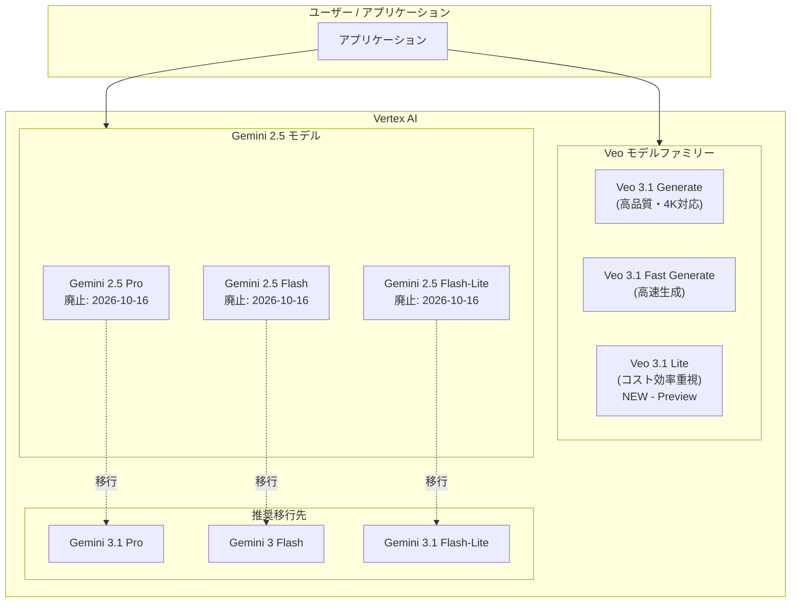

# Generative AI on Vertex AI: Veo 3.1 Lite パブリックプレビュー & Gemini 2.5 モデル廃止日更新

**リリース日**: 2026-04-02

**サービス**: Generative AI on Vertex AI

**機能**: Veo 3.1 Lite (Public Preview) / Gemini 2.5 モデル廃止日更新

**ステータス**: Feature (Public Preview) / Announcement

[このアップデートのインフォグラフィックを見る](https://takech9203.github.io/google-cloud-news-summary/20260402-vertex-ai-veo-31-lite-gemini-25-retirement.html)

## 概要

Vertex AI の生成 AI モデルに関する 2 つの重要なアップデートが発表されました。1 つ目は、Veo ファミリーの新モデル「Veo 3.1 Lite」がパブリックプレビューとして利用可能になったことです。Veo 3.1 Lite は、Vertex AI 上で最もコスト効率の高いビデオ生成モデルとして位置づけられており、大量のビデオ生成ワークロードをスケーラブルに実行したい開発者や企業向けに設計されています。

2 つ目は、Gemini 2.5 ファミリーのモデル (Gemini 2.5 Pro、Gemini 2.5 Flash-Lite、Gemini 2.5 Flash) の廃止日が 2026 年 10 月 16 日に更新されたことです。これにより、既存の Gemini 2.5 ベースのワークロードを運用しているユーザーは、移行計画を適切に策定する必要があります。

これらのアップデートは、Vertex AI の生成 AI プラットフォームとしての成熟を示しており、コスト最適化された新モデルの提供とモデルライフサイクル管理の両面で、エンタープライズユーザーにとって重要な意味を持ちます。

**アップデート前の課題**

- Veo モデルはハイエンドのビデオ生成品質を提供する一方で、大量のビデオ生成を行う場合のコスト効率が課題だった
- Gemini 2.5 モデルの廃止日が明確でなく、移行計画の策定が困難だった
- コスト効率を重視したビデオ生成の選択肢が限られていた

**アップデート後の改善**

- Veo 3.1 Lite により、コスト効率を重視した大量ビデオ生成ワークフローが実現可能になった
- Gemini 2.5 Pro / Flash / Flash-Lite の廃止日が 2026 年 10 月 16 日に明確化され、移行計画の立案が可能になった
- Veo モデルファミリーに「Lite」バリアントが追加され、品質とコストのトレードオフを柔軟に選択できるようになった

## アーキテクチャ図



Veo 3.1 Lite は既存の Veo モデルファミリーにコスト効率重視の選択肢として追加されました。Gemini 2.5 モデルは 2026 年 10 月 16 日の廃止に向けて、Gemini 3 ファミリーへの移行が推奨されます。

## サービスアップデートの詳細

### 主要機能

1. **Veo 3.1 Lite (パブリックプレビュー)**
   - Vertex AI 上で最もコスト効率の高いビデオ生成モデル
   - Veo 3.1 の技術をベースとした軽量バリアント
   - テキストから動画、画像から動画の生成に対応
   - 音声付きビデオの出力をサポート
   - テキスト入力は最大 1,024 トークン
   - 4K 出力およびビデオ拡張 (Extension) は非対応

2. **Gemini 2.5 モデル廃止日の更新**
   - Gemini 2.5 Pro: 廃止日が 2026 年 10 月 16 日に更新
   - Gemini 2.5 Flash-Lite: 廃止日が 2026 年 10 月 16 日に更新
   - Gemini 2.5 Flash: 廃止日が 2026 年 10 月 16 日に更新
   - 廃止日の 1 か月前からオンライン推論、バッチ推論、チューニングへの新規アクセスがブロックされる

3. **推奨される移行先モデル**
   - Gemini 2.5 Pro から Gemini 3.1 Pro Preview への移行を推奨
   - Gemini 2.5 Flash から Gemini 3 Flash Preview への移行を推奨
   - Gemini 2.5 Flash-Lite から Gemini 3.1 Flash-Lite Preview への移行を推奨

## 技術仕様

### Veo 3.1 Lite の仕様

| 項目 | 詳細 |
|------|------|
| モデル ID | veo-3.1-lite-generate-preview |
| ステージ | Public Preview |
| 入力 | テキスト、画像 |
| 出力 | 音声付きビデオ |
| テキスト入力上限 | 1,024 トークン |
| 出力ビデオ数 | 1 本/プロンプト |
| 4K 出力 | 非対応 |
| ビデオ拡張 | 非対応 |

### Veo モデルファミリー比較

| モデル | ステージ | 主な特徴 | 4K | 音声生成 |
|------|------|------|------|------|
| Veo 3.1 Generate 001 | GA | 最高品質、全機能対応 | 対応 (Preview) | 対応 |
| Veo 3.1 Fast Generate 001 | GA | 高速生成 | 対応 (Preview) | 対応 |
| Veo 3.1 Lite | Preview | コスト効率重視 | 非対応 | 対応 |
| Veo 3.0 Generate 001 | GA | 前世代、廃止予定 (2026/6/30) | 非対応 | 対応 |

### Gemini 2.5 モデル廃止スケジュール

| モデル ID | リリース日 | 廃止日 (更新後) |
|------|------|------|
| gemini-2.5-pro | 2025-06-17 | 2026-10-16 |
| gemini-2.5-flash | 2025-06-17 | 2026-10-16 |
| gemini-2.5-flash-lite | 2025-07-22 | 2026-10-16 |

## 設定方法

### 前提条件

1. Google Cloud プロジェクトで Vertex AI API が有効であること
2. 適切な IAM 権限 (Vertex AI ユーザーロールなど) が付与されていること

### 手順

#### ステップ 1: Veo 3.1 Lite でテキストからビデオを生成

```python
import time
from google import genai
from google.genai.types import GenerateVideosConfig

client = genai.Client()

operation = client.models.generate_videos(
    model="veo-3.1-lite-generate-preview",
    prompt="A cinematic aerial shot of a coastal city at sunset, warm golden light reflecting off glass buildings",
    config=GenerateVideosConfig(
        aspect_ratio="16:9",
        output_gcs_uri="gs://your-bucket/output/",
    ),
)

while not operation.done:
    time.sleep(15)
    operation = client.operations.get(operation)

if operation.response:
    print(operation.result.generated_videos[0].video.uri)
```

環境変数の設定が必要です。

```bash
export GOOGLE_CLOUD_PROJECT=YOUR_PROJECT_ID
export GOOGLE_CLOUD_LOCATION=global
export GOOGLE_GENAI_USE_VERTEXAI=True
```

#### ステップ 2: Gemini 2.5 モデルの移行計画策定

```bash
# 現在使用中の Gemini 2.5 モデルを確認
gcloud ai models list --region=us-central1 --filter="displayName:gemini-2.5*"

# 新しい Gemini 3 モデルへの移行テスト
# Gemini 2.5 Pro -> Gemini 3.1 Pro Preview
# Gemini 2.5 Flash -> Gemini 3 Flash Preview
# Gemini 2.5 Flash-Lite -> Gemini 3.1 Flash-Lite Preview
```

## メリット

### ビジネス面

- **コスト最適化**: Veo 3.1 Lite は大量のビデオ生成を行うユースケースにおいて、従来の Veo モデルよりも大幅にコストを削減できる
- **スケーラビリティ**: コスト効率の高いモデルにより、ビデオ生成のスケールアウトが経済的に実現可能になる
- **計画的な移行**: Gemini 2.5 の廃止日が明確になったことで、移行計画を十分な余裕を持って策定できる

### 技術面

- **モデル選択の柔軟性**: Veo ファミリーに Lite バリアントが追加されたことで、品質・速度・コストのバランスを要件に応じて選択可能
- **プログラマブルインターフェース**: Veo 3.1 Lite は API 経由で制御可能であり、ワークフローへの組み込みが容易
- **音声付きビデオ生成**: Lite バリアントでも音声付きビデオの生成が可能

## デメリット・制約事項

### 制限事項

- Veo 3.1 Lite はプレビュー段階であり、本番ワークロードでの利用にはプレビュー利用規約が適用される
- 4K 出力には対応しておらず、高解像度が必要なユースケースでは Veo 3.1 Generate 001 を使用する必要がある
- ビデオ拡張 (Extension) 機能が非対応のため、既存ビデオの延長には使用できない
- プロンプトごとの出力ビデオ数が 1 本に制限されている (Veo 3.1 Generate 001 は最大 4 本)

### 考慮すべき点

- Gemini 2.5 モデルの廃止日は 2026 年 10 月 16 日だが、その 1 か月前 (2026 年 9 月 16 日頃) から新規アクセスがブロックされるため、実質的な移行期限はそれ以前となる
- Gemini 3 ファミリーへの移行時には、レスポンスの差異やパフォーマンス特性の変化を事前に検証する必要がある
- Veo 3.1 Lite の品質と Veo 3.1 Generate 001 の品質差を事前に評価し、ユースケースに適しているか確認が必要

## ユースケース

### ユースケース 1: 大規模コンテンツ生成パイプライン

**シナリオ**: EC サイトが商品説明ビデオを数千点の商品に対して自動生成する場合

**実装例**:
```python
products = get_product_list()  # 商品リストを取得

for product in products:
    operation = client.models.generate_videos(
        model="veo-3.1-lite-generate-preview",
        prompt=f"Product showcase video: {product.description}",
        config=GenerateVideosConfig(
            aspect_ratio="16:9",
            output_gcs_uri=f"gs://product-videos/{product.id}/",
        ),
    )
```

**効果**: コスト効率の高い Veo 3.1 Lite を使用することで、大量のビデオ生成を経済的に実行でき、商品ページのエンゲージメント向上に貢献する

### ユースケース 2: Gemini 2.5 から Gemini 3 への段階的移行

**シナリオ**: Gemini 2.5 Pro をチャットボットのバックエンドとして使用している企業が、廃止前に Gemini 3.1 Pro Preview に移行する場合

**効果**: 廃止日が明確化されたことで、移行スケジュールを計画的に策定し、品質検証を十分に行った上で本番環境を切り替えることができる

## 料金

### Veo 3.1 Lite

Veo 3.1 Lite は Veo ファミリーの中で最もコスト効率の高い料金設定を提供します。詳細な料金については、Vertex AI の料金ページを参照してください。

- [Vertex AI 料金 - Veo セクション](https://cloud.google.com/vertex-ai/generative-ai/pricing#veo)
- [Gemini API 料金 - Veo 3.1 セクション](https://ai.google.dev/gemini-api/docs/pricing#veo-3.1)

### Gemini 2.5 モデル

Gemini 2.5 モデルの料金は廃止日まで現行の料金体系が維持されます。移行先の Gemini 3 モデルの料金については、Vertex AI の料金ページを参照してください。

- [Vertex AI 料金 - Gemini モデル](https://cloud.google.com/vertex-ai/generative-ai/pricing#gemini-models)

## 利用可能リージョン

Veo モデルの利用可能リージョンについては、[Generative AI on Vertex AI のロケーション](https://cloud.google.com/vertex-ai/generative-ai/docs/learn/locations-genai) ページを参照してください。Veo 3.1 Lite のプレビュー期間中は、`global` ロケーションでの利用が推奨されます。

## 関連サービス・機能

- **Vertex AI Media Studio**: ブラウザベースでビデオ生成を試すことができるインターフェース。Veo 3.1 Lite の試用にも対応
- **Vertex AI Provisioned Throughput**: 予約済みスループットにより、安定したビデオ生成パフォーマンスを確保
- **Cloud Storage**: 生成されたビデオの保存先として使用
- **Content Credentials (C2PA)**: AI 生成コンテンツの来歴情報を埋め込む機能。Veo モデルで生成されたビデオに適用される
- **Gemini 3 ファミリー**: Gemini 2.5 からの移行先として推奨されるモデル群

## 参考リンク

- [インフォグラフィック](https://takech9203.github.io/google-cloud-news-summary/20260402-vertex-ai-veo-31-lite-gemini-25-retirement.html)
- [公式リリースノート](https://cloud.google.com/release-notes#April_02_2026)
- [Veo 3.1 モデルドキュメント](https://cloud.google.com/vertex-ai/generative-ai/docs/models/veo/3-1-generate)
- [Veo 3.1 Lite (Gemini API)](https://ai.google.dev/gemini-api/docs/models/veo-3.1-lite-generate-preview)
- [Vertex AI ビデオ生成概要](https://cloud.google.com/vertex-ai/generative-ai/docs/video/overview)
- [モデルバージョンとライフサイクル](https://cloud.google.com/vertex-ai/generative-ai/docs/learn/model-versions)
- [Gemini モデル廃止スケジュール](https://ai.google.dev/gemini-api/docs/deprecations)
- [Vertex AI 料金 - Veo](https://cloud.google.com/vertex-ai/generative-ai/pricing#veo)
- [Vertex AI 料金 - Gemini](https://cloud.google.com/vertex-ai/generative-ai/pricing#gemini-models)

## まとめ

Veo 3.1 Lite のパブリックプレビュー提供により、Vertex AI 上でのビデオ生成がよりコスト効率の高い選択肢を得ました。大量のビデオ生成を必要とするユースケースにおいて、品質とコストのバランスを最適化できるようになります。一方、Gemini 2.5 モデルの廃止日が 2026 年 10 月 16 日に更新されたため、Gemini 2.5 を使用している組織は、早期に Gemini 3 ファミリーへの移行検証を開始し、計画的な移行を進めることを推奨します。

---

**タグ**: #VertexAI #Veo #Veo31Lite #ビデオ生成 #Gemini25 #モデル廃止 #Preview #GenerativeAI
