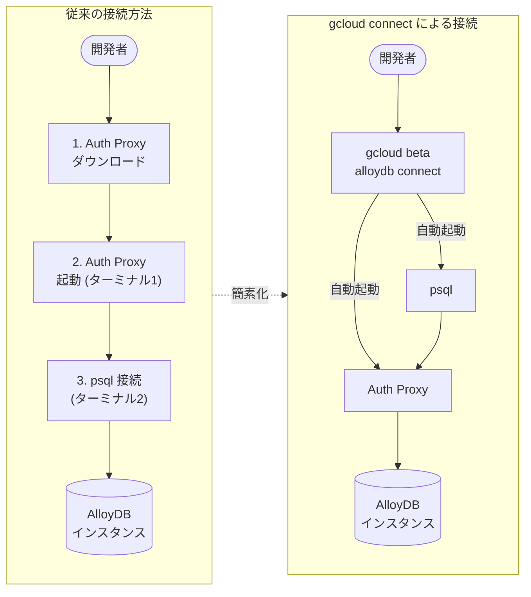

# AlloyDB for PostgreSQL: gcloud alloydb connect コマンド (Preview)

**リリース日**: 2026-04-03

**サービス**: AlloyDB for PostgreSQL

**機能**: gcloud beta alloydb connect コマンド

**ステータス**: Preview

📊 [このアップデートのインフォグラフィックを見る](https://takech9203.github.io/google-cloud-news-summary/20260403-alloydb-gcloud-connect-preview.html)

## 概要

Google Cloud は `gcloud beta alloydb connect` コマンドを Preview として公開した。このコマンドは、AlloyDB Auth Proxy と psql クライアントツールの起動を自動化し、AlloyDB インスタンスへの安全な接続を簡素化する。従来は Auth Proxy のダウンロード、起動、psql による接続を個別に行う必要があったが、本コマンドにより 1 つのコマンドでこれらの手順を完結できるようになった。

本機能は、ローカルマシンや Cloud Shell からの手動データベース管理や開発作業を行う開発者・DBA を対象としている。Private IP、Public IP、Private Service Connect、IAM 認証など、AlloyDB の主要な接続方式をすべてサポートしており、接続の初期セットアップの複雑さを大幅に軽減する。

なお、本機能は Preview (Pre-GA) であり、Google Cloud の Pre-GA Offerings Terms の対象となる。本番環境での利用は推奨されない。

**アップデート前の課題**

- AlloyDB インスタンスに接続するには、Auth Proxy バイナリを個別にダウンロード・インストールし、接続 URI を指定して起動する必要があった
- Auth Proxy を起動したターミナルとは別のターミナルで psql を起動し、手動で接続パラメータを指定する必要があった
- Auth Proxy のバージョン管理やプラットフォームに応じたバイナリの選択を手動で行う必要があった
- 複数の接続オプション (Private IP、Public IP、PSC、IAM 認証) の設定手順がそれぞれ異なり、習得コストが高かった

**アップデート後の改善**

- `gcloud beta alloydb connect` の 1 コマンドで Auth Proxy の起動と psql 接続が自動的に実行される
- Auth Proxy のダウンロードやバージョン管理が不要になった
- `--public-ip`、`--psc`、`--auto-iam-authn` などのフラグで接続方式を簡単に切り替えられる
- `--impersonate-service-account` フラグによるサービスアカウントの偽装もサポートされた

## アーキテクチャ図



従来は 3 ステップ必要だった接続手順が、`gcloud beta alloydb connect` コマンド 1 つに集約され、Auth Proxy と psql の起動が自動化される。

## サービスアップデートの詳細

### 主要機能

1. **ワンコマンド接続**
   - インスタンス ID、クラスタ ID、リージョンを指定するだけで AlloyDB に接続可能
   - Auth Proxy の起動と psql クライアントの接続が自動的に実行される

2. **複数の接続方式のサポート**
   - Private IP (デフォルト): VPC 内からの接続
   - Public IP (`--public-ip`): パブリック IP アドレス経由の接続
   - Private Service Connect (`--psc`): PSC 経由の接続

3. **IAM 認証の自動化**
   - `--auto-iam-authn` フラグにより、gcloud にログイン中の IAM ユーザーまたはサービスアカウントで自動認証
   - データベースのパスワード入力が不要になる

4. **サービスアカウントの偽装**
   - `--impersonate-service-account` フラグで指定したサービスアカウントの認証情報を使用して接続
   - `--auto-iam-authn` と組み合わせることで、偽装したサービスアカウントとしてデータベース認証も実行可能

## 技術仕様

### コマンドオプション

| オプション | 説明 |
|------|------|
| `INSTANCE_ID` (必須) | 接続先の AlloyDB インスタンス ID |
| `--cluster` (必須) | クラスタ ID |
| `--region` (必須) | リージョン ID |
| `--user` | データベースユーザー名 (デフォルト: postgres) |
| `--database` | データベース名 (デフォルト: postgres) |
| `--public-ip` | Public IP 経由で接続 |
| `--psc` | Private Service Connect 経由で接続 |
| `--auto-iam-authn` | IAM 自動認証を有効化 |
| `--impersonate-service-account` | 指定したサービスアカウントを偽装して接続 |

### 必要な IAM ロール

| ロール | 説明 |
|------|------|
| `roles/alloydb.client` | AlloyDB クライアント接続に必要 |
| `roles/serviceusage.serviceUsageConsumer` | Service Usage API の利用に必要 |

## 設定方法

### 前提条件

1. gcloud CLI がインストールされていること
2. psql クライアントツールがインストールされていること
3. IAM プリンシパルに `roles/alloydb.client` ロールが付与されていること
4. AlloyDB インスタンスへのネットワーク到達性があること (VPC 内のマシンから実行、または VPN/Interconnect 経由)

### 手順

#### ステップ 1: Private IP 経由で接続 (デフォルト)

```bash
gcloud beta alloydb connect INSTANCE_ID \
  --cluster=CLUSTER_ID \
  --region=REGION_ID
```

VPC 内のマシン (例: Compute Engine VM) からインスタンスに接続する。デフォルトの postgres ユーザーと postgres データベースに接続される。

#### ステップ 2: Public IP 経由で接続

```bash
gcloud beta alloydb connect INSTANCE_ID \
  --cluster=CLUSTER_ID \
  --region=REGION_ID \
  --public-ip
```

Public IP が有効化されたインスタンスに対して、パブリック IP アドレス経由で接続する。

#### ステップ 3: IAM 認証を使用して接続

```bash
gcloud beta alloydb connect INSTANCE_ID \
  --cluster=CLUSTER_ID \
  --region=REGION_ID \
  --auto-iam-authn
```

gcloud にログイン中の IAM ユーザーで自動認証する。データベース側で IAM 認証が設定されている必要がある。

#### ステップ 4: 特定のユーザーとデータベースを指定して接続

```bash
gcloud beta alloydb connect INSTANCE_ID \
  --cluster=CLUSTER_ID \
  --region=REGION_ID \
  --user=USER_NAME \
  --database=DATABASE_NAME
```

デフォルト以外のユーザーやデータベースを指定して接続する。

## メリット

### ビジネス面

- **オンボーディング時間の短縮**: 新規開発者が AlloyDB に接続するまでのセットアップ時間が大幅に短縮される
- **運用コストの削減**: Auth Proxy の個別管理が不要になり、接続に関するサポート問い合わせが減少する

### 技術面

- **接続手順の簡素化**: 3 ステップの手動プロセスが 1 コマンドに集約される
- **セキュリティの一貫性**: Auth Proxy による暗号化接続が自動的に確立され、安全でない接続方法を誤って使用するリスクが低減する
- **IAM 統合の強化**: `--auto-iam-authn` により、パスワードレス認証が容易に利用可能になる

## デメリット・制約事項

### 制限事項

- Preview (Pre-GA) ステータスであり、本番環境での使用は推奨されない
- Pre-GA 製品はサポートが限定的であり、他の Pre-GA バージョンと互換性がない可能性がある
- `gcloud beta` コマンドであるため、将来的にインターフェースが変更される可能性がある

### 考慮すべき点

- アプリケーションからのプログラム的な接続には引き続き AlloyDB Auth Proxy や AlloyDB Language Connectors の直接利用が推奨される
- 本コマンドは手動のデータベース管理・開発用途向けであり、自動化パイプラインでの利用は想定されていない
- インスタンスへのネットワーク到達性が必要 (VPC 内から実行するか、VPN/Interconnect 経由の接続が必要)

## ユースケース

### ユースケース 1: 開発環境からの迅速なデバッグ

**シナリオ**: 開発者がアプリケーションのデータベース関連の問題を調査するために、ローカルマシンから AlloyDB インスタンスに素早く接続したい。

**実装例**:
```bash
# Public IP 経由で開発用インスタンスに接続
gcloud beta alloydb connect my-dev-instance \
  --cluster=my-dev-cluster \
  --region=us-central1 \
  --public-ip \
  --auto-iam-authn
```

**効果**: Auth Proxy のダウンロードやセットアップを省略し、数秒でデータベースに接続してクエリを実行できる。

### ユースケース 2: Cloud Shell からのデータベース管理

**シナリオ**: DBA が Google Cloud Console の Cloud Shell から AlloyDB インスタンスに接続し、スキーマ変更やデータ確認を行いたい。

**実装例**:
```bash
# Cloud Shell から Private IP 経由で接続
gcloud beta alloydb connect my-prod-instance \
  --cluster=my-prod-cluster \
  --region=asia-northeast1 \
  --user=admin_user \
  --database=production_db
```

**効果**: Cloud Shell には gcloud CLI が事前インストールされているため、追加のセットアップなしに即座に接続できる。

## 料金

`gcloud beta alloydb connect` コマンド自体の使用に追加料金は発生しない。AlloyDB インスタンスの利用料金は、通常の AlloyDB for PostgreSQL の料金体系に従う。

AlloyDB の料金は以下の要素に基づく消費ベースの課金モデルである:
- **インスタンスリソース**: vCPU 数とメモリ量に基づくマシンタイプ
- **ストレージ**: クラスタのフレキシブルストレージレイヤーに格納されたデータ量
- **ネットワーク**: インスタンスからのネットワーク Egress トラフィック量

コミットメント利用割引 (CUD) により、1 年契約で 25%、3 年契約で 52% の割引が適用される。

詳細は [AlloyDB for PostgreSQL の料金ページ](https://cloud.google.com/alloydb/pricing) を参照。

## 関連サービス・機能

- **AlloyDB Auth Proxy**: 本コマンドが内部的に使用する接続プロキシ。アプリケーションからの接続には引き続き直接利用が推奨される
- **AlloyDB Language Connectors**: Java、Python、Go 向けのプログラム的な接続ライブラリ。アプリケーション組み込み用途に最適
- **Cloud SQL Auth Proxy**: Cloud SQL 向けの同等機能。AlloyDB Auth Proxy と同様のアーキテクチャで動作する
- **AlloyDB Studio**: Google Cloud Console 内蔵の Web ベース SQL インターフェース。GUI でのデータベース管理に適している
- **IAM データベース認証**: AlloyDB の IAM 認証機能。`--auto-iam-authn` フラグと組み合わせてパスワードレス認証を実現

## 参考リンク

- 📊 [インフォグラフィック](https://takech9203.github.io/google-cloud-news-summary/20260403-alloydb-gcloud-connect-preview.html)
- [公式リリースノート](https://cloud.google.com/release-notes#April_03_2026)
- [gcloud CLI で接続する (ドキュメント)](https://cloud.google.com/alloydb/docs/connect-gcloud)
- [AlloyDB Auth Proxy の概要](https://cloud.google.com/alloydb/docs/auth-proxy/overview)
- [AlloyDB Auth Proxy を使用した接続](https://cloud.google.com/alloydb/docs/auth-proxy/connect)
- [AlloyDB 接続方法の概要](https://cloud.google.com/alloydb/docs/connection-overview)
- [料金ページ](https://cloud.google.com/alloydb/pricing)

## まとめ

`gcloud beta alloydb connect` コマンドの Preview 公開により、AlloyDB インスタンスへの手動接続が大幅に簡素化された。Auth Proxy のセットアップと psql の起動を自動化することで、開発者や DBA の日常的なデータベース操作の効率が向上する。現時点では Preview であるため本番運用での利用は避けるべきだが、開発・テスト環境での活用を推奨する。GA 昇格後は、Cloud SQL の `gcloud sql connect` と同等の利便性を AlloyDB でも享受できるようになることが期待される。

---

**タグ**: #AlloyDB #PostgreSQL #gcloud-CLI #Auth-Proxy #Preview #データベース接続 #IAM認証
