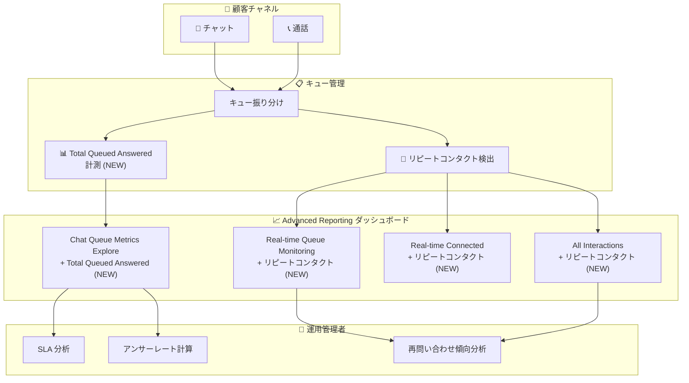

# Google Cloud Contact Center as a Service (CCaaS): チャットキューメトリクス改善とリピートコンタクトデータ追加

**リリース日**: 2026-04-03

**サービス**: Google Cloud Contact Center as a Service (CCaaS) / CCAI Platform

**機能**: Chat Queue Metrics Explore の新メトリクス、リピートコンタクトデータのダッシュボード追加、複数のバグ修正

**ステータス**: Feature / Fixed / Announcement

📊 [このアップデートのインフォグラフィックを見る](https://takech9203.github.io/google-cloud-news-summary/20260403-ccaas-chat-metrics-repeat-contacts.html)

## 概要

Google Cloud Contact Center as a Service (CCaaS) の Advanced Reporting ダッシュボードに対する複数のアップデートが発表された。主要な新機能として、Chat Queue Metrics Explore に「Total Queued Answered」メトリクスが追加され、キューから応答されたチャットの正確なカウントが可能になった。また、リピートコンタクトデータが複数のダッシュボードに統合され、顧客の再問い合わせパターンの可視化が強化された。

これらの機能追加に加えて、ダッシュボード名やお気に入り、時間間隔表示、Teams フィルタデータ、通話タイミング、エージェントアクティビティの帰属、履歴タイムスタンプ、CSAT カラム名変更、Channel Interval ドリルダウン、Queue Group Performance ハイライトなど、多岐にわたるバグ修正が行われた。コンタクトセンターの運用管理者やスーパーバイザーにとって、レポーティング精度と使い勝手が大幅に向上するアップデートである。

**アップデート前の課題**

- Chat Queue Metrics Explore では、キューから応答されたチャット数を正確に把握するための専用メトリクスがなく、標準の「handled」メトリクスでは SLA やアンサーレート計算の精度に限界があった
- リピートコンタクトデータがリアルタイムモニタリングや All Interactions ダッシュボードに表示されず、顧客の再問い合わせ傾向を横断的に把握することが困難だった
- ダッシュボード名やお気に入りの不整合、時間間隔の表示不具合、フィルタデータの誤りなど、日常的なレポーティング業務に支障をきたす複数の問題が存在していた

**アップデート後の改善**

- Total Queued Answered メトリクスにより、キューから応答されたチャットの正確な数を計測でき、SLA 達成率やアンサーレートの計算精度が向上した
- リピートコンタクトデータが Real-time Queue Monitoring、All Interactions、Real-time Connected の各ダッシュボード (Calls/Chats) に統合され、再問い合わせパターンをリアルタイムで把握可能になった
- 複数のバグ修正により、ダッシュボード全体の信頼性と操作性が改善された

## アーキテクチャ図

CCaaS の Advanced Reporting におけるデータフローを示す。顧客のチャット/通話がキューを通じて処理され、新しいメトリクスとリピートコンタクトデータが各ダッシュボードに反映される構成を表している。

## サービスアップデートの詳細

### 主要機能

1. **Total Queued Answered メトリクス (Chat Queue Metrics Explore)**
   - Chat Queue Metrics Explore に新たに「Total Queued Answered」メトリクスが追加された
   - キューから応答されたチャットの正確なカウントを提供する
   - 標準の「handled」メトリクスが適用しにくいケースで、正確な SLA 計算とアンサーレート計算を実現する
   - 「handled」メトリクスには直接割り当てやキュー外の処理も含まれるため、純粋にキュー経由で応答されたチャットを把握するには本メトリクスが適切である

2. **リピートコンタクトデータのダッシュボード統合**
   - 以下の Advanced Reporting ダッシュボードにリピートコンタクトデータが追加された:
     - Real-time Queue Monitoring (Calls)
     - Real-time Queue Monitoring (Chats)
     - All Interactions (Calls)
     - All Interactions (Chats)
     - Real-time Calls Connected
     - Real-time Chats Connected
   - リピートコンタクトは、設定された時間枠内に同一キューで複数のセッションを完了した顧客を追跡するメトリクスである
   - 設定は Settings > Operation Management > Target Metrics で行う

3. **複数のバグ修正**
   - ダッシュボード名およびお気に入り機能の不具合修正
   - 時間間隔 (Hourly Intervals) の表示不具合修正
   - Teams フィルタのデータ不整合修正
   - 通話タイミング (Call Timing) の計算不具合修正
   - Agent Activity の帰属 (Attribution) 不具合修正
   - 履歴タイムスタンプの表示不具合修正
   - CSAT カラムの名称変更に関する不具合修正
   - Channel Interval ダッシュボードのドリルダウン不具合修正
   - Queue Group Performance ダッシュボードのハイライト表示不具合修正

4. **Advance Reporting ダッシュボードのプレリリースノート**
   - 今後の Advanced Reporting ダッシュボードの更新に関するプレリリース情報が公開された

## 技術仕様

### メトリクス比較

| メトリクス | 対象範囲 | 用途 |
|-----------|---------|------|
| Total Handled Interactions | キュー経由 + 直接割り当て + キュー外処理を含むすべての対応 | 全体的な処理量の把握 |
| Total Queued Answered (NEW) | キューから応答されたチャットのみ | SLA 計算、アンサーレート計算 |

### リピートコンタクト設定

| 項目 | 詳細 |
|------|------|
| 設定場所 | Settings > Operation Management > Target Metrics |
| パラメータ | Repeat Contact Time Period |
| 検出条件 | 設定された時間枠内に同一キューで複数の着信セッションが完了した場合 |
| 対応チャネル | Calls、Chats |

### 対応ダッシュボード一覧 (リピートコンタクト)

| ダッシュボード | チャネル |
|---------------|---------|
| Real-time Queue Monitoring | Calls / Chats |
| All Interactions | Calls / Chats |
| Real-time Connected | Calls / Chats |

## 設定方法

### 前提条件

1. CCAI Platform インスタンスが Advanced Reporting 対応リージョン (us-east1、us-central1、us-west1、europe-west2、asia-northeast1、northamerica-northeast1、australia-southeast1) にデプロイされていること
2. Advanced Reporting 拡張機能が有効化されていること

### 手順

#### ステップ 1: Advanced Reporting の有効化 (未設定の場合)

1. Google Cloud コンソールで CCAI Platform インスタンスの詳細ページを開く
2. Edit > Configure extensions を選択
3. Extensions セクションで「Advanced reporting」チェックボックスを有効にして Save をクリック

#### ステップ 2: リピートコンタクト時間枠の設定

1. CCAI Platform ポータルで Settings > Operation Management に移動
2. Target Metrics セクションで「Repeat Contact Time Period」を設定
3. Set Metrics をクリックして保存

#### ステップ 3: ダッシュボードでの確認

1. CCAI Platform ポータルで Dashboard メニューから対象のダッシュボードを開く
2. Chat Queue Metrics Explore で Total Queued Answered メトリクスが表示されることを確認
3. Real-time Queue Monitoring 等のダッシュボードでリピートコンタクトデータが表示されることを確認

## メリット

### ビジネス面

- **SLA 管理の精度向上**: Total Queued Answered メトリクスにより、キュー応答に特化した正確な SLA 達成率を算出でき、サービスレベルの管理が厳密になる
- **顧客体験の可視化**: リピートコンタクトデータの横断的な把握により、顧客が繰り返し問い合わせるパターンを特定し、根本原因の解決に繋げられる
- **レポーティング信頼性の向上**: 多数のバグ修正により、日常的なダッシュボード運用における信頼性が大幅に向上した

### 技術面

- **メトリクスの正確性**: handled メトリクスでは含まれていたキュー外処理を除外し、純粋なキュー応答数を計測できるようになった
- **データ整合性**: Teams フィルタ、履歴タイムスタンプ、Agent Activity 帰属などの修正により、レポートデータの整合性が改善された
- **ダッシュボード操作性**: お気に入り、ドリルダウン、ハイライト表示の修正により、ダッシュボードの操作性が向上した

## デメリット・制約事項

### 制限事項

- Advanced Reporting ダッシュボードは特定のリージョン (us-east1、us-central1、us-west1、europe-west2、asia-northeast1、northamerica-northeast1、australia-southeast1) でのみ利用可能
- Advanced Reporting を有効化すると、レガシーの CCAI Platform ダッシュボードは利用できなくなる

### 考慮すべき点

- リピートコンタクトの検出は Target Metrics で設定した時間枠に依存するため、適切な時間枠の設定が重要である
- Total Queued Answered と Total Handled Interactions の差異を正しく理解し、用途に応じて使い分ける必要がある

## ユースケース

### ユースケース 1: チャットチームの SLA 精密管理

**シナリオ**: チャットサポートチームが、キュー経由で応答したチャットに基づく正確な SLA 達成率を算出したい。従来の handled メトリクスには、エスカレーションや直接割り当てなどキュー外の処理も含まれており、純粋なキュー応答のパフォーマンスを測定できなかった。

**効果**: Total Queued Answered メトリクスを使用することで、キューから応答されたチャットのみを対象とした SLA 達成率を正確に算出でき、チームのキュー対応パフォーマンスを厳密に評価できる。

### ユースケース 2: リピートコンタクト削減施策の効果測定

**シナリオ**: コンタクトセンターのマネージャーが、顧客の再問い合わせを削減するための施策 (FAQ の改善、エージェント研修など) を実施し、その効果をリアルタイムで測定したい。

**効果**: Real-time Queue Monitoring や All Interactions ダッシュボードのリピートコンタクトデータを活用して、施策実施前後のリピートコンタクト数の推移をリアルタイムで監視し、施策の有効性を迅速に評価できる。

## 料金

CCAI Platform の料金は、インスタンスに割り当てられた課金モデルに基づいて月額で請求される。課金モデルには以下の 3 種類がある:

- **Concurrent agents**: 月間の最大同時ログインエージェント数に基づく課金
- **Named agents**: エージェントロールを持つユーザーの最大数に基づく課金
- **Minutes used**: エージェントロールを持つユーザーのログイン時間 (分) に基づく課金

テレフォニー料金は別途、使用量に応じて課金される。非本番インスタンス (Trial、Sandbox、Dev) はテレフォニーを除き無料で利用可能。今回の Advanced Reporting 機能追加に伴う追加料金は発表されていない。

## 利用可能リージョン

Advanced Reporting ダッシュボードは以下のリージョンで利用可能:

- us-east1
- us-central1
- us-west1
- europe-west2
- asia-northeast1
- northamerica-northeast1
- australia-southeast1

## 関連サービス・機能

- **Dialogflow CX**: 仮想エージェントを作成し、定型的な問い合わせ対応を自動化する。CCAI Platform と統合して利用する
- **Agent Assist**: エージェントの通話/チャット中にリアルタイムでステップバイステップの支援を提供する
- **Customer Experience Insights**: 自然言語処理を用いて、問い合わせの要因、感情、よくある質問などを分析する
- **Cloud Monitoring**: CCAI Platform インスタンスのインフラストラクチャ監視に使用できる

## 参考リンク

- 📊 [インフォグラフィック](https://takech9203.github.io/google-cloud-news-summary/20260403-ccaas-chat-metrics-repeat-contacts.html)
- [公式リリースノート](https://cloud.google.com/release-notes#April_03_2026)
- [Advanced Reporting ダッシュボード概要](https://cloud.google.com/contact-center/ccai-platform/docs/dashboards-overview)
- [Real-time Queue Monitoring ダッシュボード](https://cloud.google.com/contact-center/ccai-platform/docs/dashboards-real-time-queue-monitor)
- [Queue Group Performance ダッシュボード](https://cloud.google.com/contact-center/ccai-platform/docs/dashboards-queue-group-perf)
- [Target Metrics 設定](https://cloud.google.com/contact-center/ccai-platform/docs/target-metrics)
- [CCAI Platform 概要](https://cloud.google.com/contact-center/ccai-platform/docs)

## まとめ

今回のアップデートは、CCAI Platform の Advanced Reporting ダッシュボードにおけるメトリクス精度の向上と運用機能の強化を実現するものである。特に Total Queued Answered メトリクスの追加は、チャットチームの SLA 管理を厳密化する上で重要な改善であり、リピートコンタクトデータの複数ダッシュボードへの統合は顧客体験分析の幅を広げる。コンタクトセンターの運用管理者は、これらの新機能を活用してレポーティングの精度と運用効率を向上させることが推奨される。

---

**タグ**: #GoogleCloud #CCaaS #CCAIPlatform #ContactCenter #AdvancedReporting #ChatMetrics #SLA #RepeatContacts #DashboardUpdate
