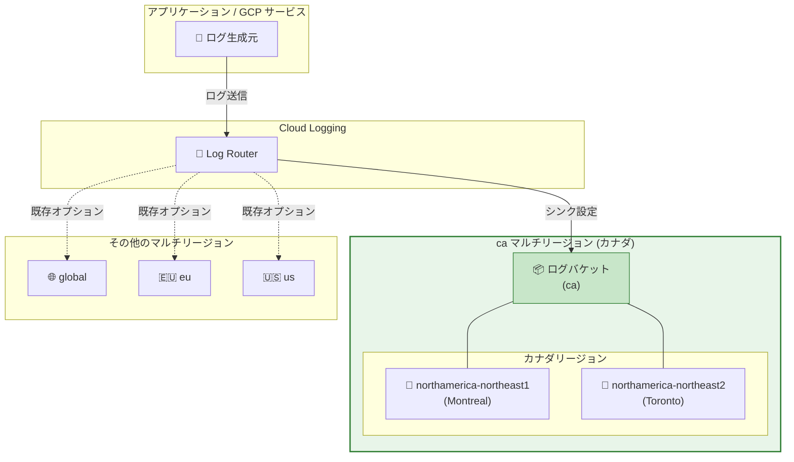

# Cloud Logging: "ca" マルチリージョンのサポート追加

**リリース日**: 2026-04-03

**サービス**: Cloud Logging

**機能**: "ca" (カナダ) マルチリージョンのサポート

**ステータス**: Announcement

📊 [このアップデートのインフォグラフィックを見る](https://takech9203.github.io/google-cloud-news-summary/20260403-cloud-logging-ca-multi-region.html)

## 概要

Cloud Logging に新たな "ca" マルチリージョンのサポートが追加された。"ca" マルチリージョンはカナダ国内のデータセンターにログデータを保存するためのロケーションオプションであり、カナダのデータレジデンシー要件を持つ組織にとって重要なアップデートとなる。

これまで Cloud Logging のマルチリージョンオプションは "global"、"eu" (欧州連合)、"us" (米国) の 3 種類のみであった。今回 "ca" (カナダ) が追加されたことで、カナダの個人情報保護法 (PIPEDA) やケベック州法 25 号 (Law 25) などのデータ主権規制に準拠しながら、マルチリージョンの利便性を活用できるようになった。

このアップデートは、カナダにビジネス拠点を持つ企業や、カナダ国内でのデータ保存が義務付けられている組織、またカナダのリージョン (northamerica-northeast1: Montreal、northamerica-northeast2: Toronto) を利用している顧客に特に有用である。

**アップデート前の課題**

- カナダ国内にログデータを保持するには、個別のリージョン (northamerica-northeast1 や northamerica-northeast2) を指定してログバケットを作成する必要があった
- カナダ国内の複数リージョンにまたがるログの統合管理をマルチリージョンレベルで行うオプションがなかった
- "eu" や "us" のようなマルチリージョンのデータレジデンシー保証をカナダ向けに利用できなかった

**アップデート後の改善**

- "ca" マルチリージョンを指定してログバケットを作成することで、ログデータがカナダ国内のデータセンターに保存されるようになった
- カナダ国内の複数リージョンをまとめたマルチリージョンレベルでのデータレジデンシーが実現された
- BigQuery のカナダマルチリージョンとのデータコロケーションが容易になった

## アーキテクチャ図



Cloud Logging の Log Router がログエントリをシンク設定に基づいて "ca" マルチリージョンのログバケットにルーティングする構成を示す。"ca" マルチリージョンはカナダ国内の northamerica-northeast1 (Montreal) と northamerica-northeast2 (Toronto) をカバーする。

## サービスアップデートの詳細

### 主要機能

1. **"ca" マルチリージョンロケーション**
   - ログバケット作成時に "ca" をロケーションとして指定可能
   - カナダ国内のデータセンターにログデータが保存される
   - "global"、"eu"、"us" に続く 4 番目のマルチリージョンオプション

2. **データレジデンシーの保証**
   - "ca" マルチリージョンを指定したログバケット内のデータはカナダ国内に保存される
   - カナダの個人情報保護規制への準拠を支援
   - 他のマルチリージョンと同様、追加の冗長性保証はリージョナルバケットと比較して提供されない

3. **BigQuery との連携**
   - BigQuery のカナダマルチリージョンにデータがある場合、"ca" マルチリージョンを使用してログデータをコロケーションできる
   - Observability Analytics を使用した SQL クエリでログデータと BigQuery データの統合分析が可能

## 技術仕様

### マルチリージョンの一覧 (更新後)

| マルチリージョン名 | 説明 |
|------|------|
| global | 世界中のデータセンターに保存。保存場所の指定不可 |
| eu | EU 加盟国内のデータセンターに保存 |
| us | 米国内のデータセンターに保存 |
| **ca (新規)** | **カナダ国内のデータセンターに保存** |

### カナダの個別リージョン (既存)

| リージョン名 | ロケーション |
|------|------|
| northamerica-northeast1 | Montreal |
| northamerica-northeast2 | Toronto |

## 設定方法

### 前提条件

1. Cloud Logging API が有効化されていること
2. ログバケットの作成権限 (`logging.buckets.create`) を持つ IAM ロールが付与されていること

### 手順

#### ステップ 1: "ca" マルチリージョンにログバケットを作成

```bash
gcloud logging buckets create BUCKET_ID \
  --location=ca \
  --project=PROJECT_ID
```

`BUCKET_ID` は任意のバケット名、`PROJECT_ID` はプロジェクト ID に置き換える。

#### ステップ 2: _Default シンクのルーティング先を変更

```bash
gcloud logging sinks update _Default \
  --project=PROJECT_ID \
  --log-bucket=projects/PROJECT_ID/locations/ca/buckets/BUCKET_ID
```

既存の _Default シンクの送信先を新しい "ca" マルチリージョンのバケットに変更する。

#### ステップ 3: ログバケットの確認

```bash
gcloud logging buckets list --project=PROJECT_ID
```

作成したバケットがリストに表示され、ロケーションが "ca" となっていることを確認する。

## メリット

### ビジネス面

- **カナダのデータ主権規制への準拠**: PIPEDA やケベック州法 25 号などの規制要件に対応するためのシンプルな手段を提供
- **ガバナンスの簡素化**: マルチリージョンレベルでカナダ国内へのデータ保存を指定できるため、個別リージョンを管理する手間が削減される

### 技術面

- **データコロケーション**: BigQuery のカナダマルチリージョンとログデータを同一ロケーションに配置でき、Observability Analytics の利用が容易になる
- **レイテンシの最適化**: カナダ国内のワークロードからのログ書き込み・読み取りのレイテンシが低減される可能性がある

## デメリット・制約事項

### 制限事項

- マルチリージョンのログバケットは、リージョナルバケットと比較して追加の冗長性保証を提供しない
- ログバケットの作成後にロケーションを変更することはできない。別のロケーションが必要な場合は新しいバケットを作成し、シンクをリダイレクトする必要がある
- global ロケーションでは Observability Analytics のデータ分析場所を選択できないため、"ca" マルチリージョンの使用が推奨される

### 考慮すべき点

- 既存の _Default バケットおよび _Required バケットは global ロケーションで自動作成される。カナダへのデータレジデンシーが必要な場合は、組織レベルでデフォルトストレージロケーションを "ca" に設定するか、新しいバケットを作成してシンクを変更する必要がある
- マルチリージョン間でのログデータの移動は発生しうるため、厳密なリージョン指定が必要な場合は個別リージョン (northamerica-northeast1 / northamerica-northeast2) の使用を検討すること

## ユースケース

### ユースケース 1: カナダの金融機関のコンプライアンス対応

**シナリオ**: カナダの金融機関が規制要件により、すべてのログデータをカナダ国内に保存する必要がある。

**実装例**:
```bash
# カナダマルチリージョンにログバケットを作成
gcloud logging buckets create compliance-logs \
  --location=ca \
  --project=my-finance-project \
  --retention-days=365

# _Default シンクのルーティング先を変更
gcloud logging sinks update _Default \
  --project=my-finance-project \
  --log-bucket=projects/my-finance-project/locations/ca/buckets/compliance-logs
```

**効果**: カナダ国内のデータレジデンシー要件を満たしつつ、マルチリージョンの利便性を享受できる。

### ユースケース 2: カナダ拠点のマルチリージョンアプリケーション

**シナリオ**: Montreal と Toronto の両方のリージョンにワークロードを展開しているアプリケーションで、統合的なログ管理を行いたい。

**効果**: "ca" マルチリージョンを使用することで、両リージョンのログを単一のマルチリージョンバケットに集約し、Logs Explorer や Observability Analytics で横断的に分析できる。

## 料金

Cloud Logging の料金は Google Cloud Observability の料金ページに記載されている。主な料金要素は以下の通りである。

| 項目 | 詳細 |
|--------|-----------------|
| ログ取り込み | 最初の 50 GiB/プロジェクト/月は無料。超過分は $0.50/GiB |
| ログストレージ (デフォルト保持期間内) | 無料 (_Default: 30 日、_Required: 400 日) |
| ログストレージ (カスタム保持期間) | デフォルト保持期間を超えた分は課金対象 |

マルチリージョンの種類による追加料金の有無については、[Google Cloud Observability の料金ページ](https://cloud.google.com/products/observability/pricing)を参照のこと。

## 利用可能リージョン

"ca" マルチリージョンはカナダ国内のデータセンターにデータを保存する。Cloud Logging がサポートする全リージョンの一覧は[サポートされるリージョン](https://cloud.google.com/logging/docs/region-support)のページを参照のこと。

## 関連サービス・機能

- **BigQuery**: "ca" マルチリージョンとのデータコロケーションにより、ログデータと業務データの統合分析が可能
- **Cloud Monitoring**: Cloud Logging と統合されたモニタリングサービス。ログベースの指標を使用してアラートやダッシュボードを構成できる
- **Observability Analytics**: ログバケットを Observability Analytics にアップグレードすることで、SQL を使用したログデータの分析が可能
- **Cloud Audit Logs**: 監査ログもログバケットに保存されるため、"ca" マルチリージョンを指定することでカナダ国内への監査ログ保存が実現できる

## 参考リンク

- 📊 [インフォグラフィック](https://takech9203.github.io/google-cloud-news-summary/20260403-cloud-logging-ca-multi-region.html)
- [公式リリースノート](https://cloud.google.com/release-notes#April_03_2026)
- [Cloud Logging サポートされるリージョン](https://cloud.google.com/logging/docs/region-support)
- [ログのリージョナライズ](https://cloud.google.com/logging/docs/regionalized-logs)
- [ログバケットの構成](https://cloud.google.com/logging/docs/buckets)
- [料金ページ](https://cloud.google.com/products/observability/pricing)

## まとめ

Cloud Logging に "ca" マルチリージョンが追加されたことで、カナダのデータレジデンシー要件を持つ組織がマルチリージョンレベルでログデータの保存場所を制御できるようになった。カナダ国内で事業を展開する組織は、既存のログバケット構成を確認し、規制要件に応じて "ca" マルチリージョンへの移行を検討することが推奨される。

---

**タグ**: #CloudLogging #マルチリージョン #カナダ #データレジデンシー #コンプライアンス #Observability
