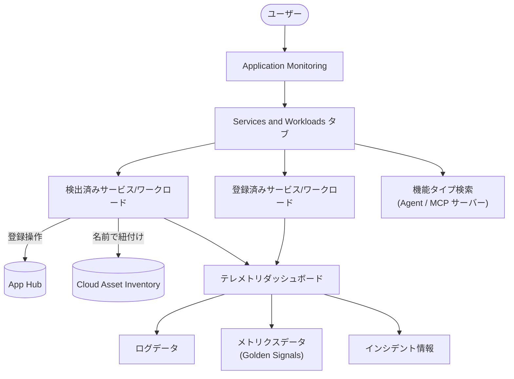

# Cloud Monitoring: Application Monitoring に Services and Workloads タブが追加

**リリース日**: 2026-04-03

**サービス**: Cloud Monitoring (Application Monitoring)

**機能**: Services and Workloads タブ

**ステータス**: Feature

[このアップデートのインフォグラフィックを見る](https://takech9203.github.io/google-cloud-news-summary/20260403-cloud-monitoring-services-workloads-tab.html)

## 概要

Google Cloud の Application Monitoring に新しい「Services and Workloads」タブが追加された。このタブでは、App Hub に登録済み (Registered) および自動検出済み (Discovered) のサービスとワークロードを一覧表示し、一元的に管理できる。

この機能により、ユーザーはサービスやワークロードの登録状態の確認、機能タイプ (Agent や MCP サーバーなど) による検索、テレメトリダッシュボードへの直接アクセスが可能になる。検出済みのサービスやワークロードについては、Cloud Asset Inventory の名前を使用して関連情報を自動的に特定する仕組みが導入されている。

対象ユーザーは、Google Cloud 上でアプリケーションの可観測性を管理する SRE、DevOps エンジニア、プラットフォームエンジニアである。特に複数のサービスやワークロードで構成されるマイクロサービスアーキテクチャを運用しているチームにとって有用な機能となる。

**アップデート前の課題**

- サービスやワークロードの一覧を確認するには、アプリケーションごとに個別のダッシュボードを開く必要があった
- 検出済みのサービスやワークロードを登録するには App Hub コンソールに移動する必要があった
- 機能タイプ (Agent、MCP サーバーなど) によるフィルタリングや検索ができなかった
- 検出済みサービスのテレメトリ情報と Cloud Asset Inventory の紐付けが手動作業だった

**アップデート後の改善**

- Application Monitoring 内の専用タブからサービスとワークロードの一覧を即座に確認できるようになった
- 検出済みのサービスやワークロードを同タブから直接登録できるようになった
- 機能タイプによる検索・フィルタリングが可能になり、目的のサービスを素早く特定できるようになった
- Cloud Asset Inventory の名前を活用した自動的な情報紐付けにより、検出済みサービスの関連テレメトリへのアクセスが容易になった

## アーキテクチャ図



Application Monitoring の Services and Workloads タブを中心としたデータフローを示す。ユーザーはタブから登録済み・検出済みのサービスを管理し、テレメトリダッシュボードで各種オブザーバビリティデータを確認できる。

## サービスアップデートの詳細

### 主要機能

1. **サービスとワークロードの一覧表示**
   - 登録済み (Registered) と検出済み (Discovered) の両方のサービスおよびワークロードをリスト形式で表示
   - 各サービス/ワークロードの登録ステータスを一目で確認可能
   - アプリケーション管理境界内のリソースを包括的に把握できる

2. **検出済みサービスの登録機能**
   - Services and Workloads タブから直接、検出済みのサービスやワークロードを App Hub アプリケーションに登録可能
   - 従来は App Hub コンソールへの遷移が必要だった操作をワンストップで完結
   - 登録時に criticality (重要度)、environment (環境) などの属性も設定可能

3. **機能タイプによる検索**
   - Agent、MCP サーバーなどの機能タイプでサービスやワークロードをフィルタリング
   - 大規模環境で特定のタイプのコンポーネントを素早く検索可能

4. **テレメトリダッシュボードへのアクセス**
   - 各サービス/ワークロードからテレメトリを表示するダッシュボードに直接遷移
   - ダッシュボードにはゴールデンシグナル (トラフィック、エラーレート、レイテンシ、飽和度) が表示される
   - 検出済みのサービス/ワークロードについては、Cloud Asset Inventory の名前を使用して関連情報を自動特定

## 技術仕様

### Application Monitoring のタブ構成

| タブ | 説明 |
|------|------|
| Overview | アプリケーションの概要、サービス/ワークロード一覧、オープンインシデント数、ゴールデンシグナル |
| Dashboard | テレメトリデータ (ゴールデンシグナル、ログ、トレース、インシデント) の詳細表示 |
| **Services and Workloads (新規)** | 登録済み・検出済みのサービス/ワークロードの一覧、検索、登録操作 |
| Topology (Preview) | アプリケーションのトポロジマップ、トラフィックの可視化 |

### サービス/ワークロードの登録ステータス

| ステータス | 説明 |
|------------|------|
| Discovered | App Hub の管理境界内で検出されたが、まだ登録されていないリソース |
| Registered | App Hub アプリケーションに登録済みのリソース |
| Detached | 登録されているが、基盤の Google Cloud リソースが管理境界外に移動した状態 |

### ゴールデンシグナル

| シグナル | 説明 |
|----------|------|
| Traffic | 選択期間中のサービス/ワークロードへの受信リクエストレート |
| Server error rate | 5xx HTTP レスポンスを生成するリクエストの平均割合 |
| P95 latency | リクエスト処理の 95 パーセンタイルレイテンシ (ミリ秒) |
| Saturation | サービス/ワークロードの飽和度 (例: CPU 使用率) |

## 設定方法

### 前提条件

1. App Hub のホストプロジェクトまたは管理プロジェクトが設定されていること
2. App Hub でアプリケーション管理境界が定義されていること
3. サービスやワークロードが Application Monitoring の対応インフラストラクチャ上で稼働していること

### 手順

#### ステップ 1: Application Monitoring ページにアクセス

Google Cloud コンソールで Application Monitoring ページに移動する。

```
Google Cloud コンソール > Monitoring > Application Monitoring
```

URL: `https://console.cloud.google.com/monitoring/applications`

#### ステップ 2: アプリケーションを選択

ツールバーで App Hub のホストプロジェクトまたは管理プロジェクトを選択し、対象のアプリケーション名をクリックする。

#### ステップ 3: Services and Workloads タブを選択

アプリケーションの詳細ビューで「Services and Workloads」タブを選択する。

#### ステップ 4: 検出済みサービスの登録 (必要に応じて)

検出済み (Discovered) のサービスやワークロードを選択し、アプリケーションに登録する。gcloud CLI を使用する場合:

```bash
# 検出済みサービスの一覧を確認
gcloud apphub discovered-services list \
  --project=PROJECT_ID \
  --location=REGION

# サービスをアプリケーションに登録
gcloud apphub applications services create SERVICE_NAME \
  --project=PROJECT_ID \
  --location=REGION \
  --application=APPLICATION_NAME \
  --discovered-service=projects/PROJECT_ID/locations/REGION/discoveredServices/SERVICE_ID \
  --display-name=SERVICE_DISPLAY_NAME
```

## メリット

### ビジネス面

- **運用効率の向上**: サービスとワークロードの管理を Application Monitoring 内で完結でき、ツール間の遷移が減少する
- **可視性の向上**: 登録済み・検出済みのサービスを一覧で把握でき、管理漏れを防止できる

### 技術面

- **ワンストップ管理**: 検出から登録、テレメトリ確認までを同一画面で実施可能
- **高度な検索機能**: 機能タイプによるフィルタリングにより、大規模環境でも目的のコンポーネントを迅速に特定できる
- **Cloud Asset Inventory 連携**: 検出済みサービスの識別に Cloud Asset Inventory の名前を活用し、テレメトリデータとの紐付けを自動化

## デメリット・制約事項

### 制限事項

- App Hub でアプリケーション管理境界を事前に設定する必要がある
- Application Monitoring の対応インフラストラクチャ上で稼働するサービス/ワークロードのみが対象 (対応リソースは公式ドキュメントを参照)
- テレメトリダッシュボードのゴールデンシグナル表示には、対応インフラストラクチャからのデータ生成が必要

### 考慮すべき点

- 検出済みサービスの登録には適切な IAM 権限が必要
- 大量のサービス/ワークロードがある環境では、機能タイプによる分類を事前に整理しておくと効果的

## ユースケース

### ユースケース 1: マイクロサービス環境の可観測性管理

**シナリオ**: 50 以上のマイクロサービスで構成されるアプリケーションを運用しており、各サービスのテレメトリ確認に時間がかかっている。

**効果**: Services and Workloads タブで全サービスを一覧表示し、機能タイプで Agent サービスや MCP サーバーをフィルタリングすることで、問題の切り分けを迅速に行える。

### ユースケース 2: 新規デプロイされたサービスの登録と監視開始

**シナリオ**: 新しいサービスをデプロイした後、App Hub で検出されたサービスを素早く登録してテレメトリの監視を開始したい。

**効果**: Services and Workloads タブで検出済みサービスを確認し、その場で登録操作を行い、テレメトリダッシュボードにアクセスして稼働状況を即座に確認できる。

## 料金

Cloud Monitoring (Application Monitoring) の料金については、Google Cloud Observability の料金体系に準じる。Application Monitoring のダッシュボード利用自体には追加料金は発生しないが、収集されるメトリクス、ログ、トレースのデータ量に応じて課金される。

詳細は [Google Cloud Observability の料金ページ](https://cloud.google.com/products/observability/pricing) を参照。

## 関連サービス・機能

- **App Hub**: サービスとワークロードの登録・管理の基盤となるサービス。Application Monitoring は App Hub の情報を活用してダッシュボードを構築する
- **Cloud Asset Inventory**: 検出済みサービスの識別に使用される。Cloud Asset Inventory の名前を基に関連テレメトリ情報を特定する
- **Cloud Logging**: Application Monitoring のダッシュボードで表示されるログデータの基盤
- **Cloud Trace**: アプリケーションのトレースデータの収集・表示に使用
- **Application Design Center**: アプリケーションの設計・デプロイを支援し、App Hub と連携して Application Monitoring での監視につなげる

## 参考リンク

- [インフォグラフィック](https://takech9203.github.io/google-cloud-news-summary/20260403-cloud-monitoring-services-workloads-tab.html)
- [公式リリースノート](https://cloud.google.com/release-notes#April_03_2026)
- [Application Monitoring の概要](https://cloud.google.com/monitoring/docs/about-application-monitoring)
- [Application Monitoring ダッシュボードの使用方法](https://cloud.google.com/monitoring/docs/application-monitoring)
- [サービスとワークロードの一覧表示](https://cloud.google.com/monitoring/docs/application-monitoring-services)
- [App Hub でサービスとワークロードを登録する](https://cloud.google.com/app-hub/docs/register-resources)
- [Cloud Asset Inventory の概要](https://cloud.google.com/asset-inventory/docs/asset-inventory-overview)
- [Google Cloud Observability 料金](https://cloud.google.com/products/observability/pricing)

## まとめ

Application Monitoring への Services and Workloads タブの追加は、Google Cloud 上のアプリケーション可観測性のワークフローを大幅に改善するアップデートである。サービスの検出・登録・テレメトリ確認をワンストップで行えるようになり、特にマイクロサービスアーキテクチャを運用するチームの運用効率が向上する。App Hub を活用している環境では、このタブを積極的に利用してサービスの可視性を高めることを推奨する。

---

**タグ**: #CloudMonitoring #ApplicationMonitoring #AppHub #Observability #CloudAssetInventory #GoogleCloud
