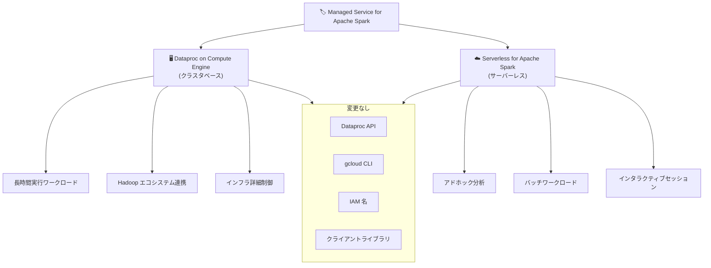

# Dataproc: Managed Service for Apache Spark ブランド統合

**リリース日**: 2026-04-03

**サービス**: Dataproc

**機能**: Managed Service for Apache Spark ブランド統合

**ステータス**: Announcement

📊 [このアップデートのインフォグラフィックを見る](https://takech9203.github.io/google-cloud-news-summary/20260403-dataproc-managed-service-apache-spark.html)

## 概要

Google Cloud は、Dataproc と Google Cloud Serverless for Apache Spark を「Managed Service for Apache Spark」という単一のアンブレラブランドに統合することを発表した。これにより、Google Cloud が提供するマネージド Spark デプロイメントオプションが 1 つのブランド名の下に集約され、Spark 関連の機能群がより分かりやすく整理される。

今回の変更はブランディングのみの変更であり、既存の機能が削除されることはない。Dataproc API、クライアントライブラリ、CLI、IAM の名称にも影響はなく、既存のワークロードやインテグレーションはそのまま継続して利用できる。Solutions Architect やデータエンジニアにとっては、サービス選定時の理解が容易になるメリットがある。

**アップデート前の課題**

- Dataproc (クラスタベース) と Serverless for Apache Spark (サーバーレス) が別々のブランドとして提供されており、Google Cloud の Spark サービスの全体像が把握しにくかった
- 新規ユーザーが Spark ワークロードを実行する際に、どのサービスを選べばよいか分かりにくい場合があった
- ドキュメントやマーケティング資料でサービス名が分散しており、統一的なメッセージングが困難だった

**アップデート後の改善**

- 「Managed Service for Apache Spark」という統一ブランドにより、Google Cloud の Spark 機能群の全体像が明確になった
- クラスタベース (Dataproc on Compute Engine) とサーバーレス (Serverless for Apache Spark) の両方が 1 つのブランドに集約された
- 既存の API、CLI、IAM 名は変更なし。移行作業やコード変更は一切不要

## アーキテクチャ図

新しい「Managed Service for Apache Spark」ブランドは、既存の Dataproc on Compute Engine と Serverless for Apache Spark を包含するアンブレラブランドである。API や CLI などの技術的なインターフェースには一切変更がない。

## サービスアップデートの詳細

### 主要機能

1. **ブランド統合**
   - Dataproc と Serverless for Apache Spark が「Managed Service for Apache Spark」として 1 つのブランドに統合
   - Google Cloud のマネージド Spark 機能の全範囲をカバー

2. **Dataproc on Compute Engine (クラスタベース)**
   - Spark クラスターをサービスとして提供し、Compute Engine インフラ上でマネージド Spark を実行
   - クラスタの稼働時間に基づく課金
   - Hadoop、Hive、Flink、Trino、Kafka 等のオープンソースフレームワークをサポート
   - カスタムマシンタイプ、ディスクサイズ、ネットワーク設定の詳細制御が可能

3. **Serverless for Apache Spark (サーバーレス)**
   - Spark ジョブをサービスとして提供し、フルマネージドの Google Cloud インフラ上で実行
   - ジョブ実行時間に基づく課金 (Data Compute Units)
   - 起動時間約 50 秒、オートスケーリング対応
   - PySpark、Spark SQL、Spark R、Spark (Java/Scala) のバッチワークロードとインタラクティブセッションをサポート

## 技術仕様

### Dataproc on Compute Engine と Serverless for Apache Spark の比較

| 項目 | Dataproc on Compute Engine | Serverless for Apache Spark |
|------|---------------------------|----------------------------|
| 管理モデル | クラスタベース (ユーザーがプロビジョニング) | フルマネージド、サーバーレス |
| 起動時間 | 約 120 秒 | 約 50 秒 |
| GPU サポート | あり | あり |
| インタラクティブセッション | なし | あり |
| カスタムコンテナ | なし | あり |
| SSH アクセス | あり | なし |
| リソース管理 | YARN | サーバーレス |
| 課金モデル | クラスタ稼働時間ベース | ジョブ実行時間ベース (DCU) |

### 変更の影響範囲

| 項目 | 影響 |
|------|------|
| Dataproc API | 変更なし |
| gcloud CLI | 変更なし |
| クライアントライブラリ | 変更なし |
| IAM ロール/権限名 | 変更なし |
| 既存ワークロード | 影響なし |
| 課金体系 | 変更なし |

## メリット

### ビジネス面

- **統一されたブランド認知**: 「Managed Service for Apache Spark」という一貫したブランドにより、組織内での Google Cloud Spark サービスの理解と採用が促進される
- **サービス選定の簡素化**: クラスタベースとサーバーレスの選択肢が 1 つのブランドの下で整理され、ワークロードに最適なデプロイメントオプションを選びやすくなる

### 技術面

- **ゼロインパクト移行**: API、CLI、IAM 名に変更がないため、コード変更や設定変更が一切不要
- **既存機能の完全維持**: すべての既存機能がそのまま利用可能。ブランド統合による機能削除はない

## デメリット・制約事項

### 制限事項

- 今回の変更はブランディングのみであり、新しい技術的機能の追加は含まれない
- API やリソース名は旧来の Dataproc ベースの名前のまま維持されるため、ブランド名と API 名の間に一時的な不一致が生じる可能性がある

### 考慮すべき点

- 社内ドキュメントやトレーニング資料で Dataproc や Serverless for Apache Spark を参照している場合、新ブランド名への更新を検討する必要がある
- 今後のドキュメントやコンソール UI が段階的に新ブランド名に移行する可能性があるため、変更を注視しておく必要がある

## ユースケース

### ユースケース 1: 新規 Spark プロジェクトのサービス選定

**シナリオ**: データエンジニアリングチームが新しい Spark ベースのデータパイプラインを構築する際に、Managed Service for Apache Spark の中から最適なデプロイメントオプションを選択する。

**効果**: 統一ブランドにより、クラスタベース (長期運用、Hadoop エコシステム連携が必要な場合) とサーバーレス (アドホック分析、バッチ処理が中心の場合) の比較が容易になり、プロジェクト要件に合った選択をスムーズに行える。

### ユースケース 2: 既存 Dataproc ユーザーの継続利用

**シナリオ**: 既に Dataproc クラスタで大規模な Spark ワークロードを運用しているチームが、ブランド変更の影響を確認する。

**効果**: API、CLI、IAM 名に変更がないため、既存のインフラストラクチャコード (Terraform、Deployment Manager 等) やアプリケーションコードの修正は不要。運用への影響ゼロで新ブランド体制に移行できる。

## 料金

ブランド統合に伴う料金体系の変更はない。既存の料金モデルがそのまま適用される。

- **Dataproc on Compute Engine**: vCPU あたり 1 セント/時間の Dataproc ライセンス料 + Compute Engine インフラ費用。秒単位課金 (最低 1 分)
- **Serverless for Apache Spark**: ジョブ実行中に消費された Data Compute Units (DCU) ベースの課金。起動・シャットダウン時間は課金対象外

詳細は [Dataproc 料金ページ](https://cloud.google.com/dataproc/pricing) および [Serverless for Apache Spark 料金ページ](https://cloud.google.com/dataproc-serverless/pricing) を参照。

## 利用可能リージョン

Dataproc は Google Cloud の全リージョン・全ゾーンで利用可能。Serverless for Apache Spark もリージョナルワークロードをサポートしている。リージョン構成に関するブランド変更による影響はない。

## 関連サービス・機能

- **BigQuery**: Spark-BigQuery コネクタにより、BigQuery データに対する Spark 処理が可能。BigQuery Studio ノートブックから Serverless for Apache Spark のインタラクティブセッションを利用可能
- **Cloud Composer**: Airflow ワークフロー内で Serverless for Apache Spark のバッチワークロードをスケジュール実行可能
- **Cloud Storage**: Dataproc クラスタおよび Serverless for Apache Spark のデータストレージとして利用
- **Dataproc Metastore**: Apache Hive メタストアのマネージドサービス。Dataproc クラスタや他の処理エンジンとテーブルメタデータを共有
- **Cloud Monitoring / Cloud Logging**: Spark ワークロードのモニタリングとログ管理

## 参考リンク

- 📊 [インフォグラフィック](https://takech9203.github.io/google-cloud-news-summary/20260403-dataproc-managed-service-apache-spark.html)
- [公式リリースノート](https://cloud.google.com/release-notes#April_03_2026)
- [Dataproc 概要ドキュメント](https://cloud.google.com/dataproc/docs/concepts/overview)
- [Serverless for Apache Spark 概要](https://cloud.google.com/dataproc-serverless/docs/overview)
- [Dataproc と Serverless for Apache Spark の比較](https://cloud.google.com/dataproc-serverless/docs/concepts/dataproc-compare)
- [Dataproc 料金ページ](https://cloud.google.com/dataproc/pricing)
- [Serverless for Apache Spark 料金ページ](https://cloud.google.com/dataproc-serverless/pricing)

## まとめ

今回のブランド統合は、Google Cloud のマネージド Spark サービスの分かりやすさを向上させるための変更であり、既存の機能や API に影響を与えるものではない。既存ユーザーはコード変更なしでそのまま利用を継続でき、新規ユーザーは「Managed Service for Apache Spark」を起点にクラスタベースとサーバーレスの最適な選択肢を見つけやすくなる。社内ドキュメントやトレーニング資料の更新を計画的に進めておくことを推奨する。

---

**タグ**: #Dataproc #Apache-Spark #Serverless-for-Apache-Spark #Managed-Service-for-Apache-Spark #ブランド統合 #BigData
