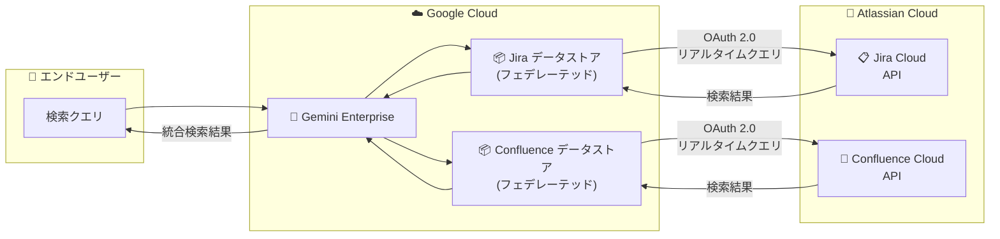

# Gemini Enterprise: Jira / Confluence フェデレーテッドコネクタが GA

**リリース日**: 2026-04-03

**サービス**: Gemini Enterprise

**機能**: Jira Cloud / Confluence Cloud フェデレーテッドコネクタ

**ステータス**: GA (一般提供)

📊 [このアップデートのインフォグラフィックを見る](https://takech9203.github.io/google-cloud-news-summary/20260403-gemini-enterprise-jira-confluence-connectors.html)

## 概要

Gemini Enterprise において、Jira Cloud および Confluence Cloud のフェデレーテッドコネクタが一般提供 (GA) となった。これにより、Atlassian のプロジェクト管理ツール (Jira) およびナレッジベース (Confluence) のデータを、Gemini Enterprise のエンタープライズ検索基盤からリアルタイムに検索できるようになる。

フェデレーテッド検索は、データを Google Cloud 側にコピー (インジェスト) せず、Atlassian API を介して直接データソースを検索する方式である。データの二重管理が不要であり、常に最新のデータに対して検索が実行される点が特徴となる。これまでパブリックプレビューとして提供されていたこの機能が GA に昇格したことで、本番ワークロードでの利用がサポートされ、SLA の対象となる。

対象ユーザーは、Jira Cloud や Confluence Cloud を利用する組織で、Google Cloud の Gemini Enterprise を導入している、もしくは導入を検討しているエンタープライズ顧客である。特にソフトウェア開発チーム、プロダクトマネジメント、IT 運用など、Atlassian 製品を日常的に活用する部門にとって大きな価値がある。

**アップデート前の課題**

- Jira や Confluence のデータを Gemini Enterprise から検索するには、フェデレーテッドコネクタがパブリックプレビューの段階であり、本番ワークロードでの利用には SLA が保証されなかった
- エンタープライズ検索で Atlassian のデータを横断的に検索するには、データインジェスト方式を使用する必要があり、データの同期やストレージコストが発生していた
- 開発者やプロダクトマネージャーが Jira のイシューや Confluence のドキュメントを探す際に、ツールを切り替えて個別に検索する必要があった

**アップデート後の改善**

- Jira Cloud / Confluence Cloud フェデレーテッドコネクタが GA となり、本番環境での利用が SLA 付きでサポートされるようになった
- データをインジェストせずにリアルタイムでフェデレーテッド検索が可能となり、データストレージコストが不要になった
- Gemini Enterprise の統合検索インターフェースから、Google Workspace のデータに加えて Jira イシューや Confluence ドキュメントも一元的に検索できるようになった

## アーキテクチャ図



Gemini Enterprise のフェデレーテッドコネクタは、ユーザーの検索クエリを Atlassian API に直接送信し、リアルタイムで結果を取得して統合的に表示する。データは Google Cloud 側にコピーされず、常にソース側の最新データが検索対象となる。

## サービスアップデートの詳細

### 主要機能

1. **Jira Cloud フェデレーテッドコネクタ**
   - Jira Cloud のイシュー、プロジェクト、コメント、添付ファイル、ワークログなどのエンティティをリアルタイムに検索可能
   - OAuth 2.0 による認証で、`read:jira-user` および `read:jira-work` スコープを使用
   - パーミッション対応の検索により、ユーザーがアクセス権を持つデータのみが結果に表示される

2. **Confluence Cloud フェデレーテッドコネクタ**
   - Confluence Cloud のページ、スペース、コメントなどのエンティティをリアルタイムに検索可能
   - OAuth 2.0 による認証、もしくは API トークンによる認証に対応
   - アイデンティティプロバイダーの設定によるアクセス制御が可能

3. **フェデレーテッド検索とアクション**
   - 検索だけでなく、Jira のイシュー更新やコメント追加などのアクションも実行可能 (アクション機能には `write:jira-work` スコープが必要)
   - Gemini Enterprise の LLM がクエリを書き換えて、より精度の高い検索結果を返すことが可能

## 技術仕様

### 接続モードの比較

| 項目 | フェデレーテッド検索 (今回 GA) | データインジェスト |
|------|-------------------------------|-------------------|
| データ保存先 | Atlassian Cloud (ソース側) | Vertex AI Search インデックス |
| 検索精度 | ソース側 API の検索品質に依存 | インデックス化により高品質 |
| データ鮮度 | リアルタイム | 同期スケジュールに依存 |
| ストレージコスト | 不要 | エディションごとのプール容量を消費 |
| セットアップ | OAuth 2.0 認証のみ | OAuth 2.0 + 同期スケジュール設定 |

### 認証設定

| 項目 | Jira Cloud | Confluence Cloud |
|------|-----------|-----------------|
| 認証方式 | OAuth 2.0 | OAuth 2.0 / API トークン |
| 必要な情報 | Client ID, Client Secret, Instance URI, Instance ID | Client ID, Client Secret, Instance URI |
| 必要なスコープ (検索のみ) | `read:jira-user`, `read:jira-work` | OAuth 2.0 スコープ (Confluence 設定に準じる) |
| 必要なスコープ (検索 + アクション) | `read:jira-user`, `read:jira-work`, `write:jira-work` | OAuth 2.0 スコープ (Confluence 設定に準じる) |

### 必要な IAM ロール

```
roles/discoveryengine.editor  # データストア作成に必要
roles/discoveryengine.admin   # 管理者操作に必要
```

## 設定方法

### 前提条件

1. Gemini Enterprise のサブスクリプション (Standard、Plus、または Frontline) が有効であること
2. Atlassian Cloud の管理者権限 (OAuth 2.0 アプリの作成が可能なこと)
3. Discovery Engine Editor ロール (`roles/discoveryengine.editor`) がユーザーに付与されていること
4. アイデンティティプロバイダーが設定済みであること (アクセス制御のため)

### 手順

#### ステップ 1: Atlassian 側で OAuth 2.0 アプリを作成

Atlassian Developer Console で OAuth 2.0 アプリを作成し、Client ID と Client Secret を取得する。最小限のアプリケーションパーミッションを設定する。

#### ステップ 2: Gemini Enterprise でデータストアを作成

```
Google Cloud Console > Gemini Enterprise > Data stores > Create data store
```

1. ソースセクションで「Jira Cloud」または「Confluence Cloud」を選択
2. コネクタモードで「Federated search」を選択
3. 認証設定で Client ID、Client Secret、Instance URI を入力
4. 「Login」をクリックして Atlassian サインインを完了
5. 検索対象のエンティティを選択
6. データストア名を入力して作成を完了

#### ステップ 3: アプリに接続

```
Google Cloud Console > Gemini Enterprise > Apps > アプリを選択 > データストアを接続
```

作成したデータストアを既存の Gemini Enterprise アプリに接続する。

## メリット

### ビジネス面

- **統合検索による生産性向上**: Jira のイシューや Confluence のドキュメントを Gemini Enterprise から直接検索でき、ツール間の切り替えが不要になる
- **データガバナンスの維持**: フェデレーテッド方式によりデータは Atlassian Cloud 側に保持されるため、データの複製に伴うガバナンスリスクが軽減される
- **GA による信頼性の保証**: SLA 対象となり、本番ワークロードでの利用が正式にサポートされる

### 技術面

- **リアルタイム検索**: データのインジェストや同期の待ち時間なく、常に最新のデータを検索可能
- **パーミッション対応**: ユーザーのアクセス権限に基づいたフィルタリングにより、セキュリティを確保
- **ストレージ不要**: Vertex AI Search のインデックスストレージを消費しないため、エディションごとのストレージクォータを節約可能

## デメリット・制約事項

### 制限事項

- フェデレーテッド検索はデータをインデックス化しないため、データインジェスト方式と比較して検索品質が劣る可能性がある
- クエリは Atlassian API に送信されるため、Atlassian 側の利用規約とプライバシーポリシーが適用される
- LLM によるクエリ書き換え時に、セッション内のクエリ履歴の一部が Atlassian API に送信される可能性がある

### 考慮すべき点

- Confluence Cloud の設定には新しい集中型 Atlassian ユーザー管理モデルが必要であり、旧モデルを使用している場合は移行が必要
- OAuth 2.0 のスコープ設定を最小限に抑えるセキュリティベストプラクティスに従うことが推奨される
- 複数のフェデレーテッド検索データソースが有効な場合、クエリがすべてのデータソースに送信される可能性がある

## ユースケース

### ユースケース 1: ソフトウェア開発チームのナレッジ検索

**シナリオ**: 開発者がバグ修正に取り組む際、関連する Jira イシューの履歴と Confluence の設計ドキュメントを同時に検索したい。

**効果**: Gemini Enterprise の統合検索から「認証モジュール タイムアウトエラー」と検索するだけで、関連する Jira イシュー、過去の修正履歴、Confluence の設計ドキュメントが一覧で表示される。ツール間の切り替えが不要となり、問題解決までの時間を短縮できる。

### ユースケース 2: プロダクトマネージャーのプロジェクト状況把握

**シナリオ**: プロダクトマネージャーが複数プロジェクトの進捗状況を横断的に確認し、ステークホルダーへの報告資料を作成したい。

**効果**: Gemini Enterprise からプロジェクト名やマイルストーンで検索し、Jira のスプリント進捗と Confluence の議事録・仕様書を統合的に把握できる。Gemini の AI 機能と組み合わせることで、情報の要約やレポート作成も効率化される。

## 料金

Gemini Enterprise のフェデレーテッドコネクタは、Gemini Enterprise サブスクリプションの一部として提供される。フェデレーテッド検索方式ではデータのインジェストが発生しないため、エディションごとのストレージクォータを消費しない。

### エディション別ストレージ容量

| エディション | ストレージ容量 (ユーザーあたり/月) |
|-------------|----------------------------------|
| Gemini Enterprise Business | 25 GiB (プール) |
| Gemini Enterprise Standard | 30 GiB (プール) |
| Gemini Enterprise Plus | 75 GiB (プール) |
| Gemini Enterprise Frontline | 2 GiB (プール) |

詳細な料金については [Gemini Enterprise の料金ページ](https://cloud.google.com/gemini-enterprise/pricing) を参照。

## 利用可能リージョン

Gemini Enterprise はグローバル、US、EU のマルチリージョンで利用可能。ライセンスはプロジェクトとロケーションに紐づくため、複数リージョンで利用する場合は各リージョンに対して個別のライセンスが必要。詳細は [Gemini Enterprise のロケーション](https://cloud.google.com/gemini/enterprise/docs/locations) を参照。

## 関連サービス・機能

- **Vertex AI Search**: Gemini Enterprise のバックエンドとして機能し、フェデレーテッド検索およびデータインジェストの基盤を提供する
- **Cloud Logging**: Gemini Enterprise コネクタのエラーログを Cloud Logging で監視可能。フェデレーテッドコネクタのエラー診断に活用できる
- **Identity and Access Management (IAM)**: Discovery Engine Editor / Admin ロールによるアクセス制御と、アイデンティティプロバイダー連携によるデータソースのアクセス制御を提供
- **他のサードパーティコネクタ**: Microsoft SharePoint、Box、Google Drive など、他のデータソースとの統合も Gemini Enterprise のコネクタエコシステムで提供されている

## 参考リンク

- 📊 [インフォグラフィック](https://takech9203.github.io/google-cloud-news-summary/20260403-gemini-enterprise-jira-confluence-connectors.html)
- [公式リリースノート](https://cloud.google.com/release-notes#April_03_2026)
- [Jira Cloud コネクタの設定ドキュメント](https://cloud.google.com/gemini/enterprise/docs/connectors/jira-cloud/set-up-data-store)
- [Confluence Cloud コネクタの設定ドキュメント](https://cloud.google.com/gemini/enterprise/docs/connectors/confluence-cloud/set-up-data-store)
- [Gemini Enterprise コネクタ概要](https://cloud.google.com/gemini/enterprise/docs/connectors/introduction-to-connectors-and-data-stores)
- [Gemini Enterprise エディション比較](https://cloud.google.com/gemini/enterprise/docs/editions)

## まとめ

Gemini Enterprise の Jira Cloud / Confluence Cloud フェデレーテッドコネクタが GA となったことで、Atlassian 製品のデータを本番環境で安心してエンタープライズ検索に統合できるようになった。フェデレーテッド方式はデータの複製が不要でリアルタイム検索が可能なため、データガバナンスを維持しつつ生産性を向上させたい組織に適している。Atlassian 製品を活用する組織では、Gemini Enterprise との連携を検討し、統合検索基盤の構築を進めることを推奨する。

---

**タグ**: #GeminiEnterprise #JiraCloud #ConfluenceCloud #FederatedSearch #Connectors #GA #EnterpriseSearch #Atlassian
