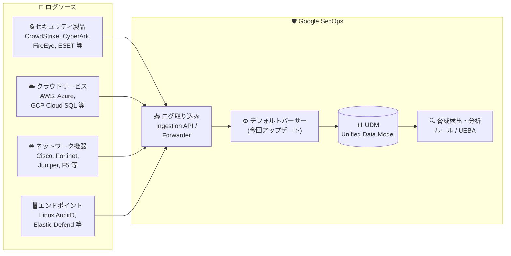

# Google SecOps: デフォルトパーサー大規模アップデート (2026年4月)

**リリース日**: 2026-04-03

**サービス**: Google SecOps (Security Operations)

**機能**: デフォルトパーサーの一括アップデート

**ステータス**: Change

📊 [このアップデートのインフォグラフィックを見る](https://takech9203.github.io/google-cloud-news-summary/20260403-google-secops-parser-updates-april.html)

## 概要

Google SecOps がサポートするデフォルトパーサーの大規模アップデートが実施された。デフォルトパーサーは、各種セキュリティ製品やクラウドサービスから取り込まれた生ログを Unified Data Model (UDM) 形式に正規化するためのプリビルト構成であり、今回のアップデートではセキュリティ、クラウド、ネットワーク、エンドポイントなど幅広いカテゴリにわたる多数のパーサーが更新された。

対象となるパーサーは、Abnormal Security、AWS 関連 (Aurora/CloudFront/CloudTrail/CloudWatch/VPC Flow/WAF)、Azure 関連 (AD/Front Door/SQL)、Cisco 関連 (ASA/Email Security/ISE/Meraki/Secure Access/Switch/Umbrella/WSA)、CrowdStrike、Fortinet、Kubernetes など、エンタープライズ環境で広く利用されるログソースを網羅している。パーサーの更新は段階的に適用され、リージョンへの反映には 1～4 日程度を要する。

このアップデートは Google SecOps の SIEM 機能を利用するすべてのユーザーに影響し、ログの正規化精度とカバレッジの向上が期待される。

**アップデート前の課題**

- 一部のログソースにおいて、フォーマット変更やフィールド追加に対応しきれずパースエラーが発生する可能性があった
- 各ベンダーのログ形式の更新に対し、UDM へのマッピングが最新の状態に追従できていなかった
- セキュリティ分析に必要なフィールドが一部正規化されていないケースがあった

**アップデート後の改善**

- 多数のパーサーが最新のログフォーマットに対応し、パースエラーのリスクが低減
- UDM フィールドへのマッピング精度が向上し、より正確な脅威検出・分析が可能に
- 新しいログフィールドやイベントタイプのサポートが追加された可能性がある

## アーキテクチャ図



デフォルトパーサーは生ログを UDM 形式に正規化する中核コンポーネントであり、今回のアップデートにより幅広いログソースからの取り込み精度が向上する。

## サービスアップデートの詳細

### 主要な更新対象パーサー

今回のアップデートでは、以下のカテゴリにわたる多数のパーサーが更新された。

1. **セキュリティ製品**
   - Abnormal Security、AI Hunter、BeyondTrust、Check Point Harmony、CrowdStrike、CyberArk、Cybereason、ESET、FireEye、Forescout、Imperva、Kolide、McAfee

2. **クラウドサービス (AWS)**
   - AWS Aurora、AWS CloudFront、AWS CloudTrail、AWS CloudWatch、AWS VPC Flow Logs、AWS WAF

3. **クラウドサービス (Azure)**
   - Azure AD、Azure Front Door、Azure SQL

4. **クラウドサービス (GCP)**
   - Cloud SQL、Google Threat Intelligence

5. **ネットワーク / インフラストラクチャ**
   - Aruba、Blue Coat Proxy、Cisco ASA / Email Security / ISE / Meraki / Secure Access / Switch / Umbrella / WSA、F5、Fortinet、HP Aruba ClearPass、Huawei、Juniper

6. **認証 / ID 管理**
   - Auth0、Duo Auth、ForgeRock、IBM

7. **プラットフォーム / アプリケーション**
   - AIX System、Apache、Cassandra、Chronicle SOAR Audit、Cloudflare、Code42、Databricks、Elastic Defend、GitHub、Kubernetes、Linux AuditD、MariaDB

### パーサー更新の適用プロセス

- パーサーは段階的にロールアウトされる
- リージョンへの反映には **1～4 日**を要する
- 更新は**新規取り込みログにのみ適用**され、既に取り込み済みのログには遡及適用されない
- 自動更新が有効な場合、自動的に最新バージョンが適用される

## 技術仕様

### パーサーの仕組み

| 項目 | 詳細 |
|------|------|
| 入力形式 | CSV, JSON, SYSLOG, KV, XML, LEEF, CEF など |
| 出力形式 | Unified Data Model (UDM) |
| 適用範囲 | 新規取り込みログのみ (遡及適用なし) |
| ロールアウト期間 | 1～4 日 (段階的) |
| 更新方式 | 自動更新 (デフォルト) / 手動更新 |

### パーサー管理オプション

| 操作 | 説明 |
|------|------|
| 自動更新の有効化/無効化 | Settings > SIEM Settings > Parsers から設定 |
| 手動更新 | 最新バージョンとの差分を確認してから適用可能 |
| カスタムパーサー作成 | プリビルトパーサーの更新をスキップし、独自のパーサーを利用可能 |
| パーサー拡張 | デフォルトパーサーに追加のマッピングルールを定義可能 |

## 設定方法

### 前提条件

1. Google SecOps インスタンスへのアクセス権限
2. SIEM Settings の管理権限

### 手順

#### ステップ 1: パーサーの更新状況を確認

Google SecOps コンソールで **Settings > SIEM Settings > Parsers** に移動し、**Filter** から **Prebuilt** と **Active** を選択する。**Update** 列に「Pending」と表示されているパーサーが更新対象。

#### ステップ 2: 更新内容の確認 (任意)

自動更新が有効な場合は自動的に適用されるが、事前に確認したい場合は対象パーサーの **Menu > View pending update** から差分を確認できる。

#### ステップ 3: 自動更新の管理

```
Settings > SIEM Settings > Parsers > [対象パーサー] > Menu
  → Turn on auto updates  (自動更新を有効化)
  → Turn off auto updates (自動更新を無効化)
```

自動更新を無効にした場合、手動で **Update to latest version** を選択して更新を適用する。

## メリット

### ビジネス面

- **セキュリティ可視性の向上**: 最新のログフォーマットに対応することで、脅威検出の精度が向上し、セキュリティインシデントの早期発見につながる
- **運用負荷の軽減**: プリビルトパーサーが自動更新されるため、カスタムパーサーの開発・メンテナンスコストを削減できる

### 技術面

- **UDM マッピングの精度向上**: 最新のフィールドやイベントタイプが正しく正規化され、検出ルールや UEBA の精度が向上
- **マルチクラウド対応の強化**: AWS、Azure、GCP の各種サービスのパーサーが更新され、マルチクラウド環境のログ分析が改善

## デメリット・制約事項

### 制限事項

- パーサーの更新は新規取り込みログにのみ適用され、既に取り込み済みのログには遡及適用されない
- リージョンへの反映に 1～4 日のタイムラグがある
- パーサー更新により既存の検出ルールの挙動が変わる可能性がある

### 考慮すべき点

- カスタムパーサーを使用している場合、プリビルトパーサーの更新は適用されない (カスタムパーサーが優先される)
- パーサー拡張を定義している場合、プリビルトパーサーの更新との互換性を確認する必要がある
- 重要な検出ルールに影響がないか、更新前にプレビュー機能で確認することを推奨

## ユースケース

### ユースケース 1: マルチクラウドセキュリティモニタリング

**シナリオ**: AWS、Azure、GCP を併用する企業が、全クラウド環境のセキュリティログを Google SecOps に集約して統合分析を行っている。

**効果**: 今回の更新により AWS (CloudTrail、VPC Flow 等)、Azure (AD、Front Door 等)、GCP (Cloud SQL 等) のパーサーが最新化され、マルチクラウド環境全体でのログ正規化精度が向上する。

### ユースケース 2: エンドポイントセキュリティの強化

**シナリオ**: CrowdStrike や Elastic Defend を導入し、エンドポイントの脅威検出を Google SecOps で一元管理している。

**効果**: エンドポイントセキュリティ製品のパーサーが更新され、最新の脅威イベントや新しいログフィールドが正しく UDM にマッピングされるようになる。

## 料金

Google SecOps の料金はパッケージ (Standard / Enterprise / Enterprise Plus) とデータ取り込み量に基づくサブスクリプションモデルで提供されている。パーサーの更新自体に追加料金は発生しない。

詳細な料金については、[Google SecOps の料金ページ](https://cloud.google.com/chronicle/pricing)または営業担当に問い合わせが必要。

## 関連サービス・機能

- **Google SecOps SIEM**: ログの取り込み、正規化、検出ルールの実行基盤
- **Google SecOps SOAR**: セキュリティオーケストレーション・自動化対応
- **Google Threat Intelligence**: 脅威インテリジェンスを活用した検出精度向上
- **Cloud Logging**: GCP サービスからのログ転送元
- **パーサー拡張機能**: デフォルトパーサーに追加のカスタムマッピングを定義する機能
- **カスタムパーサー**: 独自のログ正規化ルールを作成する機能

## 参考リンク

- 📊 [インフォグラフィック](https://takech9203.github.io/google-cloud-news-summary/20260403-google-secops-parser-updates-april.html)
- [公式リリースノート](https://cloud.google.com/release-notes#April_03_2026)
- [サポートされるデフォルトパーサー一覧](https://cloud.google.com/chronicle/docs/ingestion/parser-list/supported-default-parsers)
- [パーサー管理ドキュメント](https://cloud.google.com/chronicle/docs/event-processing/manage-parser-updates)
- [ログパースの概要](https://cloud.google.com/chronicle/docs/event-processing/parsing-overview)
- [Google SecOps パッケージ](https://cloud.google.com/chronicle/docs/secops/secops-packages)

## まとめ

今回の Google SecOps デフォルトパーサー大規模アップデートは、セキュリティ製品、クラウドサービス、ネットワーク機器など幅広いログソースの正規化精度を向上させるものである。自動更新が有効であれば特別な対応は不要だが、カスタムパーサーやパーサー拡張を利用している場合は互換性の確認を推奨する。更新の反映には最大 4 日かかるため、検出ルールの動作確認はロールアウト完了後に行うことが望ましい。

---

**タグ**: #GoogleSecOps #SIEM #Parser #セキュリティ #ログ分析 #UDM #マルチクラウド #CrowdStrike #AWS #Azure #Cisco #Fortinet
