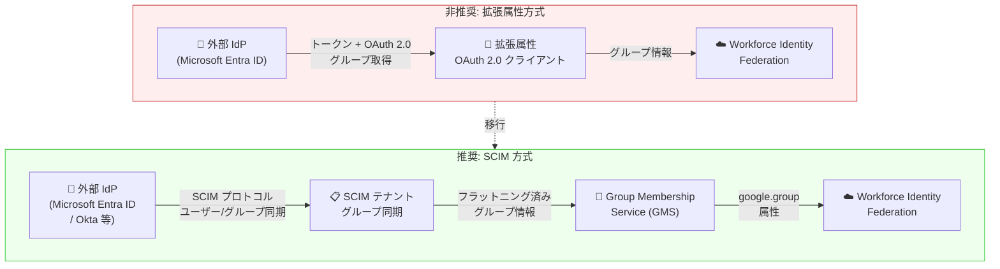

# Identity and Access Management: Workforce Identity Federation 拡張属性の非推奨化

**リリース日**: 2026-04-03

**サービス**: Identity and Access Management (IAM)

**機能**: Workforce Identity Federation 拡張属性 (Extended Attributes) の非推奨化

**ステータス**: Deprecated

📊 [このアップデートのインフォグラフィックを見る](https://takech9203.github.io/google-cloud-news-summary/20260403-iam-workforce-identity-federation-deprecation.html)

## 概要

Google Cloud は 2026 年 4 月 3 日付で、Workforce Identity Federation の拡張属性 (Extended Attributes) を非推奨としました。拡張属性は、外部 IdP (Identity Provider) からグループメンバーシップなどの追加情報を取得するために使用されていた機能ですが、今後は SCIM (System for Cross-domain Identity Management) への移行が推奨されます。

拡張属性のシャットダウン (完全廃止) は **2027 年 4 月 3 日** に予定されており、既存ユーザーには約 1 年間の移行期間が設けられています。この期間中、拡張属性は引き続き動作しますが、新規設定は推奨されません。

SCIM は拡張属性と比較して、グループのフラットニング (ネストされたグループの展開)、IdP とのリアルタイムに近い同期、Gemini Enterprise との統合など、より多くの機能を提供します。

**アップデート前の課題**

- 拡張属性を使用したグループマッピングでは、OAuth 2.0 クライアント ID/シークレットの設定が必要で、構成が複雑だった
- Microsoft Entra ID (Azure AD) のグループ取得に特化しており、IdP の種類に依存していた
- トークンベースのグループ取得にはサイズ制限があり、大量のグループを扱う場合に制約があった
- ネストされたグループメンバーシップの解決が困難だった

**アップデート後の改善**

- SCIM を使用することで、IdP からグループ情報を自動的にプロビジョニング・同期できるようになった
- SCIM のグループフラットニング機能により、ネストされたグループメンバーシップが自動的に展開される
- `--scim-usage=enabled-for-groups` の設定のみで有効化でき、OAuth クライアント設定が不要になった
- Gemini Enterprise との統合により、グループ名 (UUID ではなく) での共有が可能になった

## アーキテクチャ図



拡張属性方式 (上) から SCIM 方式 (下) への移行を示しています。SCIM 方式では IdP からの同期がプロトコル標準に基づいて行われ、グループフラットニングが自動化されます。

## サービスアップデートの詳細

### 主要機能

1. **非推奨となる拡張属性の CLI フラグ**
   - `--extended-attributes-client-id`: IdP からの拡張属性取得に使用する OAuth 2.0 クライアント ID
   - `--extended-attributes-client-secret-value`: OAuth 2.0 クライアントシークレット
   - `--extended-attributes-issuer-uri`: OIDC IdP の Issuer URI
   - `--extended-attributes-type`: 取得する属性の種類 (例: `azure-ad-groups-id`)
   - `--extended-attributes-filter`: IdP からのレコード取得フィルター

2. **代替機能: SCIM によるグループマッピング**
   - IdP から Google Cloud へのユーザー・グループ情報の自動プロビジョニング
   - グループフラットニング: ネストされたグループメンバーシップを自動展開し、IAM ポリシーチェックに使用
   - `google.group` 属性によるグループ参照 (従来の `google.groups` ではなく)
   - SCIM 対応の IdP (Microsoft Entra ID、Okta など) をサポート

3. **SCIM と拡張属性の排他制御**
   - `scim_usage` と `extended_attributes_oauth2_client` は同一プロバイダーで同時に有効化できない
   - 移行時はまず拡張属性を無効化してから SCIM を有効化する必要がある

## 技術仕様

### 非推奨タイムライン

| 項目 | 日付 |
|------|------|
| 非推奨日 (Deprecated) | 2026 年 4 月 3 日 |
| シャットダウン日 (Shutdown) | 2027 年 4 月 3 日 |
| 移行期間 | 約 12 か月 |

### SCIM 属性マッピング対応表

| Google 属性 | Workforce Identity Pool Provider マッピング (トークン) | SCIM テナントマッピング |
|---|---|---|
| `google.subject` | `assertion.oid` | `user.externalId` |
| `google.subject` | `assertion.email` | `user.emails[0].value` |
| `google.subject` | `assertion.preferred_username` | `user.userName` |
| `google.group` | N/A (SCIM で管理) | `group.externalId` |

### SCIM の制限事項

| 項目 | 制限 |
|------|------|
| SCIM テナント数 | Workforce Identity Pool あたり 1 つ |
| フィルター演算子 | `eq` のみサポート |
| ページネーション | 1 レスポンスあたり最大 100 件 |
| メールアドレス | ユーザーごとに `work` タイプ 1 件のみ |
| CEL 変換 | `.lowerAscii()` のみサポート |

## 設定方法

### 前提条件

1. Workforce Identity Pool とプロバイダーが既に構成済みであること
2. IdP が SCIM プロトコルをサポートしていること (Microsoft Entra ID、Okta など)

### 手順

#### ステップ 1: 既存の拡張属性を無効化

拡張属性と SCIM は同時に使用できないため、まず拡張属性の設定を解除します。

#### ステップ 2: プロバイダーで SCIM を有効化

```bash
# OIDC プロバイダーの場合
gcloud iam workforce-pools providers update-oidc PROVIDER_ID \
  --workforce-pool=WORKFORCE_POOL_ID \
  --location=global \
  --scim-usage=enabled-for-groups

# SAML プロバイダーの場合
gcloud iam workforce-pools providers update-saml PROVIDER_ID \
  --workforce-pool=WORKFORCE_POOL_ID \
  --location=global \
  --scim-usage=enabled-for-groups
```

#### ステップ 3: SCIM テナントの作成と IdP との連携

SCIM テナントを作成し、IdP 側で SCIM プロビジョニングを設定します。属性マッピングでは、プロバイダーの `--attribute-mapping` と SCIM テナントの `--claim-mapping` で `google.subject` が同一のアイデンティティを参照するように一致させる必要があります。

#### ステップ 4: グループ参照の更新

SCIM 使用時のグループ属性は `google.group` です。従来の `google.groups` (トークンマッピング) から変更する必要があります。IAM ポリシーや属性条件でグループを参照している箇所を確認し、更新してください。

## メリット

### ビジネス面

- **標準プロトコルへの統一**: SCIM は業界標準のプロビジョニングプロトコルであり、IdP ベンダーへの依存度を低減する
- **運用負荷の軽減**: グループ情報の自動同期により、手動でのグループ管理が不要になる

### 技術面

- **グループフラットニング**: ネストされたグループを自動的に展開し、IAM ポリシーチェックの精度を向上
- **トークンサイズ制限の回避**: トークンに含まれるグループ数の制約を受けず、大量のグループをサポート
- **Gemini Enterprise 統合**: SCIM を使用することで、Gemini Enterprise (NotebookLM Enterprise) でグループ名による共有が可能に

## デメリット・制約事項

### 制限事項

- 各 Workforce Identity Pool に SCIM テナントは 1 つのみ設定可能
- SCIM テナントの削除には 30 日間のソフトデリート期間がある (ハードデリートオプションも利用可能)
- `google.subject` や `google.group` にマッピングされた SCIM 属性は不変として扱われ、変更するには IdP 側でユーザー/グループを削除・再作成する必要がある

### 考慮すべき点

- 拡張属性と SCIM は同一プロバイダーで併用できないため、移行は切り替え方式となる
- SCIM 使用時のグループ属性名が `google.groups` から `google.group` に変わるため、既存の IAM ポリシーや属性条件の更新が必要
- IdP 側の SCIM プロビジョニング設定が別途必要であり、Okta の場合は Import Users/Groups 機能は非対応

## ユースケース

### ユースケース 1: Microsoft Entra ID からの移行

**シナリオ**: 拡張属性 (`azure-ad-groups-id`) を使用して Microsoft Entra ID のグループ情報を取得している組織が、SCIM に移行する場合。

**効果**: OAuth 2.0 クライアントの管理が不要になり、グループのネスト解決が自動化される。Gemini Enterprise での人間が読めるグループ名での共有も利用可能になる。

### ユースケース 2: 大規模グループ環境での運用改善

**シナリオ**: 400 を超えるグループを持つ組織で、トークンサイズ制限により全グループのマッピングが困難だった場合。

**効果**: SCIM のグループフラットニングにより、トークンサイズの制約なくすべてのグループメンバーシップが IAM ポリシーチェックに反映される。

## 関連サービス・機能

- **Workforce Identity Federation**: 外部 IdP のユーザーが Google Cloud リソースにアクセスするための ID 連携基盤
- **Gemini Enterprise (NotebookLM Enterprise)**: SCIM テナントによるグループ共有機能を提供
- **Cloud Audit Logs**: Workforce Identity Federation の詳細監査ログによるトラブルシューティング
- **Privileged Access Manager (PAM)**: IAM の特権アクセス管理で、Workforce Identity と組み合わせて使用可能

## 参考リンク

- 📊 [インフォグラフィック](https://takech9203.github.io/google-cloud-news-summary/20260403-iam-workforce-identity-federation-deprecation.html)
- [公式リリースノート](https://cloud.google.com/release-notes#April_03_2026)
- [IAM リリースノート](https://cloud.google.com/iam/docs/release-notes)
- [SCIM によるグループマッピング](https://cloud.google.com/iam/docs/workforce-identity-federation-scim)
- [IAM 非推奨一覧](https://cloud.google.com/iam/docs/deprecations)
- [Microsoft Entra ID との SCIM 設定](https://cloud.google.com/iam/docs/configure-scim-ms-entra)
- [大規模グループでの Workforce Identity Federation](https://cloud.google.com/iam/docs/workforce-sign-in-microsoft-entra-id-scalable-groups)

## まとめ

Workforce Identity Federation の拡張属性は 2026 年 4 月 3 日に非推奨となり、2027 年 4 月 3 日に完全廃止されます。拡張属性を使用してグループマッピングを行っている組織は、1 年間の移行期間中に SCIM への移行を計画・実施する必要があります。SCIM はグループフラットニングや Gemini Enterprise 統合など、拡張属性にはない機能を提供するため、移行により運用面・機能面の両方で改善が期待できます。

---

**タグ**: #IAM #WorkforceIdentityFederation #SCIM #Deprecated #GroupMapping #IdentityManagement #Migration
